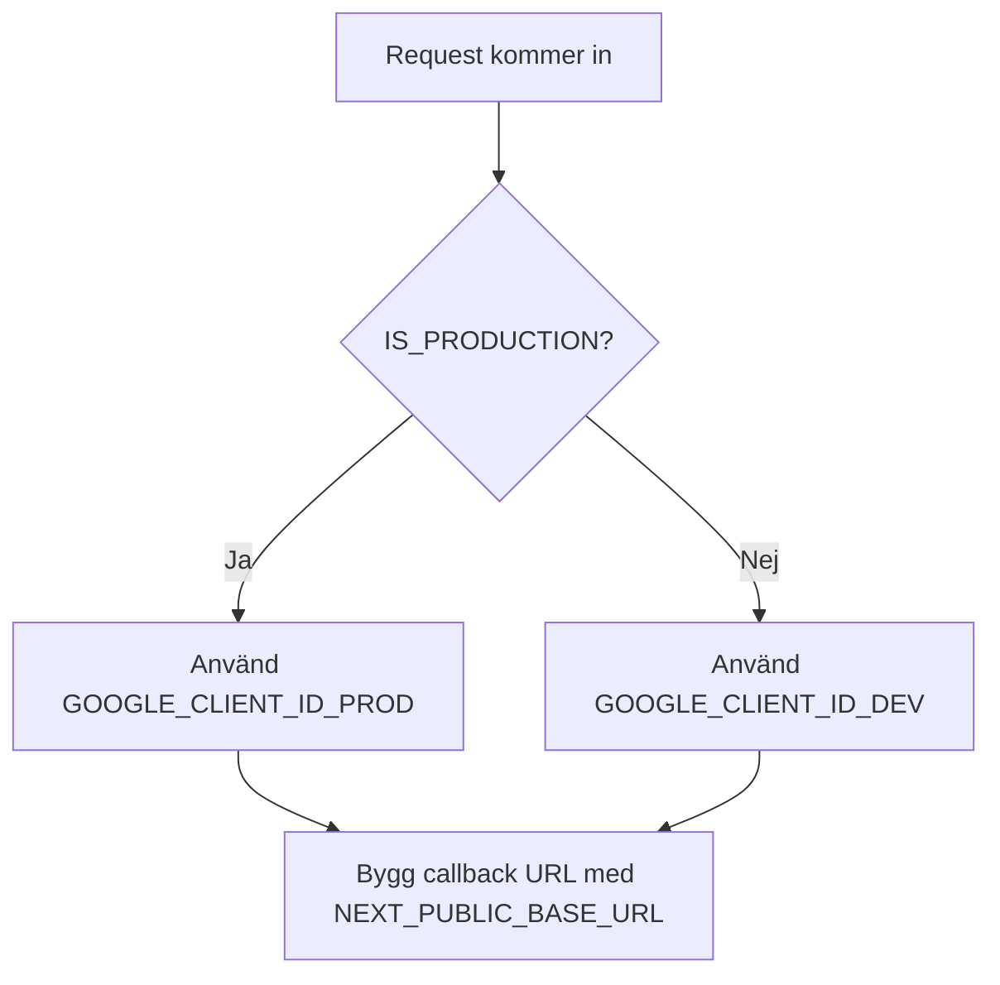
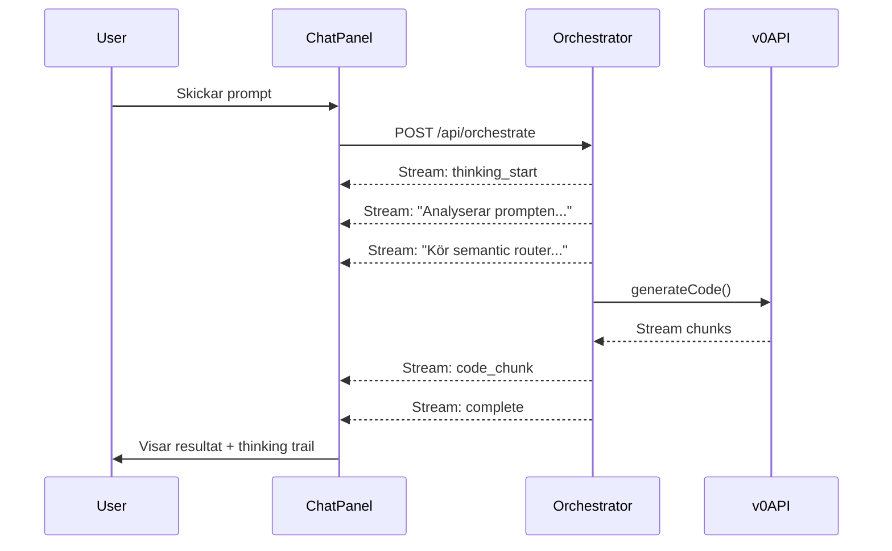
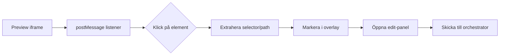

# Builder Enhancement Plan

## Bakgrund

Projektet är en AI-driven webbplatsbyggare som använder v0 SDK för kodgenerering. Analysrapporterna i `gatherd_opinions/` identifierar flera kritiska buggar som behöver åtgärdas parallellt med de nya funktionerna.---

## 1. OAuth Miljöväxling (Automatisk dev/prod)

**Problem**: OAuth credentials måste vara olika för localhost vs produktionsdomän.**Lösning**: Skapa automatisk detection i [`app/src/lib/config.ts`](app/src/lib/config.ts) och uppdatera auth-logiken.

**Ändringar**:

- Lägg till `GOOGLE_CLIENT_ID_DEV`, `GOOGLE_CLIENT_SECRET_DEV` i SECRETS
- Uppdatera `getGoogleAuthUrl()` i [`app/src/lib/auth.ts`](app/src/lib/auth.ts) att välja rätt credentials
- Samma mönster för GitHub OAuth

---

## 2. Superadmin-roll (Produktion)

**Problem**: Testanvändaren är disabled i produktion (rad 117-123 i database.ts).**Lösning**: Skapa en `SUPERADMIN_EMAIL` miljövariabel som fungerar i alla miljöer.**Ändringar i** [`app/src/lib/database.ts`](app/src/lib/database.ts):

- Lägg till `SUPERADMIN_EMAIL` och `SUPERADMIN_PASSWORD` i config
- Skapa `ensureSuperadminExists()` som körs vid DB-initialisering
- Superadmin får alltid 999999 diamonds och flaggan `is_superadmin = 1`
- Uppdatera `deductDiamond()` att hoppa över avdrag för superadmin

**Säkerhet**: Lösenordet hashas normalt, bara e-posten identifierar superadmin.---

## 3. Full Thinking/Streaming Implementation

**Problem**: Nuvarande implementation visar bara en spinner utan insikt i vad AI:n gör.**Lösning**: Implementera AI SDK 6.0's reasoning/thinking streams enligt [ai-sdk.dev](https://ai-sdk.dev/).

**Nya komponenter**:

- [`app/src/components/builder/thinking-bubble.tsx`](app/src/components/builder/thinking-bubble.tsx) - Visar live thinking
- Uppdatera `/api/orchestrate` att returnera Server-Sent Events (SSE)
- Uppdatera `ChatPanel` att hantera streaming response

**v0 SDK thinking**: Enligt v0 docs kan man använda `onThinking` callback för att visa resoneringsprocessen.---

## 4. Klickbar Elementredigering (Design Mode)

**Problem**: Användare vill kunna klicka på element i preview för att markera och redigera dem.**Lösning**: Implementera "Design Mode" inspirerat av v0.app's egna design-läge.

**Nya filer**:

- `app/src/components/builder/design-mode-overlay.tsx` - Visuell overlay
- `app/public/design-mode-injector.js` - Script som injiceras i iframe
- Uppdatera [`app/src/components/builder/code-preview.tsx`](app/src/components/builder/code-preview.tsx)

**Begränsning**: v0's demoUrl är på deras domän, så postMessage-kommunikation kan vara begränsad. Alternativ: Sandpack-läge för design mode.---

## 5. Preview-hantering (Undvik spam)

**Problem**: Hundratals previews per dag kan spamma v0/Vercel-kontot.**Lösning**: Implementera cleanup och rate limiting.**Strategier**:

1. **Reuse chatId**: Redan delvis implementerat - fortsätt samma konversation istället för ny
2. **Rate limiting**: Max X generationer per användare/dag
3. **Cleanup-jobb**: Radera gamla projekt och template-cache (redan finns i `project-cleanup.ts`)
4. **v0 API-begränsning**: v0 har troligen egen cleanup - kontrollera deras docs

**Ändringar**:

- Lägg till daglig generations-räknare i `guest_usage` / `users`-tabell
- Uppdatera orchestrator att kontrollera rate limit
- Dokumentera v0's egna cleanup-policy

---

## 6. Buggfixar från Analysrapporterna

Baserat på [`gatherd_opinions/agent_orchestration_analysis_report.txt`](gatherd_opinions/agent_orchestration_analysis_report.txt):

### Kritiska (Fixa först)

1. **chatId saknas efter template-laddning** - Rad 78-105 i rapporten

- Fix i `handleTemplateGeneration()` - validera och retry

2. **Code Crawler triggas för ofta** - Rad 108-143

- Fix i [`app/src/lib/orchestrator-agent.ts`](app/src/lib/orchestrator-agent.ts) rad ~502-515
- Ta bort `simple_code + extractHintsFromPrompt` trigger

3. **Första prompt tappar context** - Rad 5-9 i orchestrator-review.txt

- Fix i `handleGenerate()` - skicka befintlig chatId/code

### Medium

4. **Race condition i Code Crawler** - Rad 146-177
5. **Duplicerad refinement-logik** - Råd: Deprecate `/api/refine`

---

## 7. v0 Service Suggestions (Agentic Features)

Enligt [v0.app/docs](https://v0.app/docs/introduction) har v0 "Agentic Features":

- Web search
- Site inspection  
- Error fixing
- External tool integration

**Implementation**: Uppdatera ChatPanel att visa suggestions baserat på orchestrator-intent:

- `web_search` → "Vill du att jag söker efter X?"
- `image_gen` → "Ska jag skapa en bild för Y?"
- `clarify` → Visa alternativen som knappar

---

## Prioriteringsordning

| Prio | Uppgift | Uppskattad tid |

|------|---------|----------------|

| 1 | Superadmin-roll | 1h |

| 2 | OAuth miljöväxling | 1h |

| 3 | Kritiska buggfixar (chatId, crawler) | 2h |

| 4 | Preview rate limiting | 1h |

| 5 | Thinking/streaming implementation | 3-4h |

| 6 | Klickbar elementredigering | 4-5h |

| 7 | Service suggestions | 2h |---

## Risker och Begränsningar

1. **Klickbar redigering i v0 iframe**: v0's demoUrl är cross-origin - postMessage kan vara begränsat. Kan behöva Sandpack-fallback.
2. **Streaming**: Kräver omskrivning av `/api/orchestrate` till SSE/streaming response.