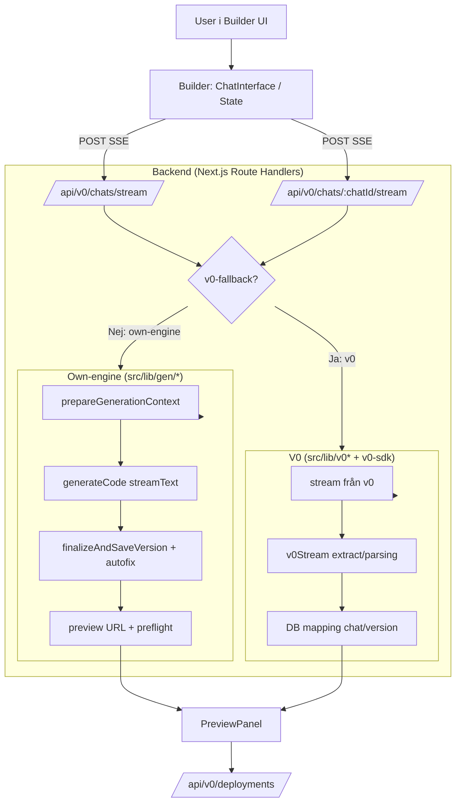

# Deep research-rapport: Jakeminator123/sajtmaskin — buggar, överlapp och arkitektonisk förvirring

## Antaganden, scope och källprioritering

Den här granskningen är en **statisk kod-/repoanalys** av GitHub-repot `Jakeminator123/sajtmaskin` (inga antaganden om faktisk driftmiljö utöver vad som framgår i repot). Fokus ligger på **kodstruktur, modulgränser, dubblerad funktionalitet** samt “obvious bugs” och risker i flödena kring **own-engine** kontra en **v0 API-mirroring/fallback**. fileciteturn51file0L1-L1

Kända osäkerheter (explicit):
- **Exakt v0 API-spec** (vilka fält/semantik som måste matchas). Jag utgår från att `/api/v0/*` eftersträvar kompatibilitet med v0-klientens förväntningar, men specen finns inte i frågan. fileciteturn55file0L1-L1  
- **Runtime environment & deploy-konfig** (t.ex. Vercel-plan, regions, abort/cancellation settings, `vercel.json`). Jag hittade inga indikationer på `supportsCancellation` i repot via sök. Därför markeras vissa punkter som “kontrollera i deploy-konfig”. citeturn2view0  
- **Vercel-domänprioritet**: Du bad uttryckligen om *vercel.app* först. I praktiken ligger Vercels officiella tekniska dokumentation normalt på `vercel.com` och “examples” på `examples.vercel.com`. Jag hittade inte relevanta canonical docs på `vercel.app` i sökresultaten, så jag har använt Vercels officiella docs/guider (under `vercel.com`/`examples.vercel.com`) som primärkällor när externt stöd behövdes. citeturn0search2turn2view0  

Källor jag primärt baserar resultaten på:
- Repo-dokumentation som beskriver arkitektur och avsikter (svenska). fileciteturn51file0L1-L1 fileciteturn63file0L1-L1  
- Centrala runtime-filer i own-engine (`src/lib/gen/*`) och v0-lagret (`src/lib/v0*`, `src/app/api/v0/*`). fileciteturn71file0L1-L1 fileciteturn75file0L1-L1 fileciteturn70file0L1-L1 fileciteturn52file0L1-L1  
- Vercel officiella docs/guider för funktionskonfig (maxDuration/cancellation) och payload-limit. citeturn2view0turn0search2  

## Executive summary

Sajtmaskin har en ambitiös arkitektur: en Next.js-baserad “builder” med **egen kodgenereringsmotor (own-engine)** som default, och en **v0-fallback** som kan aktiveras via flagga (t.ex. `V0_FALLBACK_BUILDER`). fileciteturn51file0L1-L1 fileciteturn63file0L1-L1

De mest tydliga problemen och riskerna jag hittade:

Den allvarligaste klassen är **drift/affärsrisk** kopplad till kvoter/limiters och kostnadsmodell:
- **Extremt höga default-gränser för `maxOutputTokens`** i own-engine (262 144) som dessutom **inte matchar repo-dokumentationen** (ENV.md beskriver 32 768). Detta kan skapa kostnads- och timeout-risk (särskilt eftersom krediter prissätts “flat” per åtgärd). fileciteturn70file0L1-L1 fileciteturn9file0L1-L1 fileciteturn69file0L1-L1 fileciteturn60file0L1-L1  

Den mest tydliga “logiska buggen”:
- **Plan-mode i create-stream laddar credits men committar inte** (dvs “prepareCredits” görs men `commitCreditsOnce()` anropas inte innan streamen returneras). Följden blir inkonsistent debitering (och kan även skapa “spärrar” om reservering/guard används). fileciteturn71file0L1-L1  

Arkitektur-/underhållsproblem som skapar överlapp och förvirring:
- **Own-engine och v0-mirroring är intrasslade i samma API-yta (`/api/v0/...`)**, med omfattande grenkod i routes för “own-engine” vs “v0-fallback”. Detta är funktionellt, men ger hög komplexitet, fler edge cases och svårare testbarhet. fileciteturn51file0L1-L1 fileciteturn71file0L1-L1 fileciteturn75file0L1-L1  
- Model/tier-logik ligger i `src/lib/v0/models.ts` men används även av own-engine (“single source of truth” för tiers), vilket förstärker begreppsförvirring kring vad som är “v0-lager” vs “egen motor”. fileciteturn20file0L1-L1 fileciteturn63file0L1-L1  

Edge case du specifikt lyfte (“gå in i builder utan att skicka data”):
- Builder försöker autoinitiera projekt när inga queryparams finns, men **misslyckande i auto-create** resetar bara en ref och **triggar varken auth-modal eller robust retry**, vilket kan lämna användaren i ett läge där generation misslyckas p.g.a. **saknat appProjectId** (servern kräver det i own-engine). fileciteturn74file0L1-L1 fileciteturn71file0L1-L1  

Vercel-plattform-risker:
- Ni använder långa streams med explicit `maxDuration = 800` i stream-routes. Vercel stödjer `maxDuration` i App Router-konfiguration, men driftbeteende vid klient-abort/cancellation kan kräva explicit opt-in (`supportsCancellation` i `vercel.json`) för att städning ska vara garanterad. Jag hittar ingen sådan opt-in i repot. citeturn2view0  

## Arkitektur och modulgränser

### Övergripande systembild

Repo-docs beskriver tydligt att:
- Builder UI → (own-engine default) eller v0 Platform API (fallback) → genererade filer → preview → deploy via Vercel API. fileciteturn51file0L1-L1  
- Own-engine har en flerfas-kedja (pre-generation orchestration → generation → finalize/autofix → preview) och previewn är en “intern preview-surface”, inte en full Node-build. fileciteturn63file0L1-L1  



### Modulgränser som idag skapar friktion

Det finns en uttalad struktur i repot (bra), men gränserna “läcker” i praktiken:

- **`src/app/api/v0/*` är inte bara v0-proxy**: det är också primär API-yta för own-engine. I praktiken betyder det att `/api/v0/...` innehåller *domänlogik* för två olika backends med delvis olika identitetsmodeller (uuid engine-chat vs v0-chat id). fileciteturn51file0L1-L1 fileciteturn71file0L1-L1  
- **Model/tier-hierarkin är semantiskt “v0” men operativt “own-engine”**: `DEFAULT_OWN_MODEL_ID` och canonical tiers ligger i `src/lib/v0/models.ts` och används i own-engine-beslut. Filen säger själv att detta är av “historical reasons”. fileciteturn20file0L1-L1  
- **SSE-standarden är internstandard, inte ren providerstandard**: own-engine stream-format bygger SSE events på ett sätt som routes sedan re-translaterar till builderns SSE-kontrakt; v0 fallback parse:ar v0:s stream och försöker uttrycka samma builder-kontrakt. Funktionellt, men ger dubbla parser-/formatteringslager och mer felhantering. fileciteturn65file0L1-L1 fileciteturn52file0L1-L1 fileciteturn66file0L1-L1  

## Detaljerade fynd med file-level exempel

### Kvoter/limits driftar och är potentiellt orimliga

**Symptom:** `ENGINE_MAX_OUTPUT_TOKENS` defaultar till **262 144** och `AUTOFIX_MAX_OUTPUT_TOKENS` till **122 880** i kod. fileciteturn70file0L1-L1  
Samtidigt beskriver ENV.md en väsentligt lägre default för engine (32 768) och autofix (12 288). fileciteturn9file0L1-L1  

Kod (defaults):
```ts
export const ENGINE_MAX_OUTPUT_TOKENS = readIntEnv(
  "SAJTMASKIN_ENGINE_MAX_OUTPUT_TOKENS",
  262_144,
  4_096,
  524_288,
);
```
fileciteturn70file0L1-L1  

Dokumentation (ENV.md – sammanfattat):
- `SAJTMASKIN_ENGINE_MAX_OUTPUT_TOKENS=32768`
- `SAJTMASKIN_AUTOFIX_MAX_OUTPUT_TOKENS=12288`
fileciteturn9file0L1-L1  

**Varför detta är farligt:**  
Own-engine använder dessa värden direkt som `maxOutputTokens` till `streamText`, om inget explicit override sker. fileciteturn69file0L1-L1  

```ts
const result = streamText({
  ...
  maxOutputTokens: maxTokens ?? ENGINE_MAX_OUTPUT_TOKENS,
  ...
});
```
fileciteturn69file0L1-L1  

Samtidigt är krediter prissatta som *flat cost per prompt* per tier (t.ex. `PROMPT_CREATE_COSTS`). Det finns ingen uppenbar koppling till outputstorlek, vilket gör att “för stora outputs” kan bli en ekonomisk risk. fileciteturn60file0L1-L1  

**Rekommendation:** se “Prioriterade åtgärder” nedan (harmonisera defaults + koppla budget till tier/plan).

En enkel visualisering (code-default vs ENV.md):
```text
ENGINE_MAX_OUTPUT_TOKENS:
  code default: 262,144  |█████████████████████████████|
  ENV.md:        32,768  |███|

AUTOFIX_MAX_OUTPUT_TOKENS:
  code default: 122,880  |███████████████|
  ENV.md:        12,288  |█|
```

### Plan-mode i create-stream laddar credits men debiterar inte

I `/api/v0/chats/stream` görs `prepareCredits(... "prompt.create" ...)` och `commitCreditsOnce()` definieras. fileciteturn71file0L1-L1  
I **own-engine path** och **v0 fallback path** anropas `await commitCreditsOnce()` i flera avslutsgrenar. fileciteturn71file0L1-L1  

Men i **Plan Mode Path** (create-stream) returneras streamen efter att `done` skickats och controller stängts—utan att `commitCreditsOnce()` anropas i den plan-mode-closure som returneras. I den excerpten syns att streamen avslutas direkt efter `done`/`controller.close()`. fileciteturn71file0L1-L1  

**Konsekvens:** Plan-mode kan bli “gratis” (eller åtminstone inte debiterad), samtidigt som credit-checken ändå kan blockera användare (beroende på hur `prepareCredits` fungerar). Detta skapar inkonsistent användarupplevelse och/eller ekonomisk läcka. fileciteturn71file0L1-L1  

Notera kontrast: i **follow-up plan-mode** (`/api/v0/chats/[chatId]/stream`) finns `await commitCreditsOnce()` efter `done`. Det tyder på att create-stream saknar motsvarande rad. fileciteturn75file0L1-L1  

### Builder-edge-case: in i buildern utan data → svaghet i auto-projektinit + hårt serverkrav

Builder-controller har en auto-init-effect som:
- kör när inga queryparams finns,
- försöker återställa `sajtmaskin:lastProjectId`,
- annars `createProject("Untitled Project")` och pushar `?project=<id>`. fileciteturn74file0L1-L1  

Men om `createProject` misslyckas:
- loggas bara warning,
- `autoProjectInitRef.current = false`,
- ingen auth-modal, ingen “hard error state”, ingen robust retry/backoff. fileciteturn74file0L1-L1  

Samtidigt kräver own-engine create-stream **en giltig app project id**, annars returneras 400:
```json
"Own-engine generation requires a valid app project id. Create or resolve a project before retrying."
```
fileciteturn71file0L1-L1  

**Praktisk följd:** En användare som “går in i buildern” utan att komma från en flow som redan skapat projekt (t.ex. direkt `/builder`) riskerar att hamna i ett läge där första generationen alltid faller på saknat projekt—om auto-init råkar faila (401, nät, transient fel). fileciteturn74file0L1-L1 fileciteturn71file0L1-L1  

Rekommendationer:
- Vid auto-create-fail: trigga `setAuthModalReason("builder")` vid 401/403, eller visa UI-state med “skapa projekt manuellt”. fileciteturn74file0L1-L1  
- Server-side: överväg att skapa “guest project” när `appProjectId` saknas, i stället för att kräva att klienten alltid lyckas skapa projekt innan första prompten. (Detta måste vägas mot era tenant-/ägarskapsregler.) fileciteturn64file0L1-L1  

### Follow-up “awaiting clarification” returnerar utan persistens

I follow-up stream-route (`/api/v0/chats/[chatId]/stream`) klassificeras vissa korta följdmeddelanden som “ambiguous” och då returneras en stream som ställer en klargörande fråga (tool-call `askClarifyingQuestion`) och `done` med `awaitingInput: true`. fileciteturn75file0L1-L1  

Problemet: Dessa early returns sker **innan**:
- `await chatRepo.addMessage(engineChat.id, "user", ...)` görs för current message,
- credit check/commit görs,
- och innan någon “assistant message persist” sker. fileciteturn75file0L1-L1  

Det betyder att UI kan visa frågan (streamad), men serverns chat-historik saknar både user-message och assistant-clarification, och man tappar spårbarhet/reload-konsistens.

Kontrast: pre-generation contract-clarification (create-stream) **persistar** assistant-frågan genom `chatRepo.addMessage(... "assistant", contractClarification.question, ..., uiPart)` innan den returnerar awaiting-input. fileciteturn71file0L1-L1  

**Rekommendation:** Gör follow-up-clarification symmetrisk med contract-clarification:
- Persist user-message (ev. i “raw form” utan stor fileCtx),
- Persist assistant-question + canonical uiPart,
- Skicka sedan stream. fileciteturn75file0L1-L1  

### Konfigurationsförvirring: Render-varningar triggas i Vercel-prod

`src/lib/config.ts` beskriver DATA_DIR som Render-specifikt (“Production (Render): /var/data … MUST be set …”), men själva logiken triggar “CRITICAL: DATA_DIR not set in production!” för **alla** production-miljöer utan att villkora på `IS_RENDER`. fileciteturn72file0L1-L1  

```ts
if (IS_PRODUCTION && !hasWarnedAboutDataDir && !isBuildPhase()) {
  console.error(
    "[Config] ❌ CRITICAL: DATA_DIR not set in production!\n" +
      "  → Uploads and local files will be lost on restart\n" +
      "  → Set DATA_DIR=/var/data and mount persistent disk",
  );
}
```
fileciteturn72file0L1-L1  

Eftersom repot enligt egen doc primärt deployas på Vercel och använder Vercel Blob för vissa assets, blir detta lätt “falsk brandlarm”-logg i prod. fileciteturn51file0L1-L1 fileciteturn72file0L1-L1  

### Env-hantering: cache + duplicerad sanitization

- `src/lib/env.ts` sanerar env-värden (strippar citattecken) och cachar sedan validerad env i `_cached`. Vid build-phase kan den sätta `_cached = serverSchema.parse({})` även när env saknas, för att inte krascha build. fileciteturn73file0L1-L1  
- Samtidigt innehåller admin-ENV endpoint egna sanitizers/heuristiker som överlappar. fileciteturn14file0L1-L1  

Detta är inte nödvändigtvis fel, men:
- cache + build-phase fallback kan skapa överraskande beteenden i long-running processer (t.ex. devserver) när env ändras, eftersom `_cached` inte revalideras. fileciteturn73file0L1-L1  
- duplicerad sanitization gör att “källa till sanning” blir oklar (env.ts vs admin route), vilket ökar driftfriktion.

### Vercel functions: maxDuration och cancellation

Era stream routes sätter `export const maxDuration = 800;` (13 min 20 sek). Det är korrekt i form av “route segment config” på Vercel/Next.js App Router (konfigurerbart via `maxDuration`). fileciteturn71file0L1-L1 fileciteturn75file0L1-L1 citeturn2view0  

Men: Vercel beskriver att för att opta in på “cancellation” och få garantier kring vad som händer när klienten abortar, behöver man opt-in med `supportsCancellation` i `vercel.json` för specifika paths. citeturn2view0  
Jag hittade inget `supportsCancellation` i repot via sök, så det är en riskfaktor att vissa cleanup-paths (t.ex. `cancel()` i ReadableStream) inte beter sig som man tror i prod.

Dessutom: Vercel har en känd request-body limit på 4.5 MB för Serverless Functions; streaming kan hjälpa för response-size men inte för request-size. Era prompt limits tillåter mycket stora payloads (hundratusentals tecken) vilket kan närma sig gränsen i vissa kombinationer även om det ofta är under 4.5MB. fileciteturn57file0L1-L1 citeturn0search2  

## Överlappstabell mellan own-engine och v0-lager

| Modul / fil | Ansvar | Överlapp med v0-api | Allvarlighetsgrad | Rekommenderad åtgärd |
|---|---|---|---|---|
| `src/app/api/v0/chats/stream/route.ts` fileciteturn71file0L1-L1 | Skapa chat + streaming (plan-mode, own-engine, v0-fallback) | Hög: en route = tre backends | **Kritisk** (plan-mode credits + komplexitet) | Bryt ut plan-mode och own-engine i separata interna handlers; säkerställ enhetlig credit-commit i alla paths |
| `src/app/api/v0/chats/[chatId]/stream/route.ts` fileciteturn75file0L1-L1 | Follow-up streaming (own-engine + v0 proxy) | Hög | **Hög** (awaiting-clarification utan persistens) | Persist user+assistant för clarification; isolera “intent classification” som ren modul; tydliggör kontrakt kring chatId-typ |
| `src/lib/gen/engine.ts` fileciteturn69file0L1-L1 | Anropar AI SDK `streamText` för own-engine | Indirekt: använder tiers/modeller från “v0”-moduler | **Hög** (token-budget risk) | Gör budgets tier-baserade och rimliga per modell; logga effektivt maxOutputTokens |
| `src/lib/gen/defaults.ts` fileciteturn70file0L1-L1 | Central budgets/timeouts | Indirekt | **Kritisk** (driftar från ENV.md) | Harmoniserade defaults + dokumentation; överväg lägre fallback defaults |
| `src/lib/v0Stream.ts` fileciteturn52file0L1-L1 | Parser/heuristiker för v0-streams (extract content/tool/ui) | Direkt v0-anpassning | Medel | Isolera till “provider adapter”; minimera heuristiker genom stabilt “internal stream schema” |
| `src/lib/gen/route-helpers.ts` fileciteturn66file0L1-L1 | SSE parse för own-engine, request parsing, suspense line processor | Parallell till v0Stream | Medel | Skapa ett gemensamt stream-kontrakt + adapter-lager: own-engine emitterar redan ett schema—minska re-parse/re-encode |
| `src/lib/v0/models.ts` fileciteturn20file0L1-L1 | Canonical tiers + mappning till engine/v0 modeller | Hög: används i båda | Medel/Hög | Flytta till neutralt `src/lib/models/*` och låt “v0” bara hantera v0-specifika ID:n |
| `src/lib/config.ts` fileciteturn72file0L1-L1 | Central config, feature flags, data paths | Indirekt | Medel | Villkora Render-varningar på `IS_RENDER`; minska falska prod-larm på Vercel |
| `src/lib/env.ts` + `src/app/api/admin/env/route.ts` fileciteturn73file0L1-L1 fileciteturn14file0L1-L1 | Env-sanitization + visning/audit | Indirekt | Låg/Medel | Deduplicera sanitize-logik; undvik att build-phase cache skapar “sticky” env i dev |
| `src/lib/builder/promptLimits.ts` fileciteturn57file0L1-L1 | Max char-limits för prompt/system | Indirekt | Medel | Kalibrera mot Vercel request-size och realistiska tokenbudgets; inför server-side “payload guardrails” |
| `src/app/builder/useBuilderPageController.ts` fileciteturn74file0L1-L1 | Builder orchestration inkl auto-projektinit | Indirekt | **Hög** (entry utan data) | Robust felhantering på auto-create (auth-modal/CTA); server-side fallback om project saknas |

## Prioriterade åtgärder och uppskattad insats

### Stoppa ekonomiska/timeouts-risker kopplade till token-budgetar
**Åtgärd:** Harmoniserade defaults + dokumentation, och maxOutputTokens per tier/modell.  
- Sänk code-default från 262k → något i linje med ENV.md (t.ex. 32k) eller tier-baserat (fast/pro/max/codex). fileciteturn70file0L1-L1 fileciteturn9file0L1-L1  
- Lägg in logging/telemetri för “effective maxOutputTokens per generation”, så drift får observability. fileciteturn69file0L1-L1  
**Insats:** Medel (kod + docs + ev. config/migrering).

### Fixa plan-mode credit commit i create-stream
**Åtgärd:** I plan-mode-path i `/api/v0/chats/stream` anropa `await commitCreditsOnce()` innan response return/stream close (troligen precis efter `done` enqueue och innan `controller.close()`). fileciteturn71file0L1-L1  
**Insats:** Låg (en tydlig missad rad + test).

### Gör builder-entry robust utan initial data
**Åtgärd:** 
- Vid auto project create fail: tolka 401/403 som “logga in krävs” och sätt `authModalReason`, eller visa UI som låter användaren skapa projekt manuellt. fileciteturn74file0L1-L1  
- Överväg server-side fallback: om `appProjectId` saknas i create-stream och användaren är guest—skapa “guest project” (om det passar ert tenant-upplägg). fileciteturn64file0L1-L1 fileciteturn71file0L1-L1  
**Insats:** Medel (UI + API-kontrakt + ev. tenant-regler).

### Persistens för follow-up clarification
**Åtgärd:** När follow-up klassificeras `ambiguous-*`:
- spara user-message,
- spara assistant question + canonical uiPart,
- returnera sedan awaiting-input-stream. fileciteturn75file0L1-L1  
**Insats:** Medel (API-route + chatRepo + UI reload-säkring).

### Anta en “adapter-arkitektur” mellan own-engine och v0
**Åtgärd:** Refaktorera mot ett tydligt lager:
- `core` (builder-kontrakt: chat/version/events),
- `providers/ownEngine`,
- `providers/v0`.  
Målet är att `/api/v0/*` blir ett **compat-lager** men att intern routing kan vara renare (t.ex. `/api/engine/*`). fileciteturn51file0L1-L1  
**Insats:** Hög (stegvis, men ger stor payoff).

### Förbättra Vercel-runtime robusthet för abort/cancellation
**Åtgärd:** Kontrollera och ev. inför `supportsCancellation` för relevanta API paths, och se till att cleanup som måste ske ligger i mekanismer som Vercel garanterar vid abort. citeturn2view0  
**Insats:** Låg/Medel (deploy-konfig + test).

### Minska falska prod-larm i config
**Åtgärd:** Villkora DATA_DIR “CRITICAL” på `IS_RENDER` eller storage-backend “fs”. fileciteturn72file0L1-L1  
**Insats:** Låg.

## Rekommenderade tester att lägga till

Fokus: tester som direkt fångar de buggar och edge cases som annars blir dyra i drift.

- **Unit/route test:** `/api/v0/chats/stream` plan-mode måste debitera credits (mocka `prepareCredits` och verifiera `commit` anrop). Detta fångar regressionen där plan-mode inte committar. fileciteturn71file0L1-L1  
- **Integration/Playwright:** öppna `/builder` utan queryparams i en “uthyrd/guest” session:
  - om `createProject` failar (mocka 401) ska UI visa auth modal eller tydlig CTA,
  - annars ska `project` param sättas och första generationen fungera. fileciteturn74file0L1-L1 fileciteturn71file0L1-L1  
- **Route test:** follow-up ambiguous → säkerställ att user-message + assistant-clarification persisteras i chatRepo innan `done awaitingInput` skickas, och att reload av chat återskapar frågan. fileciteturn75file0L1-L1  
- **Budget regression test:** verifiera att `ENGINE_MAX_OUTPUT_TOKENS` default inte oavsiktligt ökar igen (snapshot-test på `defaults.ts` + acceptance-test som loggar “effective maxOutputTokens”). fileciteturn70file0L1-L1 fileciteturn69file0L1-L1  
- **Payload guard test:** sänd request nära era max char limits och verifiera att ni inte oavsiktligt passerar Vercels body size limit; alternativt inför server-side guardrails och testa att gränser ger 413/400 med bra felmeddelande. fileciteturn57file0L1-L1 citeturn0search2  
- **Config test:** i “production + non-Render” ska DATA_DIR inte logga “CRITICAL” om ni kör blob/postgres-only. (Snapshot på log output eller villkorsenhetstest). fileciteturn72file0L1-L1  

