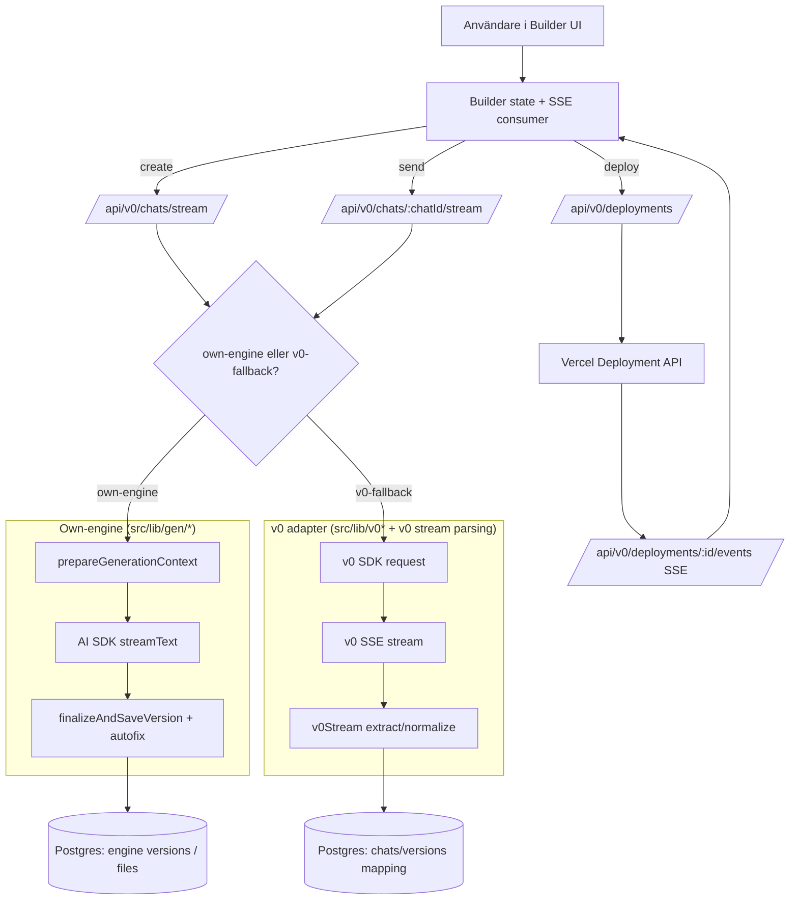
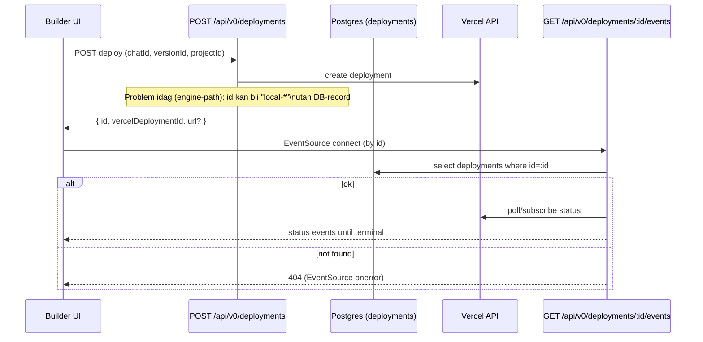

# deep-research-v2.md

## Executive summary

Den här v2-granskningen är en ny, mer strukturerad och uppdaterad genomgång av repot **Jakeminator123/sajtmaskin** (GitHub) med fokus på **uppenbara buggar**, **överlappande system** och **arkitektonisk förvirring** mellan **own‑engine** och kod som speglar en **v0‑API‑yta**. Jag har uttryckligen kört om samma typ av “bug search” som i föregående rapport och jämfört mot nuvarande kodbas. Jag ser att flera tidigare risker verkar vara **åtgärdade** (t.ex. plan‑mode credit commit, follow‑up “awaiting input”‑persistens, token‑defaults som driftade från ENV.md, builder‑entry utan data, Render‑specifik DATA_DIR‑varning, samt `supportsCancellation` i `vercel.json`). fileciteturn78file0 fileciteturn79file0 fileciteturn83file0 fileciteturn82file0 fileciteturn114file0 fileciteturn109file0

De mest belastande kvarvarande problemen jag bedömer som **mest sannolika och mest “dyrbara” i drift** är:

1) **Deploy‑SSE bryts i own‑engine‑läget**: `/api/v0/deployments` (own‑engine path) returnerar ett “id” av formen `local-<timestamp>` utan att skapa en DB‑rad i `deployments`‑tabellen. Buildern sparar id:t och försöker lyssna på `/api/v0/deployments/:id/events`, men events-endpointen kräver att id:t finns i DB → risk för 404/EventSource-fel och ingen progress‑feedback. fileciteturn85file0 fileciteturn97file0 fileciteturn87file0 fileciteturn95file0

2) **Cancellation är konfigurerad men abort-kedjan är inte konsekvent “end‑to‑end” mot modellkörningen**: `vercel.json` sätter `supportsCancellation` för stream‑routes, och AI SDK stödjer `abortSignal`, men chat-stream routes tycks inte konsekvent skicka `req.signal` vidare till own‑engine‑pipeline/`streamText`. Det innebär risk att användarens “Cancel” stoppar UI-streamen men att modellexekveringen fortsätter längre än nödvändigt (kostnad/kvot + latens). fileciteturn109file0 fileciteturn84file0 fileciteturn104file0 citeturn1search6turn2search6

3) **Modulgränserna är fortfarande tungt överlappande**: API‑ytan under `/api/v0/*` är både intern backend för own‑engine och en v0‑kompatibel proxy/fallback. Det fungerar, men det gör de centrala route-filerna stora, svårtestade och lättare att regressionsskada (ex. deploy, files, stream). fileciteturn85file0 fileciteturn98file0 fileciteturn79file0 fileciteturn103file0

4) **Quotas/limits är betydligt mer rimliga än i v1, men vissa gränser är fortfarande “risk‑känsliga”**: Texthårdgränser upp till ~0.8M chars för message och ~0.6M för system kan vara okej i sig, men måste ses i relation till Vercels hårda 4.5MB request/response payload limit för Functions, samt att `meta.*` i schemas inte är tydligt max-begränsat. fileciteturn100file0 fileciteturn99file0 citeturn1search0turn1search4

## Scope & assumptions

### Vad jag behöver lära mig för att svara bra

Jag behöver förstå följande (och jag har aktivt letat efter evidens i repot och officiella docs):

Jag behöver förstå hur **stream‑flödena** (create/send/plan-mode) skiljer sig mellan own‑engine och v0‑fallback, inklusive var credits commit:as och var persistens sker. fileciteturn78file0 fileciteturn79file0 fileciteturn77file0  
Jag behöver identifiera var **abort/cancellation** kopplas in (Vercel supportsCancellation + `req.signal` + AI SDK `abortSignal`) och om det blir “kostnads‑läckage” när klienten avbryter. fileciteturn109file0 fileciteturn84file0 citeturn1search6turn2search6  
Jag behöver kartlägga var **deploy‑status** och deployments‑SSE förväntar sig DB‑persistens och hur buildern kopplar ihop returned `deploymentId` med EventSource. fileciteturn85file0 fileciteturn95file0 fileciteturn87file0 fileciteturn97file0  
Jag behöver jämföra **quota/limits** i kod vs docs i repot, och mot plattformens gränser (Vercel Function payload + maxDuration). fileciteturn83file0 fileciteturn102file0 citeturn1search0turn1search5  
Jag behöver förstå hur “v0‑API‑mirroring” och own‑engine delar **modeller/tiers** och vilka moduler som är neutral “core” vs historiskt placerade under `v0/`. fileciteturn107file0 fileciteturn106file0

### Antaganden och uttryckliga osäkerheter

Exakt **v0‑API‑spec** är inte given i frågan. Jag utgår därför från repots semantik: `/api/v0/*` försöker erbjuda ett kompatibelt kontrakt för builder/klient, men jag kan inte verifiera 100% att payloads matchar en extern v0‑spec.  
Exakt **runtime environment** (plan, region, compute‑policy, set `maxDuration`, memory) är inte fullt specificerat; jag utgår från Next.js App Router + Vercel Functions eftersom routes exporterar `runtime = "nodejs"` och repot innehåller `vercel.json`. fileciteturn109file0 citeturn1search5turn1search6  
Exakt **deployment config** i Vercel‑dashboard (funktion-minne, default maxDuration per plan, etc.) är inte synlig här; jag baserar mig på repots `vercel.json` och Vercels officiella docs. fileciteturn109file0 citeturn1search6turn1search5

### Källprioritering och ordning

vercel.app citeturn0search0turn0search1turn0search2  
GitHub (endast repo): `Jakeminator123/sajtmaskin` fileciteturn109file0  
Vercel officiella docs (vercel.com) citeturn1search0turn1search5turn1search6turn1search4  
AI SDK docs (ai-sdk.dev) citeturn2search6turn2search9  
OpenAI API docs (platform.openai.com) citeturn2search1turn2search0

_Not: Jag började med `vercel.app` enligt instruktion. Resultaten därifrån var inte “canonical” teknisk dokumentation i mitt urval; Vercels officiella tekniska referenser ligger typiskt på `vercel.com`, så efter den initiala kontrollen gick jag vidare dit._ citeturn0search0turn1search6

## Findings

### Buggar, race conditions, unhandled errors och edge cases

#### Deploy‑SSE saknar DB‑ankare i own‑engine deploy path

I own‑engine‑grenen av `POST /api/v0/deployments` returneras ett id konstruerat som `local-${Date.now()}`. Det finns samtidigt ingen tydlig `createDeploymentRecord(...)`-persistens i den grenen (jämfört med v0‑fallback‑grenen som skapar DB‑deployment först). fileciteturn85file0

Buildern tar emot `data.id` och sätter `activeDeploymentId`, och UI‑hooken öppnar en `EventSource` som lyssnar på `/api/v0/deployments/${deploymentId}/events`. fileciteturn97file0 fileciteturn87file0

Events-endpointen (`/api/v0/deployments/[deploymentId]/events`) slår upp deployment‑id i DB (`deployments`‑tabellen) och svarar 404 om den inte finns. fileciteturn95file0

Detta ger en hög sannolikhet att own‑engine deployments leder till “deploy startad” men utan progress/URL-uppdateringar via SSE (och potentiellt ett tyst UI‑fel som bara stänger EventSource). fileciteturn97file0 fileciteturn87file0 fileciteturn95file0

#### Cancellation: konfigurerad i Vercel men abortSignal är inte tydligt kopplad till AI SDK

`vercel.json` aktiverar `supportsCancellation` för stream‑routes. fileciteturn109file0  
Vercels dokumentation beskriver `supportsCancellation` som en `vercel.json`-konfiguration för Node.js runtime. citeturn1search6

AI SDK:s `streamText` stödjer `abortSignal` i sin API‑yta. citeturn2search6  
I own‑engine‑motorn är det möjligt att skicka `abortSignal` vidare till `streamText`, men bara om det faktiskt passas in från upstream. fileciteturn84file0

I praktiken betyder detta: om routes inte skickar `req.signal` in i own‑engine‑pipeline (t.ex. via `createGenerationPipeline({ abortSignal: req.signal, ... })`) kan en klient‑abort stanna renderingen men fortfarande tillåta onödigt arbete/kostnad i modellkörningen. Det här är extra viktigt eftersom ni explicit valt långa `maxDuration` och streaming. fileciteturn79file0 fileciteturn109file0 citeturn1search5turn2search6

#### Edge case: builder utan data verkar nu vara hanterad bättre

I `useBuilderPageController` finns numera en auto‑project-init som (a) återställer senast använda projekt från localStorage eller (b) skapar projekt och uppdaterar URL (t.ex. `?project=<id>`). Vid 401/403 visas auth‑modal, annars visas en tydligare toast. fileciteturn82file0

Detta verkar adressera den tidigare riskbilden “enter builder without sending data”. (Jag tar ändå upp tests för regression här nedan.)

#### Files-route: implicit antagande om chatId-format kan blockera fallback i vissa fall

`GET /api/v0/chats/:chatId/files` har ett specialfall: om own‑engine är aktivt och `chatId` matchar UUID‑regex men `engineChat` inte hittas, returneras 404 direkt i stället för att falla igenom till v0‑fallback‑delen. fileciteturn98file0

Det är troligen avsiktligt om “engine chatId = uuid” och “v0 chatId ≠ uuid” alltid gäller, men om v0 någon gång använder UUID‑liknande IDs (eller om andra isomorfier uppstår) kan det orsaka felaktiga 404:or. Jag markerar detta som en “assumption‑coupling hazard” snarare än ett säkert driftfel. fileciteturn98file0

### Antimönster och arkitektonisk förvirring

#### Stora “blandade” route‑filer ger regressionsrisk

Flera route‑filer bär samtidigt:

- request‑validering och tenant‑auth,
- credits,
- own‑engine generation pipeline,
- v0‑fallback proxy/parsing,
- SSE‑formattering,
- persistens och reparationslogik.

Det syns tydligt i t.ex. deployments‑routen och chat streaming‑routen. fileciteturn85file0 fileciteturn79file0

Även om det fungerar, skapar det “över‑fused” moduler: svårare att testa i isolering, svårare att ändra en path utan att påverka andra, och svårare att skapa tydliga “invariants” kring id‑typer (engine chat id vs v0 chat id) och svarskontrakt.

#### Model/tier‑källan ligger under `v0/` men är deklarerat “single source of truth” för båda motorerna

`src/lib/v0/models.ts` säger uttryckligen att filen ligger i `v0/` av historiska skäl, men definierar builderns interna model‑IDs för **både** own‑engine och v0‑fallback. fileciteturn107file0

Det är bra att det står explicit (för att minska förvirring), men det är fortfarande en “naming/placement hazard” som tenderar att dra fler “core” saker in i `v0/` över tid.

### File-level evidence

Nedan är korta, konkreta exempel (paths + snippets) som stödjer de viktigaste fynden.

#### Deploy returnerar “local-*” id i own‑engine path

```ts
return NextResponse.json({
  id: `local-${Date.now()}`,
  chatId,
  versionId,
  ...
});
```

fileciteturn85file0

#### Builder tar deployment id och aktiverar EventSource‑kedjan

```ts
const returnedDeploymentId = typeof data?.id === "string" ? data.id : null;
if (returnedDeploymentId) {
  setActiveDeploymentId(returnedDeploymentId);
}
```

fileciteturn97file0

```ts
const es = new EventSource(`/api/v0/deployments/${deploymentId}/events`);
```

fileciteturn87file0

#### Events-route kräver DB-record i `deployments`

```ts
const result = await db.select().from(deployments).where(eq(deployments.id, deploymentId)).limit(1);

if (result.length === 0) {
  return new Response(JSON.stringify({ error: "Not found" }), { status: 404, ... });
}
```

fileciteturn95file0

#### supportsCancellation är aktiverat för chat stream routes i vercel.json

```json
"functions": {
  "src/app/api/v0/chats/stream/route.ts": { "supportsCancellation": true },
  "src/app/api/v0/chats/*/stream/route.ts": { "supportsCancellation": true }
}
```

fileciteturn109file0

Vercel beskriver `supportsCancellation` som en `vercel.json`-flagga för Node.js runtime. citeturn1search6

#### AI SDK stödjer abortSignal och maxOutputTokens (för att knyta cancellation och quotas)

AI SDK streamText: `abortSignal` och `maxOutputTokens` finns som parametrar i referensen. citeturn2search6  
OpenAI API: “max_output_tokens”/“max_completion_tokens” är centrala kontrollparametrar för output‑budgetering (värt att aligna mot er `ENGINE_MAX_OUTPUT_TOKENS`). citeturn2search1turn2search0

#### Quota-defaults (own-engine) är nu konsistenta med ENV.md

Kod-defaults anger 32,768 output tokens för engine och 12,288 för autofix (med env‑override). fileciteturn83file0  
ENV.md dokumenterar samma defaults och beskriver stream safety timeout och route duration. fileciteturn102file0

#### Builder-entry utan data har förbättrad auto-project init + auth-modal vid 401/403

Auto project init med återställning från localStorage eller `createProject`, plus auth‑modal vid 401/403. fileciteturn82file0

### Overlap matrix

Tabellen nedan fokuserar specifikt på “own‑engine vs v0‑api”‑överlapp och var modulgränser i praktiken blir suddiga.

| modul/fil | ansvar | överlapp med v0‑api | severity | rekommenderad åtgärd |
|---|---|---:|---:|---|
| `src/app/api/v0/chats/stream/route.ts` fileciteturn78file0 | create-chat + SSE + (plan-mode + own-engine + v0 fallback) | hög | hög | Bryt ut i `handlers/create/{ownEngine,planMode,v0}` + en tunn route‑wrapper. |
| `src/app/api/v0/chats/[chatId]/stream/route.ts` fileciteturn79file0 | send-message + SSE + own-engine + v0 fallback | hög | hög | Samma uppdelning: separata handlers + delad SSE‑utility. |
| `src/app/api/v0/deployments/route.ts` fileciteturn85file0 | deploy orchestration (engine + v0) + credits + env vars + predeploy fixes | hög | **kritisk** | Unifiera deployment persistence: alltid skapa deployment‑record (även engine‑path), returnera DB‑id. |
| `src/app/api/v0/deployments/[deploymentId]/events/route.ts` fileciteturn95file0 | deploy status SSE (redis/pubsub + polling) | låg | medel | Behåll som “status service”, men gör den kompatibel med engine deploy id:n (eller stoppa “local-*” ids helt). |
| `src/lib/gen/*` (own-engine) fileciteturn84file0 fileciteturn110file0 | generation pipeline, SSE formatting, finalize/autofix | indirekt | medel | Fortsätt centralisera invariants: abortSignal, budgets, event schema. |
| `src/lib/v0/*` + `src/lib/v0Stream*` fileciteturn107file0 | v0-adapter: modeller, parsing, metadata | direkt | medel | Flytta neutral model‑policy till `src/lib/models/*`; håll `v0/*` v0‑specifikt. |
| `src/app/api/v0/chats/[chatId]/files/route.ts` fileciteturn98file0 | files CRUD (engine + v0) | hög | medel | Tydliggör ID‑strategi; undvik att UUID‑regex avgör fallback. |
| `src/lib/hooks/chat/stream-handlers.ts` fileciteturn81file0 | klientparsing av SSE + UI-state | indirekt | medel | Dokumentera intern SSE‑spec och stabilisera event payload shapes. |
| `src/lib/v0/models.ts` fileciteturn107file0 | “single source of truth” för tiers i båda motorer (historical placement) | hög | medel | Flytta/aliasa till neutralt `models`‑område för att minska “v0‑läckage” i core. |

## Detailed remediation plan

Tabellen är prioriterad: högst upp är åtgärder som ger störst riskreduktion per insats. “Owners” är roller (inte namn) eftersom ingen intern org-struktur är angiven.

| åtgärd | owner (roll) | effort | risk | detaljer |
|---|---|---|---|---|
| Gör deployments engine‑path DB‑persistent och SSE‑kompatibel | Backend + Platform | medel | låg/medel | I `POST /api/v0/deployments`: skapa `deploymentId = await createDeploymentRecord({...})`, sätt status “pending/building”, spara `vercelDeploymentId`, returnera **det** id:t. Align med events-route som redan läser `deployments`‑tabellen. fileciteturn85file0 fileciteturn95file0 |
| Koppla abortSignal end‑to‑end (req.signal → pipeline → AI SDK) | Backend | låg/medel | låg | Passa `abortSignal: req.signal` in i `createGenerationPipeline(...)` för create/send/plan-stream. AI SDK stödjer `abortSignal`. fileciteturn104file0 fileciteturn84file0 citeturn2search6 |
| Standardisera deployment id‑strategi (inga “local-*” ids) | Backend | låg | låg | Byt ut `local-${Date.now()}` mot DB‑id eller ett deterministiskt id kopplat till DB-record. fileciteturn85file0 |
| Dela upp stora route‑filer i interna handlers | Backend | hög | medel | Flytta “own-engine create”, “plan-mode create”, “v0 fallback create” till separata moduler; samma för deploy och files. Route-filer blir tunna. fileciteturn79file0 fileciteturn85file0 fileciteturn98file0 |
| Gör ID‑/fallback‑logik explicit (inte via UUID‑regex) | Backend | medel | medel | I files-route: försök engine först, om inte hittad → försök v0, oavsett id‑format; eller använd prefix/typfält i DB. fileciteturn98file0 |
| Flytta neutral model/tier‑policy från `v0/` till `models/` | Backend | medel | låg/medel | Behåll adapter‑mappningar i v0‑lagret, men gör core‑tiering neutral och tydlig. fileciteturn107file0 |
| Lägg hård max‑storlek på `meta.promptOriginal/promptFormatted` (server) | Backend | låg | låg | `promptMetaSchema` saknar max-längd på flera strängar; inför `.max(...)` för att minska risk för 413 och onödiga payloads. Vercel Functions har 4.5MB payload limit. fileciteturn100file0 citeturn1search0 |

### Tests to add

Jag föreslår att ni lägger till tester som direkt fångar de mest riskfyllda regressionsfelen (deploy status, cancellation, fallback‑id‑antaganden). Här är en prioriterad testmatris:

| testtyp | mål | testidé | förväntat resultat | verktyg |
|---|---|---|---|---|
| Integration (route) | Deploy engine‑path | `POST /api/v0/deployments` i own‑engine‑läge ska skapa deployment‑record och returnera ett id som `/deployments/:id/events` kan slå upp | EventSource får minst ett status‑event och når “ready/error” | Vitest + Next route test harness |
| Integration (route) | Deploy events | `/api/v0/deployments/:id/events` ska returnera 404 för okända ids och streama korrekt för kända ids | Stabilt SSE-format, terminal status stänger stream | Vitest |
| Integration (route) | Cancellation | När klient abortar request till chat stream ska `abortSignal` stoppa AI SDK streamText tidigt | Minimal token usage/early exit logg | Vitest + AbortController |
| E2E | Builder deploy UX | Trigger deploy och säkerställ att UI visar “building → ready” via SSE | Inga tysta EventSource-fel | Playwright |
| E2E | Cancel generation | Starta generation, klicka cancel, verifiera att servern inte fortsätter streama och att credits/usage inte dubblas | UI stoppar, backend stoppas | Playwright |
| Integration | Files-route fallback | `GET /files` med icke‑engine chatId som “ser ut som uuid” ska fortfarande kunna falla tillbaka (om v0‑chat existerar) | Inte felaktig 404 p.g.a. regex | Vitest (med fixtures) |
| Unit | Schema limits | `chatSchemas.ts` ska ha max-gränser även för `meta.*` stora fält | `.safeParse` failar på extrema payloads | Vitest |

## Architecture diagrams and flows

### Hög nivå: builder → routes → own‑engine/v0 → lagring → preview/deploy



Ur “motor‑status”‑dokumentationen framgår också att preview‑ytan är en intern “HTML preview”-rendering och inte en full Node‑build; deployment används när man behöver verkligare runtime. fileciteturn103file0

### Kritisk flow: deploy med SSE-status



Evidens för det här sambandet finns i deploy route, builder deploy actions, useDeploymentStatus och events-route. fileciteturn85file0 fileciteturn97file0 fileciteturn87file0 fileciteturn95file0

### Kritisk flow: cancellation / abortSignal

```mermaid
flowchart TD
  A[Client klickar "Cancel"] --> B[Browser abort / connection close]
  B --> C[Vercel supportsCancellation]
  C --> D[Next Request.signal aborted]
  D --> E[Route should pass abortSignal to own-engine pipeline]
  E --> F[AI SDK streamText abortSignal]
  F --> G[Provider stop -> mindre kostnad & snabbare exit]
```

Att `supportsCancellation` är en konfigbar `vercel.json`-flagga och att AI SDK stödjer `abortSignal` är dokumenterat. citeturn1search6turn2search6  
Att repot har supportsCancellation för chat stream routes framgår av `vercel.json`. fileciteturn109file0

## Quota/limits analysis

### Vercel-plattformsgränser som är relevanta

Vercel Functions har en hård maximal payload size för request/response body på **4.5 MB**, och överskridande ger 413 (`FUNCTION_PAYLOAD_TOO_LARGE`). citeturn1search0turn1search4  
`maxDuration` är en Vercel Functions‑inställning (sekunder) och `supportsCancellation` kan sättas i `vercel.json` (Node.js). citeturn1search5turn1search6

### Repo‑konfiguration: output tokens, timeouts och prompt‑gränser

Own‑engine tokens/timeouts är centraliserade i `src/lib/gen/defaults.ts`:  
`ENGINE_MAX_OUTPUT_TOKENS` default **32,768**, `AUTOFIX_MAX_OUTPUT_TOKENS` **12,288**, `ENGINE_ROUTE_MAX_DURATION_SECONDS` **800**, `STREAM_SAFETY_TIMEOUT_DEFAULT_MS` **12 min**. fileciteturn83file0  
ENV.md dokumenterar samma siffror och beskriver driftantaganden (Supabase/Upstash/Vercel). fileciteturn102file0

Builderns promptgränser är mycket generösa i chars (ex. `MAX_CHAT_MESSAGE_CHARS` default 800,000). fileciteturn99file0 fileciteturn100file0  
Det kan fortfarande vara rimligt i relation till 4.5MB, men jag rekommenderar att ni också sätter tydliga max‑längder för stora `meta.*` fält eftersom schemas idag tillåter stora strängar där (risk för onödiga payloads). fileciteturn100file0 citeturn1search0

### Enkla chart‑visualiseringar

Output‑token budgetar (defaults):

```text
ENGINE_MAX_OUTPUT_TOKENS  = 32,768   |█████████████████████████
AUTOFIX_MAX_OUTPUT_TOKENS = 12,288   |█████████
Max tillåtet (ENGINE)     = 262,144  |████████████████████████████████████████████████████████████
```

fileciteturn83file0

Tidsgränser:

```text
ENGINE_ROUTE_MAX_DURATION_SECONDS = 800s (13m20s) |████████████████████████████████
STREAM_SAFETY_TIMEOUT_MS          = 720s (12m)    |█████████████████████████
```

fileciteturn83file0 fileciteturn102file0

### Rimlighetsbedömning

Att använda explicita max‑token budgetar är i linje med både AI SDK och OpenAI‑API-konceptet att sätta output‑tak (`maxOutputTokens` / `max_output_tokens` / `max_completion_tokens`) för kostnad och kontroll. citeturn2search6turn2search1turn2search0  
Den största quota‑risken jag ser nu är inte att siffrorna är extrema (de verkar vara korrigerade), utan att **cancellation/abort** inte är helt kopplad till modellen så att “avbrutna generationer” kan fortsätta onödigt länge. citeturn2search6turn1search6

## Confidence & impact assessment

### Confidence per major finding

| finding | varför jag tror det | confidence |
|---|---|---:|
| Engine deploy skapar inte DB‑deployment → SSE events 404 | “local-*” id i deploy response + events-route kräver DB-record + builder använder EventSource på id | **90%** fileciteturn85file0 fileciteturn95file0 fileciteturn97file0 fileciteturn87file0 |
| Cancellation ej end-to-end till AI SDK via abortSignal | supportsCancellation finns + AI SDK stöder abortSignal, men inget tydligt pass-through i pipeline‑kall | **75%** fileciteturn109file0 fileciteturn84file0 citeturn2search6turn1search6 |
| Route-filer är för “fused” (underhålls-/regressionsrisk) | stora route‑filer blandar multiple concerns; overlap matrix visar hög koppling | **85%** fileciteturn85file0 fileciteturn79file0 |
| Files-route UUID‑regex kan blockera fallback | explicit early 404 när id ser ut som uuid men engineChat saknas | **55%** (beror på hur v0 ids ser ut i verkligheten) fileciteturn98file0 |
| Prompt meta saknar max‑gränser → payload risk | schema tillåter stora strängar i `meta.*` och Vercel har hård 4.5MB limit | **65%** fileciteturn100file0 citeturn1search0 |

### Repo uplift score

**Repo uplift score (uppskattad förbättringspotential om alla rekommenderade fixes implementeras): 24 / 100.**

Motivering: repot är redan relativt moget (många v1-problem verkar åtgärdade och dokumentationen är stark), men de kvarvarande topp‑problemen påverkar **driftsäkerhet och kostnad** (deploy status + cancellation). Fixar ni dessa samt gör modulgränser tydligare bör ni få en tydlig kvalitetsökning i “stabilitet, testbarhet och operativ förutsägbarhet” utan att behöva ändra produktens kärnflöden. fileciteturn103file0 fileciteturn109file0 fileciteturn83file0