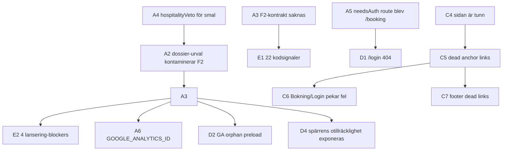

# Buggrapport — Jackes Skjuthotell (kvällsgenerering 2026-04-18)

> **Sessions-id:** chat `5f12ea82-f3e0-4ca0-9c4b-cc19a6db9a24`
> **Datum/tid:** natten mellan 2026-04-17 och 2026-04-18 (klockan ~03:36–04:50 lokal tid)
> **Rapportförfattare:** AI-assistent (Cursor / Opus 4.7), live medan användaren testkörde
> **Status:** All evidens kommer från denna sessions terminal-output (du klistrade dev-loggar), screenshots av live-previewen, samt kod-läsning. **`data/prompt-dumps/` var tomt** under hela körningen eftersom `SAJTMASKIN_PROMPT_DUMP` inte var satt i den shell som startade dev-servern; `logs/`-mappen fanns inte heller på disk att läsa. Allt under "Evidens" är därför citerat från konversationsloggar — inga prompt-artefakter sparade.

---

## 1. Sammanfattning

En F2-generering kördes mot prompten "Hejsan, jag skulle vilja ha en hemsida som handlar om ett hotell. … Jackes Skjuthotell. … Gärna två sidor, varav en är en inloggningssida." Pipelinen producerade en deploy-bar sajt med två routes (`/` och `/booking`) på vm-fly-jakem.fly.dev. Designen är hantverksmässigt **bra** (typografi, färger, hero-komposition) men har **stora kvalitetsglapp** i innehåll (fel geografi i hero-bild, "skytte"-temat osynligt, tunn sidstruktur) och **strukturella buggar** i pipelinen som gör att F2-output i praktiken beter sig som F3 (riktiga provider-imports, riktiga env-keys, lansering-spärr).

Totalt **29 observationer** dokumenterade, varav många är **symptom på 2 rotorsaker**: (1) F2-kontraktet håller inte — modellen får dossier-exempel som inspiration men lägger till deras imports och env-keys verbatim, och (2) builder-UI:t har layout-buggar som blockerar fortsatt iteration (chat-input försvinner, overlay i fel panel, chattrutor som inte stänger).

Hade vi kört **bara** två fixar — F2-kontrakt-förstärkning i system-prompten + ENV-panelens `max-h` — hade ~10 av 29 observationer fallit bort på köpet.

---

## 2. Sessions-metadata

### Prompt
> Hejsan, jag skulle vilja ha en hemsida som handlar om ett hotell. Hotellet ska bedriva uthyrning av hotellrum såklart i Småland. Vi har åtta våningar och en skyscraper mitt i skogen. På de här moderna faciliteterna så ska man kunna skjuta älg och det heter Jackes Skjuthotell. Jag vill ha lite coola, balla grejer på sidan men också så att man kan boka saker och sådär. Gärna två sidor, varav en är en inloggningssida.

(537 tecken, freeform, deep brief på, image-gen på)

### Buildprofil

- **Profil:** Tanker / `max`
- **Motorväg:** egen motor
- **Körmodell:** `gpt-5.4` (direct OpenAI provider)
- **Thinking:** av
- **Bildgenerering:** på
- **Chat privacy:** private
- **Scaffold (resolved):** `landing-page`, variant `warm-local`
- **Route count (resolved):** 2
- **Quality target:** `standard`
- **Context policy:** `normal`
- **Preview policy:** `fidelity2` (default)
- **Prompt strategy:** `direct` (537 tecken under mjuk orkestreringsgräns ~75000)

### Dossier-urval

Embedding-sökning över pool på 98 dossiers gav 4 träffar (`scaffold` 1139ms, top-K=3 men 4 returnerades efter kategorigrupperingen):

- `ui-marketing`: `ui-marketing-finwise-saas-landing-page`
- `cms`: `cms-builder-io-personalization-starter`
- `payments`: `payments-stripe-checkout` ← osannolik match för en hotell-prompt; embedding-vektorn för "boka rum" hamnar nära "checkout"
- `ui-content`: `ui-content-headlesshost-knowledgebase`

### Stream-stats

- **Pre-stream:** 4635ms
- **Stream:** 150 438ms (≈2,5 min)
- **Tokens in/ut:** 19 263 / 13 319
- **Text-deltas:** 13 315
- **Reasoning:** 0ms (thinking av)
- **System-prompt total:** 82 161 tecken (static 26 131 + dynamic 55 995)
- **Autofix:** 31 fixar, 9 warnings
- **Syntax-validering pass 1:** invalid (4 fel kvar)
- **LLM fixer:** startade med `gpt-5.3-codex` på de 4 felen

### Slutsajt (verifierad live)

- `/` (landing): renderar (se [https://vm-fly-jakem.fly.dev/5f12ea82-f3e0-4ca0-9c4b-cc19a6db9a24](https://vm-fly-jakem.fly.dev/5f12ea82-f3e0-4ca0-9c4b-cc19a6db9a24))
- `/booking` (login + ny bokning kombinerat): renderar
- `/login`: **404** — ingen sådan route finns

---

## 3. Buggar och observationer

Severitet-skalan: `blocker` (förhindrar fortsatt arbete eller publicering), `major` (allvarlig kvalitetsbrist, ej blockerande), `minor` (kosmetik/polish).

### Kategori A — Pipeline / orkestrering (8 punkter)

#### A1. Brief-generation 422-fel: schema saknar `dossierNominations` i `required`
- **Severitet:** major
- **Evidens (terminallogg):**
  ```
  03:36:41.119 [brief] start openai/gpt-5.4 (418 chars, images=true)
  [AI] Brief generation failed: {
    error: "Invalid schema for response_format 'response': In context=(),
    'required' is required to be supplied and to be an array including
    every key in properties. Missing 'dossierNominations'."
  }
   POST /api/ai/brief 422 in 825ms
  ```
  Felade två gånger i rad innan orchestrationen fortsatte utan brief.
- **Trolig orsak:** OpenAI strict JSON schema (`response_format` med `strict: true`) kräver att *varje* key i `properties` också listas i `required`. Schemat för brief-svaret listar `dossierNominations` i `properties` men har glömt det i `required`.
- **Fix-riktning:** lägg till `"dossierNominations"` i `required`-arrayen för brief response-schemat. Tag ev. på enklare lösning: kör schemat utan `strict: true` om vi inte använder strict-egenskaperna.
- **Konsekvens i den här körningen:** "Deep brief" var påslagen i UI:t men den genererade aldrig något → orchestration loggade `Server auto brief skipped or returned empty { durationMs: 244 }` → allt kontextarbete gjordes utan brief-anrikning.

#### A2. Dossier-urval kontaminerar F2 ("modellen blir ambitiös")
- **Severitet:** major
- **Evidens:** 4 valda dossiers inkluderade `payments-stripe-checkout` (osannolikt för en hotell-prompt utan webshop) och `cms-builder-io-personalization-starter` + `ui-content-headlesshost-knowledgebase` (CMS/sök-tunga). Resultat: den genererade koden importerade Stripe, Supabase, Clerk, Sanity, Algolia, Meilisearch, Typesense, Elasticsearch, Sentry, GA, GTM, Plausible, PostHog, Storyblok, Contentful — för en statisk landing.
- **Trolig orsak:** dossier-urvalet är pure embedding-similarity över hela poolen utan hård filtrering på domän-tag. "Boka rum" → "checkout" i embedding-rymden. Modellen tar import-rader och env-referenser direkt från dossier-källfiler.
- **Fix-riktning:**
  - Hård domänveto vid dossier-urval (i [src/lib/gen/scaffolds/matcher.ts](src/lib/gen/scaffolds/matcher.ts) + var dossier-urvalet sker): hospitality-prompts ska inte få `payments-*`, `auth-*`, `database-*`-dossiers även om embedding-distansen är liten
  - Eller: F2-only filter ovanpå embedding-träffarna — i F2 maxa dossier-poolen till `ui-*` och `landing-*`
  - Långsiktigt: lägg till "stoppord-kategorier" i dossier-manifestet som `incompatibleWith: ["hospitality", "service-business"]`

#### A3. F2-kontrakt saknas i system-prompten
- **Severitet:** blocker (för F2-värdesats)
- **Evidens:** Genererad kod innehöll `import Stripe from "stripe"`, `process.env.SUPABASE_URL`, `@clerk/nextjs`, `algoliasearch`, `meilisearch`, `typesense`, `@elastic/elasticsearch`. Detekterades som **22 kodsignaler / 36 env-vars** i builder-panelen och 4 hård-blockers i lansering-spärren.
- **Trolig orsak:** [src/lib/gen/build-spec.ts:551](src/lib/gen/build-spec.ts) sätter `previewPolicy: "fidelity2"` som default, men system-prompten ([config/prompt-core/01-behavioral-contract.md](config/prompt-core/01-behavioral-contract.md) och dynamic-context-byggandet) verkar **inte** explicit förbjuda riktiga provider-imports i F2.
- **Fix-riktning:** Lägg till en explicit F2-sektion i system-prompten:
  > "I F2-läge: använd ALDRIG `process.env.X` för riktiga providers (Stripe, Supabase, Clerk, Auth.js, Algolia, Meilisearch, Typesense, Elasticsearch, Sentry, Sanity, Storyblok, Contentful, Resend, Upstash). Importera ALDRIG paket från dessa leverantörer. Mocka all data inline (`const ROOMS = [...]`), använd `useState` för formulär utan persistence, visa `toast()` på submit."
  Verifiera mot [src/lib/gen/system-prompt.ts](src/lib/gen/system-prompt.ts) att F2-strängen faktiskt injiceras när `previewPolicy === "fidelity2"`. Om det redan finns en sådan sektion: gör den hårdare och flytta den högre upp i prompten.
- **Konsekvens:** Detta är **rotorsaken** till observationerna A2, D2, D4, E1, E2.

#### A4. `hospitalityVeto` är för smal
- **Severitet:** major
- **Evidens:** [src/lib/gen/capability-inference.ts:165–178](src/lib/gen/capability-inference.ts) släcker bara `needsEcommerce`-flaggan när hospitality-keywords finns. Den filtrerar **inte** dossier-urvalet och påverkar inte capability-flagor som `needsAuth` eller `needsDatabase`.
  ```typescript
  if (result.needsEcommerce) {
    const hospitalityVeto = /(restaurang|hotell|spa|salong|...)/iu;
    if (hospitalityVeto.test(prompt) && !strongEcommerceIntent.test(prompt)) {
      result.needsEcommerce = false;
    }
  }
  ```
- **Trolig orsak:** Veton designades enbart för att hindra "boka rum" från att bli "e-handel". Den lever bara i capability-lagret, inte i scaffold-/dossier-lagret.
- **Fix-riktning:** Lyft upp veton till en gemensam `domain-veto.ts` som körs både i capability-inferens **och** i dossier-urvalet. Lägg till en negativ-tagg per dossier (`incompatibleDomains: ["hospitality"]` på `payments-*`).

#### A5. Capability `needsAuth` resulterade i route `/booking` istället för `/login`
- **Severitet:** major
- **Evidens:** UI:t säger "Bokning / Login", scaffold-kontraktet talar om en login-route, men den faktiska rutten heter `/booking`. `/login` returnerar 404 (verifierat live i browser). Modellen byggde ihop login + ny-bokning-flödena i en kombinerad sida, vilket är en designvarmt val men strider mot "scaffold + auth ⇒ /login"-konventionen om sådan finns.
- **Trolig orsak:** Scaffold-kontraktet specificerar inte route-namn deterministiskt, eller låter modellen välja namn baserat på prompten ("inloggning" + "bokning" → `/booking` med tabbar). Capability-inference markerar bara `needsAuth: true` men ger inget "preferred route name"-hint.
- **Fix-riktning:** Två alternativ — välj ett:
  1. **Tolerant:** lägg till en route-alias-mappning så `/login` redirectar till `/booking` om login-flow ligger där. Acceptera modellens val.
  2. **Strikt:** inferens som sätter `needsAuth: true` ska också skicka in en hård instruktion: "Login-flödet MÅSTE ligga på `/login`, även om det är kombinerat med andra flöden." Variant: scaffold-kontraktet listar exakta route-paths.
- Se cross-cutting-fråga 2 längst ner.

#### A6. Modellen uppfann ett non-standard env-key-namn (`GOOGLE_ANALYTICS_ID`)
- **Severitet:** major
- **Evidens:** Lansering-spärren listar `GOOGLE_ANALYTICS_ID` som en av 4 saknade env-keys. [config/ai_models/40-harmless-placeholders.env.txt](config/ai_models/40-harmless-placeholders.env.txt) listar `NEXT_PUBLIC_GA_ID=G-PLACEHOLDER000` (standard-Next.js-konvention) men inte `GOOGLE_ANALYTICS_ID`. Modellen uppfann ett alternativt namn.
- **Trolig orsak:** I dossier-exempel kan både `NEXT_PUBLIC_GA_ID` och `GOOGLE_ANALYTICS_ID` förekomma; modellen valde ett eget format. Detect-pipeline fångar `NEXT_PUBLIC_GA_ID` via mönster `(?:gtag\(|google-analytics|GA_MEASUREMENT_ID|NEXT_PUBLIC_GA_ID)` i [src/lib/gen/detect-integrations.ts:152](src/lib/gen/detect-integrations.ts), men `GOOGLE_ANALYTICS_ID` fångas via `process.env.GOOGLE_ANALYTICS_ID`-regex i `appendCustomEnvIntegrations` → custom-env bucket → ingen placeholder → blocker.
- **Fix-riktning:**
  - Lägg in `GOOGLE_ANALYTICS_ID` som alias i `40-harmless-placeholders.env.txt` (snabbt) ELLER
  - Förstärk system-prompten med en lista över de **enda tillåtna** analytics/tracking-env-key-namnen, så modellen inte uppfinner egna ELLER
  - Lägg till en aliasering i [src/lib/integrations/registry.ts](src/lib/integrations/registry.ts) så att custom keys som `GOOGLE_ANALYTICS_ID`, `GA_ID`, `GA_TRACKING_ID` mappas till `NEXT_PUBLIC_GA_ID`-placeholdern.

#### A7. Överproduktion: 150s stream / 13 319 ut-tokens för en F2-landing
- **Severitet:** minor (just nu)
- **Evidens:** Stream phases: `durationMs: 150438`, `outputTokens: 13319`. Resultat: ~10 filer, modest UI. Det här är 2,5 minuters realtid och proportionellt mycket dyrt för det levererade.
- **Trolig orsak:** Modellen genererar ofta för långt i F2 — täcker mycket "best practices" (a11y-attribut, alla möjliga states, omfattande typer) som inte syns i preview. Kombineras med att system-prompten i sig är 82 161 tecken (mycket dynamic context).
- **Fix-riktning:** Mät token-spend per kategori (rendering vs imports vs types vs comments). Om mer än hälften går till annat än faktisk JSX/CSS, skär ner. Möjlig prompt-instruktion: "I F2: skriv minimalt med kommentarer, hoppa över exhaustive types, använd `unknown`/inferens där typer inte är centrala."

#### A8. Kvarvarande syntaxfel efter mekanisk autofix
- **Severitet:** minor (LLM-fixern fångade det)
- **Evidens:**
  ```
  [sajtmaskin-dev] 03:39:18 ... autofix.result | fixes=31 | warnings=9
  [sajtmaskin-dev] 03:39:19 ... syntax-validation.pass | pass=1 | phase=invalid | errors=4
  [sajtmaskin-dev] 03:39:19 ... autofix.mechanical-residual | mechanical=0 | residual=4
  [engine] Pass 1: 4 syntax errors, attempting LLM fixer
  ```
- **Trolig orsak:** Mekaniska autofix-regler täcker inte allt. Kan vara matchande JSX-taggar, semikolon, eller import-ordning. Hade krävt att man inspekterar de faktiska 4 felen — ej tillgängligt nu.
- **Fix-riktning:** Vid nästa körning, dumpa de exakta `errors`-objektresetten i autofix-loggen så vi kan se vilka mönster som missas och utöka mekanisk autofix med dem.

---

### Kategori B — Builder-UI (7 punkter)

#### B1. ThinkingOverlay placerad i chat-panelen istället för preview-panelen
- **Severitet:** major
- **Evidens:** [src/app/builder/BuilderShellContent.tsx:819](src/app/builder/BuilderShellContent.tsx) monterar `<ThinkingOverlay isVisible={vm.isAnyStreaming} />` inuti `<div id="builder-chat-panel">` runt `MessageList`. Overlayen själv använder `absolute inset-x-0 bottom-16` (se [src/components/builder/ThinkingOverlay.tsx:44](src/components/builder/ThinkingOverlay.tsx)) → "absolute parent" blir chat-divven → overlay hamnar ovanpå chatten.
- **Trolig orsak:** Overlayen införd som UI-feedback på "AI genererar..." men stoppad i fel container. Användaren förväntar sig att den syns över iframe-ytan (där genereringen visas).
- **Fix-riktning:** Två alternativ:
  1. **Snabb:** flytta `<ThinkingOverlay>` till inuti `<div id="builder-preview-panel">` (rad 911 i samma fil) och lägg `relative` på den containern.
  2. **Renare:** stoppa in overlayen *inuti* [src/components/builder/preview-panel/PreviewPanel.tsx](src/components/builder/preview-panel/PreviewPanel.tsx) precis ovanför iframen så den följer iframens bounding box. Skicka `vm.isAnyStreaming` som prop.
  Bonus: byt `bottom-16` mot `inset-0 flex items-center justify-center` så den centreras över hela iframens yta.

#### B2. "Laddar preview..." overlay är heltäckande svart över shim
- **Severitet:** major
- **Evidens:** [src/components/builder/preview-panel/PreviewPanelFrame.tsx:38–45](src/components/builder/preview-panel/PreviewPanelFrame.tsx):
  ```tsx
  {isLoading ? (
    <div className="absolute inset-0 z-10 flex items-center justify-center bg-black/80">
      <Loader2 ... />
      <p>Laddar preview...</p>
    </div>
  ) : null}
  ```
  Triggas direkt när F2-shimmen kommer upp → "asjobbig" enligt användartesten.
- **Trolig orsak:** Loadern designad för en enklare rendering-sekvens; tar inte hänsyn till att F2-shim redan kan vara synlig och bara väntar på live-VM-preview.
- **Fix-riktning:**
  - Byt `bg-black/80` mot `bg-background/40` eller en topbar-progress-stripe så shimmen syns igenom.
  - Suppressa overlayen om en shim redan är synlig: `isLoading && !hasShimVisible`.

#### B3. ProjectEnvVarsPanel kannibaliserar chat-input när expanderat (KRITISK UX)
- **Severitet:** blocker (chat blir oanvändbar mitt i en session)
- **Evidens:** [src/app/builder/BuilderShellContent.tsx:794–820](src/app/builder/BuilderShellContent.tsx) staplar `<ProjectEnvVarsPanel>` direkt över `<MessageList>` och `<ChatInterface>` i en `lg:w-96 flex-col`. När panelen expanderar (manuellt eller via auto-trigger på rad 239 / 569 i [src/components/builder/ProjectEnvVarsPanel.tsx](src/components/builder/ProjectEnvVarsPanel.tsx)) och har många integrationer (22 i den här körningen) → växer fritt → trycker chat-input ut ur viewporten. Användaren kunde inte skicka follow-up.
  Inuti panelen ([rad 798–799](src/components/builder/ProjectEnvVarsPanel.tsx)):
  ```tsx
  {expanded && (
    <div className="mt-2">
  ```
  Inget tak, inget overflow.
- **Trolig orsak:** Designerad för få integrationer (3–5). När modellen drar in 22 syns konsekvenserna.
- **Fix-riktning:**
  - **Snabbt:** lägg `max-h-[40vh] overflow-y-auto` på den expanderade `<div className="mt-2">` på rad 799.
  - **Arkitekturfix:** flytta hela panelens expanderade läge till en `Sheet`/`Drawer`/`Popover` ovanpå allt annat istället för inline-stacked.
  - **Bonus:** verifiera att auto-expand-triggers (rad 239 = `handleEnvOpen`-event, rad 569 = `handleIntOpen`-event) inte triggas under streaming/post-checks så panelen inte poppar upp av sig själv mitt i en chat.

#### B4. Auto-expand-triggers på ProjectEnvVarsPanel
- **Severitet:** minor (förvärrar B3)
- **Evidens:** [src/components/builder/ProjectEnvVarsPanel.tsx:239 + 569](src/components/builder/ProjectEnvVarsPanel.tsx) sätter `setExpanded(true)` baserat på custom-events `project-env-vars-open` och `integrations-panel-open`. Dessa kan triggas från andra panelers callbacks utan användarens aktiva val.
- **Trolig orsak:** Bra UX-intention (hoppa till relevant info) men ingen kontroll mot streaming/busy-state.
- **Fix-riktning:** Suppressa auto-expand när `vm.isAnyStreaming` eller chat-input-fältet har fokus. Eller minska auto-expand till en pulserande indikator istället för full expansion.

#### B5. /booking-route-tab i preview snurrar och bouncar tillbaka
- **Severitet:** major
- **Evidens:** Användarrapport: "Jag klickade på fliken `/booking` som bara fick allt att stå och snurra ett tag innan vi kom tillbaka till där vi var..." — vid direkt navigering i browsern fungerar `/booking`, så det är route-tab-handlern i preview-panelen som tappar bollen.
- **Trolig orsak:** Iframe re-fetch / preview-session-refresh triggas på route-klick och timeout slår till innan svar; eller route-tab-handlern återställer till första route när load överstiger en gräns.
- **Fix-riktning:** Behöver gräva i [src/components/builder/preview-panel/PreviewPanel.tsx](src/components/builder/preview-panel/PreviewPanel.tsx) eller `PreviewPanelFrame.tsx`s navigation-logik. Förslag: läs koden för route-tab-onClick och se om den postar en navigation-meddelande till iframen via `postMessage` eller pushar en path till `previewUrl` med refresh-token-bump. Om refresh-token bumpas vid varje klick → onödig full-reload som är långsam.

#### B6. OpenClaw / D-ID-chattruta kan inte stängas
- **Severitet:** major
- **Evidens:** Användarrapport. Wrapper-divven i [src/components/openclaw/OpenClawChat.tsx:233–242](src/components/openclaw/OpenClawChat.tsx):
  ```tsx
  <div className={cn(
    "origin-bottom-right self-end overflow-hidden transition-all duration-200 ease-out",
    isOpen
      ? "pointer-events-auto max-h-[min(500px,calc(100vh-7rem))] scale-100 opacity-100"
      : "max-h-0 scale-95 opacity-0",  // saknar pointer-events-none
  )}>
    <OpenClawChatPanel onClose={close} content={content.panel} isOpen={isOpen} />
  </div>
  ```
  X-knappen i panelen ([rad 155–162](src/components/openclaw/OpenClawChatPanel.tsx)) anropar `onClose={close}` (från `useOpenClawStore`).
- **Trolig orsak (3 hypoteser, behöver verifieras):**
  1. Wrappern saknar `pointer-events-none` när `!isOpen` → klick-events kan läcka under transition.
  2. Höjd-mismatch: panel har `h-[min(580px,...)]`, wrapper klipper på `max-h-[min(500px,...)]` → 80px klipps. X högst upp borde synas, men i avatar-läge kan video-rutan trycka header.
  3. `close()` från `useOpenClawStore` kallas men `isOpen` återställs av en effekt (D-ID-disconnect → state-uppdatering → bounce).
- **Fix-riktning:**
  - Lägg `pointer-events-none` + `aria-hidden="true"` på wrappern när `!isOpen`.
  - Lägg en temporär `console.log` i `close` för att verifiera att klicket faktiskt går igenom.
  - Inspektera `useDidAvatar`-hookens disconnect-flöde — kastar den något fel som triggar parent re-render?

#### B7. Mobile menu-knapp ("Öppna meny") visas på desktop
- **Severitet:** minor
- **Evidens:** Screenshot från live-preview visar "Öppna meny"-knappen synlig i desktop-vyn i den genererade hotellsidans header.
- **Trolig orsak:** Den genererade koden saknar `hidden md:block` / `md:hidden`-conditional på knappen.
- **Fix-riktning:** Detta är en autofix-kandidat — lägg till en post-check-regel: "om en knapp har label som matchar `/(open|öppna).*menu|meny/i` och inte har `md:hidden` eller motsvarande, varna." Eller bättre: skicka in en regel i system-prompten om responsiv header.

---

### Kategori C — Genererat innehåll / kvalitet (8 punkter)

#### C1. Hero-bilden är fel geografi
- **Severitet:** major
- **Evidens:** Hero-bilden är en alpin bergsbild (ser ut som Yosemite/Half Dome med flod) — Småland är platt tallskog, inga berg. Bilden var live på `https://vm-fly-jakem.fly.dev/5f12ea82-...` när granskningen gjordes.
- **Trolig orsak:** Image-gen var påslagen i UI:t men bilden ser ut som en stockfoto-fallback — antingen kallades inte image-gen för hero, eller kallades den med en generisk "skog vid berg"-prompt utan Småland-specifik geografi.
- **Fix-riktning:**
  - Verifiera att image-gen faktiskt triggas för hero-bilden (logga `image-gen.start`/`image-gen.done` per asset).
  - Berika image-gen-prompten med geografisk kontext från capability/scaffold: när prompten nämner specifik plats ("Småland"), inkludera det i image-gen-prompten ("svensk tallskog vid solnedgång, platt landskap, ej berg, Småland").
  - Om image-gen failat och kod fallback:ar till stockfoto, logga det tydligt så det inte ser ut som image-gen lyckades.

#### C2. "Skyscraper i skogen"-konceptet är osynligt visuellt
- **Severitet:** major
- **Evidens:** Prompten ber explicit om "8 våningar och en skyscraper mitt i skogen". Levereras bara som text ("8 våningar med panoramautsikt", "Våning 8" som bild-overlay). Inget visuellt motiv av höghuset, ingen siluett, ingen genererad illustration. Centrala USP saknas.
- **Trolig orsak:** Modellen tolkar "skyscraper i skogen" som en text-USP, inte ett visuellt koncept. Image-gen-prompten verkar inte fångat det heller (jfr C1).
- **Fix-riktning:** I capability-inference: identifiera "visual anchor concepts" (t.ex. ovanliga objekt + plats — "skyscraper + skog", "djur + arkitektur") och skicka en explicit instruktion till modellen att rendera dessa som SVG-illustrationer eller image-gen-assets.

#### C3. "Älgskytte" / "Skjuthotell"-temat är osynligt
- **Severitet:** major
- **Evidens:** Sajten heter "Jackes Skjuthotell" men "skytteupplevelser" nämns 1 gång i body-text. Ingen ikon, inget motiv, inget paket-kort, ingen sektion. För något döpt till "Skjut-hotell" är vapen/jakt-känslan radikalt underexponerad.
- **Trolig orsak:** Modellen behandlar provokativa/specifika tema-ord som "skytte" som *risky content* och tonar ner. Också möjligt att image-gen vägrar generera vapen/jakt-bilder.
- **Fix-riktning:**
  - Verifiera om modellen explicit tonar ner "skjut"-tematiken — kolla rådata i den genererade page.tsx (för den här körningen ej tillgängligt utan API-anrop).
  - Om image-gen vägrar: erbjud SVG-baserade ikoner för skytte-tema (sikte, älg-silhuett) som fallback.
  - Capability: lägg till `needsThematicAnchors: true` när prompten har specifika tema-ord och förstärk system-prompten: "användarens tema-ord MÅSTE vara visuellt synliga i minst 2 sektioner".

#### C4. Sidan är tunn (bara hero + plan-card + footer)
- **Severitet:** major
- **Evidens:** Full-page screenshot visar: hero med text-vänster + bildkort-höger + "Planera din vistelse"-card + footer. Inga sektioner för Rum, Upplevelser, FAQ trots att de finns i nav.
- **Trolig orsak:** Modellen prioriterade hero-kvalitet över sidlängd. Möjligt att den mekaniska autofix:n även rensade bort delvist genererade sektioner.
- **Fix-riktning:** Scaffold-kontraktet för `landing-page` bör minimi-kräva sektioner (Hero, Features/Services, Testimonials/Reviews, FAQ, CTA, Footer) — annars varna i post-checks.

#### C5. Dead anchor links i nav (4 av 5)
- **Severitet:** major
- **Evidens (verifierat live):** Klickade på "Rum & paket" i nav → URL blir `#rum` men ingen `id="rum"` finns på sidan → ingen scroll, inget händer. Samma för "Upplevelser" (`#upplevelser`), "FAQ" (`#faq`).
- **Trolig orsak:** Modellen genererar nav som "fångar promise" om vad sajten bör innehålla, men producerar inte motsvarande sektioner (kopplat till C4).
- **Fix-riktning:** Lägg till en autofix-regel: `<a href="#X">` måste matcha ett `id="X"`-element på samma route. Om inte → välj en av:
  1. Ta bort nav-länken
  2. Generera en placeholder-sektion med matchande id
  3. Konvertera till disabled state med tooltip "Kommer snart"

#### C6. "Bokning / Login" i nav pekar på `#rum` (helt fel target)
- **Severitet:** major
- **Evidens (verifierat live):** Klickade på "Bokning / Login" i nav → URL blev `#rum`. Den faktiska login/booking-sidan finns på `/booking`. Användaren skulle aldrig hitta dit via nav.
- **Trolig orsak:** Modellen generated nav-länkar i en for-loop med en mall som hade fel `href`-mappning för login-knappen. Fel kvarstod efter autofix eftersom det är "valid syntax" (hash-length är inte en syntaxfel).
- **Fix-riktning:** Samma autofix-regel som C5, plus en specifik kontroll: om en nav-länk har label som matchar `/(login|logga in|sign|auth|booking|bokning)/i`, måste `href` peka på en faktisk auth/booking-route, inte en hash.

#### C7. Footer-länkar har samma dead-link-problem
- **Severitet:** major
- **Evidens:** Footer-screenshot visar samma nav (Hem, Rum & paket, Upplevelser, FAQ) plus Service-kolumn (Bokning/Login, Ring receptionen, Skicka e-post, Vägbeskrivning).
- **Trolig orsak:** Modellen återanvände nav-data-arrayen i footer.
- **Fix-riktning:** Samma autofix-regel täcker både header och footer.

#### C8. Bakgrunden är platt (ingen gradient, texture eller djup)
- **Severitet:** minor (kvalitet)
- **Evidens:** Användarens initiala observation: "Bakgrunden är visserligen okej, men inte jättebra." Verifierat i screenshot — i stort sett vit/cream platt yta över hela layouten.
- **Trolig orsak:** Modellen valde säker default. Premium-känsla saknas.
- **Fix-riktning:** Capability `needsPremiumVisuals` finns redan ([src/lib/gen/capability-inference.ts:106](src/lib/gen/capability-inference.ts)) men triggas inte här (prompten har inga premium-keywords). Förslag: för hospitality-domän, sätt `needsPremiumVisuals: true` automatiskt.

---

### Kategori D — Deploy / runtime (4 punkter)

#### D1. `/login` returnerar 404
- **Severitet:** major
- **Evidens (verifierat live):** `https://vm-fly-jakem.fly.dev/5f12ea82-.../login` returnerar Next.js 404-sida.
- **Trolig orsak:** Se A5 — modellen valde att kombinera login + booking på `/booking` istället för att skapa separat `/login`. Konventionen "login → /login" bröts.
- **Fix-riktning:** Se A5 — välj "tolerant" (alias-redirect) eller "strikt" (forcera route-namn). Eller lägg till en route-fallback i scaffolden: om `needsAuth: true` ska antingen `/login` eller `/booking?tab=login` fungera.

#### D2. GA orphan-preload-warning ("preloaded but not used")
- **Severitet:** minor
- **Evidens (browser console):**
  ```
  The resource https://www.googletagmanager.com/gtag/js?id=1122 was
  preloaded using link preload but not used within a few seconds from
  the window's load event.
  ```
  (`1122` är värdet användaren satte på `GOOGLE_ANALYTICS_ID` för att testa lansering-spärren.)
- **Trolig orsak:** Modellen genererade `<link rel="preload" as="script" href="...gtag/js?id=...">` men det riktiga `<Script>`-elementet körs inte (eller villkoras bort med en strategy som aldrig blir sant). Mismatch mellan preload-deklaration och faktisk användning.
- **Fix-riktning:**
  - Primär: F2-kontrakt (A3) ska eliminera GA helt → preload försvinner.
  - Sekundär: post-check-regel "orphan preload" — varje `<link rel="preload" href="X">` måste ha motsvarande `<Script src="X">` eller `<script src="X">` på samma sida.

#### D3. WebSocket HMR-failure i deployed preview
- **Severitet:** minor (kosmetik)
- **Evidens (browser console):**
  ```
  WebSocket connection to 'wss://vm-fly-jakem.fly.dev/.../_next/webpack-hmr?id=...' failed
  ```
  Spamning, browsern återansluter automatiskt.
- **Trolig orsak:** Den genererade Next.js-appen kör i `next dev` (dev-mode) i fly-VM:en istället för `next build && next start`. Dev-mode försöker etablera HMR-WebSocket; fly:s reverse-proxy släpper inte igenom WSS för HMR-pathen.
- **Fix-riktning:**
  1. Kör previewn med `next start` (efter `next build`) istället för `next dev` — snabbare laddtid också.
  2. Om dev-mode är medvetet val (för snabbare regeneration): konfigurera fly-routing att hantera WSS-uppgraderingen för `/_next/webpack-hmr`-pathen.
  3. Som nödlösning: injicera en pre-render-shim som overrider HMR-WS-anropet så consolen inte spammas.

#### D4. Lansering-spärr validerar bara key-närvaro, inte värde-format
- **Severitet:** major (deploy-säkerhet)
- **Evidens:** [src/lib/project-env-resolver.ts:103](src/lib/project-env-resolver.ts) gör enkel set-medlemskaps-check:
  ```typescript
  const unconfigured = requiredEnvKeys.filter(
    (key) => !env.configuredKeys.has(key),
  );
  ```
  Inget formatkrav. Användaren kunde sätta `1122` på `GOOGLE_ANALYTICS_ID` och anses ha "konfigurerat" det. Samma logik gäller för Stripe-keys, Supabase URL etc.
- **Trolig orsak:** Spärren designades för att förhindra deploy med saknade nycklar, inte för att validera korrekta värden.
- **Fix-riktning:** Lägg till per-key validators i en ny modul (t.ex. `src/lib/integrations/env-validators.ts`):
  - `STRIPE_SECRET_KEY` → måste börja med `sk_test_` eller `sk_live_`
  - `STRIPE_PUBLISHABLE_KEY` → måste börja med `pk_test_` eller `pk_live_`
  - `NEXT_PUBLIC_GA_ID` → måste matcha `/^G-[A-Z0-9]+$/` eller `/^UA-/`
  - `NEXT_PUBLIC_SUPABASE_URL` → måste vara giltig HTTPS-URL till `*.supabase.co`
  - osv.
  Visa varning ("Värdet ser ut som en placeholder") snarare än hård blocker — användare kan ha legitima skäl att deploya med dummy-värden.

---

### Kategori E — ENV / integrationer (2 punkter)

#### E1. 22 kodsignaler / 36 env-vars detekterade i en F2-landing
- **Severitet:** blocker (för F2-värdesats)
- **Evidens:** Användarens screenshot från ProjectEnvVarsPanel visade detekterat: Supabase, Stripe, Clerk, NextAuth, Resend, Upstash, OpenAI, Algolia, Meilisearch, Typesense, Elasticsearch, Sentry, Vercel Blob, Vercel KV, Google APIs, GA, GTM, Vercel Analytics, Plausible, PostHog, MongoDB, Sanity, Contentful, Storyblok. För en hotell-landing där 0 av dessa behövs.
- **Trolig orsak:** Se A2 + A3 — dossier-kontamination + saknat F2-kontrakt → modellen drog in import-rader och env-referenser från dossier-exempel.
- **Fix-riktning:** Lös A3 (F2-kontrakt) först — då försvinner sannolikt 90% av detta. Om någon enstaka kvarstår: post-check-regel som varnar om en F2-genererad sida importerar paket från `INTEGRATION_PROVIDER_PACKAGES`-listan och fail:ar generationen (be modellen regenerera utan dem).

#### E2. 4 hård-blockers i lansering utan placeholder-täckning
- **Severitet:** major (annars kan inte sajten publiceras)
- **Evidens:** Lansering-spärr listar:
  - `GOOGLE_CLIENT_ID` (server-side OAuth, inte i placeholders)
  - `GOOGLE_CLIENT_SECRET` (samma)
  - `SANITY_API_TOKEN` (server-side write token; `NEXT_PUBLIC_SANITY_*` är placeholdrade men inte denna)
  - `GOOGLE_ANALYTICS_ID` (non-standard namn — se A6)
- **Trolig orsak:** Modellen drog in OAuth-koppling och Sanity write-token utan att användaren bett om det. Placeholders för dessa server-side-keys är medvetet uteslutna eftersom de hade gjort F3-deploys osäkra.
- **Fix-riktning:**
  - Primär: F2-kontrakt (A3) eliminerar dem från koden.
  - Sekundär (om de ändå hamnar i F3): aliasera `GOOGLE_ANALYTICS_ID` → `NEXT_PUBLIC_GA_ID` (A6).
  - Sanity write-token bör i F3 prompta användaren med en specifik connect-flow ("Anslut Sanity") istället för att kräva manuellt fyllda env-vars.

---

## 4. Tematisk röd tråd

Av de 29 observationerna är **~10 direkta symptom av samma rot**: F2-kontraktet är inte tillräckligt strikt och dossier-urvalet drar in olämpliga exempel som modellen kopierar imports från.



**Slutsats:** Att fixa **A3 (F2-kontrakt)** + **A2 (dossier-veto för F2)** + **B3 (ENV-panelens max-h)** skulle ta bort 10–12 observationer på köpet. Det är klart högsta-ROI-arbetet.

---

## 5. Föreslagen prioriteringsordning för imorgon

### Våg 1 — Akut UX (≤30 min)
Mål: göra det möjligt att fortsätta testa utan att fastna.

- **B3** ENV-panelens `max-h-[40vh] overflow-y-auto` på rad 799 → chat-input synlig igen
- **B6** OpenClaw `pointer-events-none` när stängd + verifiera `close()` → chattruta stänger
- **B1** ThinkingOverlay flyttas till PreviewPanel + centrera

### Våg 2 — F2-kontrakt (1–2h)
Mål: stoppa rotorsaken bakom ~10 av observationerna.

- **A3** Lägg till explicit F2-förbud-sektion i system-prompten ([src/lib/gen/system-prompt.ts](src/lib/gen/system-prompt.ts) eller [config/prompt-core/01-behavioral-contract.md](config/prompt-core/01-behavioral-contract.md))
- **A1** Fixa brief-schemat: lägg till `dossierNominations` i `required`
- **A2** + **A4** Förstärk hospitality-veto till att även filtrera dossier-pool, inte bara `needsEcommerce`-flaggan

### Våg 3 — Innehållskvalitet (2–4h)
Mål: lyfta excellence-känslan i den genererade output.

- **C5** + **C6** + **C7** Autofix-regel: nav-anchor-href måste matcha sektion-id
- **C2** + **C3** Capability `needsThematicAnchors` för specifika tema-ord
- **C1** Berika image-gen med geografisk kontext
- **C4** Scaffold-minimum-sektioner-kontrakt för `landing-page`
- **C8** Auto-trigga `needsPremiumVisuals` för hospitality

### Våg 4 — Polish och deploy (1–2h)
Mål: städa runtime-spam och spärr-säkerhet.

- **D2** Post-check "orphan preload"
- **D3** Kör preview med `next start` istället för `next dev`
- **D4** Per-key env-value-validators
- **A6** Aliasera `GOOGLE_ANALYTICS_ID` till `NEXT_PUBLIC_GA_ID` placeholder
- **A5** + **D1** Beslut: tolerant (alias) eller strikt (force `/login`)
- **B2** Diskretare "Laddar preview..."-overlay
- **B4** Suppressa auto-expand under streaming
- **B5** Gräv i route-tab-spinnern
- **B7** Mobile-menu på desktop

### Inte prioriterat (kan vänta)
- A7 (överproduktion / token-spend) — mät innan optimera
- A8 (kvarvarande syntaxfel) — LLM-fixern fångade det

---

## 6. Cross-cutting frågor att besluta

Det här är **policy-frågor** snarare än buggar — de behöver svar innan vissa fixar kan göras "rätt". Förslagsvis 5 minuter över morgonkaffet.

### Q1. Vad är F2 egentligen?
- **Alternativ A:** "UI-skiss utan något backend-beroende, all data inline". Då måste F2-kontraktet vara mycket striktare än idag.
- **Alternativ B:** "UI med mockad backend, kan ha lokala fake-providers". Då behöver vi en mock-provider-bibliotek (t.ex. en `@sajtmaskin/mock-stripe`).

Min rekommendation: **A**. B är overkill för F2.

### Q2. Login-route: tolerant eller strikt?
- **Alternativ A (tolerant):** modellen får välja `/login`, `/booking`, `/auth`, `/sign-in` — vi alias:ar dem till varandra och scaffold-kontraktet ackommoderar.
- **Alternativ B (strikt):** vi forcerar `/login` när `needsAuth: true`. Modellen får INTE byta route-namn.

Min rekommendation: **B** för F2 (tydlighet > flexibilitet), **A** för F3 (när användaren vet vad de bygger).

### Q3. Dossier-urval: hard veto eller mjuk vikt?
- **Alternativ A (hard veto):** lista incompatibla `(domain, dossier-key)`-par i config. Hospitality får inte `payments-*`.
- **Alternativ B (mjuk vikt):** påverka embedding-distansen med ett straff på olämpliga par istället för hård exclusion.

Min rekommendation: **A** för F2 (förhindra spillage), **B** för F3 (låt användaren se "mindre relevanta" inspirations-dossiers om embedding tycker det matchar).

---

## 7. Bilaga: filer att börja med

- [src/lib/gen/system-prompt.ts](src/lib/gen/system-prompt.ts) — F2-kontrakt-injektion (A3)
- [config/prompt-core/01-behavioral-contract.md](config/prompt-core/01-behavioral-contract.md) — alternativ plats för F2-förbud
- [src/components/builder/ProjectEnvVarsPanel.tsx](src/components/builder/ProjectEnvVarsPanel.tsx) (rad 799) — B3 quick-fix
- [src/components/openclaw/OpenClawChat.tsx](src/components/openclaw/OpenClawChat.tsx) (rad 233–242) — B6 wrapper-fix
- [src/app/builder/BuilderShellContent.tsx](src/app/builder/BuilderShellContent.tsx) (rad 819) — B1 flytta overlay
- [src/components/builder/preview-panel/PreviewPanelFrame.tsx](src/components/builder/preview-panel/PreviewPanelFrame.tsx) (rad 38–45) — B2 overlay-färg
- [src/lib/gen/capability-inference.ts](src/lib/gen/capability-inference.ts) (rad 165–178) — A4 utöka veto
- [src/lib/gen/detect-integrations.ts](src/lib/gen/detect-integrations.ts) — A6 alias-mappning, E2 post-check
- [src/lib/project-env-resolver.ts](src/lib/project-env-resolver.ts) (rad 103) — D4 lägg till value-validators
- [src/app/api/engine/chats/[chatId]/readiness/route.ts](src/app/api/engine/chats/%5BchatId%5D/readiness/route.ts) (rad 52–60) — D4 spärrens callsite
- [config/ai_models/40-harmless-placeholders.env.txt](config/ai_models/40-harmless-placeholders.env.txt) — A6 lägg till `GOOGLE_ANALYTICS_ID`-alias
- (för Q1/Q2/Q3) [src/lib/gen/build-spec.ts](src/lib/gen/build-spec.ts) (rad 519–553) — preview-policy-resolution

---

## 8. Bilaga: nästa körning rekommenderas med

```powershell
$env:SAJTMASKIN_PROMPT_DUMP = "1"
npm run dev
```

Då skrivs faktiska prompt-artefakter till `data/prompt-dumps/`:
- `orchestration-dynamic/` — dynamisk del av system-prompten
- `own-engine-codegen/full-system.md` + `dynamic-context.md` — full system som skickades till codegen-LLM
- `plan-mode-planner/` — om plan-mode körs

Då kan vi vid nästa bug-jakt korrelera *exakt* vad modellen såg → vad den producerade.

---

*Rapport slut. 29 observationer, 5 kategorier, 3 rotorsaker, 4 vågor av åtgärd.*
