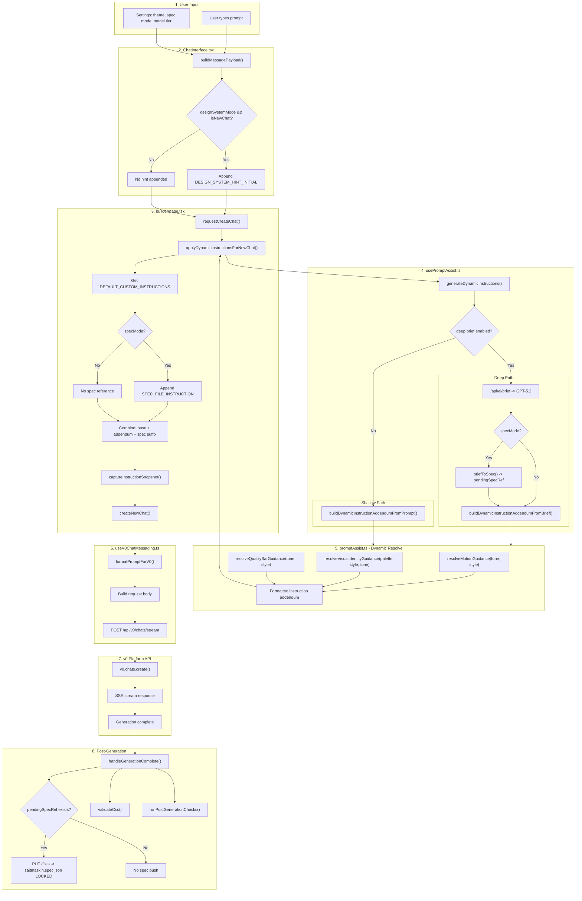
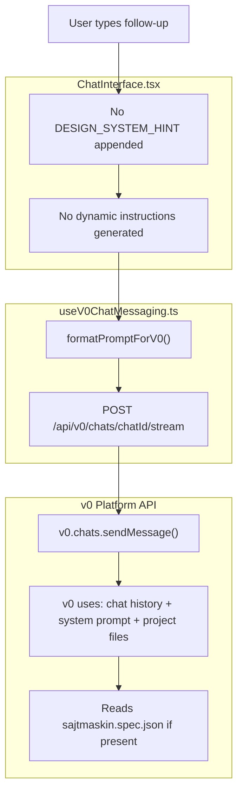
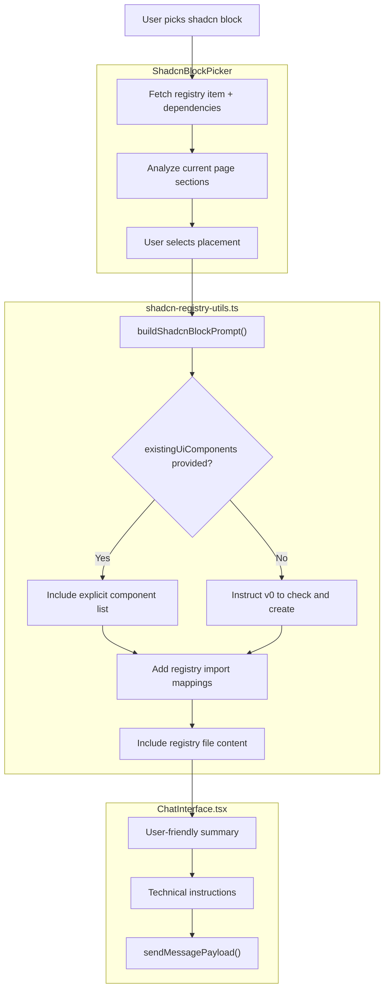

# Sajtmaskin Chat Flow Architecture

Complete flow from user input to v0 generation, including all prompt preprocessing.

## First Prompt (New Chat Creation)



## Follow-up Messages (Existing Chat)



## System Prompt Composition

```
+----------------------------------------------+
| DEFAULT_CUSTOM_INSTRUCTIONS (~1500 chars)    |
| - Tech Stack (Next.js, Tailwind, shadcn)     |
| - shadcn/ui Bootstrap Setup                  |
| - Component Usage                            |
| - Tailwind Best Practices                    |
| - Visual Identity                            |
| - Layout Patterns                            |
| - Motion & Interaction                       |
| - Visual Quality                             |
| - Images                                     |
| - Accessibility                              |
+----------------------------------------------+
|                                              |
| DYNAMIC ADDENDUM (~500-2000 chars)           |
| - Build Intent (template/website/app)        |
| - Project Context (title, tone, audience)    |
| - Pages & Sections (from brief)             |
| - Interaction & Motion (DYNAMIC)             |
| - Visual Identity (DYNAMIC)                  |
| - Quality Bar (DYNAMIC)                      |
| - Imagery guidance                           |
| - Technical Constraints                      |
| - Must Have / Avoid                          |
+----------------------------------------------+
|                                              |
| SPEC_FILE_INSTRUCTION (~150 chars)           |
| (only if spec mode active)                   |
| - Follow sajtmaskin.spec.json                |
| - Refer to spec for context                  |
+----------------------------------------------+

Total: ~2000-4000 chars (~500-1000 tokens)
```

## Block/Component Insertion Flow



## Settings State

| Setting | Type | Default | Persisted | Location |
|---------|------|---------|-----------|----------|
| designTheme | DesignTheme | "blue" | localStorage | page.tsx |
| specMode | boolean | false | localStorage | page.tsx |
| modelTier | ModelTier | "v0-max" | URL param | page.tsx |
| enableThinking | boolean | true | localStorage | page.tsx |
| enableImageGenerations | boolean | true | localStorage | page.tsx |
| enableBlobMedia | boolean | true | localStorage | page.tsx |
| promptAssistDeep | boolean | true | state | page.tsx |
| promptAssistModel | string | "openai/gpt-5.2" | state | page.tsx |
| customInstructions | string | DEFAULT_CUSTOM_INSTRUCTIONS | localStorage (per chat) | page.tsx |
| showStructuredChat | boolean | false | localStorage | page.tsx |
