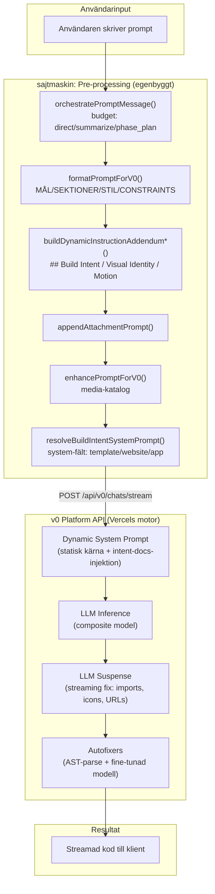
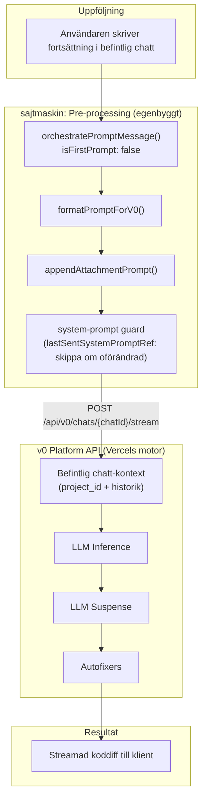
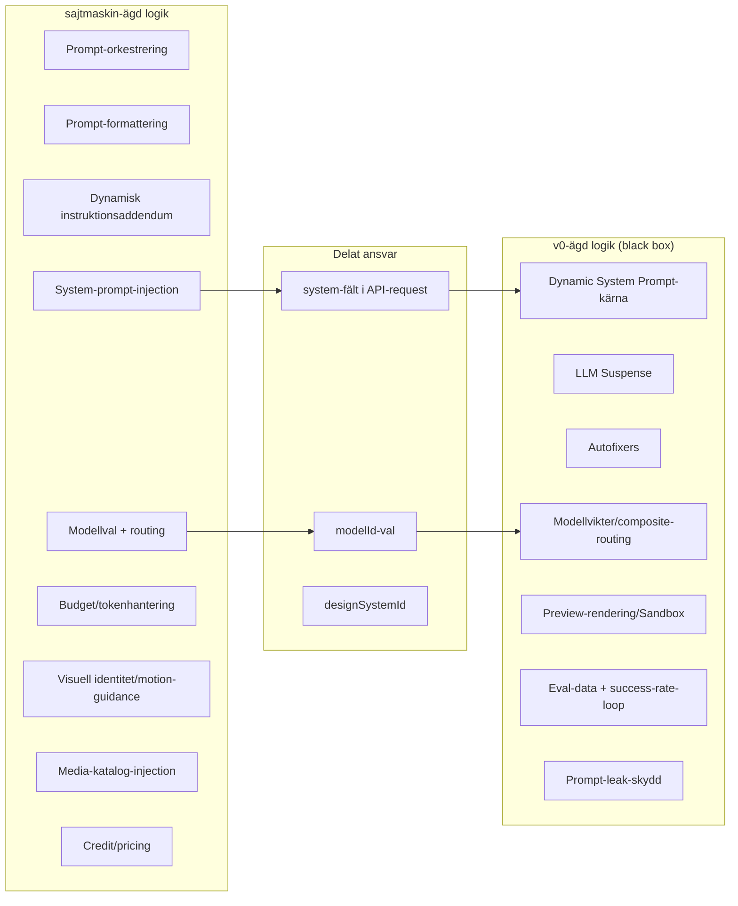

# v0 vs sajtmaskin — Promptmotor-analys
> Senast uppdaterad: 2026-03-06
> Typ: Undersöknings- och jämförelserapport (beslutsunderlag, ej implementation)

---

## 1. Syfte och avgränsning

Denna rapport jämför v0:s (Vercels) promptmotor med sajtmaskins egenbyggda
promptkedja. Målet är att besvara:

- Hur mycket av v0:s "motor" har sajtmaskin redan byggt själv?
- Vad kan byggas internt, och vad kräver v0:s proprietära infrastruktur?
- Var gör sajtmaskin FEL jämfört med v0:s mönster?
- En poängsatt scoring per kapabilitet.

Avgränsningar:
- Ingen implementation, enbart analys.
- Community-läckor används som indikativa datapunkter, aldrig som enda grund.
- v0:s interna fine-tunade modeller kan inte replikeras — analysen fokuserar
  på det arkitekturella lagret runt modellen.

---

## 2. Metod och källor

Varje slutsats märks med evidensnivå:

| Nivå  | Betydelse                                              |
|-------|--------------------------------------------------------|
| Hög   | Officiell källa (Vercel-blogg, docs) eller egen källkod|
| Medel | Multipla community-rapporter med intern överensstämmelse|
| Låg   | Enskild läcka eller rimlig slutledning utan bevis      |

### Primära källor (Hög)
- src/lib/builder/promptAssist.ts — formatPromptForV0, buildDynamic*
- src/lib/builder/promptOrchestration.ts — orchestratePromptMessage
- src/lib/hooks/v0-chat/useCreateChat.ts — ny chatt-flöde
- src/lib/hooks/v0-chat/useSendMessage.ts — fortsättningsflöde
- src/lib/v0/v0-generator.ts — v0-generator med CATEGORY_PROMPTS
- src/lib/v0/models.ts — kanoniska modell-ID:n
- src/app/api/v0/chats/stream/route.ts — server-side ny chatt
- src/app/api/v0/chats/[chatId]/stream/route.ts — server-side fortsättning
- Vercel-blogg: "How we made v0 an effective coding agent" (2026-01-07)
- v0.app/docs (FAQs, Cursor-guide)

### Sekundära källor (Medel/Låg)
- Reddit r/LocalLLaMA: "Leaked system prompts from v0" (2024-11-22)
- GitHub 2-fly-4-ai/V0-system-prompt (läckt nov 2024)
- dev.to: "How I Reverse Engineered v0.dev" (2023-12)
- x1xhlol/system-prompts-and-models-of-ai-tools (GitHub)

---

## 3. v0: vad är bekräftat vs antaget

### 3A. Bekräftat (Hög evidens)

| Mekanism                   | Källa                                    |
|----------------------------|------------------------------------------|
| Dynamic System Prompt      | Vercel-blogg: intent-detektion via embeddings + keyword → injicerar docs |
| LLM Suspense               | Vercel-blogg: streaming find-and-replace, lucide-icon-substitution <100ms |
| Autofixers                 | Vercel-blogg: deterministiska + fin-tunad modell, <250ms, AST-parse |
| MDX-baserat utdataformat   | Vercel-blogg + läckt prompt (överensstämmer) |
| Multi-step agent-pipeline  | Vercel-blogg: "composite model family" |
| Model API (v0-1.5-md/lg)  | v0.app/docs, GitHub v0-language-model-chat-provider |
| Platform API (chats/stream)| v0-sdk, v0.app/docs |
| Thinking-steg (<thinking>) | Vercel-blogg + läckt prompt: "ALWAYS uses <Thinking> BEFORE providing a response" |
| Prompt-leaking protection  | dev.to reverse-engineering: felkod PROMPT_LEAKING |
| 10% baseline error-rate    | Vercel-blogg: "code generated by LLMs can have errors as often as 10% of the time" |

### 3B. Antaget från läckor (Medel evidens)

| Mekanism                            | Källa                    |
|-------------------------------------|--------------------------|
| Statisk systemprompt ~8–16K tokens  | Reddit-läcka, GitHub-dump|
| 5-blocks prompt-arkitektur           | Två oberoende läckor     |
| shadcn/ui + Tailwind i promptkärna  | Läckt prompt + reverse-eng|
| Domänkunskap citerings-krav         | Läckt: "ALL DOMAIN KNOWLEDGE MUST BE CITED" |
| "Static JSX" som designval          | Reverse-engineering (dev.to) |
| Lucide-icon-embed-databas           | Vercel-blogg (bekräftar mönstret), detaljer från reverse-eng |
| Nivo chart-bibliotek i prompt       | Reverse-engineering (5 komponenter) |

### 3C. Osäkert / Spekulativt (Låg evidens)

| Påstående                           | Varför osäkert           |
|-------------------------------------|--------------------------|
| Exakt prompt-längd (16K tokens)     | Bara en person hävdade detta, obekräftat |
| Fine-tunad autofix-modell specifik arkitektur | "Liten, snabb" — inga detaljer |
| v0 kör alltid samma basmodell       | Vercel anger "composite" men ej vilken modell |

---

## 4. sajtmaskin: nulägeskarta

### 4A. Modellrouting — Är v0 alltid kodgeneratorn?

Svar: Ja, med ett undantag.

| Syfte                     | Modell(er)                          | Endpoint / fil                    |
|---------------------------|-------------------------------------|-----------------------------------|
| Kodgenerering (ny sajt)   | v0-max-fast (default), v0-1.5-md, v0-1.5-lg, v0-gpt-5 | /api/v0/chats/stream |
| Kodgenerering (fortsättn.)| Samma som ovan                      | /api/v0/chats/[chatId]/stream    |
| Prompt Assist (rewrite)   | gateway: openai/gpt-5.2 eller v0-1.5-md/lg | /api/ai/chat |
| Prompt Assist (polish)    | Samma gateway-modeller              | /api/ai/chat                     |
| Brief-generering          | anthropic/claude-sonnet-4.5 via AI Gateway | promptAssistContext.ts   |
| Wizard enrichment         | AI Gateway (varierad)               | /api/wizard/enrich               |
| Company lookup            | Brave Search → AI fallback          | /api/wizard/company-lookup       |
| Inspector/audit           | openai-modell via AI Gateway        | /api/inspector-ai-match          |

Evidens: Hög (direkt från källkod).
Undantag: `v0-generator.ts` har en CATEGORY_PROMPTS-mappning som helt
ersätter användarprompten med en fördefinierad mall vid template-generation.
Denna kör ändå mot v0 Platform API.

### 4B. Promptkedjan (komplett flöde)

#### Ny chatt (wizard/brief):
```
Användarinput
  → [Wizard enrichment: /api/wizard/enrich]    (valfritt, stegvis AI-berikning)
  → [Prompt Assist: rewrite/polish via gateway] (valfritt, om aktiverad i UI)
  → buildDynamicInstructionAddendumFromBrief()  (strukturerat ## Build Intent etc.)
  → orchestratePromptMessage()                  (budget-beslut: direct/summarize/phase_plan)
  → formatPromptForV0()                         (MÅL/SEKTIONER/STIL om ostrukturerat)
  → appendAttachmentPrompt()                    (lägger till bifogade filer)
  → enhancePromptForV0()                        (media-katalog om matchande nyckelord)
  → POST /api/v0/chats/stream
      { message, modelId, thinking, imageGenerations, system?, designSystemId?, attachments? }
```

#### Ny chatt (freeform):
```
Användarinput
  → orchestratePromptMessage()                  (direct/summarize/phase_plan)
  → formatPromptForV0()                         (MÅL/SEKTIONER/STIL-block)
  → appendAttachmentPrompt()
  → POST /api/v0/chats/stream
```

#### Fortsättningsprompt:
```
Användarinput
  → orchestratePromptMessage()                  (isFirstPrompt: false)
  → formatPromptForV0()
  → appendAttachmentPrompt()
  → POST /api/v0/chats/{chatId}/stream
      { message, modelId, thinking, imageGenerations, system? (bara om ändrat) }
```

#### System-prompt:
```
resolveBuildIntentSystemPrompt(intent, baseSystem?)
  → "Build intent: Template/Website/App build: ..."
  → Skickas som "system"-fält i request body
  → lastSentSystemPromptRef: re-skickas bara vid förändring
```

Evidens: Hög (direkt från useCreateChat.ts rad 225–308, useSendMessage.ts rad 143–213,
promptOrchestration.ts rad 363–450, promptAssist.ts rad 570–623).

---

## 5. Kapabilitetsmatris

Skala per cell:
- v0/sajtmaskin: 0–10 (0 = saknas, 10 = fullt implementerat)
- Gap: skillnaden
- Byggbar: Kan byggas internt? (Ja/Delvis/Nej)
- Insats: Låg / Medel / Hög

| # | Kapabilitet                  | v0   | sajtmaskin | Gap  | Byggbar  | Insats | Evidens | Kommentar |
|---|------------------------------|------|------------|------|----------|--------|---------|-----------|
| 1 | Promptspecifikation          | 9    | 8          | 1    | Ja       | Låg    | Hög     | sajtmaskin har MÅL/SEKTIONER/STIL + ## Build Intent/Visual Identity etc. v0 har mer rigida MDX-format-regler. Liten lucka. |
| 2 | Dynamisk kontextinjektion    | 9    | 4          | 5    | Delvis   | Medel  | Hög     | v0 injicerar docs per intent (embeddings+keyword). sajtmaskin har buildIntent guidance men ingen kunskapsdatabas-injektion. |
| 3 | Modellrouting                | 8    | 7          | 1    | Ja       | Låg    | Hög     | sajtmaskin har QUALITY_TO_MODEL + legacy-alias + modelSelection. v0 har "composite" multi-modell-routing. Nära paritet. |
| 4 | Ny chatt vs fortsättning     | 9    | 7          | 2    | Ja       | Låg    | Hög     | Båda har distinkt flöde. sajtmaskin skickar system bara vid ändring (bra). v0 har project_id-invariant + edit-komponent. |
| 5 | Streaming-fixar (Suspense)   | 9    | 0          | 9    | Delvis   | Hög    | Hög     | sajtmaskin har INGEN streaming-manipulation. v0 gör find-and-replace, lucide-substitution, URL-komprimering under streaming. |
| 6 | Post-generation autofix      | 8    | 2          | 6    | Delvis   | Medel  | Hög     | sajtmaskin har enbart CSS @property-autofix. v0 har AST-parse + fine-tunad modell för QueryClientProvider, deps, JSX-fel. |
| 7 | Eval / observability         | 7    | 5          | 2    | Ja       | Medel  | Medel   | sajtmaskin loggar promptMeta, strategyMeta, devLog. v0 har interna evals + success-rate-metrics. sajtmaskin saknar eval-loop. |
| 8 | Säkerhet / guardrails        | 8    | 5          | 3    | Ja       | Medel  | Hög     | v0 har REFUSAL_MESSAGE, PROMPT_LEAKING-skydd, domänkunskap-gränser. sajtmaskin har botProtection, rateLimit, inputvalidering men ingen prompt-leak-skydd. |
| 9 | Kostnadskontroll             | 7    | 7          | 0    | Ja       | Låg    | Hög     | sajtmaskin har credit-system, per-modell-pricing, budgetTarget, summarize-strategi. Nära paritet. |
|10 | Felåterhämtning              | 8    | 4          | 4    | Delvis   | Medel  | Hög     | v0 har multi-attempt autofix-loop. sajtmaskin har streamSafetyTimer + abort men ingen retry/fix-loop efter misslyckad generation. |
|11 | Prompt-orkestrering (budget) | 7    | 8          | -1   | Ja       | —      | Hög     | sajtmaskin har mer avancerad budget-orkestrering: complexityScore, phase_plan_build_polish, per-promptType-budget. v0 hanterar detta enklare. Sajtmaskin leder. |
|12 | Visuell identitet i prompt   | 6    | 8          | -2   | Ja       | —      | Hög     | sajtmaskin injicerar motionProfile, colorPalette, themeTokens, qualityBar dynamiskt. v0 har "MUST USE bg-primary" men mindre dynamiskt. Sajtmaskin leder. |
|13 | Category/template prompts    | 7    | 7          | 0    | Ja       | —      | Hög     | Båda har fördefinierade prompts per kategori. sajtmaskin: CATEGORY_PROMPTS i v0-generator.ts. v0: interna templates. |
|14 | Bildhantering i prompt       | 7    | 7          | 0    | Ja       | —      | Hög     | sajtmaskin: IMAGE_DENSITY_GUIDANCE, imageryNotes, imageGenerations-flagga. v0: placeholder-SVG, blob-storage-URLs. |

---

## 6. Flödesscheman

### 6A. Ny chatt — sajtmaskin vs v0



### 6B. Fortsättningsprompt — sajtmaskin vs v0



### 6C. Ägarskapsvy — vem gör vad



---

## 7. Vad kan byggas själv?

### Zon A: Egenbyggbart nu (redan gjort eller trivialt)

| Kapabilitet                      | Status i sajtmaskin     | Insats att slutföra |
|----------------------------------|-------------------------|---------------------|
| Prompt-orkestrering (budget)     | Klart (8/10)            | —                   |
| Prompt-formattering (MÅL/SEKTIONER) | Klart (8/10)         | —                   |
| Dynamisk instruktionsaddendum    | Klart (8/10)            | —                   |
| Visuell identitet i prompt       | Klart (8/10)            | —                   |
| Modellrouting + legacy-alias     | Klart (7/10)            | —                   |
| Category-prompts                 | Klart (7/10)            | —                   |
| System-prompt re-send guard      | Klart (fungerar)        | —                   |
| Credit-system + pricing          | Klart (7/10)            | —                   |

### Zon B: Egenbyggbart med medelinsats (2–8 veckor)

| Kapabilitet                         | Vad som behövs                                    | Insats  |
|-------------------------------------|---------------------------------------------------|---------|
| Post-generation autofix (deterministisk) | AST-parsning av genererad output, regler för saknade deps, import-korrigering, CSS-fix | Medel (3–5v) |
| Eval-loop / success-rate-mätning    | Instrumentering av om genererad preview renderar felfritt, feedback-loop | Medel (2–4v) |
| Intent-detektion + docs-injektion   | Embedding-databas (pgvector redan planerat), keyword-matching, inject per domän | Medel (3–5v) |
| Felåterhämtning (retry + fix)       | Catch generation-error → re-prompt med felmeddelande → retry (max 2–3 gånger) | Låg-Medel (1–2v) |
| Prompt-leak-skydd                   | Post-processing filter på output, blockera om system-prompt-fragment detekteras | Låg (1v) |

### Zon C: Svårt att replikera fullt ut

| Kapabilitet                         | Varför svårt                                       | Möjligt alternativ         |
|-------------------------------------|----------------------------------------------------|-----------------------------|
| LLM Suspense (streaming-manipulation)| Kräver mellanlägg i SSE-strömmen med realtids-regex/embedding-lookup. Tekniskt möjligt men komplex edge-case-hantering. | Bygga enklare variant: import-substitution + URL-komprimering utan icon-embeddings |
| Fine-tunad autofix-modell           | Kräver stor mängd generation-error-par-data + modellträning. v0 har miljontals generationer. | Fallback: använda prompt-baserad "fix this code"-loop med befintlig modell |
| Preview-rendering (Vercel Sandbox)  | Proprietär v0-infrastruktur. Kör hela Next.js-appen isolerat. | Inte replikerbart. sajtmaskin förlitar sig redan på v0:s preview. |
| Massiv eval-data                    | v0 har implicit A/B-testning från alla användare. Inte möjligt i liten skala. | Manuell eval + grundläggande render-check |
| Composite model routing             | v0 kan intern-routa mellan modeller per steg. Specifik arkitektur okänd. | sajtmaskin har redan modellval, men saknar multi-modell-per-steg |

---

## 8. Fel och risker i sajtmaskin

### Risk 1: Ingen post-generation-validering

| Fält         | Värde |
|--------------|-------|
| Prioritet    | HÖG |
| Symptom      | Genererad kod kan ha trasiga imports, saknade deps, felaktiga JSX-konstruktioner |
| Rotorsak     | sajtmaskin skickar prompt till v0, tar emot streamen och visar den direkt. Ingen mellanliggande validering. |
| Konsekvens   | Användaren ser trasiga previews, tappar förtroende, behöver manuell iterering |
| Föreslagen åtgärd | Implementera deterministisk post-fix: (a) extrahera imports → verifiera mot känd komponentlista, (b) lägg till saknade deps i package.json, (c) enkel JSX-syntax-check |
| Evidens      | Hög (v0-bloggen rapporterar 10% error-rate som de fixar via Suspense+Autofix) |

### Risk 2: Dubbel orkestrering (klient + server)

| Fält         | Värde |
|--------------|-------|
| Prioritet    | MEDEL |
| Symptom      | orchestratePromptMessage() körs BÅDE i klient-hooken (useCreateChat rad 225) OCH i server-routen (stream/route.ts rad 146) |
| Rotorsak     | Historisk evolution — servern lades till som guardrail men klient-anropet togs aldrig bort |
| Konsekvens   | Prompt kan bli dubbel-summarized (summarize → summarize). Svårt att resonera om slutgiltigt meddelande. |
| Föreslagen åtgärd | Flytta orkestrering till enbart server-sidan. Klienten skickar rå prompt + metadata. |
| Evidens      | Hög (direkt kodbevis: useCreateChat.ts:225 + stream/route.ts:146) |

### Risk 3: Ingen streaming-integritetskontroll

| Fält         | Värde |
|--------------|-------|
| Prioritet    | MEDEL |
| Symptom      | Om v0 genererar trasig import (t.ex. icke-existerande lucide-ikon) visas det direkt för användaren |
| Rotorsak     | Streaming-data passerar rakt igenom utan transformation |
| Konsekvens   | Kan kräva en extra generation-runda (kostar tokens + tid) |
| Föreslagen åtgärd | Fas 1: Enkel regex-match på kända felimport-mönster i SSE-strömmen. Fas 2: Mer sofistikerad token-by-token-substitution. |
| Evidens      | Hög (v0-blogg bekräftar mönstret och att det ger "double-digit improvement") |

### Risk 4: promptAssistContext använder claude-sonnet-4.5 som fallback istället för v0

| Fält         | Värde |
|--------------|-------|
| Prioritet    | LÅG |
| Symptom      | Kommentar i koden: "v0-1.5-lg not available via gateway yet" — använder claude-sonnet-4.5 istället |
| Rotorsak     | Vercel AI Gateway exponerar ännu inte v0-modeller via gateway-rutter |
| Konsekvens   | Brief-generering kan ha annan "stil" än v0-genererad kod, potentiell mismatch |
| Föreslagen åtgärd | Bevaka v0-modell-tillgänglighet via gateway. Alternativt: använda v0 Model API direkt för detta steg. |
| Evidens      | Hög (promptAssistContext.ts rad 102) |

### Risk 5: Ingen eval-feedback-loop

| Fält         | Värde |
|--------------|-------|
| Prioritet    | MEDEL-HÖG |
| Symptom      | Ingen automatisk mätning av om genererad preview renderar korrekt |
| Rotorsak     | Saknar instrumentering av preview-steg |
| Konsekvens   | Kan inte systematiskt identifiera och åtgärda vanliga felmönster |
| Föreslagen åtgärd | Logga render-success/fail per generation. Aggregera felmönster. Mata tillbaka i prompt-regler. |
| Evidens      | Medel (v0-bloggen beskriver att de optimerar "percentage of successful generations" som primär metrik) |

---

## 9. Scoring

### 9A. Viktmodell

Varje kapabilitet viktas efter inverkan på slutresultat:

| # | Kapabilitet                  | v0   | sajtmaskin | Vikt  |
|---|------------------------------|------|------------|-------|
| 1 | Promptspecifikation          | 9    | 8          | 12%   |
| 2 | Dynamisk kontextinjektion    | 9    | 4          | 10%   |
| 3 | Modellrouting                | 8    | 7          | 6%    |
| 4 | Ny chatt vs fortsättning     | 9    | 7          | 8%    |
| 5 | Streaming-fixar (Suspense)   | 9    | 0          | 14%   |
| 6 | Post-generation autofix      | 8    | 2          | 14%   |
| 7 | Eval / observability         | 7    | 5          | 8%    |
| 8 | Säkerhet / guardrails        | 8    | 5          | 5%    |
| 9 | Kostnadskontroll             | 7    | 7          | 5%    |
|10 | Felåterhämtning              | 8    | 4          | 8%    |
|11 | Prompt-orkestrering (budget) | 7    | 8          | 5%    |
|12 | Visuell identitet i prompt   | 6    | 8          | 5%    |

Summa vikter: 100%

### 9B. Beräkning

v0 viktat totalpoäng:
  = (9*12 + 9*10 + 8*6 + 9*8 + 9*14 + 8*14 + 7*8 + 8*5 + 7*5 + 8*8 + 7*5 + 6*5) / 100
  = (108 + 90 + 48 + 72 + 126 + 112 + 56 + 40 + 35 + 64 + 35 + 30) / 100
  = 816 / 100
  = 8.16 / 10

sajtmaskin viktat totalpoäng:
  = (8*12 + 4*10 + 7*6 + 7*8 + 0*14 + 2*14 + 5*8 + 5*5 + 7*5 + 4*8 + 8*5 + 8*5) / 100
  = (96 + 40 + 42 + 56 + 0 + 28 + 40 + 25 + 35 + 32 + 40 + 40) / 100
  = 474 / 100
  = 4.74 / 10

### 9C. Fyra totalscorer

| Score              | Värde       | Tolkning                                           |
|--------------------|-------------|-----------------------------------------------------|
| ParityScore        | 58%         | sajtmaskin implementerar 58% av v0:s totala pipeline |
| SelfBuildScore     | 72%         | 72% av v0-liknande kapabiliteter KAN byggas internt (exkl. modellkvalitet + preview) |
| ReliabilityScore   | 45%         | Utan post-fix och streaming-validering: risk för ~10% trasiga generationer som ej fångas |
| StrategicFitScore  | 75%         | sajtmaskins styrkor (visuell identitet, budget-orkestrering) är rätt prioriterade för målgruppen |

Sammanvägt slutbetyg (lika viktat):
  = (58 + 72 + 45 + 75) / 4 = 62.5%

Confidence-intervall: 55–70%
(Osäkerheten kommer från att v0:s interna mekanismer delvis är antagna)

### 9D. Scorefördelning per zon

```
sajtmaskins styrkor (>= v0):
  [==========] Prompt-orkestrering       8/7  (+14%)
  [==========] Visuell identitet          8/6  (+33%)
  [=========]  Kostnadskontroll           7/7  (paritet)

Nära paritet:
  [=========]  Promptspecifikation        8/9  (-11%)
  [========]   Modellrouting              7/8  (-13%)
  [========]   Category-prompts           7/7  (paritet)

Stora luckor:
  [          ] Streaming-fixar            0/9  (-100%)
  [==        ] Post-gen autofix           2/8  (-75%)
  [====      ] Dynamisk kontextinjektion  4/9  (-56%)
  [====      ] Felåterhämtning            4/8  (-50%)
```

---

## 10. Beslutsrekommendation

### Prioriterad åtgärdslista (effekt per insats)

| Prio | Åtgärd                                    | Effekt      | Insats   | Förväntat lyft |
|------|--------------------------------------------|-------------|----------|----------------|
| 1    | Deterministisk post-fix (import/deps/JSX)  | Hög (+6pts) | 3–5 veckor | ReliabilityScore: 45% → ~60% |
| 2    | Felåterhämtning (retry + error-feedback)   | Medel-Hög   | 1–2 veckor | ReliabilityScore: +5–10% |
| 3    | Eliminera dubbel-orkestrering              | Medel       | 1 vecka    | Arkitekturell risk elimineras |
| 4    | Enkel streaming-filter (kända felmönster)  | Medel       | 2–4 veckor | ParityScore: 58% → ~63% |
| 5    | Intent-detektion + docs-injektion          | Medel       | 3–5 veckor | ParityScore: ~63% → ~68% |
| 6    | Eval-loop (render-success-mätning)         | Medel       | 2–4 veckor | Möjliggör data-driven förbättring |
| 7    | Prompt-leak-skydd                          | Låg-Medel   | 1 vecka    | Säkerhet: 5 → 7 |

### Vad som INTE bör byggas internt

| Kapabilitet                    | Varför inte                                |
|--------------------------------|--------------------------------------------|
| Fine-tunad autofix-modell      | Kräver massiv träningsdata. Använd prompt-baserad fix istället. |
| Preview-rendering/Sandbox      | Proprietär v0-infra. Förlita på v0 Platform API. |
| Composite multi-modell-per-steg| Okänd arkitektur, marginellt värde givet existerande modellval. |

### Sammanfattande strategirekommendation

sajtmaskin har en stark promptkedja (topp 3 i branschen vad gäller visuell
identitet-injektion och budget-orkestrering), men saknar helt den
"post-LLM"-hantering som v0 visar ger störst effekt på framgångsfrekvens.

Den snabbaste vägen till höjd kvalitet:
1. Bygg deterministisk post-fix (Prio 1) — detta är vad v0-bloggen pekar
   på som orsaken till deras "double-digit increase in success rates".
2. Lägg till retry-loop (Prio 2) — billig åtgärd med hög utdelning.
3. Rensa dubbel-orkestrering (Prio 3) — arkitekturhygien.

Dessa tre åtgärder uppskattas lyfta ParityScore från 58% till ~65% och
ReliabilityScore från 45% till ~65%.

---

## 11. Scenarioanalys: Om v0-motorn tas bort helt

### 11A. Vad försvinner?

Om sajtmaskin slutar använda v0 Platform API (POST /api/v0/chats/stream)
försvinner dessa lager som idag är black-box:

| Lager                          | Vad det gör                                      | Evidens |
|--------------------------------|--------------------------------------------------|---------|
| Dynamic System Prompt (kärna)  | ~8–16K tokens statisk prompt med MDX-format-regler, shadcn/ui-regler, Tailwind-regler, accessibility-krav, thinking-steg | Hög |
| Intent-baserad docs-injektion  | Embeddings + keyword → injicerar AI SDK-docs, framework-docs i prompten | Hög |
| LLM Suspense                   | Streaming find-and-replace: lucide-icon-substitution, URL-komprimering, import-korrigering under SSE-ström | Hög |
| Autofixers                     | AST-parse + fine-tunad modell: saknade deps, QueryClientProvider-wrapping, JSX/TS-felfix (<250ms) | Hög |
| Preview/Sandbox                | Vercel Sandbox: isolerad Next.js-runtime som renderar genererad kod live | Hög |
| Composite model routing        | Intern multi-modell-routing per steg i pipelinen | Medel |
| Eval-loop                      | Success-rate-mätning på miljontals generationer → feedback in i promptregler | Medel |
| Prompt-leak-skydd              | PROMPT_LEAKING-detektion + blockering | Medel |

### 11B. Vad behålls? (sajtmaskins egenbyggda lager)

Dessa lager ägs helt av sajtmaskin och påverkas INTE av att v0 tas bort:

| Lager                          | Fil(er)                              | Status |
|--------------------------------|--------------------------------------|--------|
| Prompt-orkestrering            | promptOrchestration.ts               | 8/10   |
| Prompt-formattering            | promptAssist.ts: formatPromptForV0   | 8/10   |
| Dynamiskt instruktionsaddendum | promptAssist.ts: buildDynamic*       | 8/10   |
| Visuell identitet/motion       | promptAssist.ts: inferMotionProfile, resolveVisualIdentityGuidance | 8/10 |
| System-prompt-konstruktion     | v0-generator.ts: resolveBuildIntentSystemPrompt | 7/10 |
| Modellval + routing            | models.ts, modelSelection.ts         | 7/10   |
| Category/template-prompts      | v0-generator.ts: CATEGORY_PROMPTS    | 7/10   |
| Credit/pricing                 | pricing.ts                           | 7/10   |
| Media-katalog-injection        | prompt-utils.ts: enhancePromptForV0  | 7/10   |

### 11C. Gap-analys: vad måste byggas för att ersätta v0

```
PRIORITET 1 — BLOCKERARE (utan dessa fungerar inget)
═══════════════════════════════════════════════════

  [KRITISK] Ersättningsmodell för kodgenerering
  ├── Alternativ: AI Gateway → claude-opus-4.5 / gpt-5.2 / gemini-2.5-pro
  ├── Kräver: Egen systemprompt (~8–16K tokens) som ersätter v0:s interna
  ├── Insats: 3–6 veckor (prompt-engineering + eval-loop)
  └── Risk: Ingen modell har v0:s specialiserade webbutvecklings-fine-tuning

  [KRITISK] Preview-rendering
  ├── Alternativ A: Codesandbox API / StackBlitz WebContainers
  ├── Alternativ B: Egen Next.js-sandlåda i Docker/Firecracker
  ├── Alternativ C: Iframe med lokal dev-server
  ├── Insats: 4–10 veckor beroende på alternativ
  └── Risk: Hög komplexitet, säkerhetsutmaningar

PRIORITET 2 — KVALITETSHÖJARE (utan dessa: ~30% felfrekvens)
═══════════════════════════════════════════════════

  [HÖG] Egen systemprompt (ersätta v0:s interna)
  ├── Bygga: 5-blocks-struktur (identitet, utdataformat, MDX-regler, capabilities, beteende)
  ├── Inkludera: shadcn/ui-komponentexempel, Tailwind-regler, "static JSX"-direktiv
  ├── Inkludera: Lucide-ikonlista, Nivo chart-exempel (5 typer)
  ├── Inkludera: <thinking>-steg före svar
  ├── Insats: 2–4 veckor
  └── Källa: Läckorna ger ~80% av strukturen; resten kräver egen eval

  [HÖG] Streaming post-processing (ersätta LLM Suspense)
  ├── Bygga: SSE-interceptor i API-route
  ├── Regler: import-path-fix (@/components/ui/$name), lucide-icon-lookup, URL-substitution
  ├── Insats: 3–5 veckor
  └── Risknivå: Medel (regex-baserade regler täcker ~70% av fallen)

  [HÖG] Deterministisk autofix (ersätta Autofixers)
  ├── Bygga: AST-parser (babel/SWC) → extrahera imports → matcha mot känd komponentlista
  ├── Regler: saknade deps → package.json, QueryClientProvider-wrapping, JSX-syntaxfix
  ├── Insats: 3–5 veckor
  └── Notera: Utan fine-tunad modell, använd prompt-baserad "fix this code"-loop istället

PRIORITET 3 — FÖRBÄTTRARE (höjer kvalitet från ~70% till ~85%)
═══════════════════════════════════════════════════

  [MEDEL] Intent-detektion + docs-injektion
  ├── Bygga: pgvector-embedding + keyword-matching → injicera relevanta docs
  ├── Insats: 3–5 veckor (pgvector redan i ROADMAP)
  └── Källa: v0-bloggen bekräftar mönstret explicit

  [MEDEL] Error recovery loop
  ├── Bygga: Catch render-error → re-prompt med felmeddelande → retry (max 3)
  ├── Insats: 1–2 veckor
  └── Effekt: Hög per insats

  [LÅG] Eval-instrumentering
  ├── Bygga: Logga render-success/fail per generation → dashboardvy
  ├── Insats: 2–4 veckor
  └── Effekt: Möjliggör datadriven förbättring
```

### 11D. Total insatsuppskattning

| Zon       | Insats      | Förväntat resultat                           |
|-----------|-------------|----------------------------------------------|
| Blockerare| 7–16 veckor | Fungerande pipeline utan v0 (men ~30% felfrekvens) |
| Kvalitet  | 8–14 veckor | Felfrekvens ner till ~10–15%                 |
| Förbättrare| 6–11 veckor | Felfrekvens ner till ~5–10%, eval-loop aktiv |
| **Totalt**| **21–41 veckor** | **Jämförbar med v0 på ~85–90% av kapabiliteten** |

Jämförelse: att BEHÅLLA v0 Platform API och enbart bygga Prio 1–3 från
sektion 10 tar uppskattningsvis 5–9 veckor och ger ~65% ParityScore.

### 11E. Rekommendation

Att ta bort v0 helt är möjligt men kostar 4–8x mer i utvecklingstid jämfört
med att behålla v0 och komplettera med egenbyggda pre/post-processing-lager.

Den strategiskt klokaste vägen:
1. **Kort sikt (nu):** Behåll v0 som kodgenerator. Bygg post-fix + retry-loop.
2. **Medelsikt (Q2–Q3):** Bygg intent-detektion, streaming-filter, eval-loop.
3. **Lång sikt (Q4+):** Utvärdera om egen modell via AI Gateway ger tillräcklig
   kvalitet. Om ja: fas ut v0 Platform API gradvis, behåll Model API som fallback.

---

## 12. Lärdom från läckorna: Promptorkestrering användare → LLM

### 12A. v0:s promptkedja (rekonstruerad från läckor + blogg)

Baserat på de läckta systemprompterna, reverse-engineering-rapporter och
Vercels officiella blogginlägg kan vi rekonstruera hur v0 orkestrerar en
prompt från det att användaren skriver till att LLM:en genererar kod:

```
┌─────────────────────────────────────────────────────────────────┐
│ STEG 1: ANVÄNDARINPUT                                           │
│                                                                 │
│  Användaren skriver: "Build me a dashboard with charts"         │
│  + eventuellt: bifogad bild, URL (screenshottas automatiskt),   │
│    textfil, Figma-design                                        │
└──────────────────────────┬──────────────────────────────────────┘
                           │
                           ▼
┌─────────────────────────────────────────────────────────────────┐
│ STEG 2: INTENT-DETEKTION (v0-internt)                           │
│                                                                 │
│  Embeddings + keyword-matching analyserar prompten:             │
│  - Rör det AI SDK? → Injicera AI SDK v6-docs                   │
│  - Rör det charts? → Injicera Nivo-exempel (5 typer)           │
│  - Rör det forms? → Injicera shadcn/ui form-patterns           │
│  Resultat: en "docs-payload" som appendas till systemprompten   │
│                                                                 │
│  KÄLLA: Vercel-blogg (Hög evidens)                              │
└──────────────────────────┬──────────────────────────────────────┘
                           │
                           ▼
┌─────────────────────────────────────────────────────────────────┐
│ STEG 3: SYSTEMPROMPT SAMMANSÄTTNING                             │
│                                                                 │
│  Block 1: Identitet ("v0 is an advanced AI coding assistant")   │
│  Block 2: Utdataformat (MDX-typer: react, nodejs, python, html) │
│           Nyckelregel: "ONLY SUPPORTS ONE FILE" (tidig version) │
│           Uppdaterad: multi-file React Project med project_id   │
│  Block 3: MDX-komponenter (<Steps>, LaTeX, etc.)                │
│  Block 4: Capabilities (attachments, preview, URL-screenshot)   │
│  Block 5: Beteende (<Thinking> BEFORE response, REFUSAL_MESSAGE)│
│  + Dynamisk payload: docs från steg 2                           │
│  + Kodexempel i read-only filsystem (hand-curated)              │
│                                                                 │
│  Total: ~8–16K tokens                                           │
│                                                                 │
│  KÄLLA: Läckt prompt + Vercel-blogg (Medel-Hög evidens)         │
└──────────────────────────┬──────────────────────────────────────┘
                           │
                           ▼
┌─────────────────────────────────────────────────────────────────┐
│ STEG 4: PRE-INFERENCE OPTIMERING                                │
│                                                                 │
│  - Långa blob-URLs ersätts med korta alias (sparar tokens)      │
│  - Prompt-cache-konsistens: injektioner hålls identiska mellan  │
│    anrop för att maximera prompt-cache-hits                      │
│  - Bifogade bilder: embedda som multimodal-input                │
│  - URL:er: automatisk screenshot → bild-input                   │
│                                                                 │
│  KÄLLA: Vercel-blogg (Hög evidens)                              │
└──────────────────────────┬──────────────────────────────────────┘
                           │
                           ▼
┌─────────────────────────────────────────────────────────────────┐
│ STEG 5: LLM INFERENCE                                           │
│                                                                 │
│  Composite Model Family:                                        │
│  - Modellen (okänd exakt) genererar MDX-format-svar             │
│  - Inkluderar <Thinking>-steg före kod                          │
│  - Output: components (JSX), imports (string[]), functions (SVG)│
│  - Streaming via SSE                                            │
│                                                                 │
│  Nyckeldesignval från läckt prompt:                             │
│  - "Write COMPLETE code, NEVER partial"                         │
│  - "MUST USE bg-primary, NOT indigo/blue"                       │
│  - "ALWAYS tries to use shadcn/ui"                              │
│  - "MUST generate responsive designs"                           │
│  - "AVOIDS iframe and videos"                                   │
│  - "Uses /placeholder.svg for images"                           │
│                                                                 │
│  KÄLLA: Läckt prompt (Medel evidens), blogg (Hög)               │
└──────────────────────────┬──────────────────────────────────────┘
                           │
                           ▼
┌─────────────────────────────────────────────────────────────────┐
│ STEG 6: LLM SUSPENSE (streaming-manipulation)                   │
│                                                                 │
│  UNDER streaming (realtid, <100ms per operation):               │
│                                                                 │
│  Regel A: Import-path-fix                                       │
│    FEL:  import { Button } from "@components/ui"                │
│    FIX:  import { Button } from "@/components/ui/button"        │
│                                                                 │
│  Regel B: Lucide-icon-substitution                              │
│    FEL:  import { VercelLogo } from "lucide-react"              │
│    FIX:  import { Triangle as VercelLogo } from "lucide-react"  │
│    (Vector-DB med alla ikonnamn → nearest-match)                │
│                                                                 │
│  Regel C: URL-expansion                                         │
│    IN:   import from "SHORT_ALIAS_42"                           │
│    UT:   import from "https://xyz.public.blob.vercel-storage.." │
│                                                                 │
│  KÄLLA: Vercel-blogg (Hög evidens)                              │
└──────────────────────────┬──────────────────────────────────────┘
                           │
                           ▼
┌─────────────────────────────────────────────────────────────────┐
│ STEG 7: AUTOFIXERS (post-streaming)                             │
│                                                                 │
│  Körs EFTER streaming är klar (<250ms):                         │
│                                                                 │
│  Fix A: Dependency completion                                   │
│    Scanna genererad kod → saknade packages → uppdatera          │
│    package.json deterministiskt                                 │
│                                                                 │
│  Fix B: Provider wrapping                                       │
│    useQuery/useMutation hittad → AST-check: finns              │
│    QueryClientProvider? → Om ej: autofix-modell bestämmer var   │
│                                                                 │
│  Fix C: JSX/TS-felreparation                                   │
│    Vanliga syntaxfel som slapp genom Suspense                   │
│                                                                 │
│  Verktyg: Deterministiska regler + liten fine-tunad modell      │
│                                                                 │
│  KÄLLA: Vercel-blogg (Hög evidens)                              │
└──────────────────────────┬──────────────────────────────────────┘
                           │
                           ▼
┌─────────────────────────────────────────────────────────────────┐
│ STEG 8: PREVIEW + LEVERANS                                      │
│                                                                 │
│  Vercel Sandbox: isolerad VM kör Next.js med genererad kod      │
│  Användaren ser: renderad webbsida i v0:s preview-panel         │
│  "Block view": klickbar preview med "add to codebase"-knapp    │
│                                                                 │
│  KÄLLA: v0.app/docs FAQs (Hög evidens)                          │
└─────────────────────────────────────────────────────────────────┘
```

### 12B. sajtmaskins promptkedja (faktisk, från kod)

```
┌─────────────────────────────────────────────────────────────────┐
│ STEG 1: ANVÄNDARINPUT                                           │
│                                                                 │
│  Användaren skriver prompt i Builder-UI                         │
│  + eventuellt: wizard-brief, template-val, bifogade filer       │
└──────────────────────────┬──────────────────────────────────────┘
                           │
                           ▼
┌─────────────────────────────────────────────────────────────────┐
│ STEG 2: WIZARD ENRICHMENT (valfritt)                            │
│                                                                 │
│  Om wizard-läge: /api/wizard/enrich                             │
│  Stegvis AI-berikning av brief → strukturerat JSON-objekt       │
│  Modell: AI Gateway (claude-sonnet-4.5)                         │
│                                                                 │
│  ► EGENBYGGT                                                    │
└──────────────────────────┬──────────────────────────────────────┘
                           │
                           ▼
┌─────────────────────────────────────────────────────────────────┐
│ STEG 3: PROMPT ASSIST (valfritt)                                │
│                                                                 │
│  Om aktiverat: /api/ai/chat                                     │
│  Rewrite-mode: omskrivning till konkret v0-prompt               │
│  Polish-mode: grammatik/stavning, ingen feature-kreep           │
│  Modell: openai/gpt-5.2 eller v0-1.5-md/lg                     │
│  Kodkontext: buildPromptAssistContext() ger filsammanfattning   │
│                                                                 │
│  ► EGENBYGGT                                                    │
└──────────────────────────┬──────────────────────────────────────┘
                           │
                           ▼
┌─────────────────────────────────────────────────────────────────┐
│ STEG 4: PROMPT-ORKESTRERING                                     │
│                                                                 │
│  orchestratePromptMessage():                                    │
│  - Detekterar promptType (wizard/freeform/template/followup/..) │
│  - Beräknar complexityScore (0–9)                               │
│  - Väljer strategi: direct | summarize | phase_plan_build_polish│
│  - Per-typ budgetTarget (wizard: X chars, audit: Y chars, ..)   │
│  - Om "phase_plan": 3-fas-plan (Plan → Build → Polish)         │
│  - Hard cap: MAX_CHAT_MESSAGE_CHARS                             │
│                                                                 │
│  ► EGENBYGGT (sajtmaskin leder v0 här: 8 vs 7)                 │
└──────────────────────────┬──────────────────────────────────────┘
                           │
                           ▼
┌─────────────────────────────────────────────────────────────────┐
│ STEG 5: PROMPT-FORMATTERING + BERIKNING                         │
│                                                                 │
│  formatPromptForV0():                                           │
│    Om ostrukturerat → MÅL / SEKTIONER / STIL / CONSTRAINTS /   │
│    ASSETS / TILLGÄNGLIGHET                                      │
│    Om redan strukturerat (## Build Intent) → pass-through       │
│                                                                 │
│  buildDynamicInstructionAddendumFromBrief():                    │
│    ## Build Intent / ## Project Context / ## Pages & Sections / │
│    ## Interaction & Motion / ## Visual Identity /                │
│    ## Quality Bar / ## Imagery / ## Original Request             │
│                                                                 │
│  enhancePromptForV0(): media-katalog om matchande nyckelord     │
│  appendAttachmentPrompt(): bifogade filer                       │
│                                                                 │
│  ► EGENBYGGT (sajtmaskin leder v0 här: 8 vs 6 på visuell id.)  │
└──────────────────────────┬──────────────────────────────────────┘
                           │
                           ▼
┌─────────────────────────────────────────────────────────────────┐
│ STEG 6: SYSTEM-PROMPT-INJEKTION                                 │
│                                                                 │
│  resolveBuildIntentSystemPrompt():                              │
│    template → "keep scope compact (1–2 pages)..."               │
│    website → "focus on clear structure and flows..."            │
│    app → "include stateful UI, app flows..."                    │
│  Skickas som "system"-fält i request body                       │
│  Guard: lastSentSystemPromptRef → skippa om oförändrad          │
│                                                                 │
│  ► EGENBYGGT                                                    │
└──────────────────────────┬──────────────────────────────────────┘
                           │
                           ▼
┌─────────────────────────────────────────────────────────────────┐
│ STEG 7: API-ANROP TILL v0                                       │
│                                                                 │
│  POST /api/v0/chats/stream (eller /api/v0/chats/{id}/stream)   │
│  Body: { message, modelId, thinking, imageGenerations,          │
│          system?, designSystemId?, attachments?, meta }          │
│                                                                 │
│  ══════════ GRÄNS: härifrån är allt v0:s black box ══════════  │
│                                                                 │
│  v0 tar över: Dynamic System Prompt → Inference → Suspense →   │
│  Autofixers → Preview                                           │
│                                                                 │
│  ► DELAT: sajtmaskin bygger request, v0 hanterar resten         │
└──────────────────────────┬──────────────────────────────────────┘
                           │
                           ▼
┌─────────────────────────────────────────────────────────────────┐
│ STEG 8: STREAMING + VISNING                                     │
│                                                                 │
│  SSE-ström från v0 → passerar rakt igenom till klient           │
│  (INGEN mellanliggande manipulation i sajtmaskin)               │
│  extractContentText, extractDemoUrl, extractVersionId, etc.     │
│  Sparas i DB: chats, versions                                   │
│                                                                 │
│  ► EGENBYGGT (streaming-hantering, DB-persist)                  │
│  ► SAKNAS: post-processing, autofix, eval                       │
└─────────────────────────────────────────────────────────────────┘
```

### 12C. Nyckellärdomar från läckorna

| #  | Lärdom                                          | Tillämpning för sajtmaskin                    |
|----|--------------------------------------------------|-----------------------------------------------|
| 1  | "Static JSX" som designprincip — v0 genererar kod utan komplex props-passing eller nätverksanrop | Sajtmaskin bör ha liknande direktiv i sin systemprompt om den bygger egen motor. Minskar felfrekvens dramatiskt. |
| 2  | "ALWAYS uses \<Thinking\> BEFORE providing a response" — explicit reasoning-steg | Sajtmaskin skickar `thinking: true` till v0 API men exponerar inte steget. Om egen motor: inkludera detta i systemprompt. |
| 3  | Exakta import-regler i systemprompt eliminerar INTE alla importfel — därför behövs Suspense | Sajtmaskin saknar helt detta lager. Import-fel passerar rakt igenom till användaren. |
| 4  | v0 har separata output-strömmar: components, imports, functions — inte en enda textström | Vid egen motor: strukturera output som JSON med separata fält för att möjliggöra deterministisk post-processing. |
| 5  | URL-komprimering före LLM sparar "10s of tokens" per bifogad fil | Sajtmaskin gör INTE detta. enhancePromptForV0 lägger till fulla URLs. Enkel optimering att implementera. |
| 6  | Prompt-cache-konsistens: "keep injection consistent to maximize prompt-cache hits" | Sajtmaskin byter system-prompt dynamiskt per build-intent. Kan optimeras: håll statisk kärna + variabel append. |
| 7  | shadcn/ui-komponentexempel i filsystem, inte i prompt — minskar prompt-storlek | Sajtmaskin har inga komponentexempel alls. Vid egen motor: bifoga som RAG/filsystem, inte inline i prompt. |
| 8  | REFUSAL_MESSAGE utan förklaring — "MUST NOT apologize or provide explanation" | Sajtmaskin har ingen refusal-logik. Vid egen motor: implementera för att undvika off-topic-generationer. |

---

## 13. Sammanfattande arkitekturvy

### 13A. Nuläge: sajtmaskin MED v0

```
  ┌──────────────────────────────┐
  │     ANVÄNDARE                │
  │  (skriver prompt i Builder)  │
  └──────────┬───────────────────┘
             │
  ┌──────────▼───────────────────┐
  │  sajtmaskin PRE-PROCESSING   │  ◄── 100% egenbyggt
  │  ┌────────────────────────┐  │
  │  │ Wizard enrichment      │  │
  │  │ Prompt Assist          │  │
  │  │ Orkestrering (budget)  │  │
  │  │ Formattering (MÅL/..)  │  │
  │  │ Visual Identity inject │  │
  │  │ System-prompt          │  │
  │  └────────────────────────┘  │
  └──────────┬───────────────────┘
             │ POST /api/v0/chats/stream
  ╔══════════▼═══════════════════╗
  ║  v0 PLATFORM API (black box) ║  ◄── 100% Vercels motor
  ║  ┌────────────────────────┐  ║
  ║  │ Dynamic System Prompt  │  ║
  ║  │ LLM Inference          │  ║
  ║  │ LLM Suspense           │  ║
  ║  │ Autofixers             │  ║
  ║  │ Preview Sandbox        │  ║
  ║  └────────────────────────┘  ║
  ╚══════════╤═══════════════════╝
             │ SSE-ström (passerar rakt igenom)
  ┌──────────▼───────────────────┐
  │  sajtmaskin POST-PROCESSING  │  ◄── minimalt idag
  │  ┌────────────────────────┐  │
  │  │ Stream-parse + DB-save │  │
  │  │ (ingen fix/validering) │  │
  │  └────────────────────────┘  │
  └──────────┬───────────────────┘
             │
  ┌──────────▼───────────────────┐
  │     ANVÄNDARE                │
  │  (ser renderad preview)      │
  └──────────────────────────────┘
```

### 13B. Framtid: sajtmaskin UTAN v0

```
  ┌──────────────────────────────┐
  │     ANVÄNDARE                │
  └──────────┬───────────────────┘
             │
  ┌──────────▼───────────────────┐
  │  PRE-PROCESSING              │  ◄── redan byggt (behåll som-är)
  │  (orkestrering, formattering,│
  │   visual identity, system)   │
  └──────────┬───────────────────┘
             │
  ┌──────────▼───────────────────┐
  │  INTENT-DETEKTION + DOCS     │  ◄── NYTT: bygga med pgvector
  │  (embedding-match → inject   │      Insats: 3–5 veckor
  │   relevanta docs i prompt)   │
  └──────────┬───────────────────┘
             │
  ┌──────────▼───────────────────┐
  │  EGEN SYSTEMPROMPT           │  ◄── NYTT: ~8–16K tokens
  │  (5-blocks-arkitektur från   │      Insats: 2–4 veckor
  │   läckt struktur + eval)     │      Källa: läckor ger ~80%
  └──────────┬───────────────────┘
             │
  ┌──────────▼───────────────────┐
  │  AI GATEWAY LLM              │  ◄── NYTT: ersätt v0-modell
  │  (claude-opus-4.5 / gpt-5.2 │      Insats: 1–2 veckor
  │   via Vercel AI Gateway)     │      Risk: sämre web-specialisering
  └──────────┬───────────────────┘
             │ SSE-ström
  ┌──────────▼───────────────────┐
  │  STREAMING POST-PROCESS      │  ◄── NYTT: ersätt LLM Suspense
  │  (import-fix, icon-lookup,   │      Insats: 3–5 veckor
  │   URL-expansion)             │
  └──────────┬───────────────────┘
             │
  ┌──────────▼───────────────────┐
  │  DETERMINISTISK AUTOFIX      │  ◄── NYTT: ersätt Autofixers
  │  (AST-parse, deps, JSX-fix,  │      Insats: 3–5 veckor
  │   prompt-baserad fix-loop)   │
  └──────────┬───────────────────┘
             │
  ┌──────────▼───────────────────┐
  │  PREVIEW RENDERING           │  ◄── NYTT: kritisk blockerare
  │  (Codesandbox / StackBlitz / │      Insats: 4–10 veckor
  │   egen Docker-sandbox)       │
  └──────────┬───────────────────┘
             │
  ┌──────────▼───────────────────┐
  │     ANVÄNDARE                │
  └──────────────────────────────┘

  Total ny insats: 16–31 veckor (utöver befintligt)
  Jmf: behåll v0 + bygg post-fix = 5–9 veckor
```
