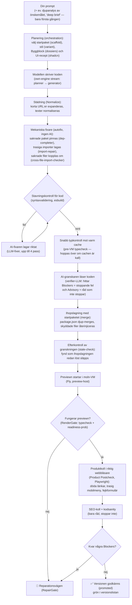
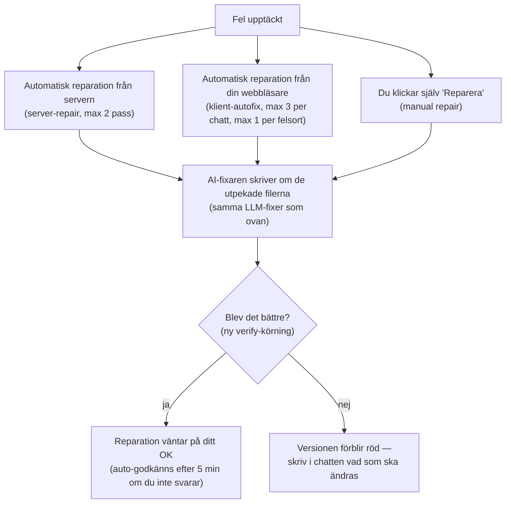
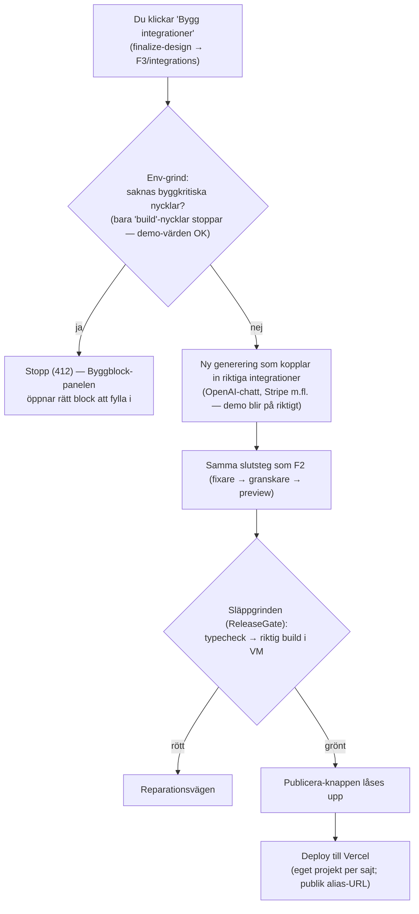

# Flödesschema — så byggs en sajt (grindar, fixare och modeller)

Snabbtitt för ägaren: vilka vägar en generering kan ta, vilka **grindar** (kontroller
som kan stoppa) och **fixare** (automatiska reparatörer) som finns, och vilken modell
som jobbar var. Enkelt språk; dev-ordet står i parentes. Koden vinner alltid över
det här dokumentet. Djupare detaljer: [`docs/architecture/llm-pipeline.md`](docs/architecture/llm-pipeline.md).

## Huvudflödet (F2 — designläget)

## Reparationsvägarna (när något stoppar)

## F3 — "Bygg integrationer" och publicering

## Vilken modell jobbar var? (per kvalitetsnivå/tier)

Kanonisk källa: `config/ai_models/manifest.json` → `phaseRouting` (syns även i
backoffice → LLM-konfig).

| Fas | Premium | Pro | Max | Anthropic |
|---|---|---|---|---|
| Planerare (planner) | GPT-5.6 Sol 🧠 | gpt-5.3-codex 🧠 | gpt-5.5 🧠 | Claude Opus 4.8 🧠 |
| Kodskrivare (generator) | GPT-5.6 Sol 🧠 | gpt-5.3-codex 🧠 | gpt-5.5 🧠 | Claude Opus 4.8 🧠 |
| **Fixare (fixer)** | **GPT-5.6 Sol** (utan 🧠 — ägarbeslut 2026-08-11) | gpt-5.3-codex | gpt-5.3-codex | Claude Opus 4.8 (utan 🧠) |
| Granskare (verifier) | GPT-5.6 Sol 🧠 | gpt-5.3-codex | gpt-5.3-codex | Claude Opus 4.8 |
| Deploy-hjälp | GPT-5.6 Sol 🧠 | gpt-5.3-codex | gpt-5.3-codex | Claude Opus 4.8 |

🧠 = "thinking" (modellen resonerar längre innan svar; långsammare men noggrannare).
Fixaren jobbar riktat på utpekade filer — där vinner snabbhet över djup.

## Grindarna i klartext

| Grind | Vad den stoppar | När |
|---|---|---|
| Syntaxvalidering | kod som inte ens kompilerar | direkt efter generering |
| Verifier-LLM | logiska fel, låtsasfunktioner, trasigt manifest (Blockers) | efter fixarna |
| Stale-check | *häver* granskarens fynd som ihopslagningen redan löst | efter merge |
| RenderGate | preview som inte renderar | F2, efter boot |
| Product Postcheck | trasig mobilmeny, ≥2 döda länkar, renderkrasch | F2, i riktig webbläsare |
| Env-grind (412) | saknade byggkritiska nycklar | vid F3-klick |
| ReleaseGate | kod som inte klarar riktig build | F3, före Publicera |
| Deploy-grindar (409) | opublicerbar version (ej grön, fel env) | vid Publicera |

## Lärande i bakgrunden (RAG)

Varje fel och fix loggas i produktionsdatabasen (`error_log_events` i Postgres/Supabase).
Före varje ny generering hämtas de ~5 000 senaste raderna (en gång per serverinstans
per minut, inte per bygge) och blir "lärdomar från liknande byggen" i prompten —
så samma fel ska bli mindre sannolikt nästa gång.
