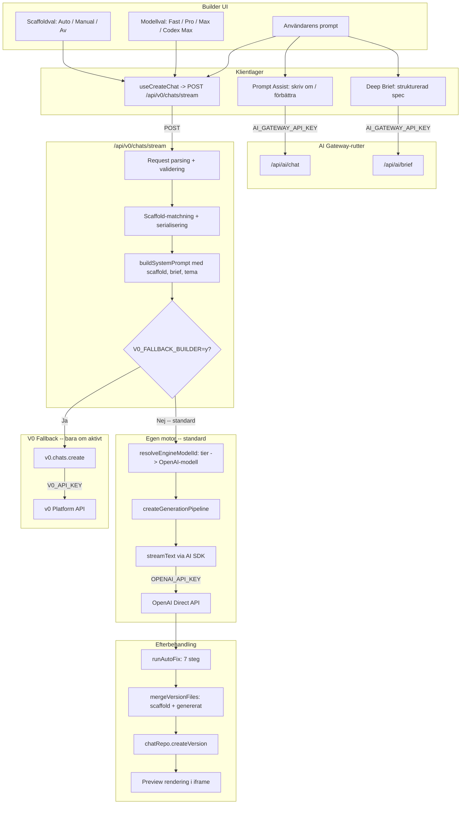

# Del 1: Grundläggande buggfixar och modellhygien

> Kör denna del FÖRST. Verifiera med `npx tsc --noEmit` + manuell test innan Del 2 påbörjas.

---

## Arkitekturkarta: Hur egen motor, AI Gateway och modeller hänger ihop



### API-nycklar per flöde

| Flöde | Nyckel | Provider |
|-------|--------|----------|
| **Kodgenerering (egen motor)** | `OPENAI_API_KEY` | OpenAI direkt via AI SDK |
| **Prompt Assist (gateway)** | `AI_GATEWAY_API_KEY` / `VERCEL_OIDC_TOKEN` | Vercel AI Gateway |
| **Deep Brief** | `AI_GATEWAY_API_KEY` | Vercel AI Gateway (v0 avvisas) |
| **V0-fallback** | `V0_API_KEY` | v0 Platform API (bara om `V0_FALLBACK_BUILDER=y`) |

---

## A. Uppdaterad modellmappning

### Nuvarande mappning (problemet)

| Tier | ID | Mappar till | Problem |
|------|----|------------|---------|
| Max Fast | `v0-max-fast` | `gpt-5.4` | Dyraste modellen på "snabb"-tiern |
| Pro | `v0-1.5-md` | `gpt-5.2` | OK |
| Max | `v0-1.5-lg` | `gpt-5.4` | Samma som Max Fast |
| GPT-5 | `v0-gpt-5` | `gpt-5.4` | Samma som Max Fast och Max |

Tre av fyra tier-nivåer mappar till samma modell. Ingen kodspecialiserad modell finns.

### Ny mappning (med Codex-modeller från OpenAI)

| Tier | ID | Mappar till | Styrka | Pris |
|------|----|------------|--------|------|
| **Fast** | `v0-max-fast` | `gpt-4.1` | Snabb, kapabel, bra för enkla sidor och ändringar | Lågt |
| **Pro** | `v0-1.5-md` | `gpt-5.3-codex` | Kodspecialiserad, bra balans | Medel |
| **Max** | `v0-1.5-lg` | `gpt-5.4` | Flaggskepp, bäst reasoning | Högt |
| **Codex Max** | `v0-gpt-5` | `gpt-5.1-codex-max` | Kod + xhigh reasoning | Högst |

Tillgängliga OpenAI Codex-modeller (per mars 2026):
- `gpt-5.3-codex` -- kodspecialiserad, stöder streaming
- `gpt-5.1-codex-max` -- kodmodell med `xhigh` reasoning effort
- `gpt-5.4` -- flaggskepp, rekommenderad för kodgenerering (ej Codex men bäst reasoning)
- `gpt-4.1-mini` -- snabb och billig för enklare uppgifter

### Filer att ändra

1. **`src/lib/v0/models.ts`** -- `OWN_MODEL_IDS`, `QUALITY_TO_OPENAI_MODEL`, `DEFAULT_OWN_MODEL_ID`
2. **`src/lib/gen/models.ts`** -- `MODEL_TIER_MAP`
3. **`src/lib/builder/defaults.ts`** -- `MODEL_TIER_OPTIONS` labels och descriptions
4. **`src/lib/v0/modelSelection.ts`** -- `v0TierToOpenAIModel`

---

## B. Kritiska buggar att fixa

### B1. SSE-stream lämnar meddelande fast i `isStreaming: true`

**Var:** `src/lib/hooks/v0-chat/stream-handlers.ts` rad 311, 404-410

**Problem:** Om streamen avslutas utan `"done"`-event kastas undantag. `setMessages` som sätter `isStreaming: false` nås bara på success-vägen. Meddelandet blir fast med spinner.

**Fix:**
```typescript
// I stream-handlers.ts, efter main loop (rad ~404):
// Flytta isStreaming:false till finally-blocket
finally {
  setMessages((prev) =>
    prev.map((m) =>
      m.id === assistantMessageId ? { ...m, isStreaming: false } : m
    )
  );
}
```

### B2. Post-checks kör på avmonterad komponent

**Var:** `src/lib/hooks/v0-chat/post-checks.ts` rad 414-527

**Problem:** `runPostGenerationChecks` körs fire-and-forget utan `AbortSignal`. Vid navigation anropas `setMessages` på avmonterad komponent.

**Fix:**
1. Lägg till `signal: AbortSignal` parameter
2. Kontrollera `signal.aborted` före varje `setMessages`
3. Skicka `streamAbortRef.current.signal` från anropsstället

### B3. `useAutoFix` setTimeout utan cleanup

**Var:** `src/lib/hooks/v0-chat/useAutoFix.ts` rad 42-44

**Fix:**
```typescript
const timerRef = useRef<ReturnType<typeof setTimeout> | null>(null);

// I handleAutoFix:
timerRef.current = setTimeout(() => { sendMessage(prompt); }, delay);

// I useEffect cleanup:
return () => { if (timerRef.current) clearTimeout(timerRef.current); };
```

### B4. SSE reader cleanup kan orsaka `ERR_INVALID_STATE`

**Var:** `src/lib/builder/sse.ts` rad 68-73

**Problem:** Per projektets egna `platform-quirks.mdc`: "Never call `reader.releaseLock()` while a `reader.read()` is pending."

**Fix:** Byt `reader.releaseLock()` till `reader.cancel()` i finally-blocket.

### B5. Preview: lucide default-import ger `undefined`

**Var:** `src/lib/gen/preview.ts` rad 394-396

**Problem:** Default-import från `lucide-react` mappas till `undefined`.

**Fix:** Lägg till fallback: om modulen är `lucide-react` och import är default, mappa till en generisk ikon-komponent.

---

## C. Modell- och konfigurationshygien

### C1. Död kod: `createV0FallbackStream`

**Var:** `src/lib/gen/fallback.ts` rad 55-110

**Problem:** Aldrig anropad. Stream-routes branchar innan `createGenerationPipeline`.

**Fix:** Ta bort `createV0FallbackStream`. Förenkla `createGenerationPipeline` till att bara anropa `generateWithEngine`.

### C2. Dubblerade modellmappningar

**Var:** `src/lib/v0/models.ts` (`QUALITY_TO_MODEL`) och `src/lib/gen/models.ts` (`MODEL_TIER_MAP`)

**Fix:** Konsolidera till en enda källa. Låt `gen/models.ts` importera från `v0/models.ts`.

### C3. Hårdkodade modellnamn

7+ ställen har hårdkodade modellnamn:

| Fil | Hårdkodat |
|-----|-----------|
| `src/lib/gen/engine.ts` | `DEFAULT_MAX_TOKENS = 16_384` |
| `src/lib/gen/models.ts` | `gpt-4.1-mini`, `gpt-5.2`, `gpt-5.4` |
| `src/app/api/ai/chat/route.ts` | default model, fallback models |
| `src/app/api/ai/brief/route.ts` | default model |
| `src/lib/gen/autofix/llm-fixer.ts` | `gpt-4.1-mini` |

**Fix:** Centralisera till config/env: `GEN_DEFAULT_MODEL`, `GEN_MAX_TOKENS`, `ASSIST_DEFAULT_MODEL`.

### C4. Gateway fallback-modeller ur synk

**Var:** `chat/route.ts` rad 101-106 vs `promptAssist.ts`

**Problem:** Fallback-modeller använder `claude-opus-4.5` / `claude-sonnet-4.5` medan `promptAssist.ts` använder `claude-sonnet-4-6`.

**Fix:** Synkronisera till senaste versioner.

### C5. Abort signal saknas i `streamText`

**Var:** `src/lib/gen/engine.ts` rad 46-53

**Fix:** Propagera `req.signal` genom pipeline till `streamText({ ..., abortSignal })`.

---

## Verifiering efter Del 1

- [ ] `npx tsc --noEmit` -- inga fel
- [ ] `npm run lint` -- inga nya fel
- [ ] Starta dev-server, generera en enkel sida
- [ ] Verifiera i konsolen att rätt modell visas (t.ex. "Byggtier: Pro, Motor: gpt-5.3-codex")
- [ ] Avbryt en generering mitt i -- verifiera att spinner försvinner
- [ ] Navigera bort under generering -- ingen React-varning om unmounted component
