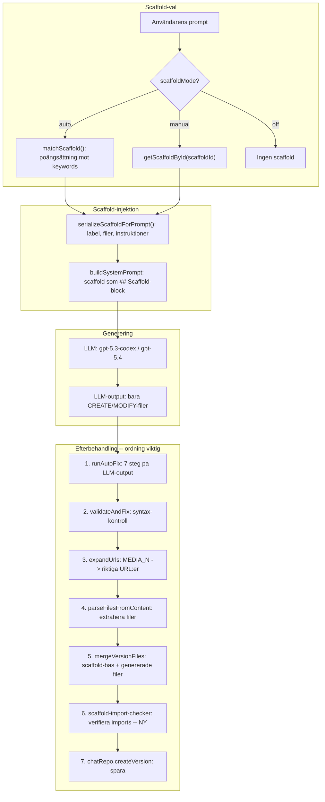

# Del 2: Arkitektur-refaktor och scaffold-förbättringar

> Kör denna EFTER att Del 1 är verifierad. Beror på att död kod är borta och modellmappning är uppdaterad.

---

## Scaffold-flöde (komplett)



**Notera ordningen:** AutoFix körs på LLM-output FÖRE merge. Scaffold-filer finns inte i `accumulatedContent` vid autofix-tidpunkten. Scaffold-import-checkern (ny) körs EFTER merge.

---

## A. Stream-route refaktor

### Problem

`src/app/api/v0/chats/stream/route.ts` är ~1475 rader. All logik lever i en enda POST-handler.

Autofix + validateAndFix + expandUrls + parseFiles + merge + createVersion upprepas **3 gånger** (rad ~511-564, ~676-712, ~762-806).

### Plan

Skapa nya filer under `src/lib/gen/stream/`:

| Ny modul | Rad-intervall idag | Innehåll |
|----------|-------------------|----------|
| `parseRequest.ts` | 109-187 | `parseAndValidateRequest()`: body-validering, meta-extraktion, modellval, prompt-orkestrering |
| `resolveScaffold.ts` | 329-379 | `resolveScaffoldAndBuildPrompt()`: scaffold-matchning, tema/brief-extraktion, `buildSystemPrompt` |
| `engineProcessor.ts` | 412-828 | `createEngineStream()`: hela SSE-loopen + `finalizeAndSaveVersion()` |
| `v0Processor.ts` | 831-1372 | `createV0Stream()`: V0-fallback SSE-loopen |

Route-filen krymps till ~100-150 rader: request parsing -> engine/v0 branch -> response.

### `finalizeAndSaveVersion()` -- deduplicering

De tre upprepade blocken ersätts med en gemensam funktion:

```typescript
async function finalizeAndSaveVersion(params: {
  accumulatedContent: string;
  engineChat: Chat;
  engineModel: string;
  resolvedScaffold: ScaffoldManifest | null;
  urlMap: Record<string, string>;
  runAutofix?: boolean;
}): Promise<{ version: Version; filesJson: string }> {
  let content = params.accumulatedContent;

  // 1. Autofix (om aktivt)
  if (params.runAutofix) {
    const result = await runAutoFix(content, { chatId, model });
    content = result.fixedContent;
  }

  // 2. Syntax-validering
  const syntax = await validateAndFix(content, { chatId, model });
  content = syntax.content;

  // 3. URL-expansion
  content = expandUrls(content, params.urlMap);

  // 4. Filparsning
  let filesJson = parseFilesFromContent(content);

  // 5. Scaffold-merge
  if (params.resolvedScaffold) {
    const generated = JSON.parse(filesJson);
    const scaffoldBase = params.resolvedScaffold.files.map(...);
    const merged = mergeVersionFiles(scaffoldBase, generated);
    filesJson = JSON.stringify(merged);
  }

  // 6. Scaffold-import-check (NY)
  if (params.resolvedScaffold) {
    filesJson = runScaffoldImportCheck(filesJson, params.resolvedScaffold);
  }

  // 7. Spara version
  const msg = chatRepo.addMessage(engineChat.id, "assistant", content);
  const version = chatRepo.createVersion(engineChat.id, msg.id, filesJson);
  return { version, filesJson };
}
```

### Extra bugg: parseSSEBuffer

**Var:** `src/lib/gen/route-helpers.ts` rad 138

**Problem:** `lines.pop()` antar att sista elementet är ofullständigt. En buffer som slutar exakt på `\n` behandlar sista raden som ofullständig.

**Fix:** Kontrollera om `sseBuffer` slutar på `\n\n` -- isåfall är alla rader kompletta.

---

## B. Scaffold-förbättringar

### B1. Scaffold-medveten import-check (NY)

**Problem:** Om modellen genererar `app/layout.tsx` utan att importera scaffoldens `SiteHeader`/`SiteFooter`, bryts layouten.

Ny fil: `src/lib/gen/autofix/rules/scaffold-import-checker.ts`

```typescript
export function runScaffoldImportCheck(
  filesJson: string,
  scaffold: ScaffoldManifest,
): string {
  const files: CodeFile[] = JSON.parse(filesJson);
  const layoutFile = files.find(f => f.path === "app/layout.tsx");
  if (!layoutFile) return filesJson;

  // Hitta scaffoldens komponenter som borde importeras
  const scaffoldComponents = scaffold.files
    .filter(f => f.path.startsWith("components/"))
    .map(f => {
      const name = f.path.replace("components/", "").replace(".tsx", "");
      // Extrahera export-namn
      const exportMatch = f.content.match(/export (?:default )?function (\w+)/);
      return exportMatch ? { path: f.path, name: exportMatch[1] } : null;
    })
    .filter(Boolean);

  // Kontrollera och fixa saknade imports
  for (const comp of scaffoldComponents) {
    if (!layoutFile.content.includes(comp.name)) {
      // Lägg till import
      layoutFile.content = `import { ${comp.name} } from "@/${comp.path.replace('.tsx', '')}";\n${layoutFile.content}`;
    }
  }

  return JSON.stringify(files);
}
```

Anropas i `finalizeAndSaveVersion` efter steg 5 (merge).

### B2. Intelligent merge med storleksvarning

**Var:** `src/lib/gen/version-manager.ts` rad 69-81

```typescript
export interface MergeWarning {
  type: "significant-shrink" | "scaffold-file-dropped";
  file: string;
  previousSize: number;
  newSize: number;
}

export function mergeVersionFiles(
  previousFiles: CodeFile[],
  newFiles: CodeFile[],
): { files: CodeFile[]; warnings: MergeWarning[] } {
  const merged = new Map<string, CodeFile>();
  const warnings: MergeWarning[] = [];

  for (const f of previousFiles) merged.set(f.path, f);

  for (const f of newFiles) {
    const prev = merged.get(f.path);
    if (prev && f.content.length < prev.content.length * 0.3) {
      warnings.push({
        type: "significant-shrink",
        file: f.path,
        previousSize: prev.content.length,
        newSize: f.content.length,
      });
    }
    merged.set(f.path, f);
  }

  // Kolla om scaffold-filer tappades
  for (const f of previousFiles) {
    if (!newFiles.some(n => n.path === f.path)) {
      // Scaffold-filen behålls via Map, men flagga att modellen inte rörde den
    }
  }

  return {
    files: Array.from(merged.values()).sort((a, b) => a.path.localeCompare(b.path)),
    warnings,
  };
}
```

Alla anropare uppdateras till att hantera `{ files, warnings }`.

### B3. Scaffold-info i SSE meta + UI

**Steg 1: Servern skickar scaffold-info**

I `engineProcessor.ts` (meta-eventet):
```typescript
formatSSEEvent("meta", {
  modelId: engineModel,
  modelTier: resolvedModelTier,
  thinking: resolvedThinking,
  imageGenerations: resolvedImageGenerations,
  chatPrivacy: resolvedChatPrivacy,
  scaffoldId: resolvedScaffold?.id ?? null,        // NY
  scaffoldFamily: resolvedScaffold?.family ?? null, // NY
})
```

**Steg 2: Klient visar scaffold-info**

I `src/lib/hooks/v0-chat/helpers.ts`, `buildModelInfoSteps`:
```typescript
if (meta.scaffoldId) {
  steps.push({ label: "Mall", value: scaffoldLabel(meta.scaffoldId) });
}
```

I `src/components/builder/MessageList.tsx`: visa som badge.

### B4. serialize.ts: första filen kan överskrida maxChars

**Var:** `src/lib/gen/scaffolds/serialize.ts` rad 31-34

**Fix:** Lägg till storlekscheck även för första filen:
```typescript
if (usedChars + block.length > maxChars) {
  if (usedChars === 0) {
    // Trunkera första filen istället för att skippa
    blocks.push(block.substring(0, maxChars) + "\n// ... truncated");
  }
  break;
}
```

---

## Verifiering efter Del 2

- [ ] `npx tsc --noEmit` -- inga fel
- [ ] `stream/route.ts` < 200 rader
- [ ] Starta dev-server, generera med scaffold (t.ex. portfolio)
- [ ] Verifiera i konsolen att "Mall: Portfolio" syns i agent-loggen
- [ ] Generera utan scaffold -- verifiera att "Mall: -" visas
- [ ] Kontrollera att merge-varningar loggas om modellen genererar en minimerlig globals.css
- [ ] Kontrollera att scaffold-header/footer importeras korrekt i layout.tsx
