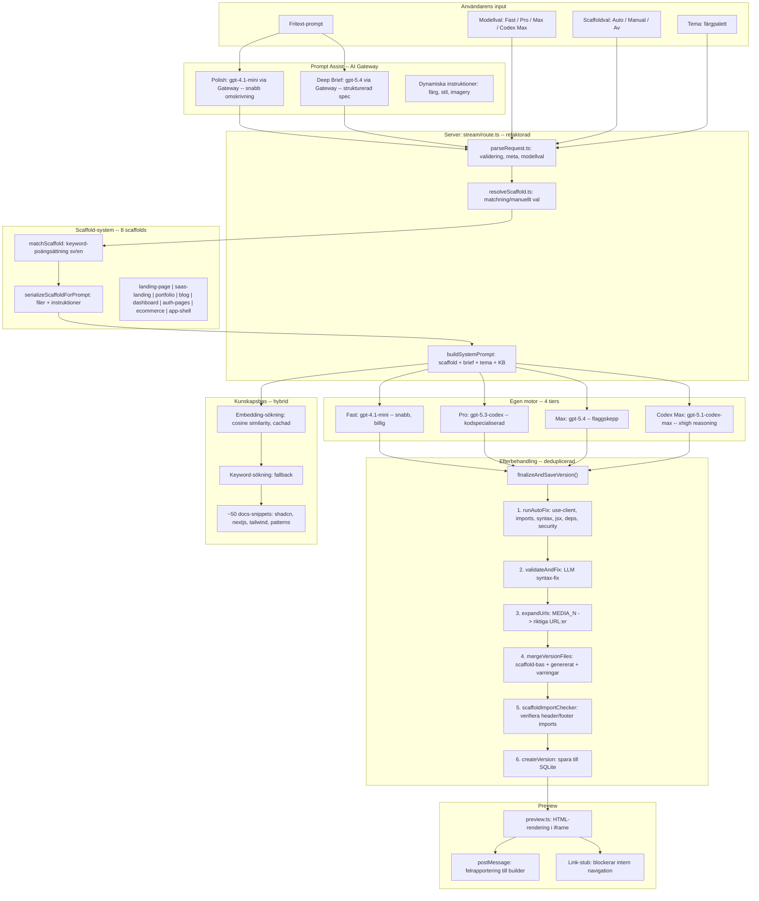

# Del 4: Sluttest, verifiering och nästa steg

> Del 1-3 KLARA (2026-03-10). tsc + lint passerar. Denna fil beskriver sluttest och framtida steg.

## Status efter Del 1-3

| Del | Vad | Status |
|-----|-----|--------|
| **Del 1** | 5 buggfixar, modellmappning (4 tiers med Codex), död kod borta, abort signal | KLAR |
| **Del 2** | `finalizeAndSaveVersion`, scaffold i SSE meta, import-checker, merge-varningar | KLAR |
| **Del 3** | Ecommerce scaffold (9:e), fallback abort signal | KLAR |
| **Docs** | MOTOR-STATUS.md, scaffold-status-and-plan.md, schemas_overview.txt uppdaterade | KLAR |

**OBS om kodstrukturen:** `src/lib/hooks/v0-chat/` och `src/lib/v0/` hanterar BÅDA motorerna (egen + v0-fallback). Tier-ID:n (`v0-max-fast` etc.) är interna etiketter som mappas till OpenAI-modeller via `v0TierToOpenAIModel()` i egen motor. De skickas aldrig till v0:s API om inte `V0_FALLBACK_BUILDER=y`.

---

## Komplett arkitektur efter alla förbättringar



---

## A. Fullständig testmatris

### A1. Kompilering och linting

```bash
npx tsc --noEmit
npm run lint
npm run build
```

Alla tre ska klara utan fel.

### A2. Scaffold-matchning (automatisk)

Testa varje scaffold med sin primära prompt:

| # | Prompt | Förväntat scaffold | Verifiering |
|---|--------|-------------------|-------------|
| 1 | "Bygg en hemsida för en rekryteringsfirma" | `landing-page` | Kontrollera agent-logg |
| 2 | "SaaS landing page with pricing tiers" | `saas-landing` | |
| 3 | "Personlig sajt för en fotograf" | `portfolio` | |
| 4 | "Tech blog with categories and newsletter" | `blog` | |
| 5 | "Adminpanel för en e-handel" | `dashboard` | |
| 6 | "Inloggningssida med registrering och glömt lösenord" | `auth-pages` | |
| 7 | "Webbshop för kläder med varukorg" | `ecommerce` | |
| 8 | "Bygg ett CRM-verktyg med sidebar" | `app-shell` | |

### A3. Modell-verifiering

| Tier | Förväntat i agent-logg | API-anrop (kontrollera i nätverkspanel) |
|------|------------------------|----------------------------------------|
| Fast | "Byggtier: Fast, Motor: gpt-4.1-mini" | POST openai med model=gpt-4.1-mini |
| Pro | "Byggtier: Pro, Motor: gpt-5.3-codex" | model=gpt-5.3-codex |
| Max | "Byggtier: Max, Motor: gpt-5.4" | model=gpt-5.4 |
| Codex Max | "Byggtier: Codex Max, Motor: gpt-5.1-codex-max" | model=gpt-5.1-codex-max |

### A4. Streaming och avbrott

| Test | Steg | Förväntat |
|------|------|-----------|
| Normal generering | Starta en sajt med Pro-tier | Komplett SSE-stream, version sparad, preview visas |
| Avbryt mitt i | Klicka "Avbryt" under generering | Spinner försvinner, inget felmeddelande |
| Navigera bort | Starta generering, klicka "Ny sida" | Ingen React-varning om unmounted component |
| Nätverksavbrott | Simulera med DevTools | Felmeddelande visas, spinner försvinner |

### A5. Scaffold-merge och import-check

| Test | Steg | Förväntat |
|------|------|-----------|
| Normal scaffold | Generera med portfolio | SiteHeader + SiteFooter finns i layout.tsx |
| Modell glömmer import | Kontrollera logg | Import-checker lägger till saknad import |
| Liten globals.css | Om genererad CSS < 30% av scaffold | MergeWarning loggas |

### A6. Preview

| Test | Förväntat |
|------|-----------|
| Klicka intern länk | Ingen navigation, `navigation-attempt` loggas |
| Saknad komponent | Tydligt felmeddelande, inte blank iframe |
| Lucide-ikoner | Renderas korrekt, inte `undefined` |

---

## B. Kontroll av "spöktrådar" och ghost state

### B1. Timer-cleanup

Verifiera att alla `setTimeout`/`setInterval` rensas vid unmount:
- `useAutoFix.ts` -- timerRef.current clearas
- `useBuilderPageController.ts` -- alla timers har cleanup
- `engineProcessor.ts` -- pingTimer clearas

### B2. Abort-signaler

Verifiera att alla fetch-anrop har `signal`:
- `useCreateChat.ts` -- primär + fallback fetch
- `useSendMessage.ts` -- primär + fallback fetch
- `post-checks.ts` -- alla interna fetchar

### B3. Reader-cleanup

Verifiera att alla stream-readers använder `cancel()` istället för `releaseLock()`:
- `src/lib/builder/sse.ts`
- `src/app/api/v0/chats/stream/route.ts` (engine reader)

### B4. State-reset vid navigation

Testa sekvensen:
1. Generera en sajt
2. Klicka "Ny sida"
3. Verifiera att chatId, messages, demoUrl, versionId alla är null/tomma
4. Generera igen -- ska vara helt fräscht

---

## C. Förslag på nästa steg

### Kortsiktigt (nästa sprint)

| # | Förslag | Effekt | Insats |
|---|---------|--------|--------|
| 1 | **Preflight requirements pass** -- analysera prompten före generering, extrahera behov som `SITE_PASSWORD`, `SUPABASE_URL`, och ställ följdfrågor | Användarupplevelse | ~4h |
| 2 | **Multipage-detection i scaffold** -- analysera om prompten beskriver flera sidor och utöka scaffolden dynamiskt | Kvalitet | ~3h |
| 3 | **Scaffold A/B-testning** -- logga vilken scaffold som valdes och korrelera med användarens feedback | Data | ~2h |
| 4 | **Prompt-cache med OpenAI** -- aktivera `prompt_cache_key` och `24h` retention för scaffold-tunga system prompts | Kostnad/latens | ~1h |

### Medellångt (nästa månad)

| # | Förslag | Effekt | Insats |
|---|---------|--------|--------|
| 5 | **Scaffold-medveten retry** -- om generering misslyckas, försök igen med förenklad scaffold | Robusthet | ~4h |
| 6 | **Smart bildval via CLIP** -- matcha bildförslag semantiskt mot prompten | Bildkvalitet | ~8h |
| 7 | **Progressiv preview** -- visa delresultat under generering (likt v0) | UX | ~6h |
| 8 | **pgvector för KB** -- flytta embeddings till Supabase/pgvector för snabbare sökning | Infrastruktur | ~4h |

### Långsiktigt (Q3 2026)

| # | Förslag | Effekt |
|---|---------|--------|
| 9 | **Flersidigt scaffold-system** -- en scaffold kan innehålla 10+ sidor med routing | Kapacitet |
| 10 | **Scaffold-marketplace** -- användare kan dela och rösta på scaffolds | Community |
| 11 | **Kodreview-agent** -- automatisk kvalitetsgrading av genererad kod med scoring | Kvalitet |
| 12 | **Deployment-pipeline** -- automatisk preview-deploy till Vercel efter generering | Hastighet |

---

## D. Sammanfattning

När alla 4 delar är klara har vi:

- **8 scaffolds** (landing, saas, portfolio, blog, dashboard, auth, ecommerce, app-shell)
- **4 modell-tiers** med kodspecialiserade Codex-modeller
- **Refaktorad stream-route** (< 200 rader, deduplicerad)
- **Scaffold-medveten autofix** (import-checker efter merge)
- **Intelligent merge** med storleksvarningar
- **Embedding-baserad KB-sökning** med keyword-fallback
- **Inga spöktrådar** -- alla timers, readers, och abort-signaler korrekt hanterade
- **Scaffold-synlighet** i chat-UI

Estimerad total insats: ~24h fördelat på 4 delar.
