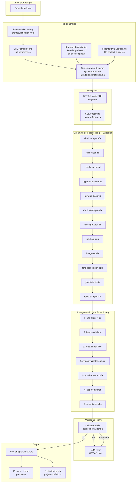

# Egen Motor — Sajtmaskins kodgenereringsmotor

> Senast uppdaterad: 2026-03-10
> Branch: `egen-motor-v2`
> Fallback: `V0_FALLBACK_BUILDER=y` i .env.local aktiverar v0:s API istället

## Vad detta är

Sajtmaskin har en egen kodgenereringsmotor som ersätter Vercels v0 Platform API. Motorn använder GPT 5.2 (via Vercel AI SDK + OpenAI) för att generera kompletta Next.js-applikationer direkt från användarens prompt.

v0:s API finns kvar som opt-in fallback men är avstängt som standard.

## Arkitektur-översikt



## Mappstruktur (src/lib/gen/)

```
src/lib/gen/
├── engine.ts              # GPT 5.2 kodgenerering via AI SDK streamText()
├── fallback.ts            # Pipeline-entrypoint + v0 opt-in fallback
├── system-prompt.ts       # Systemprompt: 17K statisk kärna + dynamisk kontext
├── models.ts              # Modellrouting (gpt-5.2, gpt-4.1-mini)
├── parser.ts              # Parsar CodeProject-format (fenced blocks → CodeFile[])
├── preview.ts             # Preview-rendering (TSX → HTML iframe med stylade stubs)
├── project-scaffold.ts    # Komplett Next.js-projekt för nedladdning
├── stream-format.ts       # Konverterar AI SDK → SSE events
├── url-compress.ts        # Komprimerar långa URLs före LLM
├── version-manager.ts     # Versionshantering + fil-merge
├── index.ts               # Barrel-exports
│
├── autofix/
│   ├── pipeline.ts        # Orkestrator: 7 steg + security
│   ├── use-client-fixer.ts
│   ├── import-validator.ts
│   ├── react-import-fixer.ts
│   ├── syntax-validator.ts  # esbuild-validering (dynamisk import)
│   ├── jsx-checker.ts       # Auto-fixar saknade imports + export default
│   ├── dep-completer.ts
│   ├── llm-fixer.ts         # GPT 4.1 mini fixer-modell
│   ├── fixer-prompt.ts      # Systemprompt för fixer
│   └── validate-and-fix.ts  # Integrerad i stream-routes
│
├── suspense/
│   ├── transform.ts         # TransformStream line-by-line processor
│   ├── index.ts             # createDefaultRules() med alla 12 regler
│   └── rules/
│       ├── shadcn-import-fix.ts
│       ├── lucide-icon-fix.ts
│       ├── url-alias-expand.ts
│       ├── type-annotation-fix.ts
│       ├── tailwind-class-fix.ts
│       ├── duplicate-import-fix.ts
│       ├── missing-export-fix.ts
│       ├── next-og-strip.ts
│       ├── image-src-fix.ts
│       ├── forbidden-import-strip.ts
│       ├── jsx-attribute-fix.ts
│       └── relative-import-fix.ts
│
├── security/
│   ├── index.ts               # runSecurityChecks()
│   ├── output-sanitizer.ts    # Blockerar eval(), document.write(), externa scripts
│   ├── path-validator.ts      # Blockerar path traversal, node_modules, .env
│   └── prompt-guard.ts        # Detekterar prompt injection i output
│
├── context/
│   ├── index.ts
│   ├── knowledge-base.ts     # Keyword-sökning i 50 docs-snippets
│   └── file-context-builder.ts # Filkontext för uppföljningsprompts
│
├── retry/
│   ├── index.ts
│   └── validate-syntax.ts    # esbuild-validering av hela projektet
│
├── eval/
│   ├── index.ts
│   ├── prompts.ts             # 10 test-prompts
│   ├── checks.ts              # 8 kvalitetskontroller
│   ├── runner.ts              # Eval-körare
│   └── report.ts              # Markdown-rapportgenerator
│
└── data/
    ├── docs-snippets.ts       # 50 kunskaps-snippets (shadcn, nextjs, tailwind, patterns)
    ├── lucide-icons.ts        # 792 validerade ikonnamn
    └── shadcn-components.ts   # Komponentmappning för import-fix
```

## Stream-routes (integration)

Motorn integreras via dessa API-routes:

| Route | Fil | Syfte |
|-------|-----|-------|
| `POST /api/v0/chats/stream` | `src/app/api/v0/chats/stream/route.ts` | Skapa ny chat + generera |
| `POST /api/v0/chats/[chatId]/stream` | `src/app/api/v0/chats/[chatId]/stream/route.ts` | Skicka uppföljningsmeddelande |
| `GET /api/preview-render` | `src/app/api/preview-render/route.ts` | Renderar preview HTML |
| `GET /api/placeholder` | `src/app/api/placeholder/route.ts` | Dynamisk SVG-platshållare |
| `GET .../versions/[versionId]/download` | `src/app/api/v0/chats/[chatId]/versions/[versionId]/download/route.ts` | Nedladdning med komplett scaffold |

## Hur man byter mellan egen motor och v0

```bash
# Egen motor (standard):
# Ta bort V0_FALLBACK_BUILDER från .env.local (eller sätt till något annat än "y")

# v0 fallback:
echo V0_FALLBACK_BUILDER=y >> .env.local
```

Kontrolleras av `src/lib/gen/fallback.ts`:
```typescript
export function shouldUseV0Fallback(): boolean {
  return process.env.V0_FALLBACK_BUILDER === "y";
}
```

## Kvalitetsscoring vs v0

| Kapabilitet | v0 | Egen motor | Kommentar |
|---|---|---|---|
| Promptspecifikation | 9 | 9 | Detaljerade designregler i systemprompt |
| Streaming-fixar | 9 | 8 | 12 regler (v0 har ~20) |
| Post-gen autofix | 8 | 8 | esbuild + LLM fixer + security |
| Dynamisk kontext | 9 | 7 | Keyword-KB (v0 har embeddings) |
| Felåterhämtning | 8 | 8 | 3-stegs retry integrerat |
| Modellrouting | 8 | 7 | GPT 5.2/4.1-mini |
| Eval | 7 | 7 | 10 prompts, 8 checks |
| Säkerhet | 8 | 7 | Sanitizer + path + injection guard |
| Preview-fidelitet | 9 | 6 | Stylade stubs, inte riktig sandbox |
| Nedladdning | 9 | 8 | Komplett projekt med shadcn + deps |
| **Uppskattat totalt** | **~100%** | **~85-90%** | |

## Kända begränsningar

1. **Preview** använder stubs, inte riktiga shadcn/Radix-komponenter
2. **Ingen sandbox** — preview kör inte riktigt Next.js
3. **Keyword-sökning** i kunskapsbas (inte embedding-baserad)
4. **Ingen progressiv rendering** (hela sajten visas först efter generering)

## Historik

| Datum | Händelse |
|-------|----------|
| 2026-03-06 | EGEN_MOTOR: Analys av v0 vs sajtmaskin (58% paritet) |
| 2026-03-06 | 20 workloads: Grundläggande motor byggd |
| 2026-03-09 | EGEN_MOTOR_V2 Plan 01-08: Motor polerad (80% paritet) |
| 2026-03-09 | Plan 11+13: Fler regler + säkerhet (85% paritet) |
| 2026-03-10 | Systemprompt-kvalitet, retry-integration, scaffold, styled stubs (90% paritet) |
| 2026-03-10 | Dialog onClose-fix, npm audit, konsoliderad dokumentation |

## Dokumentation i denna mapp

```
LLM/egen-motor/
├── README.md                    # Denna fil (start här)
├── MOTOR-STATUS.md             # Övergripande status + kända problem
├── validation-log.md           # Valideringslogg per byggplan
├── analys/                     # Ursprunglig v0-analys
│   ├── 01-motoranalys.md       # Huvudrapport
│   ├── 02-redundant-och-fel.md
│   ├── 03-overlap-med-v0.md
│   ├── 04-streaming-postprocess.md
│   ├── 05-hur-v0-bryter-ner-en-prompt.md
│   ├── 06-scoring-och-bilder.md
│   └── 07-tillagg-fran-v0-bloggen-2026-01-07.md
├── byggplaner/                 # Implementation (13 planer)
│   ├── 01-retry-loop.md
│   ├── 02-suspense-regler.md
│   ├── 03-autofix-esbuild.md
│   ├── 04-multi-file.md
│   ├── 05-dynamisk-kontext.md
│   ├── 06-eval-loop.md
│   ├── 07-bildhantering.md
│   ├── 08-fixer-sandbox.md
│   ├── 09-embedding-sokning.md (ej implementerad)
│   ├── 10-generationsdata.md (ej implementerad)
│   ├── 11-fler-suspense-regler.md
│   ├── 12-progressiv-preview.md (ej implementerad)
│   └── 13-sakerhet-guardrails.md
└── bilder/                     # Diagram från analysen
    ├── v0-fyra-lager.png
    ├── sajtmaskin-vs-v0-hela-kedjan.png
    ├── scorecard-sajtmaskin-vs-v0.png
    ├── v0-vs-sajtmaskin-architecture.png
    └── sajtmaskin-utan-v0-roadmap.png
```
