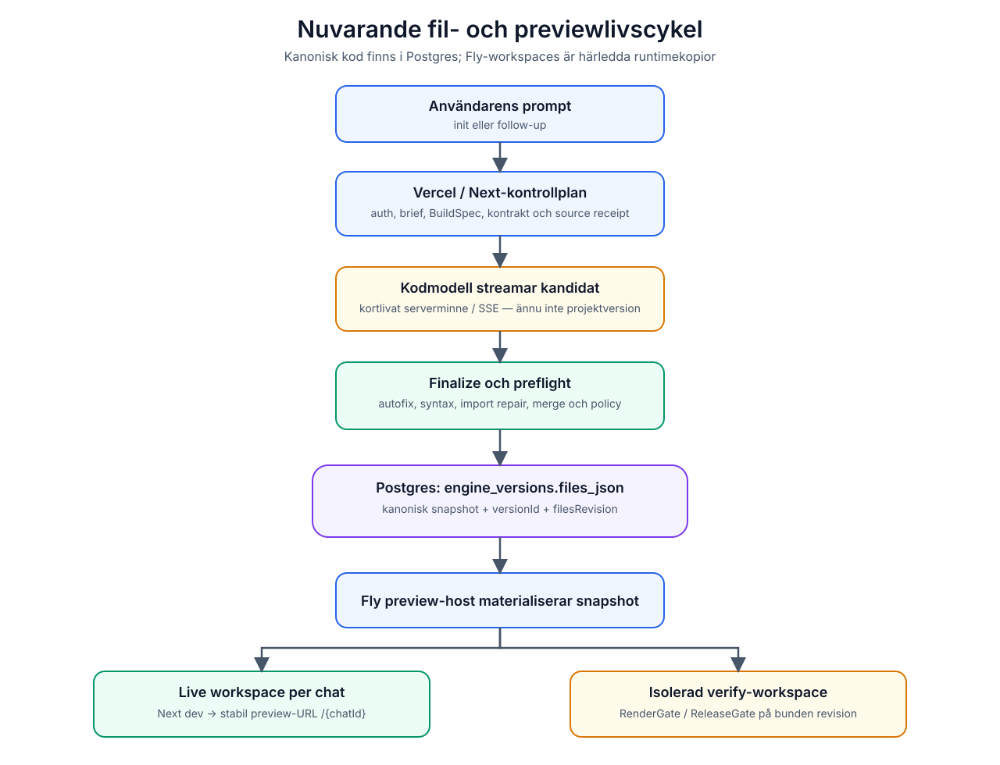
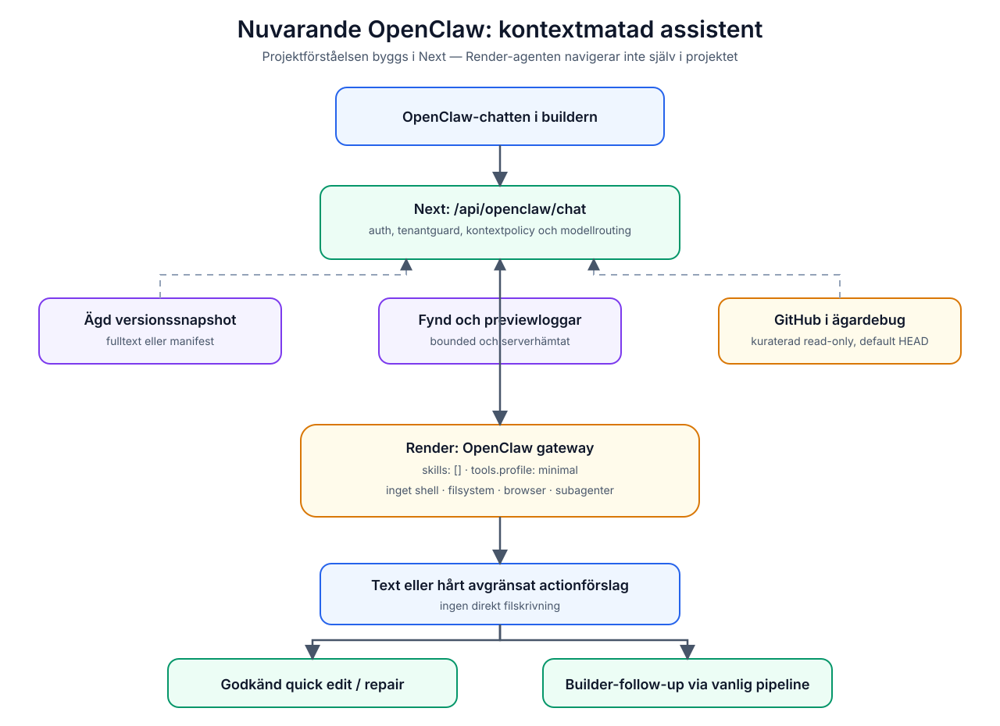

# Filkarta och dataflöde

## Nuvarande projektlivscykel

Mermaid-källa: [diagrams/current-file-lifecycle.mmd](diagrams/current-file-lifecycle.mmd).

## Var allt ligger

| Objekt | Nuvarande plats | Auktoritet |
| --- | --- | --- |
| Användarprompt | `engine_messages` | historik för chatten |
| Orchestration snapshot | `engine_chats` | bas för follow-up |
| Generation input | serverminne under körningen | kortlivat paket |
| Kodkandidat under stream | Next-process/SSE | inte ännu en version |
| Kanoniska projektfiler | `engine_versions.files_json` | **source of truth** |
| Filrevision | `engine_versions.files_revision` | bindning för verifiering/CAS |
| Repair-kandidat | `engine_versions.repaired_files_json` | separat förslag |
| Previewpekare | Redis | kortlivad cache, inte kodlager |
| Live previewkopia | Fly `/data/workspaces/{chatId}` | härledd runtimekopia |
| Verifykopia | Fly `/data/verify-workspaces/{chatId}/{verifyId}` | isolerad och disponibel |
| Preview sessionsregister | Fly `/data/preview-host-store.json` | hostens runtime-state |
| Materialiserade bilder | Vercel Blob | assetlager, URL lagras i snapshot |
| Sajtmaskins plattformskod | GitHub-repot | inte användarprojektet |
| Publicerad webbplats | Vercel Deployment | härledd från vald version |
| OpenClaw-state | Render `/root/.openclaw` | gateway/agentstate, inte projektkod |

`project_files` och liknande äldre tabeller får inte misstas för own-engine-
projektets kanoniska filkälla.

## Generation steg för steg

1. Ny generation kommer till `POST /api/engine/chats/stream`; follow-up går via
   chattspecifik streamroute.
2. Prompten blir Brief och deterministisk orkestreringskontext.
3. `resolveOrchestrationBase` samlar scaffold, variant, route plan,
   capabilities, dossiers, kontrakt, BuildSpec och freeze/floor.
4. `GenerationInputPackage` skapas med lineage hash, promptstorlek och source
   receipt.
5. Modellen streamar en kandidat. Den finns ännu bara i generationsprocessen.
6. Finalize kör normalisering, autofix, syntax, import repair, eventuell
   RepairGate, bildmaterialisering och skyddad merge.
7. Preflight körs före persist.
8. Assistantmeddelande och version sparas.
9. Exakt sparad snapshot skickas till preview-hosten.
10. F2 RenderGate eller F3 ReleaseGate bedömer den sparade versionen.

## Preview steg för steg

1. Appen läser den sparade versionens `files_json`, `versionId` och revision.
2. Om samma revision redan kör kan sessionen återanvändas.
3. En säker follow-up kan patcha bara ändrade filer.
4. Strukturella ändringar eller osäker diff ger full update och restart.
5. Preview-hosten skriver filerna till sin workspace och startar `npm run dev`.
6. Browsern får en stabil URL på `/{chatId}`; browsern äger inga projektfiler.
7. Verifyjobb materialiseras i en separat workspace och får inte dela muterbar
   arbetskopia med live preview.

## Var OpenClaw ansluter i dag

OpenClaw läser inte Fly-disken eller Postgres själv. Next-route:n läser
server-side, verifierar ägarskap, formar textblock och skickar dem till Render.
Ett framtida Builder-verktyg ska fortsätta använda samma princip: OpenClaw får
en broker, inte råa plattformscredentials.
