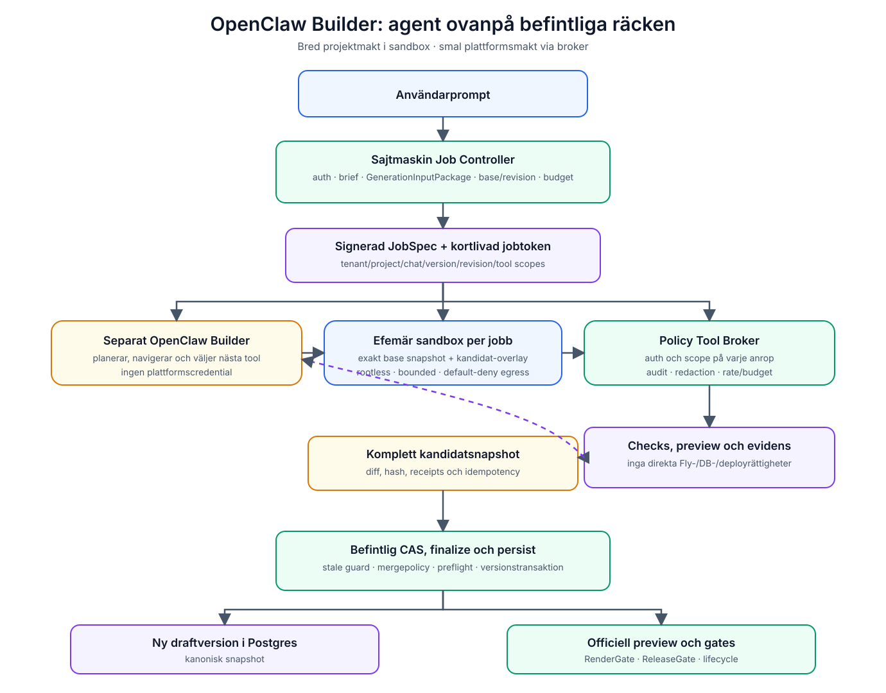

# Målarkitektur

## Rekommendation

Behåll Sajtagenten som den säkra publika assistenten. Skapa en separat intern
Render-service, `openclaw-builder`, för agentiska byggjobb.

Mermaid-källa: [diagrams/target-openclaw-builder.mmd](diagrams/target-openclaw-builder.mmd).

## Komponenter

### 1. Sajtmaskin Job Controller

Ägs av Next-kontrollplanet och ansvarar för:

- auth, tenant och credits
- generationslås och idempotency
- val av exakt base version/revision
- skapande av befintligt `GenerationInputPackage`
- budgets och tillåtna verktyg
- kortlivad jobtoken
- status, cancel och audit

Controllern skickar ett signerat `BuilderJobSpec`, inte databaskort eller
Vercel/Fly-credentials.

### 2. Separat OpenClaw Builder

Ansvarar för:

- planering
- val av nästa verktyg
- avgränsad filnavigering
- ändringar i den tillfälliga kandidatarbetsytan
- tolkning av check-, preview- och loggresultat
- högst ett litet antal reparationer
- inlämning av komplett kandidatsnapshot

Den får inte avgöra att något är persisted, promoted eller live.

### 3. Sandbox per jobb

Varje jobb får egen isolerad filyta och processgräns. Sandboxes får aldrig
återanvändas mellan tenants. Basen hydreras från exakt `files_json` och binds
till revision.

Sandboxen har:

- projektfiler
- syntetisk, hemlighetsfri env
- CPU-, minnes-, disk- och tidsgräns
- default-deny egress
- separat dependencycache som inte innehåller projektdata

### 4. Policy Tool Broker

Broker är enda vägen mellan agent och Sajtmaskin. Den verifierar för varje call:

- jobtoken och scope
- tenant/chat/version/revision
- tillåtet verktyg
- path och payloadstorlek
- budget och rate limit
- att jobbet inte cancelats eller supersedats

Resultatet normaliseras och loggas innan det når modellen.

### 5. Befintlig finalize och versionering

`candidate.submit` skickar hela kandidatsnapshoten tillbaka till kontrollplanet.
Där körs befintliga deterministiska skydd, inklusive stale-base-kontroll.

Agenten bör inte själv emulera:

- scaffold/dossier merge policy
- package-baseline
- preflight
- versionstransaktion
- repair acceptance
- promotion

### 6. Befintlig preview och verifiering

Preview och verify anropas via avgränsade APIs. Agenten får status och evidens,
inte shell på Fly. RenderGate/ReleaseGate arbetar fortsatt på den sparade eller
explicit utvärderade kandidatrevisionen.

## Rekommenderad jobsekvens

1. Controller fryser base version och bygger `GenerationInputPackage`.
2. Builder läser planpaketet och inspekterar aktuella filer med verktyg.
3. Builder skriver en kort plan med ändringsscope och expected files.
4. Builder kan anropa nuvarande codegen som ett verktyg för första kandidaten,
   eller redigera en existerande snapshot vid follow-up.
5. Builder kör statiska checks i sandbox.
6. Builder begär preview/evaluering.
7. Builder gör högst två evidensstyrda repairvarv.
8. Builder lämnar komplett snapshot och ändringsmanifest.
9. Controller verifierar base/revision igen och kör befintlig finalize.
10. Ny draftversion skapas; vanliga gates avgör promote/repair/block.

## Varför inte full ersättning

En fri agent kan sannolikt göra snyggare och mer sammanhängande projekt, men
den kan inte promptas till transaktionssäkerhet. Om den också ska ansvara för
tenantisolering, versioner, dossierkrav och release gates måste samma
deterministiska system byggas om runt den. Hybridlösningen får agentens
iterativa kvalitet utan att kasta bort den starkaste delen av nuvarande system.

## Render-topologi

| Service | Profil | Data | Verktyg |
| --- | --- | --- | --- |
| `openclaw-sajtagenten` | publik assistent | nuvarande begränsade state | fortsatt `minimal` |
| `openclaw-builder-control` | intern agentcontroller | jobmetadata, ingen kanonisk kod | broker-klient |
| per-jobb sandbox/worker | disponibel exekvering | en projektsnapshot | projektverktyg |

På en första PoC kan controller och worker deployas tillsammans men måste ändå
ha separata process-/credentialgränser. Långsiktigt bör varje skrivande jobb
köras i en separat microVM/container, inte direkt i den permanenta
OpenClaw-processen.
