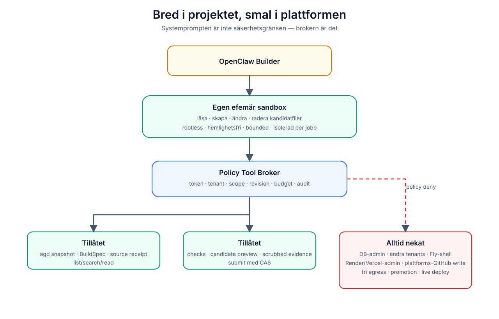

# Säkerhet och behörigheter

## Grundprincip

OpenClaw får stora befogenheter **inom en engångssandbox**. All åtkomst ut ur
sandboxen går genom en serverägd broker med explicit scope.

## Varför nuvarande gateway inte ska uppgraderas till full tools

Nuvarande Render-container:

- är publikt nåbar bakom bearer-token
- kör OpenClaw med persistent `/root/.openclaw`
- kör som root
- innehåller bland annat `git` och nätverksverktyg
- bär OpenAI-nyckel och gateway-token
- delar workspace mellan strong/balanced/fast

Det är acceptabelt när toolprofilen är `minimal`. Att bara slå om till shell,
filesystem eller browser skulle göra prompt injection till container- och
hemlighetsrisk.

## Behörighetsmatris

| Resurs | Sajtagenten | OpenClaw Builder | Huvudappen |
| --- | --- | --- | --- |
| Ägd versionssnapshot | injicerad text | read via broker | full serveråtkomst |
| Kandidatworkspace | nej | read/write i eget jobb | validerar/kan materialisera |
| Postgres | nej | nej | tenantgrindad ägare |
| Fly live workspace | nej | nej | host-API |
| Candidate preview | nej | begär via broker | skapar/isolerar |
| Plattformens GitHub | kuraterad debug-read | normalt nej | deploy-/utvecklingsflöde |
| Användarens GitHub | nej | framtida scoped app | separat consentflow |
| Vercel deploy | nej | nej | releasegrindad route |
| Internet | ingen browser | default deny/allowlist | serverpolicy |
| Hemligheter | inga i kontext | syntetiska placeholders | serverägda |

## Huvudhot

### Prompt injection

Opålitlig data omfattar:

- användarprompt
- importerade filer och README
- genererad kod och kommentarer
- previewloggar
- screenshots/OCR
- webbinnehåll
- dependency-output

Instruktioner i sådan data får aldrig höja scope, ändra JobSpec, begära andra
tenants eller göra ett nekad verktyg tillåtet.

### Cross-tenant-läckage

- ny sandbox och workspace för varje jobb
- inga återanvända agentsessioner mellan tenants
- cache keys får inte innehålla eller returnera projektinnehåll
- alla brokeranrop verifierar tenant igen
- model history binds till project/chat/version/revision
- cleanup efter terminalt jobb verifieras och auditeras

### Supply-chain-RCE

`npm install`, `postinstall`, byggskript och testkod är exekvering av opålitlig
kod. Kör detta:

- i annan process/microVM än controllern
- som icke-root
- utan plattformshemligheter
- med read-only systemlager
- med bounded disk/minne/CPU/tid
- med default-deny egress
- med dependency-/registry-policy

En dependencycache får optimera hämtning men inte minska isoleringen.

### Stale writes och dubbla versioner

- bind jobb till version + `filesRevision`
- durable lease och heartbeat
- idempotent submit
- compare-and-swap precis före persist
- terminalt `superseded` när användaren startar ett nyare skrivjobb

### Secrets och nätverk

- inga råa envvärden i modellen
- placeholders för preview/checks
- kortlivad jobtoken med audience och tool scopes
- olika identiteter för chattgateway, builder och previewbroker
- automatisk rotation och revocation
- egressallowlist per verktyg, inte fri internetåtkomst

### Kostnads- och resurs-DoS

- max modellvarv
- max previewloopar
- max wall time
- max filantal/bytes/diff
- max tool calls och parallellism
- tenant/user rate limits
- cancel och global kill switch

## Serverauktoritativa grants

Nuvarande armed/quick-edit-systemprompt löses från global `OC_EDIT` och den
begärda klientlistan. En Builder måste dessutom kontrollera en serverpersistad
grant/mandate för exakt chat och jobb. Klientens `allowedTools` får bara smalna
av, aldrig skapa behörighet.

Även nuvarande power-semantik bör förtydligas: kommentarer säger session-only,
medan UI kan hydrera en DB-persistad grant efter reload. Det ska finnas ett enda
uttalat kontrakt och test för vilken semantik som gäller.

## GitHub

Nuvarande debugläsning använder `HEAD` som standardref och fyra kuraterade
plattformfiler. För reproducerbar analys bör framtida repo-read alltid pinnas
till en commit-SHA.

Om användaren senare kopplar ett eget GitHub-repo:

1. använd project-scoped GitHub App
2. explicit installation/consent
3. read-only först
4. fast commit-SHA
5. list/search/read via broker
6. skriv endast till ny användarbranch och PR efter separat grant
7. aldrig återanvänd Sajtmaskins plattformstoken

## Driftkontroller före PoC

- verifiera att gateway-tokenen som dokumenterats som exponerad faktiskt har
  roterats i Render och Vercel
- separera credentials mellan miljöer och services
- kör builder som icke-root
- lägg kill switch i huvudappen
- säkerställ audit retention och redaction
- penetrationstesta path traversal, SSRF, prompt injection och tenantförfalskning
- testa OOM, timeout, worker crash, network deny och expired token

Ingen akut exploit är bekräftad i nuvarande minimalprofil. Riskökningen uppstår
först när riktiga verktyg kopplas in.
