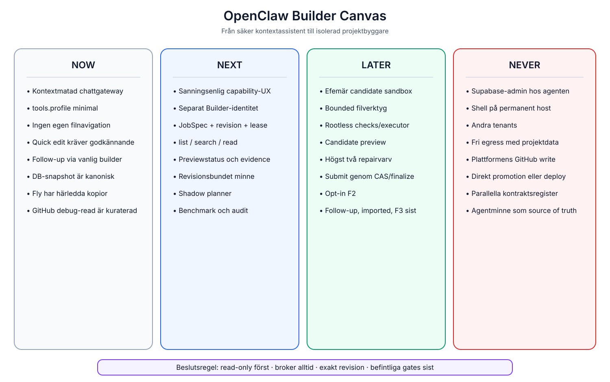

# OpenClaw Builder Canvas

## Now

- Sajtagenten är en kontextmatad, minimal chattgateway.
- Kanoniska filer ligger i `engine_versions.files_json`.
- Preview och verify materialiserar separata kopior på Fly.
- OpenClaw kan föreslå quick edit eller skicka builder-follow-up.
- GitHub-read är kuraterad, debug-only och read-only.

## Next

- sanningsenlig kapabilitets-UX
- separat Builder-identitet
- JobSpec + revision + durable lease
- read-only list/search/read
- previewstatus/logg/screenshot via broker
- shadow planner och benchmark

## Later

- efemär candidate sandbox
- bounded write tools
- statiska checks
- högst två preview-/repairvarv
- candidate submit genom befintlig finalize
- opt-in F2 och stegvis rollout

## Never

- rå Supabase-admin hos agenten
- shell på permanent Fly/Render-service
- plattforms-GitHub write
- fri egress med projektdata
- direkt promotion/deploy
- parallell BuildSpec/scaffold/dossier-owner
- agentminne som source of truth

## Beslutsregel

När en ny capability föreslås, placera den först i en kolumn och svara:

1. Vilken kanonisk owner påverkas?
2. Vilken brokerpolicy stoppar fel tenant/scope?
3. Vilken revision binds resultatet till?
4. Hur avbryts, återkallas och auditeras den?
5. Kan samma nytta uppnås read-only först?
