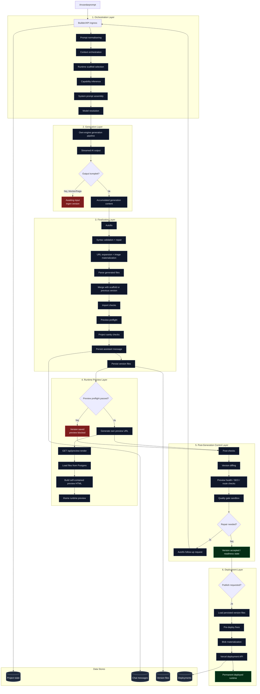

# Own-Engine Flow V2

Mermaid V2b for Sajtmaskin's own-engine lane.

This version is intentionally architect-focused:
- less UI detail
- clearer separation of responsibilities
- explicit data stores
- explicit preview-blocked state

Short reading guide:
- `Project state` tracks builder/project-level state.
- `Chat messages` stores user/assistant conversation artifacts.
- `Version files` is the main source of truth for generated own-engine output.
- `Preview blocked` means a version exists, but no preview URL is emitted.
- `Permanent deployed runtime` is separate from preview and only happens after publish.
