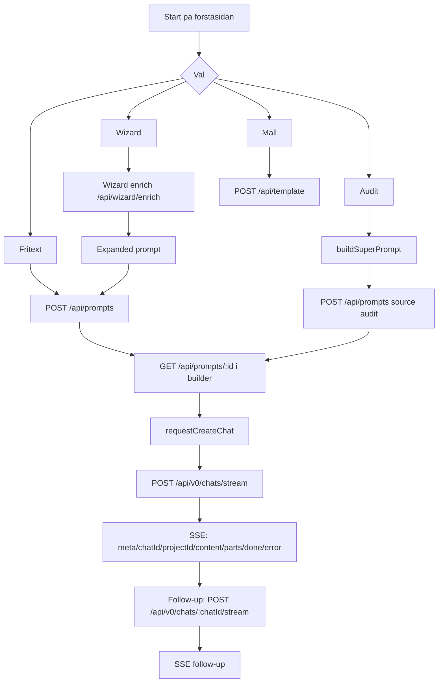
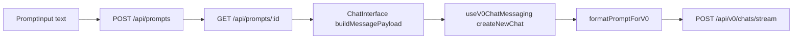
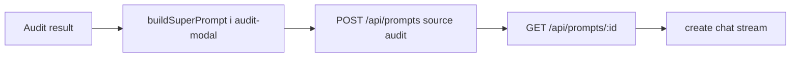
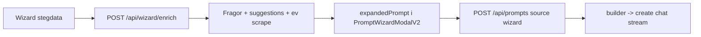

# AC-schema: Promptfloden (Fritext, Audit, Mall, Wizard)

> STATUS (2026-02-13): Legacy/reference document.
> Primary consolidated audit: `BUILDER_V0_ALIGNMENT_AUDIT_2026-02-13.md`
> Use the consolidated audit first for current conflicts, major risks, and action priority.
> Last verified snippets in this file: 2026-02-13.

Detta dokument beskriver hur promptar och relaterade meddelanden skickas i Sajtmaskin, med fokus pa:

- flode per startmetod
- forvantad storlek/langd
- var text dubblas eller svaller
- risk for felaktig anvandning av `system`-prompt, `spec`-fil och attachments
- forslag pa vad som bor laggas till eller tas bort

---

## Kallor

### Intern kod

- `src/components/layout/home-page.tsx`
- `src/components/forms/prompt-input.tsx`
- `src/components/modals/audit-modal.tsx`
- `src/components/modals/prompt-wizard-modal-v2.tsx`
- `src/components/builder/ChatInterface.tsx`
- `src/app/builder/page.tsx`
- `src/lib/hooks/useV0ChatMessaging.ts`
- `src/lib/builder/promptAssist.ts`
- `src/lib/builder/promptAssistContext.ts`
- `src/lib/builder/defaults.ts`
- `src/lib/validations/chatSchemas.ts`
- `src/app/api/prompts/route.ts`
- `src/app/api/prompts/[id]/route.ts`
- `src/app/api/v0/chats/stream/route.ts`
- `src/app/api/v0/chats/[chatId]/stream/route.ts`
- `src/app/api/ai/chat/route.ts`
- `src/app/api/ai/brief/route.ts`
- `src/app/api/ai/spec/route.ts`
- `src/app/api/template/route.ts`
- `src/app/api/wizard/enrich/route.ts`

### Extern dokumentation (natkoll)

- `https://v0.dev/docs/text-prompting`
- `https://v0.dev/docs/instructions`
- `https://v0.dev/docs/api/platform/reference/chats/create`
- `https://v0.dev/docs/api/platform/reference/chats/send-message`
- `https://v0.dev/docs/api/platform/guides/environment-variables`

---

## Overgripande schema (alla fyra startmetoder)

---

## Meddelandetyper som skickas

| Typ                      | Endpoint                              | Nar                  | Kort innehall                                                   |
| ------------------------ | ------------------------------------- | -------------------- | --------------------------------------------------------------- |
| Prompt handoff create    | `POST /api/prompts`                 | Fritext/Wizard/Audit | `prompt`, `source`, `projectId`                           |
| Prompt handoff consume   | `GET /api/prompts/:id`              | Builder load         | Returnerar sparad prompt                                        |
| Create chat (stream)     | `POST /api/v0/chats/stream`         | Forsta generation    | `message`, `system`, `attachments`, `modelId`, `meta` |
| Send message (stream)    | `POST /api/v0/chats/:chatId/stream` | Follow-ups           | `message`, `system`, `attachments`                        |
| Prompt assist shallow    | `POST /api/ai/chat`                 | Vid prompt-assist    | Rewrite/polish text                                             |
| Prompt assist deep brief | `POST /api/ai/brief`                | Vid deep assist      | Strukturerad brief                                              |
| Spec-first               | `POST /api/ai/spec`                 | Spec mode            | Spec + enhanced prompt                                          |
| Template init            | `POST /api/template`                | Mall-flode           | `templateId`, `quality` (ingen fri prompt)                  |
| Wizard enrich            | `POST /api/wizard/enrich`           | Wizard steg          | Kort JSON-fokuserad fraga/suggestion prompt                     |

---

## 1) Fritext

### AC (Acceptance Criteria)

- **AC-FREE-01:** Fritext ska skapa `project` + `promptId`, sedan ladda prompt i builder.
- **AC-FREE-02:** Forsta chat-skapning ska ga via `POST /api/v0/chats/stream`.
- **AC-FREE-03:** Prompten far inte oavsiktligt dubblas i flera lager utan kontroll.
- **AC-FREE-04:** Langd ska kunna observeras/loggas innan skick till v0.

### Flode

### Forvantad langd + innehall

| Steg                        | Innehall                                                                               | Forvantad langd                     |
| --------------------------- | -------------------------------------------------------------------------------------- | ----------------------------------- |
| User text i `PromptInput` | Fri text                                                                               | 20 - 4,000+ tecken (ingen hard max) |
| `POST /api/prompts`       | Samma prompt, source freeform                                                          | Samma som ovan                      |
| `buildMessagePayload`     | Bastext + ev design hint + ev Figma-rad + ev attachment prompt                         | +100 till +3,000                    |
| `formatPromptForV0`       | MALL:`MAL`, `SEKTIONER`, `STIL`, `CONSTRAINTS`, `ASSETS`, `TILLGANGLIGHET` | ofta +10% till +40%                 |
| `system`                  | `DEFAULT_CUSTOM_INSTRUCTIONS` + ev dynamiskt addendum + ev spec-suffix               | ofta 6,000 - 14,000+                |
| Slutlig create payload      | `message + system + attachments + meta`                                              | ofta 8,000 - 20,000+, ibland mer    |

### Exempel (fritext)

1. User skriver ca 900 tecken.
2. `buildMessagePayload` lagger pa design-hint + fil-URL-lista -> ca 1,800 tecken.
3. `formatPromptForV0` paketerar om -> ca 2,200 tecken.
4. `system` (standard + dynamic) ar tex 8,500 tecken.
5. Slutlig request till `POST /api/v0/chats/stream` blir ~10,700 tecken + attachments.

### Dubbeltext / textsvallning

- Samma krav kan finnas i:
  - user `message`
  - `formatPromptForV0` extraktioner
  - `system` addendum
- Tidigare kunde filinnehall skickas bade som:
  - `attachments[]`
  - text i `attachmentPrompt` (`filesToPromptText`)
- Nuvarande riktning: undvik `attachmentPrompt` nar samma fil redan skickas som attachment.
- Nuvarande riktning: skicka inte full `system` pa varje follow-up om den inte andrats.

### Risker / felanvandning

- Hard max finns nu pa `message`/`system` i schema (`createChatSchema`, `sendMessageSchema`).
- Hard max finns nu pa `POST /api/prompts.prompt`.
- `attachments` ar fortfarande `z.array(z.any())` (oppen typning), men antalet ar begransat per meddelande.

### Lagg till / ta bort (fritext)

- **Lagg till:** starkare attachment-typning (inte bara `z.any()`).
- **Lagg till:** plan-instruktion som kan slas pa endast for forsta prompten.
- **Ta bort/minska:** duplicerad filkontext i text om attachments redan skickas.

---

## 2) Audit

### AC

- **AC-AUD-01:** Audit ska skapa en "superprompt" och spara via `POST /api/prompts`.
- **AC-AUD-02:** Prompten ska inte bli oproportionerligt stor for enkel audit.
- **AC-AUD-03:** Endast relevanta audit-delar ska skickas vidare.

### Flode

### Forvantad langd + innehall

| Steg                 | Innehall                                                                                            | Forvantad langd       |
| -------------------- | --------------------------------------------------------------------------------------------------- | --------------------- |
| `buildSuperPrompt` | Scores, issues, improvements, strengths, design, audience, security, rekommendationer, strukturkrav | ofta 2,500 - 12,000+  |
| Efter builder-lager  | +`formatPromptForV0` + `system`                                                                 | ofta 10,000 - 25,000+ |

### Exempel (audit)

- Stor audit med manga listor -> superprompt ~6,000 tecken.
- Med `system` 8,000+ -> total payload ~14,000+ innan model-processing.

### Dubbeltext / textsvallning

- Samma sak uttrycks ofta i flera sektioner:
  - "issues", "improvements", "priority matrix", "technical recommendations"
- Plus generella krav laggs till igen i slutet ("struktur att bygga", "design & kvalitet").

### Risker / felanvandning

- Hog risk for overlangt forsta meddelande.
- Harda maxgranser finns, men prompten kan fortfarande bli semantiskt for tung innan orkestrering.

### Lagg till / ta bort (audit)

- **Lagg till:** "compact audit prompt mode" (top-N issues, top-N fixes).
- **Lagg till:** auto-split i 2-3 faser (Plan -> Build -> Polish).
- **Ta bort/minska:** repetitiva listor som overlappar mellan sektioner.

---

## 3) Mall

### AC

- **AC-TPL-01:** Mall ska initialiseras utan onodig fri prompt.
- **AC-TPL-02:** `templateId` + `quality` ska vara primara parametrar.
- **AC-TPL-03:** Mallflodet ska ge lag promptrisk jamfort med freeform/audit.

### Flode

### Forvantad langd + innehall

| Steg                           | Innehall                                      | Forvantad langd             |
| ------------------------------ | --------------------------------------------- | --------------------------- |
| `POST /api/template` body    | `templateId`, `quality`, ev `skipCache` | < 120 tecken                |
| Prompt till v0 i template init | template-baserad internt hos v0               | typiskt kort/standardiserad |

### Dubbeltext / textsvallning

- Liten risk i init-steget (ingen fri textprompt).
- Svallning uppstar forst vid senare vanliga follow-up prompts i chatten.

### Risker / felanvandning

- Inte samma promptsvallning som i freeform/audit.
- Caching av template-resultat ar bra for att undvika duplicerade generationskostnader.

### Lagg till / ta bort (mall)

- **Lagg till:** tydlig markering i UI att "Mall = liten startprompt, lag timeout-risk".
- **Ta bort/minska:** inget kritiskt i promptlagret for init.

---

## 4) Wizard

### AC

- **AC-WIZ-01:** Wizard ska skapa strukturerad expanded prompt for builder.
- **AC-WIZ-02:** Enrich-steg ska vara snabba, korta, och JSON-stabila.
- **AC-WIZ-03:** Expanded prompt ska hallas inom rimlig storlek.

### Flode

### Forvantad langd + innehall

| Steg                     | Innehall                                                        | Forvantad langd      |
| ------------------------ | --------------------------------------------------------------- | -------------------- |
| `wizard/enrich` prompt | kompakt kontext + strikt JSON-instruktion                       | ca 700 - 1,800       |
| Expanded prompt          | bolag, malgrupp, design, site context, inspiration, krav, scope | ca 900 - 5,000       |
| Slutlig create payload   | expanded + formattering + system                                | ofta 8,000 - 18,000+ |

### Dubbeltext / textsvallning

- Wizard sammanfattar redan allt i expanded prompt.
- Efter det adderas samma krav igen av `formatPromptForV0` och dynamic `system`.

### Risker / felanvandning

- `websiteAnalysis` trunkeras visserligen till 200 chars i wizard prompt-builder, bra.
- Men expanded prompt saknar hard max innan den gar in i samma pipeline som freeform.

### Lagg till / ta bort (wizard)

- **Lagg till:** maxlangd + soft truncation pa expanded prompt innan handoff.
- **Lagg till:** quality gate som visar uppskattad payload-storlek innan "skicka".

---

## Specifik notering om `system`-prompt och `spec`-fil

### 1) `system`-prompt

- Ar stor som default och kombineras med dynamic addendum.
- Pa follow-up skickas den endast nar instruktionerna faktiskt andrats (delta-beteende).
- Inte "fel" funktionellt, men kan bli overkill och ge onodig token/latency-kostnad.

### 2) `spec`-fil (`sajtmaskin.spec.json`)

- Pushas in som fil nar spec mode ar aktivt.
- Om deep brief inte produceras, fallback `promptToSpec()` skapar en minimal spec.
- Risk: minimal/generisk spec kan bli "source of truth" med for lite precision.

### 3) Typning/validering

- `attachments: z.array(z.any())` ar for bred.
- `message/system/prompt` saknar hard max i flera kritiska led.

---

## Exempel pa var dubbla saker skrivs

1. User skriver krav i fritext.
2. `formatPromptForV0` extraherar/omformulerar samma krav.
3. Dynamic instructions lagger till liknande krav igen i `system`.
4. (Historiskt) `filesToPromptText` skrev fil-URL i text samtidigt som samma filer lag i `attachments`.
5. (Atgardad riktning) attachment-text hoppas over nar attachments redan skickas.

Resultat: semantiskt liknande information i flera lager -> stor payload utan motsvarande kvalitetslyft.

---

## Prioriterad atgardslista (lagg till / ta bort)

### Lagg till (hog prioritet)

1. Hard max + varning pa:
   - `POST /api/prompts.prompt`
   - `createChatSchema.message/system`
   - `sendMessageSchema.message/system`
2. Payload-rapport innan create:
   - `message length`, `system length`, `attachments count`, total estimering.
3. Dedupe-regler:
   - hoppa over `attachmentPrompt` om samma info redan finns i attachments.
4. Auto-fasning:
   - for stora forstaprompter delas i `Plan -> Build -> Polish`.

### Ta bort/minska (hog prioritet)

1. Minska `system` pa follow-up till "delta mode" nar inga instruktioner andrats.
2. Minska audit superprompt till top-listor + referens-ID i stallet for full dump.
3. Undvik att lagga "Original request" flera ganger i olika lager.

---

## Natkoll: `fast`, `opus 4.6 fast`, `plan mode` via v0 API

### `fast` / `opus 4.6 fast`

- **v0 Platform API** dokumenterar modellvalg som `v0-mini | v0-pro | v0-max` i chat-endpoints.
- Ingen separat `fast`-flagga visas i create/send payload.
- Praktisk strategi i Sajtmaskin: tillat manuellt `modelId` (experimental) for test av nya strangar och visa tydligt fel om v0 avvisar.

### Plan mode via API

- **v0 docs (Instructions)** beskriver Plan Mode som instruction/preset-beteende.
- **v0 Platform API** visar ingen explicit `planMode: true/false` i chat request body.
- Slutsats: Plan-beteende styrs genom `system`/prompt-instruktioner.
- Rekommenderad policy: applicera plan-instruktion endast pa forsta prompten i ny chat.

---

## Kort slutsats

- Storsta prompt-riskerna finns i `Audit`, `Fritext` och `Wizard` (i den ordningen).
- `Mall` ar betydligt tryggare i init-fasen.
- De storsta orsakerna till textsvallning ar:
  1) stor `system`-prompt
  2) addendum/spec-lager
  3) dubblerad filkontext i text + attachments
  4) stora audit/wizard-underlag som kraver aggressiv sammanfattning/fasning.

---

## Implementerad styrning (lokalt, verifierad 2026-02-13)

- `modelId` ar i normalfallet styrd till stabil tier; experimental model-id ar opt-in och avstangt som default i produktion.
- `Plan-lage` styrs via instruktion i systemprompt (forsta prompten i ny chat).
- `message/system/prompt` har harda maxgranser i centrala API-scheman for att stoppa obegransad tillvaxt.
- Ny central policy i `src/lib/builder/promptOrchestration.ts`:
  - `direct` nar prompt ligger inom soft target
  - `summarize` nar prompt ar over budget men inte hog-komplex
  - `phase_plan_build_polish` nar prompt ar stor/komplex (sarskilt `audit`)
- Policyn ar inkopplad i:
  - klient: `useV0ChatMessaging` (meta + enkel status i chatten)
  - server: alla create/send-routes (`/api/v0/chats` och `/api/v0/chats/:chatId`)
- Strategi-meta loggas nu konsekvent:
  - `promptStrategy`, `promptType`, `budgetTarget`
  - `originalLength`, `optimizedLength`, `reductionRatio`, `reason`
  - `slug` (for spårbarhet i dev-loggar)
- Aldre hard truncation i `src/lib/v0/v0-generator.ts` ar ersatt med samma orkestreringspolicy.
- Dev-logg ar centraliserad under `logs/`:
  - `logs/sajtmaskin-local.log` (kort rolling vy)
  - `logs/sajtmaskin-local-document.txt` (langre dokumentvy, 10k eller 20k ord via env)
