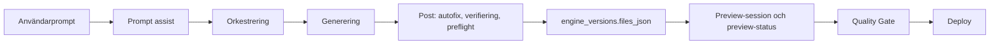
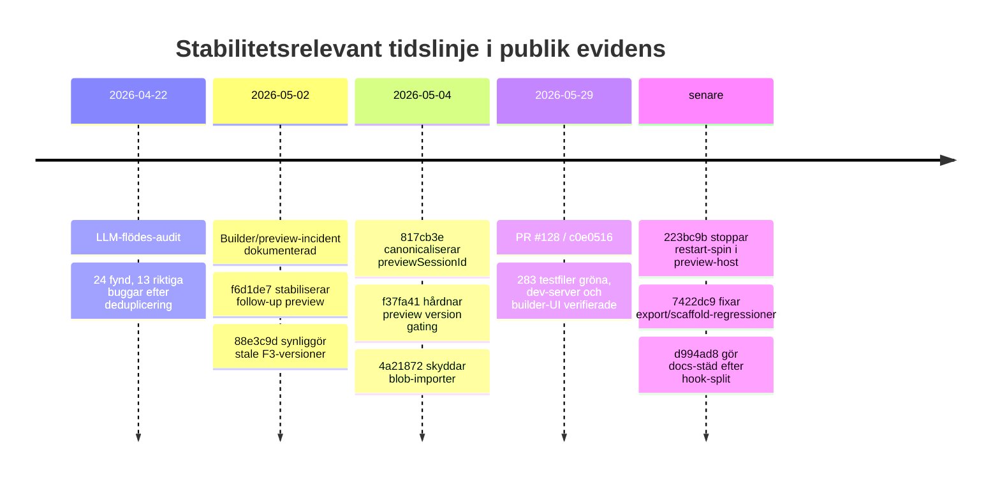
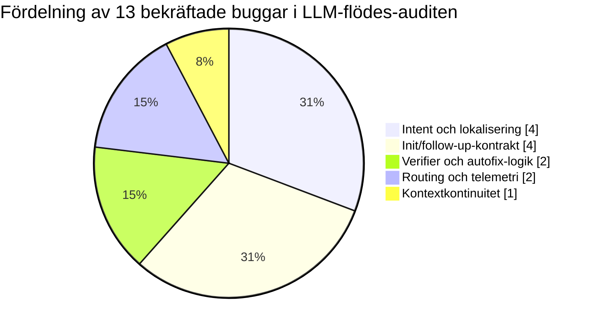

# Djupanalys av GitHub-repot Jakeminator123/sajtmaskin och varför follow-up-prompter ibland degenererar till mekaniskt, trasigt beteende

## Sammanfattning för ledningen

Repot finns publikt på GitHub som `Jakeminator123/sajtmaskin` och inte med versaliserad path `Sajtmaskin`; GitHub-sidan visar också att repot är publikt och att det inte finns några öppna GitHub Issues på den publika issues-fliken. Däremot tyder källmaterialet på att projektet i praktiken använder commit-historik, PR-trådar, interna plansidor och framför allt `BUG-SWARM-BACKLOG.md` som det primära buggsystemet. citeturn2view0turn9view0turn9view1

Den viktigaste slutsatsen är att problemen inte ser slumpmässiga ut. De allvarliga felen klustrar tydligt i ett litet antal familjer: förlorad follow-up-kontext, stale basversion eller stale preview-session, scaffold-/preflight-/dependency-kontrakt som bryts efter generation, falskt gröna verifieringssignaler, sido-API:er som ger 404 eller payload-fel, samt env/db/tooling-drift. Det betyder att “mekaniskt skit” inte främst verkar bero på att den mekaniska autofixen i sig är felkonstruerad, utan på att flera kontrakt mellan init → follow-up → finalize → preview inte hålls ihop konsekvent. citeturn25view0turn10view0turn36view0turn34view0turn39view0

Den senaste **tydligt evidensbaserade stabila** commiten är enligt min bedömning `c0e0516`, därför att PR #128 explicit anger att alla 283 testfiler och 2197 tester passerar, att `typecheck` och `lint` är gröna, att dev-servern startar och att landing page samt builder-UI fungerar. Om man vill ha den senaste **kodförändrande** commiten med lika tydlig verifiering är `1456cc0` den bättre referensen, eftersom `c0e0516` bara uppdaterar dokumentation om teststatus. Senare commits finns, men de har inte lika offentlig, heltäckande stabilitetsbevisning i tillgängligt material. citeturn21view0turn19view2turn38view0turn15view0

Min övergripande bedömning är därför att ungefär **fem till sex defektfamiljer förklarar merparten av de svåraste follow-up-felen**, medan den återstående buggsvärmen är mer heterogen och mest består av P3-städ, UI-race, copy, docs och edge cases. För att få tillbaka stabilitet bör teamet prioritera kontraktsfixar och runtime-smoke före ännu fler promptjusteringar. citeturn25view0turn9view1turn36view0

## Antaganden och metod

Analysen bygger i första hand på repots egna primärkällor: kod- och commit-sidor, PR-trådar, Actions-metadata, `AGENTS.md`, `BUG-SWARM-BACKLOG.md`, arkitekturdokumenten och incidentrapporten `RAPPORT-2026-05-02-builder-incident.md`. Det är därför en relativt stark källbas för att bedöma både faktiska fel och hur projektet själv beskriver sina återkommande failure modes. citeturn9view0turn9view1turn10view0turn27view0turn28view1

Två antaganden behövde göras. För det första: GitHubs publika Actions-sidor visar workflow-fil och run-metadata, men själva loggarna kräver inloggning, så råa CI-loggar gick inte att läsa öppet. För det andra: den publika `/commits/master/`-vyn såg ut att sluta vid början av maj, medan Actions-sidan tydligt visar senare pushes; därför triangulerade jag “senaste commits” från både commit-sidor och Actions-historiken. citeturn17view0turn15view0turn20view0

För att kalla en commit “tydligt stabil” använde jag strikta kriterier: explicit bevis i publika primärkällor för grön `typecheck`, grön `lint`, grön testsvit och åtminstone någon indikation på fungerande dev/builder/preview. Den bedömningen lutar sig mot dels `AGENTS.md` och CI-konfigurationen, dels PR #128:s verifieringsanteckningar. citeturn9view0turn17view0turn19view2turn21view0

Arkitekturellt är flödet explicit dokumenterat som användarprompt → prompt assist → orkestrering → generering → post-processing/autofix/verifiering/preflight → sparad version i Postgres → preview-session/quality gate → deploy. Det är just i övergångarna mellan dessa steg som de flesta återkommande follow-up-fel uppstår. citeturn27view0turn28view1

## Hur repot hittas och vilken commit som senast var tydligt stabil

Det säkraste sättet att hitta repot är att öppna GitHub-sidan direkt på `Jakeminator123/sajtmaskin`, eller att söka på GitHub efter `Jakeminator123 Sajtmaskin`. På repots kodyta finns länkar till `Code`, `Issues`, `Pull requests`, `Actions` och till commit-historik via “History”. I praktiken är det också användbart att gå via `Actions`, eftersom senare pushes syns där även när den publika commit-vyn ser cachead ut. citeturn2view0turn3view0turn15view0

De exakta stegen som fungerar från publik GitHub-yta är följande. Först: öppna repo-sidan. Sedan: klicka på `Code`. Därefter: klicka på `History` från en fil eller gå till commit-vyn. Om man vill fånga de senaste pusharna i praktiken: öppna `Actions`, välj `CI`, och klicka på commit-SHA eller run-rad för senaste körningar. För pull requests: öppna `Pull requests` och läs sammanfattningar, testplaner och Vercel-status i PR-trådarna. citeturn2view0turn9view0turn15view0turn18view0turn18view3

De senaste commits som gick att belägga publikt i tillgängligt material var bland annat `d994ad8` med bara docs-justeringar efter hook-splitten, `7422dc9` som fixade fyra export/scaffold-regressioner, `c0e0516` som uppdaterade `AGENTS.md` efter att hela testsviten blivit grön, `1456cc0` som lade defensiva scaffold-tester, `7b37828` som klargjorde den mekanisk–LLM–mekanisk-sandwichen i docs, samt tidigare stabiliseringsfixar som `223bc9b`, `f37fa41`, `4a21872` och `817cb3e`. citeturn15view0turn21view0turn37view0turn21view2turn38view0turn39view0turn26view2turn26view0turn12view3turn33view3

Min bedömning av **senaste tydligt stabila commit** är därför tvådelad:

| Typ av “stabil” commit | SHA | Varför den kvalar in |
|---|---|---|
| Senaste tydligt evidensbaserade stabila SHA | `c0e0516` | PR #128 säger uttryckligen att 283 testfiler och 2197 tester passerar, att `typecheck` och `lint` är gröna, att dev-servern startar och att builder-UI fungerar. citeturn19view2turn21view0 |
| Senaste kodförändrande SHA med tydlig verifiering | `1456cc0` | Commiten verifierar riktade testtillägg, `tsc --noEmit` = 0 errors och `ReadLints` = 0 errors; `c0e0516` därefter ändrar bara dokumentation. citeturn38view0turn21view0 |

Det finns senare commits än `c0e0516`, men de publika källorna visar inte lika starkt helhetsbevis för att **hela** projektet var grönt i just dessa SHAs. Därför vore det metodiskt svagare att välja t.ex. `d994ad8` eller `7422dc9` som “senaste stabila” bara för att de är senare. citeturn37view0turn21view2turn17view0

## Återkommande felmönster och rotorsaker bakom mekaniskt skit

En viktig nyans är att projektets “mekanisk → LLM → mekanisk”-sandwich **inte** i sig verkar vara definierad som en bugg. Tvärtom dokumenteras den uttryckligen som avsiktlig: först mekanisk autofix, sedan LLM-fixer, sedan mekanisk pass igen, följt av revalidering. I `finalizeAndSaveVersion` markeras dessutom att den initiala mekaniska passagen kan hoppas över när `alreadyMechanicallyFixed: true`, just för att inte göra dubbelarbete. Det tyder på att själva mekaniklagret är medvetet designat och inte huvudorsaken till haveriet. citeturn39view0turn33view0turn31view0

Det som i stället återkommer är **kontraktssplittring**. Follow-up-flödet använder fler sammanlänkade tillstånd än init-flödet: senaste sparade version, aktiv version i UI, orkestreringssnapshot, briefSummary, capability-källa, previewSessionId, previewUrl, lifecycleStage och event-bus-status. När en av dessa blir stale eller divergerar från de andra kan projektet framstå som “mekaniskt trasigt” trots att enskilda delsteg faktiskt kör som de ska. Det är exakt den typ av fragmentering som både auditrapporten från 2026-04-22 och builder-incidenten från 2026-05-02 beskriver. citeturn25view0turn10view0turn28view1turn35view4

Det tydligaste exemplet är att follow-up/F3 kan baseras på fel version. Incidentplanen beskriver att `Bygg integrationer nu` kördes mot en explicit äldre basversion och slutade i `site.empty_generation` med bara `suggestIntegration`; samma plan säger också att `engineBaseVersionId` och `activeVersionId` ägs av klienten, vilket gör UI-versionering till en central riskpunkt. Därefter behövdes fixes för stale version state, stale designversion och preview-session pinning. citeturn35view5turn35view2turn35view4turn11view0

Nästa stora rotorsak är att projektet ofta kan bli **falskt grönt**. `BUG-SWARM-BACKLOG.md` anger öppna risker kring att F2-quality gate inte fångar runtime/UI-fel, att warm `tsc`/`eslint` kan fail-open vid kall cache, att preview kan visas trots verifier-blockerad draft och att Product Postcheck ännu är default-off eller fail-open. Incidentrapporten säger samma sak i praktiken: core-pipelinen levererar versioner, men kringytor och verifieringslager gör upplevelsen ostadig. citeturn36view0turn8view1turn10view0

Ytterligare en rotorsak är att follow-up-klassning och språkstöd historiskt har varit för spröda. Den egna LLM-flödes-auditen dokumenterar flera buggar där svenska ord som `ändra`, `byt` och `rubrik` inte fångades korrekt, där ASCII-ordgränser inte fungerade med `ä/ö/å`, och där follow-up därmed föll till neutral klassning i stället för refine. Om follow-up redan i klassningen tappar användaravsikten blir det nästan oundvikligt att efterföljande mekaniska lager bara “mekaniskt” förstärker ett dåligt underlag. citeturn25view0turn32view0turn32view2

Slutligen finns en tydlig familj av problem där kod **sparas eller materialiseras** trots att dess kontrakt redan borde ha blockerat den. Wave 5-auditen pekar ut att persist för versionen kunde ske innan preflight-gating markerade blockerande fel. Incidentrapporten visar samma mönster i användarupplevelsen: version skapas, men preview blockeras av `project-sanity`, `scaffold-import-drift` eller dependency failure. Det här är en klassisk källa till “det ser ut som att något byggdes, men allt beter sig ändå trasigt”. citeturn19view1turn10view0turn31view0

## Defektkatalog och evidensbaserad klassificering

Tabellen nedan sammanfattar de viktigaste **reella** defekttyperna som framgår av primärkällorna. Den inkluderar både historiska och kvarstående fel, eftersom frågan gäller vad som hindrar follow-ups från att fungera bättre än “mekaniskt skit”.

| Defekttyp | Typiska symptom | Sannolik orsak | Påverkade moduler/filer | Allvar | Reproducerbara steg | Föreslagen fix |
|---|---|---|---|---|---|---|
| Lokaliserings- och regexfel i follow-up-klassning | Svenska prompts som “ändra rubriken” eller “byt hero-bilden” klassas som neutral eller fel intent | ASCII `\b` och saknade svenska tokens/targets i refine-logiken | `src/lib/providers/own-engine/follow-up-clarification.ts` citeturn25view0turn32view0turn32view2 | Hög | Ge svensk follow-up med `ändra`, `byt`, `rubrik`; kontrollera att intent inte blir refine | Unicode-aware regex, svensk evalsvit och kontraktstest för målord |
| Förlorad designkontinuitet i follow-up | Follow-up tappar art direction, tone eller stil trots att init såg rätt ut | Snapshot bar `styleKeywords` och `toneKeywords`, men consumers läste andra nycklar | `src/lib/gen/orchestration-snapshot.ts` citeturn25view0turn32view3turn32view4 | Hög | Kör init med tydlig stil/tone, följ upp med liten ändring, jämför om stilen bevaras | Rehydrera briefSummary till canonical nycklar och lås detta med regressionstester |
| Init/follow-up-kontrakt divergerar | Follow-up missar integrationskrav, build-plan eller heavy-capabilities; init och follow-up beter sig olika | Init och follow-up har olika promptsignalering, capability-källa eller build-spec-hopsättning | `create-chat-stream-post.ts`, `chat-message-stream-post.ts`, `build-spec.ts`, dossier/capability-lager citeturn25view0turn36view0 | Kritisk | Gör init som skapar integrationsbehov, kör follow-up/F3, se om readiness/build plan tappas | En canonical capability-källa och gemensam build-spec-assembler för init/follow-up |
| Draft sparas innan blockerande preflight syns tydligt | Version numer skapas men preview/verifiering blockeras omedelbart efteråt | Persist sker före eller oberoende av blockerande preflight/verification-signal | `src/lib/gen/stream/finalize-version/runner.ts` och finalize-flödet citeturn19view1turn31view0 | Kritisk | Tvinga scaffold- eller sanity-fel och observera att version ändå blir sparad/materialiserad | Fail closed tidigare, eller markera version som explicit `draft_blocked` före UI-materialisering |
| Tool-only F3-output maskeras som tom generation | `site.empty_generation`, inga filer, bara `suggestIntegration` | Tool calls utan kodfiler behandlas som vanlig empty output | `generation-stream.ts`, `generation-stream-tools.ts` citeturn10view0turn35view0 | Hög | Kör “Bygg integrationer nu” på edge-case/F3 och kontrollera att bara tools returneras | Egen status för `tool_only_empty_generation`, tydligt `awaitingInput=true`, separata tester |
| Stale basversion i F3/follow-up | Follow-up bygger på äldre version, UI verkar ignorera senaste designen | Klienten skickar äldre `engineBaseVersionId` eller `activeVersionId`; servern saknade tillräckligt hårda stale-skydd | `finalize-design`, builder hooks, version-state UI citeturn35view2turn35view4turn11view0 | Kritisk | Skapa version A, följ upp till B, trigga F3 från UI som fortfarande pekar på A | Server-side 409 på stale designversion plus hård UI-pin på aktiv version |
| Preview-session/version mismatch | Preview “fladdrar”, reload använder fel session, ny version ser redan “klar” ut | Stale `previewUrl`/sessionMeta; otydlig identitet mellan `sandboxId` och `previewSessionId` | `usePreviewSession.ts`, preview-status route, preview-host-kontrakt citeturn10view0turn35view4turn33view3turn26view0 | Hög | Byt version snabbt eller reloada mitt under preview-start, observera mismatch och fel recovery | All preview-logik ska nycklas på `previewSessionId + versionId`, inte på återanvänd URL |
| Dependency/preflight-kontrakt bryts efter verbatim restore | `dependency_install_failure`, `previewBlocked=true`, särskilt vid Stripe/Clerk/auth/payments | Verbatim-filer eller dossier-material återställs utan att motsvarande dependencies merges till `package.json` | Dossier/dep-completer/project-sanity/exportlager citeturn35view1turn34view0turn21view2 | Kritisk | Kör F2/F3 med auth/payments-dossiers; observera att imports finns men deps saknas | Dependency merge före project-sanity, plus tests som verifierar Stripe/Clerk-flöden |
| Runtime/UI-fel fångas inte av quality gate | Allt ser grönt ut i typecheck men UI eller runtime beter sig trasigt | Product Postcheck och runtime smoke är inte tillräckligt blockerande | Quality gate, preview verify lane, postchecks citeturn8view0turn36view0turn28view1 | Kritisk | Generera något som kompilerar men har trasig UI/runtime; notera att pipeline ändå går vidare | Gör runtime smoke, visual QA och postcheck till blockande CI- och preview-gates |
| Sidecar-API:er och preview payload-gränser fallerar | `404` på `error-log`/`collaboration-summaries`, download ZIP 404, `Invalid filesJson: total payload too large` | Rutter saknas eller är ofullständiga lokalt; preview-host har payload-begränsningar | Builder metadata/download-routes, preview-host start/update citeturn10view0 | Hög | Öppna metadata-paneler, ladda ner ZIP eller starta stor template-preview | Lägg fasta kontraktstester för routes, chunking/filtering av stora payloads och tydligare UI-fallback |
| DB-init och miljödrift | Lokal DB-init fallerar, migrations beroenden körs i fel ordning, `sslmode=disable` ignoreras | `db-init.mjs` hanterade SSL och migrations i fel ordning | `scripts/db/db-init.mjs`, migrationslager, `AGENTS.md` citeturn14view0turn13view0turn13view1 | Medel | Kör fresh DB-init på lokal Postgres utan SSL eller med tom DB | Läs `sslmode` före removal, dependency-aware migrations, särskild kallstartstest i CI |
| Preview-host restart-spin | Preview-host rebootar för snabbt efter clean exit och går i loop | Proxy retry loop restartade direkt utan cooldown | `preview-host/src/runtime.js` citeturn26view2 | Medel | Låt `npm run dev` exit:a tidigt under start; observera snabb rebootloop | Spara `stoppedAt` och införa cooldown, vilket också redan gjorts i commit `223bc9b` |
| Export/scaffold-regressioner i dependency resolution | Exportbar projektbyggnad bryts eller vakuumtestar fel | Prefix-resolution för scoped paket saknades och lazy-load/`require()` gav dålig testbarhet | `dep-completer.ts`, `build-exportable-project.ts`, `project-scaffold.test.ts` citeturn21view2turn33view1 | Medel | Kör export/scaffold-flöden med scoped Radix-paket och lockfile-lösa projekt | Prefixbaserad versionsupplösning, statiska imports, bättre assertions |

### Koncentrationsanalys

Om man tittar på den explicita LLM-flödes-auditen från 2026-04-22 rapporterades 24 distinkta fynd, och efter deduplicering bedömdes 13 som riktiga buggar och 11 som “inte buggar”. Det är ett bra underlag för att mäta **om** problemen kommer från ett fåtal familjer eller från en helt spretig flora. citeturn25view0

Min klassificering av dessa 13 bekräftade buggar ger följande fördelning: fyra hör till intent/lokalisering i follow-ups, fyra till init/follow-up-kontrakt eller build-spec-drift, två till verifier/autofix-logik, två till routing/telemetri och en till kontextkontinuitet. Med andra ord: **fem familjer förklarar 100 procent** av de bekräftade buggarna i den audit som mest direkt handlade om LLM- och follow-up-flödet. citeturn25view0

Backloggen bekräftar samma mönster, fast i större skala. `BUG-SWARM-BACKLOG.md` anger 129 rader totalt, varav 64 fortfarande öppna. De öppna P1/P2-raderna koncentreras dessutom kring just några få teman: runtime/UI-smoke, F3 readiness/build plan, dossier/capability-threading, placeholder/degraded-state, verifier fail-open, follow-up context-budget och event-bus statusprojektion. Den långa P3-svansen är däremot betydligt mer diversifierad. Därför är svaret på din fråga: **ja, ungefär sex defektfamiljer verkar förklara merparten av de viktiga follow-up-haverierna; men den totala buggsvärmen är bredare om man räknar UI-race, copy, docs och edge-fall.** citeturn9view1turn36view0

Det syns också i incidentrapporten från 2026-05-02: där är det inte “allt” som är trasigt, utan framför allt några lager som återkommer tillsammans och skapar intrycket av totalt haveri — preflight/scaffold-drift, preview-version mismatch, metadata/download-routes som 404:ar, tom tool-only output och stora preview payloads. Det stärker bilden av ett fåtal koncentrerade rotorsaker snarare än allmän kodmässig kaos. citeturn10view0

## Rekommenderad återställningsplan

Den snabbaste vägen tillbaka till stabilitet är att låsa **kontrakten mellan follow-up, finalize och preview** innan man gör fler breda promptförändringar. Jag skulle börja med tre blockerande arbetsströmmar: hård pinning av basversion i F3/follow-up, blockande runtime/UI-smoke i quality gate, och fail-closed-hantering när dependency/preflight-kontrakt bryts. Alla tre återkommer i både incidentdokumentet, backloggen och PR-fixarna. citeturn35view4turn35view1turn36view0turn10view0

CI bör därefter utökas. Den publika `ci.yml` kör i dag `npm ci`, `typecheck`, `lint`, `test:ci`, baseline dependency-kontroller och `build`, vilket är bra men inte tillräckligt för de fel som dokumenterats. Jag skulle lägga till minst fyra nya blockande jobb: ett follow-up/F3-eval-jobb, ett preview-session-kontraktstest, ett runtime/UI-smoke-jobb via preview-host verify lane, samt ett kall-cache-jobb som fångar warm `tsc`/`eslint` fail-open-beteende. Det ligger helt i linje med backloggens rekommendationer om Product Postcheck, follow-up-budget-gate och statusprojektion. citeturn17view0turn36view0turn28view1

Testmatrisen behöver också bli mer produktnära. Den bör innehålla åtminstone: svenska refine-prompter med `ä/ö/å`, init → follow-up → F3-kedjor där aktiv version byts mellan steg, tool-only `suggestIntegration`-fall, dossier/import-flöden för Stripe/Clerk/auth/payments, stora templatelaster som riskerar `filesJson`-gränsen, samt lokala DB-init-scenarier med `sslmode=disable` och fresh migrations. De här testerna är inte hypotetiska; de motsvarar redan dokumenterade incidenter och fixes. citeturn25view0turn35view0turn35view1turn10view0turn14view0turn13view0

Kodhygienen bör på samma sätt fokusera på ett fåtal regler. Det bör bara finnas **en** canonical källa för capability IDs, **en** canonical tolkning av preview-session-identitet, **en** canonical väg för brief/snapshot-kontinuitet mellan init och follow-up, och tydliga degraded states i UI som aldrig ser ut som “success”. `AGENTS.md` säger redan att kod är source of truth och att varje PR ska ha grön `typecheck`, `lint` och tester; nästa steg är att göra samma sak sant även för runtime-sanning och preview-sanning. citeturn9view0turn33view3turn32view3turn36view0

Jag skulle prioritera åtgärderna så här:

| Prioritet | Åtgärd | Varför först | Hur den verifieras |
|---|---|---|---|
| Omedelbar | Gör stale basversion till hårt serverfel och UI-pin på aktiv version | Stoppar felankrade F3/follow-ups innan de blir “mekaniskt” meningslösa | Route-test för `409 stale_design_version` + builder-E2E med versionsbyte citeturn35view4turn11view0 |
| Omedelbar | Gör runtime/UI-smoke och Product Postcheck blockande | Stoppar falskt gröna builds som kompilerar men beter sig trasigt | Preview verify-lane + visual QA + block i CI citeturn36view0turn8view0turn28view1 |
| Omedelbar | Fail closed på dependency/preflight-kontrakt | Stoppar “version skapad men i praktiken död” | Tester för Stripe/Clerk/import/deps före project-sanity citeturn35view1turn10view0turn21view2 |
| Kort sikt | Nyckla all preview-logik på `previewSessionId + versionId` | Eliminerar stale URL/session-reuse och fladdrig status | `preview-status`- och hooktester, plus reload-scenario-E2E citeturn35view4turn33view3turn26view0 |
| Kort sikt | Lyft tool-only F3-output till förstklassig status | Gör “tom generation” begriplig och reparerbar | `generation-stream-tools.test.ts` och UI-SSE-kontraktstester citeturn35view0 |
| Kort sikt | Lägg hård regression-gate på follow-up-kontext och svensk lokalisering | Skyddar det som historiskt brutit follow-ups först | `eval:followup` + svenskspråkig promptsvit citeturn36view0turn25view0turn32view0 |
| Medellång sikt | Konsolidera canonical capability/source-of-truth-lager | Minskar init/follow-up-drift på systemnivå | Kontrakttester mellan snapshot, build-spec, dossier-selektion och UI-status citeturn36view0turn25view0 |
| Medellång sikt | Rensa docs/AGENTS/backlog så de inte normaliserar gamla fel | Förhindrar att agenter “ignorerar” regressionssignaler | PR-regel: om test noteras som känd fail måste den ha färsk referens eller tas bort citeturn19view2turn21view0 |

Den sista praktiska rekommendationen gäller observability. Run-metadata, generation-logg, preview-status och event-bus-status måste kunna korreleras utan tvetydighet. Projektet har redan jobbat i den riktningen, men både backloggen och incidentplanen visar att statusprojektion, GPT-dashboard-rader och duplicate-create-spår ännu inte alltid är entydiga. För follow-up-problem är det avgörande: utan entydig korrelation mellan användarprompt, vald basversion, genererad version och preview-session ser allt ut som “mekaniskt skit” även när bara ett enda lager egentligen är fel. citeturn35view3turn36view0turn10view0