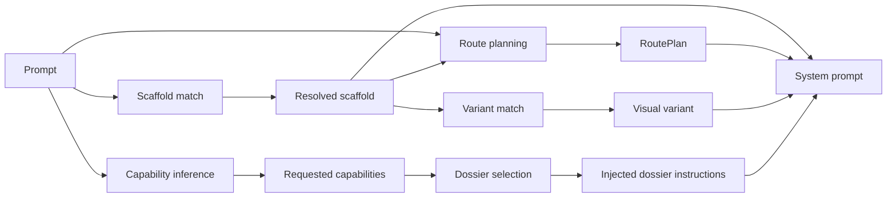
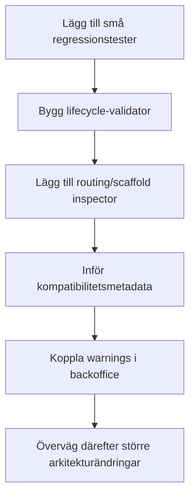

# Jakeminator123/sajtmaskin på master

## Sammanfattning för ledning

Den enda aktiverade connectorn i denna research-session är **GitHub**. Repot `Jakeminator123/sajtmaskin` har `master` som default branch enligt GitHub-connectorn, och den senast observerade committen i commit-sökningen var `c13b515` den 2026-05-01. 

Min huvudslutsats är att repot just nu har **flera parallella signalmotorer** i stället för en enda central styrning:  
- **scaffold-val** använder både **keywords/regex** och **embeddings** i samma beslutskedja,  
- **capability/dossier-val** är i huvudsak **deterministisk keyword/regex-baserad** och uttryckligen **utan embeddings**,  
- **route-planering** är **deterministisk regex/phrase-baserad**,  
- **variant-val** använder **keywords först** och **embeddings när fil + API-nyckel finns**,  
- **template-sökning** använder **embeddings med keyword-fallback**. fileciteturn6file0L1-L1 fileciteturn24file0L1-L1 fileciteturn26file0L1-L1 fileciteturn44file0L1-L1 fileciteturn30file0L1-L1 fileciteturn18file0L1-L1 fileciteturn39file0L1-L1

Det viktigaste arkitekturmässigt är att **dossiers inte är samma sak som capabilities**. Capabilities är abstrakta trigger-ID:n som `ai-chat`, `payments`, `visual-3d` och mappar vidare till konkreta dossiers som `openai-chat`, `stripe-checkout` eller `three-fiber-canvas`. Den mappningen finns i `data/dossiers/_index/capability-map.json`, medan runtime-valet i `src/lib/gen/dossiers/select.ts` är deterministiskt och explicit säger: **“No embeddings. No fuzzy match.”** fileciteturn45file0L1-L1 fileciteturn44file0L1-L1

Det finns också en viktig **driftrisk mellan backoffice och runtime**. Backoffice kan redan idag skriva till flera centrala konfigurationsytor — bland annat scaffold-manifest, scaffold-variant-JSON och AI-model manifest — men backoffice är byggt i Python/Streamlit medan runtimevalidering i TypeScript ofta använder Zod eller handskrivna TS-kontrakt. Det betyder att ni **inte delar en gemensam strikt validator i samma språk** mellan UI-redigering och runtime-läsning. Det är den högsta ROI-fixen i min bedömning. fileciteturn22file0L1-L1 fileciteturn20file0L1-L1 fileciteturn23file0L1-L1

Min prioritering är därför:
1. **lägga till regressionsskydd för de viktigaste promptfallen**,  
2. **bygga en scaffold/dossier/variant-validator som kör före sparning eller CI**,  
3. **göra en routing/scaffold-inspector i backoffice**,  
4. **införa explicit kompatibilitetsmetadata mellan dossier ↔ scaffold ↔ route**.  
Det går att göra utan tung refaktor och utan nya beroenden om man håller sig till befintlig kodstil. fileciteturn20file0L1-L1 fileciteturn44file0L1-L1 fileciteturn30file0L1-L1

## Repoets nuvarande signalarkitektur

Scaffold-registret är statiskt och är den centrala runtime-källan för vilka scaffolds som överhuvudtaget kan väljas. `src/lib/gen/scaffolds/registry.ts` importerar nio manifests (`base-nextjs`, `app-shell`, `landing-page`, `saas-landing`, `portfolio`, `blog`, `dashboard`, `auth-pages`, `ecommerce`) och exponerar `getScaffoldById`, `getAllScaffolds` och `getScaffoldIds`. Typfilen `src/lib/gen/scaffolds/types.ts` definierar även dessa nio scaffold-ID:n och kontraktet för `ScaffoldManifest`. fileciteturn14file0L1-L1 fileciteturn15file0L1-L1

Det finns däremot ingen tydligt verifierad runtime-egenskap som bokstavligen heter **`baseScaffold`** i de filer jag hann inspektera. I praktiken verkar “base scaffold” vara ett **konceptuellt namn** för det scaffold som väljs av `matchScaffoldAuto()` och sedan skickas vidare till route-planering, variant-val och prompt-assembly. Jag skulle därför behandla `baseScaffold` som **analytisk benämning**, inte som en bekräftad fältnamnstruktur i koden. fileciteturn6file0L1-L1 fileciteturn14file0L1-L1

Den centrala relationen ser ut så här:



Det här diagrammet är direkt härlett från att scaffold-valet sker i `src/lib/gen/scaffolds/matcher.ts`, capabilities i `src/lib/gen/capability-inference.ts`, follow-up capabilities i `src/lib/builder/follow-up-capability-detection.ts`, route-planen i `src/lib/gen/route-plan/route-plan-builder.ts`, variant-valet i `src/lib/gen/scaffold-variants/matcher.ts` och dossier-valet i `src/lib/gen/dossiers/select.ts`. fileciteturn6file0L1-L1 fileciteturn24file0L1-L1 fileciteturn26file0L1-L1 fileciteturn30file0L1-L1 fileciteturn18file0L1-L1 fileciteturn44file0L1-L1

Det mest praktiska svaret på din tidigare fråga om “landing page + 3 sidor” är att route-planeraren **redan har logik för detta**. `buildRoutePlan()` räknar explicit sidantal från prompten, applicerar scaffold defaults först, och trimmar sedan bort överflödiga routes för att försöka respektera användarens uttryckliga sid-cap. Det är alltså inte helt “ologiskt” idag; det finns redan en medveten mekanism för att undvika att scaffold-defaults spränger uttryckliga page-count-krav. fileciteturn30file0L1-L1

## Ordmatchning, vetoer och embeddings

### Best-effort-räkning

Min best-effort-bedömning av **aktiva runtime-delar** är:

| Typ av signalsystem | Best-effort antal | Konfidens | Stödjande filer |
|---|---:|---|---|
| Keyword/regex/phrase matching i kärn-routing/urval | 9–12 moduler | Medel–hög | `scaffolds/matcher.ts`, `capability-inference.ts`, `follow-up-capability-vocabulary.ts`, `follow-up-capability-detection.ts`, `build-spec/prompt-patterns.ts`, `build-spec/policy-inference.ts`, `route-plan/route-patterns.ts`, `route-plan/route-matchers.ts`, `scaffold-variants/matcher.ts`, samt indirekt `route-plan-builder.ts` |
| Embeddings i aktiva runtimebeslut | 3 huvudsakliga subsystem, 5–8 filer totalt | Hög | `scaffolds/scaffold-search.ts`, `scaffolds/scaffold-embeddings-core.ts`, `scaffold-variants/matcher.ts`, `templates/template-search.ts`, `templates/template-embeddings-core.ts` |
| Dossier-val med embeddings | 0 | Hög | `gen/dossiers/select.ts` säger uttryckligen “No embeddings” |

Källstödet för denna uppdelning är starkt eftersom varje subsystem uttryckligen beskriver sin strategi i filkommentarer och funktioner. fileciteturn6file0L1-L1 fileciteturn24file0L1-L1 fileciteturn25file0L1-L1 fileciteturn26file0L1-L1 fileciteturn31file0L1-L1 fileciteturn32file0L1-L1 fileciteturn27file0L1-L1 fileciteturn28file0L1-L1 fileciteturn18file0L1-L1 fileciteturn33file0L1-L1 fileciteturn34file0L1-L1 fileciteturn39file0L1-L1 fileciteturn40file0L1-L1 fileciteturn44file0L1-L1

### Filer som gör exact/regex/keyword/phrase matching

| Fil | Typ | Viktiga funktioner eller mönster | Kort syfte |
|---|---|---|---|
| `src/lib/gen/scaffolds/matcher.ts` fileciteturn6file0L1-L1 | keyword + regex + embeddings-policy | `countKeywordMatches`, `buildKeywordScores`, `matchScaffold`, `matchScaffoldAuto`, `GAME_SYNC_PATTERN`, `GAME_SYNC_VETO_PATTERN` | Väljer scaffold från prompt och kan låta embeddings vinna över keyword-resultat |
| `src/lib/gen/capability-inference.ts` fileciteturn24file0L1-L1 | regex rules | `RULES`, `inferCapabilities`, `buildCapabilityHints` | Init-klassning till `needs3D`, `needsGame`, `needsPayments`, `needsForms` m.fl. |
| `src/lib/builder/follow-up-capability-vocabulary.ts` fileciteturn25file0L1-L1 | regex vocabulary + vetoes | `CAPABILITY_VOCABULARY`, `patterns`, `vetoes` | Högprecisionstriggers för dossier-capabilities på follow-ups |
| `src/lib/builder/follow-up-capability-detection.ts` fileciteturn26file0L1-L1 | regex orchestration | `detectFollowUpCapabilities`, `ADD_VERB_PATTERNS`, `REFINE_OR_MOVE_VERB_PATTERNS`, `MODIFY_REFERENCE_MARKERS`, `BEYOND_DOSSIER_MARKERS`, `SPECIFIC_BEHAVIOR_MARKERS` | Avgör om follow-up betyder “lägg till capability”, “modifiera befintlig capability” eller inget alls |
| `src/lib/gen/build-spec/prompt-patterns.ts` fileciteturn31file0L1-L1 | phrase/word banks | `REDESIGN_PATTERNS`, `COPY_PATTERNS`, `PAGE_ADDITION_PATTERNS`, `SECTION_INSTEAD_OF_PAGE_PATTERNS`, `isInPageSectionRequest` | Gemensamma pattern-banker för build-spec och route-realization |
| `src/lib/gen/build-spec/policy-inference.ts` fileciteturn32file0L1-L1 | phrase/keyword guards | `inferChangeScope`, `inferQualityTarget`, `deriveFollowUpContextPolicy`, `matchQualityPremiumKeyword` | Avgör redesign/copy/local-layout/page-addition m.m. |
| `src/lib/gen/route-plan/route-patterns.ts` fileciteturn27file0L1-L1 | route regex banks | `WEBSITE_ROUTE_PATTERNS`, `APP_ROUTE_PATTERNS` | Mappning från promptord till `/about`, `/pricing`, `/contact`, `/settings` osv |
| `src/lib/gen/route-plan/route-matchers.ts` fileciteturn28file0L1-L1 | regex generation | `routePatternToRegex`, `findMissingRequiredRoutes` | Matchar planerade och faktiska routes, inkl. dynamiska segment |
| `src/lib/gen/scaffold-variants/matcher.ts` fileciteturn18file0L1-L1 | keyword + regex + embedding floor | `scoreVariant`, keyword-boundary `RegExp`, färgmode-regler | Rankar varianter via keywords och kan sedan använda embeddings |
| `src/lib/templates/template-search.ts` fileciteturn39file0L1-L1 | keyword fallback + regex hints | `QUERY_HINTS`, `keywordSimilarity`, `fallbackKeywordSearch` | Template-sökning som faller tillbaka till deterministisk keywordmatchning |

### Filer som använder embeddings

| Fil | Funktioner | Modell / artefakt | Syfte |
|---|---|---|---|
| `src/lib/gen/scaffolds/scaffold-search.ts` fileciteturn33file0L1-L1 | `searchScaffolds`, `searchScaffoldsWithDiagnostics` | `text-embedding-3-small`, `scaffold-embeddings.json` | Semantisk scaffold-sökning och diagnostics |
| `src/lib/gen/scaffolds/scaffold-embeddings-core.ts` fileciteturn34file0L1-L1 | `getScaffoldEmbeddingInputs`, `generateScaffoldEmbeddings` | `text-embedding-3-small`, 1536 dim | Bygger scaffold-embeddingtext och genererar embedfil |
| `src/lib/gen/scaffold-variants/matcher.ts` fileciteturn18file0L1-L1 | `pickScaffoldVariantAsync`, `loadVariantEmbeddings` | `config/scaffold-variants/_index/variant-embeddings.json` | Variantmatchning med embedding-cosine och keyword fallback |
| `scripts/scaffolds/generate-variant-embeddings.ts` fileciteturn38file0L1-L1 | `buildEmbeddingText`, `main` | `text-embedding-3-small`, 1536 dim | Genererar embeddings för alla variants |
| `src/lib/templates/template-search.ts` fileciteturn39file0L1-L1 | `searchTemplates` | `text-embedding-3-small`, `template-embeddings.json` | Template retrieval med embedding + fallback |
| `src/lib/templates/template-embeddings-core.ts` fileciteturn40file0L1-L1 | `generateTemplateEmbeddings` | `text-embedding-3-small`, 1536 dim | Genererar template embeddings |
| `src/lib/gen/scaffolds/scaffold-embeddings.json` fileciteturn35file0L1-L1 | datafil | `_meta.model = text-embedding-3-small`, `count = 9` | Precomputade scaffold embeddings |
| `config/scaffold-variants/_index/variant-embeddings.json` fileciteturn37file0L1-L1 | datafil | innehåll ej läsbart i denna pass | Existerar och används av variantmatchern |
| `src/lib/gen/dossiers/select.ts` fileciteturn44file0L1-L1 | explicit negativt fall | — | Viktigt: dossier-val använder **inte** embeddings |

### Där vetoer faktiskt används

Det finns tre tydliga “veto-familjer” som påverkar routing eller urval:

| Plats | Mönster | Effekt |
|---|---|---|
| `src/lib/gen/scaffolds/matcher.ts` fileciteturn6file0L1-L1 | `GAME_SYNC_VETO_PATTERN` med uttryck som `tv-spel butik`, `game store`, `gaming news`, `esport-site` | Stoppar game-signal från att skicka retail/news-portaler till game-liknande scaffold |
| `src/lib/builder/follow-up-capability-vocabulary.ts` fileciteturn25file0L1-L1 | `vetoes` på t.ex. `parallax-scroll` och `interactive-game` | Undertrycker capability när prompten tydligt betyder något annat |
| `src/lib/gen/capability-inference.ts` fileciteturn24file0L1-L1 | hospitality-veto mot ecommerce | Hindrar att restaurang/hotell/salong felaktigt blir `needsEcommerce` |
| `src/lib/gen/build-spec/prompt-patterns.ts` + `policy-inference.ts` fileciteturn31file0L1-L1 fileciteturn32file0L1-L1 | `isInPageSectionRequest`, `COPY_GUARD_PATTERNS`, imagery escape patterns | Hindrar att sektioner blir routes eller att copy-only requests blir redesigns |

Den praktiska innebörden av din formulering “Även om ett ord matchar, stoppa träffen om texten också innehåller något som tyder på fel betydelse” är alltså exakt detta: systemet matchar först ett ord eller en fras, men **låter sedan ett veto slå ut matchen** om prompten innehåller en mer specifik signal för en annan domän. Det är smartare än ren keywordmatchning, men det är fortfarande **handkuraterad logik** och därför regressionskänslig. fileciteturn25file0L1-L1 fileciteturn26file0L1-L1 fileciteturn6file0L1-L1

## Scheman, backoffice och scaffold-livscykel

### Zod-scheman och validering

Jag identifierade följande tydliga Zod-ankare via kodsökning:  
- `src/lib/ai-models/load-manifest.ts`  
- `src/lib/env.ts`  
- `src/lib/integrations/integration-manifest.ts`  
- `src/lib/projects/preferences-schema.ts`  
- `src/lib/validations/chatSchemas.ts`  
- `src/lib/gen/agent-tools.ts`  
samt några API-rutter där `z.object(...)` används. Dessa verkar vara de mest relevanta för runtime-konfiguration, AI-manifest och API-input. fileciteturn13file2L1-L1 fileciteturn13file8L1-L1 fileciteturn13file4L1-L1 fileciteturn13file6L1-L1 fileciteturn13file1L1-L1 fileciteturn13file0L1-L1

Det som är viktigt för dig är inte bara **att** Zod finns, utan **var den saknas**. Backoffice är Python/Streamlit och använder `read_json`, `write_json`, `write_text` och egenskrivna parse/helpers i `backoffice/shared.py` och `backoffice/pages/scaffold_lifecycle.py`, inte samma TypeScript/Zod-kontrakt som runtime. Det betyder att backoffice kan skriva filer som runtime sedan läser med andra regler. Det är en klassisk källa till “det gick att spara i admin men kraschar i appen”. fileciteturn22file0L1-L1 fileciteturn20file0L1-L1

### Vad som faktiskt verkar redigerbart i backoffice

| Konfigyta | Fil(er) | Redigerbar via backoffice | Bedömning |
|---|---|---|---|
| AI-modellmanifest, phase routing, budgets, timeouts, provider contracts | `config/ai_models/manifest.json` via `backoffice/pages/ai_models.py` | Ja | Hög säkerhet |
| Scaffold-manifest och scaffold-filer | `src/lib/gen/scaffolds/...` via `backoffice/pages/scaffold_lifecycle.py` | Ja | Hög säkerhet |
| Scaffold-variant-JSON | `config/scaffold-variants/...` via `backoffice/pages/scaffold_lifecycle.py` | Ja | Hög säkerhet |
| Scaffold research/embeddings paths visas i backoffice-context | `scaffold-research.generated.json`, `scaffold-embeddings.json` i `BackofficeContext` | Delvis / minst läsning, viss tooling-koppling | Medel |
| Dossier capability-map | `data/dossiers/_index/capability-map.json` | Ja, åtminstone rebuild/index | Hög säkerhet |
| Full dossier-manifestredigering | `backoffice/pages/dossiers.py` finns, men ej fullt inspekterad här | Ospecificerat | Medel–låg |
| Env-variabler | backoffice har `env_local` och env-script i context, men ej full edit-yta verifierad i denna pass | Ospecificerat | Medel–låg |

Stödet för “ja” här kommer av att `BackofficeContext` uttryckligen binder dessa paths, att `ai_models.py` gör `write_json/write_text` över AI-manifestet, och att `scaffold_lifecycle.py` både läser, genererar och skriver scaffold/variant-filer. Capability-map-filen säger dessutom i sin egen kommentar att den kan byggas om från `backoffice/pages/dossiers.py`. fileciteturn22file0L1-L1 fileciteturn23file0L1-L1 fileciteturn20file0L1-L1 fileciteturn45file0L1-L1

### En viktig drift mellan backoffice och runtime

`ScaffoldVariant`-typen i runtime beskriver att gamla generiska guidance-fält som `styleRules`, `sectionInventory`, `avoidPatterns` och `worldClassRubric` togs bort 2026-04-17, medan `backoffice/pages/scaffold_lifecycle.py` fortfarande har formulär- och payloadlogik för just dessa fält. Det innebär att backoffice-ytan verkar kunna fortsätta skriva legacy-fält som runtime-typen inte längre presenterar som förstaklassiga. Det är en tydlig kandidat för “strict schema drift”. fileciteturn17file0L1-L1 fileciteturn20file0L1-L1

### Hur scaffold variants, routePlan och capabilities samverkar

- **Scaffold** bestäms först av `matchScaffoldAuto()` genom en kombination av keyword scores, brief-boosts, capabilities och embeddings. fileciteturn6file0L1-L1  
- **RoutePlan** byggs sedan av `buildRoutePlan()` utifrån prompt, buildIntent, brief och `resolvedScaffold`, och försöker både lägga till scaffold-defaults och respektera uttryckliga sidantal. fileciteturn30file0L1-L1  
- **Capabilities** på init-prompt ligger i `inferCapabilities()`, medan follow-up-capabilities går via dossier-vokabulären och tiering i `detectFollowUpCapabilities()`. fileciteturn24file0L1-L1 fileciteturn26file0L1-L1  
- **Dossiers** väljs därefter deterministiskt från capabilities och injecteras som instruktioner/kodpaket; de ändrar alltså funktionalitet men ersätter inte det valda scaffoldet. fileciteturn44file0L1-L1 fileciteturn45file0L1-L1  
- **Variant** väljs inom scaffoldet — deterministiskt via keywordscore eller semantiskt via embeddings — och kan låsas mellan follow-ups för att undvika stilflippar. fileciteturn18file0L1-L1

Det betyder att ett “AI-chat capability + ny sida i app-shell” **inte nödvändigtvis blir stökigt**, men det saknas i det inspekterade materialet en explicit, central **kompatibilitetsmatris** som säger vilka dossiers som är säkra på vilka scaffolds eller på vilken route-typ. Det är därför jag prioriterar kompatibilitetsmetadata som nästa steg. `selectDossiersForRequest()` väljer på capability alene och nämner varken scaffold eller route-kompatibilitet. fileciteturn44file0L1-L1

## Tester, regressioner och luckor

### Vad som tydligt finns

Följande testsviter eller testfiler är tydligt synliga i repo-indexet och/eller refereras som regressionskällor i kodkommentarer:

| Test / suite | Vad den verkar täcka |
|---|---|
| `src/lib/builder/follow-up-capability-detection.test.ts` fileciteturn7file5L1-L1 | follow-up capability detection |
| `src/lib/gen/dossiers/select.test.ts` fileciteturn43file29L1-L1 | deterministic dossier selection |
| `src/lib/gen/dossiers/system-prompt-integration.test.ts` fileciteturn43file31L1-L1 | dossier injection i systemprompt |
| `src/lib/gen/orchestration-integration.test.ts` fileciteturn29file5L1-L1 | orchestrationkedjan |
| `src/lib/own-engine/generate-site-from-prompt.test.ts` fileciteturn41file9L1-L1 | end-to-end-ish site generation |
| `src/lib/gen/autofix/dep-completer.test.ts` fileciteturn13file39L1-L1 | autofix/dependency completion |
| `follow-up-clarification.test.ts` refereras från kommentarer i capability/scaffold-filer | regression matrix för signaler kring unlock/rematch |

Repot visar alltså redan en tydlig regressionstänkande kultur kring de mest riskabla heuristiska delarna: follow-up-capabilities, dossier selection, orchestration och autofix. Det är bra. fileciteturn24file0L1-L1 fileciteturn26file0L1-L1

### Vad jag inte kunde verifiera fullt

Jag hann **inte** verifiera alla GitHub Actions-workflows eller hela `package.json`-scripts i detalj i denna pass. Det jag med hög säkerhet kan säga är att `npm run typecheck` och `npx vitest run` används återkommande som verifiering, eftersom de nämns i repots egna flöden och i de commit-verifieringar som GitHub-sökningen visade. Exakta CI-jobb, workflow-namn och matrissteg bör därför ses som **delvis ospecificerade** i denna rapport. 

### De tydligaste gapen

De största hög-risk-luckorna jag ser är inte “fler tester generellt”, utan **saknade tester precis där logiken är skörast**:

1. **Game-veto-fall** som “tv-spel butik”, “gaming news blog”, “esport-site”. Här finns kod, men jag ser inte tillräckligt explicit coverage redovisad i det material jag hann läsa. fileciteturn6file0L1-L1 fileciteturn25file0L1-L1  
2. **Page-addition vs section-addition** på två språk, t.ex. “lägg till en pricing section” kontra “lägg till en pricing page”. Detta är ett klassiskt regressionsområde eftersom `PAGE_ADDITION_PATTERNS` och `isInPageSectionRequest()` är separata ytor. fileciteturn31file0L1-L1 fileciteturn32file0L1-L1  
3. **Scaffold deletion / registry drift / embedding drift**. `scaffold-search.ts` har explicit diagnostik för registry mismatch, vilket i sig visar att detta är ett reellt scenario. Jag ser däremot inte ett tydligt lifecycle-test som bevisar “delete scaffold → update registry/types/embeddings/variants atomiskt”. fileciteturn33file0L1-L1 fileciteturn14file0L1-L1 fileciteturn16file0L1-L1  
4. **Dossier ↔ scaffold-kompatibilitet**. Dossier selection är capability-driven men inte scaffold-aware i det inspekterade runtimevalet. Det är en logiklucka mer än en testlucka, men borde få regressionstest när kompatibilitetsmetadata väl finns. fileciteturn44file0L1-L1  
5. **Backoffice/runtime schema drift** mellan Python-editorn och TS-runtime. Detta syns redan i variantfältens legacy-ytor. Det borde få validator-test och gärna golden tests. fileciteturn17file0L1-L1 fileciteturn20file0L1-L1

### Tio små regressionstestfall att lägga till

| Prompt / input | Funktion | Exakta assertioner att lägga till |
|---|---|---|
| `Bygg ett Pac-Man spel` | `matchScaffold()` | `expect(matchScaffold(prompt, "website")?.id).toBe("base-nextjs")` |
| `Bygg en app med ett Pac-Man spel` | `matchScaffold()` | `expect(matchScaffold(prompt, "app")?.id).toBe("app-shell")` |
| `Sajt för en tv-spel butik` | `matchScaffold()` | `expect(matchScaffold(prompt, "website")?.id).not.toBe("base-nextjs")` |
| `Move the pricing section above FAQ` | `detectFollowUpCapabilities()` | `expect(result.capabilityIds).toEqual([])` och `expect(result.referencesExistingCapability).toBe(false)` |
| `lägg till en ai-chatt` | `detectFollowUpCapabilities()` | `expect(result.capabilityIds).toContain("ai-chat")` och `expect(result.tierByCapability["ai-chat"]).toBe("generic")` |
| `lägg till en faq-sektion med frågor och svar längst ner på sidan` | `detectFollowUpCapabilities()` | `expect(result.capabilityIds).toContain("faq-section")` och `expect(result.tierByCapability["faq-section"]).toBe("specific")` |
| `lägg till physics-simulation av studsande tomater` | `detectFollowUpCapabilities()` | `expect(result.capabilityIds).toContain("visual-3d")` och `expect(result.tierByCapability["visual-3d"]).toBe("beyond-dossier")` |
| `add a pricing section` | `inferChangeScope()` | `expect(scope).toBe("local-layout")` |
| `add a pricing page` | `inferChangeScope()` | `expect(scope).toBe("page-addition")` |
| prompt med explicit 2 sidor + scaffold med defaults | `buildRoutePlan()` | `expect(plan.routes.length).toBeLessThanOrEqual(2)` och `expect(plan.routes.some(r => r.path === "/")).toBe(true)` |

De här är små, billiga och träffar exakt de ställen där repot har mest handkuraterad språklogik. De ger mycket hög ROI. fileciteturn6file0L1-L1 fileciteturn26file0L1-L1 fileciteturn31file0L1-L1 fileciteturn32file0L1-L1 fileciteturn30file0L1-L1

## Prioriterad åtgärdslista

### Hög ROI

| Åtgärd | Varför | Cursor-agent prompt |
|---|---|---|
| Lägg till regressionspaket för signalmotorerna | Billigast sättet att minska falska matchningar, scaffold-flippar och page/section-regressioner | **Goal:** Lägg till små, snabba regressionstester för scaffold-matchning, follow-up capability detection och route-plan edge cases. **Constraints:** Ingen tung refaktor. Inga nya dependencies utan godkännande. Behåll nuvarande API:er. **Commands:** `git fetch origin` ; `git log origin/master -5 --oneline --decorate` ; `npm run typecheck` ; `npx vitest run src/lib/builder/follow-up-capability-detection.test.ts src/lib/gen/orchestration-integration.test.ts` **Deliverables:** 1) nya testfall för game-veto, page-vs-section, explicit page-count cap och capability-modify/add; 2) kort CHANGELOG i PR-beskrivning; 3) inga runtime-beteendeförändringar utöver testskydd. **Tests to add:** Pac-Man website/app, tv-spel-butik veto, pricing section vs pricing page, ai-chat generic, physics-simulation => beyond-dossier. |
| Bygg en scaffold-lifecycle-validator | Backoffice kan skriva filer som riskerar schema-/registry-/embedding-drift | **Goal:** Inför en validator som kontrollerar scaffold registry, scaffold IDs, variant JSON, legacy-fält, embeddings-filer och referenser innan save/CI godkänns. **Constraints:** Ingen tung refaktor. Inga nya dependencies utan godkännande. Använd befintliga filer och Node/Python där det är enklast. **Commands:** `git fetch origin` ; `git log origin/master -5 --oneline --decorate` ; `npm run typecheck` ; `npx vitest run src/lib/gen/dossiers/select.test.ts src/lib/gen/orchestration-integration.test.ts` **Deliverables:** 1) validator-CLI eller serverfunktion; 2) tydliga felmeddelanden för orphan scaffold IDs, orphan variant IDs, stale embeddings och legacy variantfält; 3) ett litet testpaket eller snapshottests. **Tests to add:** fail on orphan scaffold embedding, fail on unknown variant scaffoldId, warn on removed fields like styleRules/sectionInventory/avoidPatterns/worldClassRubric. |
| Lägg till routing/scaffold inspector i backoffice | Gör systemet begripligt och minskar “varför valdes detta?”-friktion | **Goal:** Skapa en inspectorvy i backoffice som för en given prompt visar scaffold keyword scores, embedding-toppar, veto-träffar, route-plan, explicit page-count och valda capabilities/dossiers. **Constraints:** Ingen tung refaktor. Återanvänd existerande funktioner. Inga nya deps utan godkännande. **Commands:** `git fetch origin` ; `git log origin/master -5 --oneline --decorate` ; `npm run typecheck` ; `npx vitest run src/lib/gen/orchestration-integration.test.ts src/lib/builder/follow-up-capability-detection.test.ts` **Deliverables:** 1) ny Streamlit-sida eller utökad befintlig sida; 2) debugpanel med “matched patterns / vetoes / embedding diagnostics”; 3) export av JSON-debugpaket. **Tests to add:** unit test för debug serializer och en golden-snapshot för en prompt som triggar game-veto + explicit 3-page cap. |
| Inför kompatibilitetsmetadata för dossiers | Det saknas synlig, central guard mellan capability → dossier och scaffold/route-kompatibilitet | **Goal:** Lägg till kompatibilitetsmetadata för dossiers/capabilities och använd det för warnings (inte hårda blockers först) i selection/backoffice. **Constraints:** Ingen tung refaktor. Börja med warnings. Inga nya dependencies utan godkännande. **Commands:** `git fetch origin` ; `git log origin/master -5 --oneline --decorate` ; `npm run typecheck` ; `npx vitest run src/lib/gen/dossiers/select.test.ts src/lib/gen/dossiers/system-prompt-integration.test.ts` **Deliverables:** 1) metadatafält för compatibleScaffolds / routeRequirements / conflictsWithCapabilities; 2) warnings i backoffice inspector; 3) tests för minst ett inkompatibelt case. **Tests to add:** ai-chat allowed on app-shell + landing-page, stripe-checkout warns without pricing/cart/checkout context, three-fiber-physics warns when no visual-3d or game context finns. |

### Medel ROI

- Flytta “strict schema”-tänk från enbart TS-runtime till en **delad validator pipeline** som backoffice kan anropa före save.  
- Lägg till ett “regenerate on change”-flöde för scaffold/variant embeddings när scaffold eller variant ändras.  
- Lägg till golden snapshots för route-plan reasoning.  

### Låg ROI

- Försök inte byta ut allt mot en tunn LLM i första steget. Det skulle öka kostnad och sänka reproducerbarhet snabbare än det löser dagens operativa problem.  
- Försök inte centralisera hela språkförståelsen i embeddings direkt. Repoets nuvarande veto-logik fångar flera viktiga domänmissar som ren embedding-ranking sannolikt skulle göra sämre utan extra guardrails. fileciteturn25file0L1-L1 fileciteturn44file0L1-L1

Här är en lämplig implementeringsordning:



Denna ordning ger snabb riskreduktion först, sedan bättre operatörsöverblick, och först därefter djupare strukturförändringar. fileciteturn20file0L1-L1 fileciteturn22file0L1-L1 fileciteturn44file0L1-L1

## Risker, mitigeringar och öppna frågor

### Viktigaste riskerna just nu

Den största praktiska risken är **oavsiktlig scaffold-drift eller deletion**. Scaffold-registret är statiskt importerat, scaffold-search har separat embeddingfil och variant-registret läser JSON från en annan struktur. Om man tar bort eller döper om en scaffold utan att samtidigt uppdatera registry, typer, embeddings och variants får man orphan state eller mismatch-varningar. Koden i `scaffold-search.ts` visar att detta inte är hypotetiskt; den har explicit diagnostik för `registry_mismatch`. fileciteturn14file0L1-L1 fileciteturn16file0L1-L1 fileciteturn33file0L1-L1

Nästa stora risk är **feltriggade capabilities eller dossiers**. Dossier-valet är mycket deterministiskt, vilket är bra för kontroll, men det betyder också att ett fel i vocabulary eller detektion får direkt operativ effekt eftersom systemet inte gör någon senare “semantic sanity check”. `selectDossiersForRequest()` lovar uttryckligen “No embeddings. No fuzzy match.” fileciteturn25file0L1-L1 fileciteturn26file0L1-L1 fileciteturn44file0L1-L1

Tredje risken är **embedding overrides som blir för starka eller för svaga**. Scaffoldmatchern innehåller redan skydd som `canUseEmbeddingOverride()` och min-score-gränser, men dessa guards är handbyggda och måste testas mot verkliga promptfamiljer. Det är särskilt sant för auth/ecommerce/app-shell där fel scaffold blir dyrt i användarupplevelse. fileciteturn6file0L1-L1

Fjärde risken är **backoffice/runtime-schema-drift**, särskilt eftersom backoffice fortsatt exponerar legacy-fält som inte längre framstår som förstaklassiga i runtime-typen för scaffold variants. Det här är exakt den sorts problem som ser litet ut i början men blir dyrt när UI-användare tror att ett fält fortfarande betyder något i produktion. fileciteturn17file0L1-L1 fileciteturn20file0L1-L1

### Föreslagna mitigeringar

- Gör **validatorn blockerande i CI** men först **warning-only i backoffice**.  
- Regenerera embeddings eller åtminstone gör stale-check när scaffold/variant ändras.  
- Visa **varför** ett scaffold/capability/route valdes, inte bara vad som valdes.  
- Lägg till **kompatibilitetsmetadata** mellan dossier och scaffold innan ni bygger fler capabilities.  
- Låt inte capability-map vara enda sanningen; den säger själv att runtime går direkt på dossier-katalogen och att map-filen främst är tooling/sanity check. fileciteturn45file0L1-L1

### Exempel på föreslaget Zod-schema för capability/dossier-config

Detta är **inte** nuvarande repo-kod, utan ett rekommenderat exempel för att få striktare kontrakt mellan backoffice, runtime och CI:

```ts
import { z } from "zod";

export const CompatibilitySchema = z.object({
  compatibleScaffolds: z.array(z.string()).default([]),
  incompatibleScaffolds: z.array(z.string()).default([]),
  requiredRouteKinds: z.array(z.enum([
    "root",
    "pricing",
    "checkout",
    "booking",
    "contact",
    "auth",
    "dashboard",
  ])).default([]),
  buildIntents: z.array(z.enum(["website", "app", "template"])).default([]),
  conflictsWithCapabilities: z.array(z.string()).default([]),
  warnings: z.array(z.string()).default([]),
});

export const DossierManifestSchema = z.object({
  id: z.string().min(1),
  class: z.enum(["hard", "soft"]),
  capabilities: z.array(z.string()).min(1),
  defaultForCapability: z.boolean().default(false),
  envVars: z.array(z.object({
    key: z.string().min(1),
    required: z.boolean().default(false),
  })).default([]),
  compatibility: CompatibilitySchema.default({}),
});
```

### Exempel på kompatibilitetsmetadata

Ett litet, praktiskt format som skulle passa repoets nuvarande struktur:

```ts
type DossierCompatibilityMetadata = {
  compatibleScaffolds?: Array<
    "base-nextjs" | "app-shell" | "landing-page" | "saas-landing" |
    "portfolio" | "blog" | "dashboard" | "auth-pages" | "ecommerce"
  >;
  incompatibleScaffolds?: string[];
  requiredRouteKinds?: Array<
    "root" | "pricing" | "checkout" | "booking" | "contact" | "auth" | "dashboard"
  >;
  buildIntents?: Array<"website" | "app" | "template">;
  conflictsWithCapabilities?: string[];
  placementHint?: "root-page" | "feature-route" | "section" | "dialog" | "shared-component";
  severity?: "info" | "warn" | "block";
};
```

### Öppna frågor och begränsningar

Jag vill vara tydlig med tre begränsningar i denna rapport.

För det första hann jag inte verifiera varje CI-workflow eller varje testscript i `package.json`, så min CI-del är **delvis men inte fullständigt** kartlagd.

För det andra kunde jag se att `config/scaffold-variants/_index/variant-embeddings.json` finns och används, men GitHub-connectorn gav inte läsbart innehåll i denna pass. Därför är dess exakta `_meta` i denna rapport **ospecificerad** trots att filens roll är tydlig. fileciteturn37file0L1-L1 fileciteturn18file0L1-L1

För det tredje identifierade jag flera Zod-filer via sökning, men öppnade inte samtliga. Därför är vissa schemafält markerade som **ospecificerade** i stället för att jag gissar. Det är medvetet; i just detta repo är felaktig precision farligare än att lämna några saker öppna.