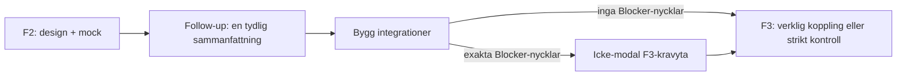

# Builder- och F2/F3-konsolidering

## Målbild

Builderns huvudloop ska kännas enkel:

- Ingen ny golden-prompt- eller LLM-eval-svit. Följ [docs/delivery-bias.md](docs/delivery-bias.md): varje nytt test ska låsa en observerad defekt eller ett litet kontrakt.
- Inga env-frågor i chatten, inga env-dialoger och inga autoöppnade popovers. Ett explicit klick på **Bygg integrationer** får däremot visa en beständig, icke-modal F3-kravyta.
- UI använder **Byggblock**. `dossier` är fortsatt kod-/route-ord. **Integration** betyder en extern tjänst eller runtime-koppling; orden får inte göras till synonymer eftersom ett Byggblock kan vara helt självförsörjande.
- Inspector hålls utanför denna leverans. Det fungerade senast i produktion och dess 503:or kan begränsas till versionsbyten; ta upp det först med en reproducerbar användareffekt.

## Verifierat nuläge

1. `MessageList` visar inte längre en `Svar krävs`-dialog. F3-continuation renderas inline, men F3-readiness använder fortfarande toast + Byggblock-popover.
2. F2-previewens runtime-`.env.local`, versionens `files_json`-`.env.local`, `env.example` och krypterade `projectEnvVars` är fyra skilda saker:
   - Preview-VM:n får sin sammanslagna `.env.local` av [src/lib/gen/preview/env-local.ts](src/lib/gen/preview/env-local.ts).
   - Den versionssparade `.env.local` är i dag en full placeholder-katalog och syns felaktigt stor i kodvyn; den strippas i ZIP/export.
   - `env.example` är den användarsynliga dokumentationsfilen och är redan byggblocks-scopad.
   - Riktiga värden ligger krypterat i `projectEnvVars`, inte i någon committad fil.
3. F3-readiness ska bara stoppa på `buildBlockingKeys`; `feature-runtime`, `warn-only` och mock/placeholder är Advisory. Den observerade körningen ska därför sparas med chatId, versionId och `/finalize-design`-svarets `missingByIntegration` innan vi ändrar servergaten.
4. PR #480 är rebase:ad mot `c4b9627`. Den är default-off och `SAJTMASKIN_PREVIEW_PREWARM` är verifierat osatt i Production, Preview och Development.

## Spår A — en follow-up får bara redovisa ändringen en gång

**Hypotes att låsa först:** post-checken appendar en andra fil-lista i samma assistant-text som `GenerationSummary` redan har omvandlat till filbadges. En separat autofix-runda kan också se ut som en andra ändring och ska vara visuellt identifierbar.

1. Lägg en regression i `post-checks` + `GenerationSummary` för en follow-up med `file="..."`-block.
2. Flytta eller undertryck post-checkens textbaserade fil-diff när meddelandet redan är codegen. Behåll den strukturerade `tool:post-check`-informationen i Agentloggen.
3. Verifiera att en riktig automatisk repair visas som en egen, namngiven repair-runda i stället för att se ut som en tyst dublett.
4. Hårdare SSE-overlap-dedupe utreds bara om det finns två stora `content`-chunks i samma session efter steg 2.

**Ägare:** `src/lib/hooks/chat/post-checks.ts`, `post-checks-summary.ts`, `stream-handlers.ts`, `src/components/builder/GenerationSummary.tsx` och deras riktade tester.

**Klart när:** en normal follow-up visar en generation-sammanfattning och en Agentlogg, men aldrig en andra nästan likadan fil-lista i samma chattbubbla.

## Spår B — F3 använder valda Byggblock, inte ett generellt env-formulär

1. Låt [resolveSelectedDossiersWithVersionPresence](src/lib/gen/dossiers/version-presence.ts) och [project-env-resolver](src/lib/project-env-resolver.ts) vara enda källorna för valt Byggblock respektive `buildBlockingKeys`.
2. Knyt F3-ytans fält direkt till serverns `missingByIntegration` från `finalize-design`; klienten får inte härleda en större nyckeluppsättning själv.
3. Ersätt F3-triggerns toast/popover-väg med en persistent F3-kravyta i buildern:
   - visas först efter ett explicit klick på **Bygg integrationer**,
   - innehåller bara de verkliga Blocker-nycklarna, med byggblocksnamn och syfte,
   - sparar till `projectEnvVars`,
   - har en tydlig återuppta-knapp, men ingen dialog, popover eller chattfråga.
4. Behåll F2-mute: F2 ska fortsatt rendera dossierns `mock`-läge och demo-seed utan env-trafik i chatten. Uppdatera [`.cursor/rules/env-flow-f2-mute.mdc`](.cursor/rules/env-flow-f2-mute.mdc) bara för att beskriva den explicita, icke-modala F3-förberedelsen.
5. För Byggblock utan `build`-enforcement:
   - bevara F2-filer och visuell yta,
   - visa eventuella `feature-runtime`-nycklar som frivillig konfiguration, aldrig som Blocker,
   - starta ingen extra LLM-runda enbart för att ingen verklig koppling finns. Om ReleaseGate behöver köras ska den använda den befintliga versionsfilen deterministiskt.
6. För Byggblock med en riktig `build`-nyckel: F3 får först efter sparat värde skapa den riktiga server-/SDK-varianten. F3-prompten scope:as till versionens valda och filbevisade Byggblock.

**Primära ytor:** `PreviewPanelF3Trigger.tsx`, `PreviewPanelDossiers.tsx`, `BuilderShellContent.tsx`, `finalize-design/route.ts`, `tier3-build-spec.ts`, `chat-message-stream-post.ts`.

**Klart när:** Stripe/OpenAI-liknande `feature-runtime`-Byggblock kan ha samma F2/F3-yta med ärlig Advisory; en verklig Clerk-/server-Blocker visar exakt sina nycklar; inga env-nycklar frågas i chatten eller i en overlay.

## Spår C — ta bort placeholder-katalogen ur kodvyn

1. Ersätt [buildPlaceholderEnvLocalBody](src/lib/gen/export/project-scaffold.ts) som alltid lägger in hela katalogen i versionens `.env.local`.
2. Tråda samma `dossierEnvScope` / `selectedDossierEnvKeys` som redan används för `env.example` till den sparade filartefakten, eller låt den sparade `.env.local` utebli när preview-/verify-lagret kan skapa den själv. Välj den minsta vägen som bevarar verifieringslanen.
3. Behåll säkra F2-placeholdervärden endast för valda Byggblock i preview-VM:n. Riktiga användarvärden får endast komma från `projectEnvVars`.
4. Behåll exportregeln: `.env.local` strippas ur ZIP; `env.example` är dokumentation och innehåller aldrig riktiga secrets.
5. Lås paritet med tester för `project-scaffold`, `project-env-file`, `env-local` och `preview-session`.

**Klart när:** kodvyn visar bara relevanta nycklar; previewn bootar fortsatt i F2; F3 får inga fiktiva värden från F2; export läcker inga värden.

## Spår D — gör signalerna konsekventa efter follow-up

Detta delas upp i egna små PR:er efter A–C, inte i en stor pipeline-rewrite:

1. Fixa `configured` så dossier-selektion läser projektets sparade env-karta, inte Sajtmaskins `process.env`.
2. Stäng removal-kedjan: “ta bort Stripe” ska nå capability-hints, contracts och den faktiska filmergen.
3. Låt F3-build-planen läsa parent-versionens filbevis. Init och follow-up ska använda samma capability-källa.

Varje del ska ha en exakt regression från [BUG-SWARM-BACKLOG.md](BUG-SWARM-BACKLOG.md), utan nya generella policy-lager.

## Spår E — preview-prewarm, PR #480

1. Rebase mot `master` är klar i den separata `sajtmaskin-preview-prewarm`-worktreen.
2. Lägg regressionstest som bevisar att plan-mode och contract-clarification aldrig startar en prewarm.
3. Kör `npm run typecheck`, `npm run lint`, de riktade preview-/stream-testerna, `npm --prefix preview-host run check`, `npm --prefix preview-host run test:guards`, backlog-kontrollen och diff-kontroll.
4. Kör `/granska` på den uppdaterade branch-diffen, därefter en ny Bugbot-pass. Triagera alla fynd innan push.
5. Pusha den rebase:ade branchen med `--force-with-lease`, läs om Vercel/Codex-/Bugbot-fynd och invänta alla required checks. Sätt inte flaggan och mergea inte innan ny SHA-bunden sign-off och `merge:ready`.
6. Aktivering är en separat produktkontroll: ny chat utan version, kontrakt/plan-mode (ska inte prewarma), vanlig follow-up och slutlig preview. Mät install-skip-rate och preview-hostens kötid innan flaggan sätts.

## Copy, terminologi och docs

- Inga nya produkttermer planeras. Glossaryn har redan `Byggblock`, dossier, F2/F3, mock mode och `buildBlockingKeys`.
- Rätta befintlig copy som felaktigt antyder att varje hårt Byggblock alltid kräver en riktig nyckel. `hard` beskriver secret-/servertyngd; det är `enforcement: build` som är Blocker.
- Använd svenska i användarytan. Kodidentifierare, DB-värden och telemetri behåller sina etablerade engelska namn.
- Uppdatera [docs/contracts/env-flow.md](docs/contracts/env-flow.md), [docs/contracts/dossier-system.md](docs/contracts/dossier-system.md), [docs/ENV.md](docs/ENV.md) och [docs/architecture/glossary.md](docs/architecture/glossary.md) endast om runtime-kontraktet faktiskt ändras. `terminology.mdc` ändras bara om förväxlingstabellen behöver en ny rad.
- Bilder har inte kommit med i den här chatten. När de bifogas granskas den konkreta svensk/engelsk-copy:n mot samma kontrakt, utan generell översättning av intern tekniktext.

## Agentuppdelning och grind

| Arbete | Ansvar | Grind |
| --- | --- | --- |
| Repro, diffgranskning och riktade testluckor | Composer 2.5 Fast, read-only | Bevis + filägare innan kod |
| Prewarm-test, rebase och små isolerade UI-fixar | GPT 5.6 | Riktad Vitest, typecheck, lint |
| F2/F3- och env-kontrakt över flera ägare | Huvudagent; Opus används endast för separat kontraktsgranskning vid behov | Plan + små PR:er, aldrig en stor samtidighetsmerge |
| PR-granskning | `/granska` + Cursor Bugbot | Fynd: fixat, loggat eller avfärdat |

## Gemensam verifiering

Efter A–D, kör en enda prod-canary:

1. Välj ett icke-default Byggblock i katalogen.
2. Generera F2 och kontrollera mock-ytan utan env-fråga.
3. Kör en follow-up och bekräfta att ändringen redovisas en gång.
4. Klicka **Bygg integrationer**:
   - inga verkliga Blocker-nycklar → behåll fil-/UI-ytan och kör endast relevant kontroll,
   - verkliga Blocker-nycklar → visa bara dessa i den icke-modala F3-ytan.
5. Kontrollera att `env.example` och kodvyn är scopade, att previewn fungerar och att F3/deploy-status är ärlig.

Logga bara reproducerbara avvikelser i `BUG-SWARM-BACKLOG.md`; skapa inte en parallell lista.
