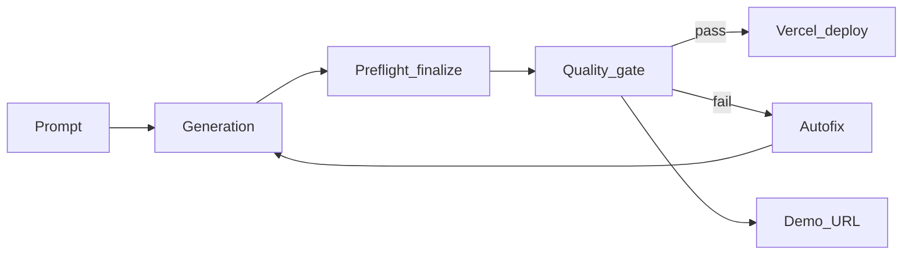
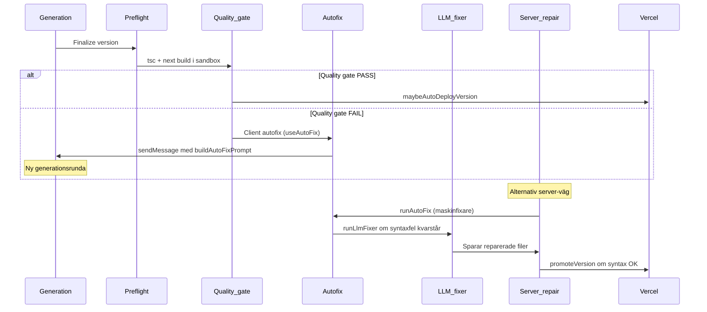

# Sajtmaskin Product Runbook

En enda fil att utgå ifrån: mål, miljö, användarresa, repair-kedja, scaffold-system och kända fallgropar.

---

## 1. Mål: "Next Standard"

Användaren ska kunna nå en **standardiserad Next.js App Router**-version av sin sajt som:

1. **Valideras** av `tsc` / `next build` i sandbox (quality gate).
2. **Visas** i en tydlig kedja: snabb visning → sandlåda → deploy.
3. **Publiceras** till Vercel via plattformens deploy-kedja.

"Snabb visning" i byggaren är **inte** full Next-runtime; förtroendet vilar på sandlåda och deploy.



---

## 2. Miljö-checklista

### 2.1 Sajtmaskin-plattformens egna variabler

| Variabel | Lokalt | Prod (Vercel) | Syfte |
|----------|--------|---------------|-------|
| `POSTGRES_URL` | `.env.local` | production, preview | Databas (Supabase Postgres) |
| `REDIS_URL` | `.env.local` | production, preview | Cache (Upstash, ioredis) |
| `UPSTASH_REDIS_REST_URL` + `_TOKEN` | `.env.local` | production, preview | Rate limiting (Upstash REST) |
| `BLOB_READ_WRITE_TOKEN` | `.env.local` | production, preview | Vercel Blob (media, backoffice) |
| `JWT_SECRET` | `.env.local` | production, preview | Auth-tokens |
| `OPENAI_API_KEY` | `.env.local` | production, preview | Kodgenerering (own engine) |
| `VERCEL_TOKEN` | `.env.local` | production, preview | Deploy av genererade sajter |
| `NEXT_PUBLIC_APP_URL` | `.env.local` | production, preview | Appens publika URL |

**Alias:** `KV_URL`, `KV_REST_API_*` skapas av Vercel/Upstash-integration; de behövs bara om `REDIS_URL` / `UPSTASH_*` saknas.

**Separation:** Dev och prod **måste** använda separata Redis- och Postgres-instanser.

### 2.2 Projektspecifika variabler (genererad sajt)

Nycklar som den genererade koden behöver (t.ex. `NEXT_PUBLIC_SUPABASE_URL`, `STRIPE_SECRET_KEY`) lagras per projekt i `project_data.meta.projectEnvVars` och skickas vidare till Vercel-deploy vid publicering. Dessa **delar inte** Sajtmaskin-plattformens env.

### 2.3 Gemensam infrastruktur

| Tjänst | Leverantör | Roll |
|--------|-----------|------|
| **Postgres** | Supabase | Plattformens databas (chattar, versioner, projekt, felloggar) |
| **Redis** | Upstash | Cache (ioredis) + rate limiting (REST) |
| **Blob** | Vercel Blob | Media-uppladdning, backoffice-paths med prefix per miljö |
| **Deploy** | Vercel | Hosting av genererade Next.js-sajter |

Supabase tillhandahåller **databasen** — inte hosting av genererade appar. Genererade sajter hostas på **Vercel**.

**Verifierat:** `src/lib/env.ts` (serverSchema) registrerar alla variabler ovan; `src/lib/config.ts` resolvar Redis-URL med fallback-kedja `REDIS_URL` → `KV_URL`; `src/lib/data/redis.ts` loggar varning om Redis saknas; `src/lib/db/client.ts` kräver `POSTGRES_URL` (legacy: `POSTGRES_PRISMA_URL`, `POSTGRES_URL_NON_POOLING`); Blob-token behövs av `imageAssets`, `template-embeddings-storage`, `backoffice`; utan den faller media-uploads tillbaka till lokalt FS.

Se `docs/ENV.md` for full detalj.

### 2.4 Manuell E2E (builder)

**Reproducerbarhet:** Notera `git branch --show-current` och `git rev-parse HEAD` i testrapporten så att andra kloner kan jämföra mot samma snapshot (dokumentation kan skilja sig från en annan checkout).

**Minsta miljö — full app:** En ren `OPENAI_API_KEY` räcker inte för en normal lokal session med sparade chattar och versioner. Förvänta att följande finns enligt policy i `src/lib/env.ts` och tabellen i §2.1: **`POSTGRES_URL`**, **`JWT_SECRET`**, och Redis/rate limit (**`REDIS_URL`** och/eller **`UPSTASH_REDIS_REST_URL`** + **`UPSTASH_REDIS_REST_TOKEN`**). **`ANTHROPIC_API_KEY`** endast om Anthropic-tier väljs. **`AI_GATEWAY_API_KEY`** eller motsvarande gateway/OIDC kan behövas för **Förbättra / Skriv om** (prompt-assist) — se `docs/ENV.md` om gateway. **`V0_API_KEY`** behövs inte för own-engine-generering men kan fortfarande gälla för kvarvarande v0-/registry-hjälp om de rutterna rörs.

**Sandbox / “riktig” preview / quality gate:** Utan `PREVIEW=y`, med `SANDBOX_AUTO` och **`VERCEL_TOKEN` + `VERCEL_TEAM_ID` + `VERCEL_PROJECT_ID`** — annars kan quality gate svara **501** och preview markeras som **skipped**. Se `docs/ENV.md` (checklista för iframe med Next-runtime).

**Embeddings vs registry:** `src/lib/gen/scaffolds/scaffold-embeddings.json` (checkad in) ger matchning i en vanlig clone. Om **`registry.ts`** eller scaffold-innehåll ändrats utan att embeddings regenererats, kan scaffold-valet avvika från en “byggd pipeline”. Kör `npm run scaffolds:embeddings` (eller hela `npm run scaffolds:build`). Se `Scripts/embeddings/README.md`.

**Stress av autofix (valfritt):** `SAJTMASKIN_AGGRESSIVE_AUTOFIX=1` eller motsvarande via `layout` / `localStorage` — se `docs/ENV.md`.

**Manuell körning:** `npm run dev` → öppna buildern → skicka en tydlig prompt (t.ex. restaurang med meny och bokning). Bekräfta att **inga compile-fel** spammar terminalen vid första prompt.

**Vad räknas som lyckat test (tydliga kriterier):**

| Steg | Förväntan |
|------|-----------|
| Stream | SSE/bygg-flöde går till slut utan hårdt fel |
| Version | `engine_versions`/`version`-spår i UI uppdateras (ny version skapad) |
| Scaffold | Scaffold-badge / metadata stämmer med **intention** (eller notera avvikelse om embeddings är stale) |
| Preview | Antingen **intern snabb visning** (shim/fallback) **eller** **sandbox-URL** beroende på env — inte tom panel utan förklaring (se §4.4) |
| Quality gate | Om sandbox-credentials finns: gate körs eller **501** förklaras av env; annars “skipped” är förväntat tills creds finns |

**Valfritt:** Bekräfta att readiness/versionsbadge rör sig mot **Visning redo** / **Sandbox-klar** / **Produktionsklar** — eller dokumentera **Fel** / **Omtag** med loggrad.

**Kostnadsnotis:** En vanlig sandbox-baserad quality gate (`tsc` + `next build`, 2 vCPU) ligger normalt runt **~$0.01–$0.03** på Vercel. Om runtime också bootas och hålls vid liv upp till **10 minuter** tillkommer oftast bara några extra cent. Detta räknas mot Vercels vanliga Pro-kredit innan separat debitering börjar.

---

## 3. Användarresa (prompt → deploy)

```
1. Prompten skrivs         (scaffold-match via embedding-similarity)
2. Generation              (own-engine, streamed output)
3. Finalisering            (autofix, syntax, SEO-baseline, import-check)
4. Quality gate            (tsc + next build i sandbox)
5. Visning                 (snabb visning → sandlåda → deploy)
6. Publicering             (Vercel deploy + DNS)
```

### 3.1 Visningskedja

| Nivå | Etikett i UI | Beskrivning |
|------|-------------|-------------|
| 1 | **Snabb visning** | Förenklad intern rendering — inte full Next-runtime |
| 2 | **Sandlåda** | Isolerad Node/Next — närmast "riktig" runtime i byggaren; quality gate kan nu även starta runtime-URL som hålls uppe i upp till 10 minuter |
| 3 | **Deploy** | Publicerad Vercel-miljö |

Inga "Preview", "Legacy preview" eller "Fidelity"-etiketter i UI.

Se `docs/architecture/builder-visual-path.md`.

### 3.2 Scaffold-matchning

Prompten matchas mot ett scaffold via **embedding-similarity** (`matchScaffoldWithEmbeddings`). Vid saknad API-nyckel eller embeddings används en deterministisk fallback baserad på `buildIntent`. Scaffolds bestämmer **layout-struktur** och basfiler.

Dossier-/mallreferenser rankas med embedding-sökning (`rankTemplateReferences()`) och klipps till max 3 träffar, max 2 snippets. Scaffold-filer serialiseras med `buildFileContext()` (max 4000 tecken, max 4 filer). Allt sker automatiskt; användaren behöver aldrig välja scaffold manuellt.

Scaffold-val styrs av embeddings; historisk keyword/dossier-ranking är arkiverad.

Mer detalj: `docs/architecture/scaffold-system.md`, `src/lib/gen/scaffolds/README.md`, `docs/architecture/2026-03-20-own-engine-pipeline-rapport.md`.

---

## 4. Repair-kedja



### 4.1 Tre repair-vägar

| Väg | Trigger | Fil |
|-----|---------|-----|
| **Quality gate** | Automatisk efter version sparad | `src/app/api/v0/chats/[chatId]/quality-gate/route.ts` |
| **Client autofix** | Gate fail → chat-meddelande | `src/lib/hooks/chat/useAutoFix.ts`, `helpers.ts` (`buildAutoFixPrompt`) |
| **Server repair** | Manuell eller API-driven | `src/app/api/v0/chats/[chatId]/repair-version/route.ts` |

### 4.2 Vad avgör "redo att publicera"

**Readiness API** (`readiness/route.ts`) samlar blockers och varningar:
- **Blocker:** saknad env, draft/verifying/failed version, kritisk SEO (`missing-metadata`, `missing-title`).
- **Varning:** preview-problem, SEO-varningar, placeholder-env.

Versionsbadge i UI visar **Visning redo** / **Sandbox-klar** / **Produktionsklar** — eller **Fel** / **Omtag**.

### 4.3 SEO-baseline

`applyCriticalSeoBaseline` (i `finalize-preflight.ts`) lägger till `metadata`-export med `title` + `description` i root layout **innan** versionen sparas — förebygger den vanligaste SEO-blockern.

Om baseline inte kan köras (t.ex. `"use client"` root layout) sätts SEO som **autofix-orsak** i `post-checks-results.ts` och utlöser autofix-runda.

### 4.4 Demo-URL policy

`resolveEngineDemoUrlDetails` i `src/lib/gen/demo-url.ts` avgör vilken URL som visas:

| Villkor | Mode | Resultat |
|---------|------|----------|
| Sandbox-URL finns och inte expired | `runtime` | Sandlåda visas |
| `PREVIEW=1` (legacy shims) | `legacy-preview` | Intern snabb visning |
| Verifiering failed | `verification-failed` | Intern snabb visning (aldrig tom panel under repair) |
| Sandbox saknas, ej legacy | `pending-runtime` | Intern snabb visning som fallback, UI visar "Ingen sandlåde-URL ännu…" |
| Ingen version | `none` | Tomt tillstånd |

**Beslut:** Intern snabb visning används alltid som fallback så att panelen aldrig är tom. Om sandlåda/deploy ska vara enda sanningen krävs att de är snabba nog att ersätta intrycket direkt.

---

## 5. Kända fallgropar

| Problem | Rotorsak | Status / åtgärd |
|---------|----------|-----------------|
| **Dubbel "generera"-copy** | Samma mening i `buildPromptStrategySteps` (helpers) och `buildProgressSteps` (stream-handlers) | Ska dedupas |
| **"Skriv om" ger MÅL/CONSTRAINTS dubbelt** | `handlePromptEnhance` kör `formatPrompt` efter polish → struktur dupliceras | Ska fixas (ta bort `formatPrompt` i polish-vägen) |
| **Lucide vs Next import** | `Image`/`Link` från lucide krockar med `next/image`/`next/link` | Prompt-regler + ev. autofix-utökning |
| **Phantom-rutter** (`/support` m.fl.) | `WEBSITE_ROUTE_PATTERNS` i `route-plan.ts` matchar nyckelord i prompt | Dokumenterat; ev. visa härledda rutter i UI |
| **Motstridiga "redo"-signaler** | Readiness, post-checks och versionsbadge kan ge olika intryck | Konsolidera till en sanningskälla |
| **Tom sandbox-väntan** | `demoUrl` pending medan sandbox startar → tom panel | Snabb visning som fallback med tydlig etikett; resolver (`demo-url.ts`) returnerar legacy URL i `pending-runtime` istället för `null` |

---

## 6. Pekare

| Dokument | Innehåll |
|----------|----------|
| `docs/ENV.md` | Alla env-variabler, topologi, kanoniska namn |
| `docs/architecture/builder-visual-path.md` | Visningskedja (snabb → sandlåda → deploy) |
| `docs/architecture/repair-deploy-loop.md` | Repair/deploy-sekvens och komponenter |
| `docs/architecture/engine-status.md` | Motor-arkitektur, generationsflöde |
| `docs/architecture/scaffold-system.md` | Scaffold-matchning (embedding-baserad) |
| `docs/schemas/version-status-lifecycle.md` | Versionsstatus och badge-regler |

---

*Senast uppdaterad: 2026-03-23*
