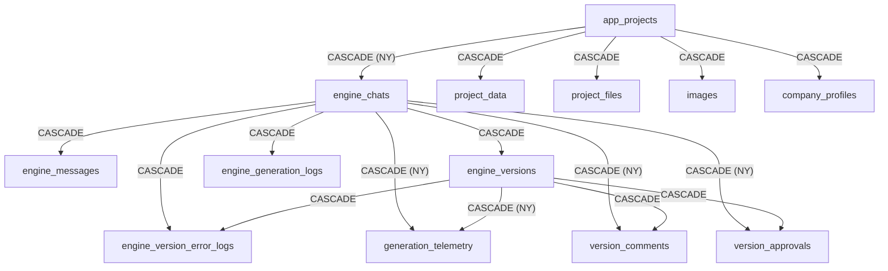

# Database cascade graph

Visuell karta över FK-cascade-kedjan i sajtmaskins Postgres efter migrationerna
`add-cascade-to-engine-fks.sql` och `add-cascade-engine-chats-project.sql`.

En enda `DELETE FROM app_projects WHERE id = $1` rensar nu allt som hänger
under projektet — Postgres kaskaderar via FK:erna nedan.

## Tabeller utanför cascade-kedjan (medvetet)

| Tabell                                      | Varför ingen cascade                                                           |
| ------------------------------------------- | ------------------------------------------------------------------------------ |
| `media_library`                             | Ägs av användaren, kan delas mellan projekt — ska överleva projekt-radering    |
| `domain_orders`                             | Finansiella records, raderas explicit i `deleteProject()` och cleanup-scriptet |
| `prompt_logs`                               | Telemetri, ska överleva projekt-radering så analytics inte tappas              |
| Externa Supabase/Neon hos genererade sajter | Ägs av användarens egna konto, helt utanför sajtmaskins DB                     |
| Vercel Blob/S3-payloads                     | Lever utanför Postgres, separat städ-flöde                                     |

## Referenser

- Migration: [add-cascade-to-engine-fks.sql](../../src/lib/db/migrations/add-cascade-to-engine-fks.sql)
- Migration: [add-cascade-engine-chats-project.sql](../../src/lib/db/migrations/add-cascade-engine-chats-project.sql)
- Drizzle-schema: [src/lib/db/schema.ts](../../src/lib/db/schema.ts)
- Cleanup-script: [scripts/db/cleanup-test-projects.mjs](../../scripts/db/cleanup-test-projects.mjs)
- Schema-doc: [docs/schemas/integrations-and-data.md](../schemas/integrations-and-data.md)

