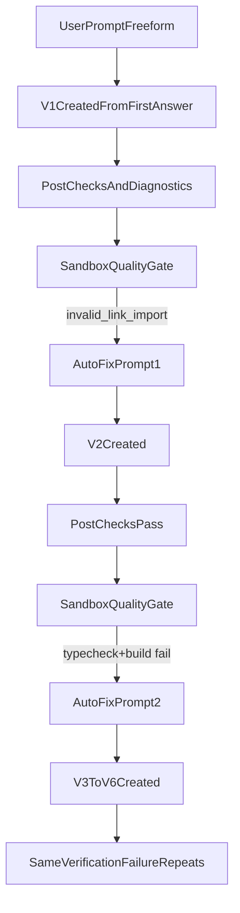

# Builder Version Audit

Datum: `2026-03-14`

## Sammanfattning

Den här körningen började som en normal own-engine-generering men gick sedan in i en auto-fix-kedja där varje ny version klarade preview/post-checks bättre, men fortfarande fastnade i sandbox-baserad verifiering (`typecheck`, `build`). Resultatet blev att `v1` skapades från första prompten, medan senare versioner skapades av interna auto-fix-prompter och inte av nya manuella användarprompter.

Det centrala problemet i observabiliteten var inte bara att fler versioner skapades, utan att Version History inte förklarade skillnaden mellan:

- den ursprungliga versionssnapshoten
- en intern auto-fix/omtag-version
- en version som nått ett slutligt felläge

## Fryst underlag

- Serverprocessen `npm run start` stoppades manuellt efter att körningen hade observerats färdigt.
- Terminalunderlag hämtades från den aktiva serverterminalen.
- Browser-snapshot från buildern användes som fryst UI-underlag.
- Lokala dev-loggfiler i `logs/` fanns inte för denna körning.

## Flödesschema

## Vad som hände i denna körning

### 1. Server och första generation

- Servern startade rent på `http://localhost:3000`.
- Terminalen visade endast ett par CSP-rapporter och därefter en egen motor-signal:
  - `Pass 1: 1 syntax errors, attempting LLM fixer`
  - `Pass 1: LLM fixer resolved all errors`
- Den signalen visar att own-engine-autofixen i finaliseringssteget gick in tidigt och lyckades.

### 2. Första versionen (`v1`)

- Första version-ID som fångades i buildern var `994103a0-9544-49e5-a697-1bc3a44e32f6`.
- Snapshotunderlaget visar att den versionen nådde:
  - `Autofix klar`
  - `Validering klar`
  - `Finalisering klar`
  - `Filer i versionen: 28`
- Samma underlag visar därefter:
  - `Quality gate: FAIL (invalid_link_import).`
  - `Fel Link-import i app/page.tsx. Använd next/link, inte lucide-react.`
  - `AUTO-FIX REQUEST — STRICT MINIMAL DIFF ...`

Tolkning: `v1` var första promptens första slutresultat, men det blev samtidigt startpunkten för en intern auto-fix-kedja.

### 3. Senare versioner (`v2` och framåt)

- Efter `v1` skapades minst fem ytterligare versioner i samma chat.
- Frysta snapshotdata visar i slutläget `6 versions`.
- Minst följande version-ID:n fångades i det frysta underlaget:
  - `994103a0-9544-49e5-a697-1bc3a44e32f6`
  - `752b7564-c6f0-4a2d-8fbd-db5d87b35c7e`
  - `005c440c-5bb3-4438-b339-836ed3a1f27e`
  - `0938380b-e3d4-4427-8435-ddc45521bc16`
- UI-underlaget visade upprepat:
  - `Quality gate: PASS (changes + preview + stream quality).`
  - följt av:
  - `typecheck: FAIL (exit 2)`
  - `build: FAIL (exit 1)`
  - `AUTO-FIX REQUEST — STRICT MINIMAL DIFF Issues detected: typecheck failed, build failed.`

Tolkning: den visuella previewn och post-checks blev bättre nog för att quality-gate-delen i message-flödet kunde säga `PASS` för preview/changes/stream, men den separata sandboxverifieringen fortsatte att fallera på faktisk kompilering och bygg.

### 4. UI-beteendet som blev förvirrande

- Version History visade flera `Failed`-badges för versioner som i praktiken var steg i samma auto-fix-kedja.
- Samtidigt fortsatte buildern att polla `readiness` för äldre versioner, särskilt `v1`.
- Browsertrafiken visade fortsatt polling mot:
  - `/api/v0/chats/<chatId>/versions`
  - `/api/v0/chats/<chatId>/readiness?versionId=<v1>`
  - `/api/v0/chats/<chatId>/versions/<versionId>/error-log`

Tolkning: UI:t gjorde det svårt att se skillnaden mellan:

- en failad mellanversion som redan ersatts
- en aktuell failad frontversion
- en äldre version som fortfarande pollas av readiness-skäl

## Hur loggar sparas

### Persistenta loggar

Dessa loggar sparas i datalagret och överlever en sidomladdning:

1. `engine_versions`

- versionens livscykelstatus
- `releaseState`
- `verificationState`
- `verificationSummary`
- `promotedAt`

2. `engine_version_error_logs`

- nivå (`info`, `warning`, `error`)
- kategori (`preview`, `quality-gate`, `seo`, `routes`, `images`, `render-telemetry` m.fl.)
- medföljande `meta`-payload

3. `engine_generation_logs`

- modell
- tokenanvändning
- duration
- success/error

### Builderns UI-/minnesloggar

Dessa är synliga i chat- och verktygsdelarna men är inte primärt den persistenta sanningen:

- `tool:post-check`
- `tool:quality-gate`
- progress-/statusdelar som `Autofix klar`, `Validering klar`, `Finalisering klar`

### Browser-/previewloggar

För denna körning observerades live och frystes:

- `preview-render`-anrop
- `versions`-polling
- `readiness`-polling
- `error-log` POST-anrop
- browser-snapshot av Version History

### Terminal-/serverloggar

För denna körning visade terminalen:

- ren serverstart
- project-limit-varning
- CSP-rapporter
- syntax-fix-signaler från own-engine

### Lokala dev-loggfiler

Koden stöder lokala filer via `src/lib/logging/devLog.ts`:

- `logs/sajtmaskin-local.log`
- `logs/sajtmaskin-local-document.txt`

För denna körning fanns ingen `logs/`-mapp, vilket betyder att lokal dev-loggning inte gav extra underlag här.

## Analys av brister

### 1. Versionssemantiken i UI:t är för grov

Allt som inte är `Promoted`, `Verifying` eller `Draft` faller i praktiken tillbaka till `Failed`. Det gör att en auto-fix-kedja ser ut som flera orelaterade misslyckanden trots att de är omtag i samma kedja.

### 2. Auto-fix-kedjan är inte tydligt visualiserad

Snapshotunderlaget visar att failed quality gate återkom flera gånger, men Version History saknade begrepp för:

- `omtag`
- `ersatt av nyare retry`
- `slutligt fel`

### 3. Loop-signalen är reell

Det frysta snapshotunderlaget visar en upprepad sekvens av:

- sandbox-fel på `typecheck`/`build`
- auto-fix-request
- ny version

Det innebär att systemet inte bara “verifierade länge”, utan faktiskt producerade nya versioner på samma grundproblem.

### 4. Readiness-polling blev missvisande

Browserunderlaget visade fortsatt polling mot `v1` samtidigt som senare failade versioner dök upp. Det riskerar att ge intrycket att första versionen fortfarande är den aktiva kandidaten fast kedjan redan gått vidare.

### 5. Lokal dev-observabilitet var tunn

Avsaknaden av `logs/`-filer gjorde att denna analys huvudsakligen fick byggas på:

- terminalutskriften
- browser snapshot
- nätverksmönster
- kodens persistensflöden

Det räckte för slutsatsen, men inte för full detaljinspektion av varje persisted error-log-rad i databasen.

## Analys av fördelar

### 1. Own-engine lyckades ta sig förbi tidiga syntaxproblem

Terminalen visade att LLM-fixern faktiskt fångade och löste syntaxfel tidigt. Det är ett tydligt styrketecken i finalize-flödet.

### 2. Buildern sparade versionssteg konsekvent

Trots loopproblemet skapades tydliga versionssnapshots som gick att följa i efterhand.

### 3. Det finns redan flera separata loggskikt

Arkitekturen har redan bra byggstenar för observabilitet:

- persistenta version error logs
- generation logs
- verification state
- render telemetry
- chatens tool-parts i UI

Problemet ligger mer i hur allt visualiseras än i att data saknas helt.

### 4. Auto-fix använder minimal-diff-prompting

Underlaget visar återkommande `STRICT MINIMAL DIFF`-prompter, vilket är en bra strategi för att begränsa collateral damage mellan försök.

## Slutsats

Det här var inte en vanlig enkel verifiering som tog lång tid. Det var en faktisk retry-/auto-fix-kedja där:

- `v1` var första promptens första snapshot
- senare versioner skapades av interna auto-fix-promptar
- sandboxverifieringen fortsatte att fallera på `typecheck` och `build`
- UI:t saknade språk för att visa att vissa `Failed` i själva verket var `omtag`

Den rekommenderade UI-justeringen är därför att behålla dagens generationslogik, men att annotera versionerna så att Version History kan visa:

- `Omtag` för failade versioner som ersatts eller fortfarande ingår i retrykedjan
- `Fel` först när den aktuella frontier-versionen bedöms vara slutligt stoppad/uttömd

## Underlag som användes

- Terminalspår från stoppad serverprocess
- Builder-snapshot i browserlogg
- live browser request-historik
- relevanta kodvägar i:
  - `src/app/api/v0/chats/route.ts`
  - `src/lib/hooks/chat/useCreateChat.ts`
  - `src/lib/hooks/chat/post-checks.ts`
  - `src/lib/hooks/chat/useAutoFix.ts`
  - `src/components/builder/VersionHistory.tsx`
  - `src/lib/db/engine-version-lifecycle.ts`
  - `src/lib/logging/devLog.ts`
  - `src/app/api/v0/chats/[chatId]/versions/[versionId]/error-log/route.ts`
