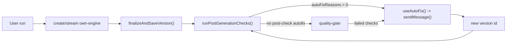

# Autofix Loop Diagnosis

Datum: `2026-03-15`

## Scope

Den här analysen följer en enda own-engine-körning för `chatId`
`e7d74c94-a96b-42af-a2a7-04a888ad8edf` och fokuserar på builderns
autofix-/post-check-kedja, versionssemantik och hur detta ska hållas isär från
kvalitets- och modellfrågor.

`embeddings` ingår inte här.

## Fryst artefaktpaket

Underlaget för den här reproduktionen består av:

- `error_log/chatflöde.txt`
- serverterminal med own-engine-körningen och uppföljningskörningarna
- en enda builderflik för samma `chatId`
- builderns versionspolling, readiness-polling och previewtrafik
- persistenta `error-log`-anrop för flera versioner i samma chat

Det räcker för att bevisa loopkällan utan en full DevTools-export.

## Kort svar på sidospår

### Extra browserflik

En extra builderflik kan skapa mer polling mot:

- `/api/v0/chats/{chatId}/versions`
- `/api/v0/chats/{chatId}/readiness`
- `/api/preview-render`

Det kan alltså öka brus i nätverksspåren och göra UI:t mer förvirrande, men det
förklarar inte att en ny intern `send`-körning startar. Den biten kräver att
buildern själv kallar `sendMessage(...)`.

### `Stream summary` betyder inte separat agent

`src/lib/hooks/chat/helpers.ts` loggar `Stream summary` för både
`streamType: "create"` och `streamType: "send"`.

Det visar att send-vägen kördes. Det bevisar inte att OpenClaw eller någon
annan separat assistent tog över.

### Python är låg sannolikhet

Den normala utvecklingsstarten i `package.json` använder:

- `node scripts/refresh-token.mjs`
- `node scripts/db-init.mjs`
- `node scripts/next-runner.mjs`

Det finns inget i den normala runtime-lanen som pekar på att Python driver
builderns loopar.

### Bara en server på `3000`

Vid kontrolltillfället fanns bara en faktisk lyssnare på `localhost:3000`.
Det betyder att vi inte hade två aktiva dev-servrar på samma port samtidigt när
artefakterna samlades in.

## Huvudslutsats

Loopen är verklig och den drivs av builderns interna autofix-kedja, inte av att
användaren skickar ny `Fritext`-prompt och inte av OpenClaw.

Den högst sannolika rotorsaken är kombinationen av:

1. `runPostGenerationChecks()` kan köa autofix från både post-check och
   quality gate.
2. `useAutoFix()` återanvänder `sendMessage(prompt)`.
3. dedupe-nyckeln innehåller `versionId`, vilket gör att nästan samma felklass
   kan återutlösas i nästa version i samma chat.

## Beviskedja

## 1. Version sparas innan post-check och quality gate

`src/lib/gen/stream/finalize-version.ts` sparar först assistant message och
skapar sedan versionen via `createDraftVersion(...)`.

Det betyder att systemet redan har skapat en ny versionssnapshot innan
efterkontrollerna avgör om resultatet egentligen behöver intern repair.

Konsekvens:

- användaren kan uppleva detta som samma första försök
- systemet har redan skapat ett nytt `versionId`

## 2. Post-check har två vägar till autofix

`src/lib/hooks/chat/post-checks.ts` visar två separata triggar:

- direkt från post-check när `artifacts.autoFixReasons.length > 0`
- från sandbox quality gate när checks misslyckas

Det innebär att loopen inte är begränsad till ett enda felställe. Samma chat
kan få nya interna repair-försök både före och efter quality gate.

## 3. Autofix återanvänder `sendMessage(...)`

`src/lib/hooks/chat/useAutoFix.ts` gör detta explicit:

- bygger dedupe-nyckel med `chatId`, `versionId` och `reasonHash`
- enrichar payload med persisted version logs
- bygger en autofixprompt
- väntar kort
- kör `await sendMessage(prompt)`

Detta är den kritiska punkten. Buildern går alltså tillbaka in i den vanliga
follow-up-vägen för samma chat i stället för att använda en separat intern
repair-kanal.

## 4. `sendMessage(...)` kör den vanliga send-streamen

`src/lib/hooks/chat/useSendMessage.ts` skickar follow-up till:

- `POST /api/v0/chats/${chatId}/stream`

och markerar strömmen som:

- `streamType: "send"`

Detta matchar exakt de loggrader som observerades i terminalen och förklarar
varför `Stream summary { streamType: "send" }` syns under loopen.

## 5. Samma felklass återkommer över flera versioner

I `error_log/chatflöde.txt` återkommer samma mönster över flera versioner:

- samma semantiska bildvarning
- mycket små eller obefintliga filändringar
- `Quality gate: FAIL (no_file_changes)`
- ny `AUTO-FIX REQUEST — STRICT MINIMAL DIFF`

Exempel på kedjan i den här chatten:

- `cabb0775-8e4b-41a9-aa5a-136581d0cf9c`
- `8ab66dae-0140-4b3f-85af-1cf8e9261ad3`
- `14bfa91f-2666-413c-b1b0-0afae8b793ee`
- `36c94256-986e-4bfc-825e-2120cb0c4810`
- `eafec19a-7850-452a-9bff-0056a107fdd1`
- `5033cefc-409a-41e8-9efb-0c7b1242ab1e`
- `9ae61a74-f626-49dd-971e-584b3d161d40`
- `79036616-d14c-41d9-89e8-c2096893ccd1`
- `305237e5-47f7-451c-9dc6-295774d429a7`
- `6ed8478f-440d-42a1-9a5f-7f9b73d84b4b`
- `5f4c9088-875e-42d4-b8dc-2a13a2e6bb25`

Detta är inte bara lång verifiering. Det är en faktisk retrykedja med nya
versioner.

## 6. Terminalen visar ordningen: error-log, sedan ny send-körning

Serverterminalen visar för samma `chatId`:

- persisted `error-log`-anrop för befintliga versioner
- därefter `Follow-up chat stream request`
- därefter `Version saved via finalizeAndSaveVersion`

Ett tydligt exempel i samma körning:

- `GET /api/v0/chats/.../versions/14bfa.../error-log`
- `00:38:45.961 [build] Follow-up chat stream request`
- `00:39:31.207 [engine] Version saved via finalizeAndSaveVersion`
- ny version `36c94256-986e-4bfc-825e-2120cb0c4810`

Detta binder ihop persisted diagnostics med en ny intern send-körning i samma
chat.

## Loopens troligaste mekanik

Den troligaste sekvensen är:

Det mest riskabla i kedjan är att dedupe sker per version i stället för per
chat/felklass.

## Versionssemantik

## Hur användaren tolkar `v1`

Ur användarens perspektiv är `v1` ofta:

- första stabila fungerande resultatet från första prompten

Ur systemets perspektiv är `v1` däremot:

- första snapshot som sparades innan post-check och quality gate var färdiga

Det innebär att interna repair-steg idag får helt nya versioner, trots att
användaren fortfarande kan uppleva allt som samma första försök.

## Vad UI:t redan gör

`src/components/builder/VersionHistory.tsx` och
`src/lib/db/engine-version-lifecycle.ts` försöker mildra detta genom att visa
äldre failade versioner som `Omtag` om en nyare version finns.

Det är bra, men inte tillräckligt, eftersom:

- intern repair och användarinitierade uppföljningar ser likadana ut som nya
  versioner
- den aktuella frontier-versionen saknar tydlig koppling till vilken
  repairkedja den tillhör
- readiness-polling för äldre versioner gör UI:t ännu svårare att läsa

## Separation mot kvalitets- och modellfrågor

Loopbuggen och kvalitetsfrågan är relaterade men inte samma sak.

## Vad som talar för att detta är en loopbugg

- samma felklass återkommer nästan oförändrat
- flera versioner har `+0 ~0 -0`
- nya `send`-körningar sker utan ny manuell prompt
- dedupe återställs praktiskt mellan versioner eftersom `versionId` ändras

## Vad som talar för ett separat kvalitetsproblem

Följande observationer pekar på kvalitetsvariation som ett eget spår:

- system prompt-längder i serverloggen ligger kring `46943` till `51826`
  tecken totalt
- den dynamiska delen ligger ofta kring `25891` till `30774`
  tecken
- follow-up-körningar kan bära mycket diagnostik och växa tydligt jämfört med
  ursprungsprompten
- en observerad repair-körning hade `promptTokens: 38517` och
  `completionTokens: 5629`

Det här ser alltså inte ut som att modellerna får för lite sammanhang.
Tvärtom ser own-engine-körningarna ofta tunga ut. Den rimliga risken är snarare:

- för mycket promptmassa
- för mycket scaffold-/diagnostiklast
- större tendens till generiska eller överförsiktiga svar

Det kan försämra kvaliteten, men det är inte det som skapar den observerade
versionsloopen.

## Scaffold- och promptlager

Kvalitetsvariationen bör därför analyseras separat genom att följa:

- scaffold-val i runtime-lanen
- brief och deep brief
- promptstrategi och promptmassa
- om vissa runtime scaffolds tenderar att ge för generiska resultat

Detta ska inte blandas ihop med autofixloopens stop conditions.

## Säkra fixspår

Följande fixspår framstår som säkra och prioriterade.

## 1. Dedupe per chat och felklass, inte per version

Byt från:

- `chatId:versionId:reasonHash`

till något i stil med:

- `chatId:reasonHash`
- eller `chatId:failureClass:normalizedDiagnosticHash`

Det gör att samma återkommande felklass inte startar om loopen bara för att ett
nytt `versionId` skapades.

## 2. Stoppa autofix efter första interna repair-rundan för samma felklass

Lägg in en tydlig spärr som stoppar ny autofix om:

- senaste version redan reparerade samma felklass
- och resultatet gav inga meningsfulla filändringar

Detta adresserar explicit `no_file_changes`-fallet.

## 3. Gate:a mot persisted error-log-historik

Eftersom `useAutoFix()` redan läser current/previous version errors kan
stopplogiken bli striktare:

- om current och previous version errors är materiellt samma
- och nyaste version fortfarande är samma felklass
- köa inte en ny `sendMessage(...)`

## 4. Skilj på intern repair-version och användarversion

Behåll gärna tekniska snapshots i databasen, men introducera ett tydligare
begrepp i UI och metadata:

- `userVersionNumber`
- `repairAttemptNumber`
- eller en repair chain kopplad till en ursprunglig användarversion

Då kan användaren se:

- första användarversion
- interna omtag inom samma användarversion
- slutligt frontier-resultat

## 5. Nedprioritera icke-blockerande varningar som ensam autofix-trigger

Semantiska bildvarningar och rena launch-varningar bör inte ensamma få starta
obegränsade interna repairkedjor.

Ett säkrare beteende är:

- visa varningen
- föreslå manuell förbättring
- eller tillåta högst ett automatiskt repairförsök

## Rekommenderad prioritering

1. Ändra dedupe så att den inte är versionsbunden.
2. Lägg till stop condition för samma felklass + inga filändringar.
3. Inför tydligare separation mellan användarversion och intern repair-version.
4. Separera därefter kvalitetsarbete kring promptmassa, scaffoldstyrning och
   generiska resultat.

## Applicerad fix (2026-03-15)

Samtliga rekommenderade åtgärder i punkt 1-2 ovan har implementerats:

### 1. Dedupe utan versionId

`makeDedupeKey` ersatt med `makeReasonKey` som använder `chatId:reasonHash`
istället för `chatId:versionId:reasonHash`. Varje ny version skapar inte längre
en ny dedupe-nyckel.

### 2. Globalt tak per chatt

Nya konstanter: `MAX_AUTOFIX_PER_CHAT = 2`, `MAX_ATTEMPTS_PER_REASON = 1`.
Oavsett hur många anledningar som hittas stoppas autofix efter max 2 reparationer
per chatt.

### 3. Klassificering: kritisk vs varning

Autofix-anledningar uppdelade i två kategorier:

- **Kritiska** (triggar autofix): `preview saknas`, `preview blockerad i preflight`, `kodsanity error`
- **Varningar** (loggas, visas, triggar INTE autofix): `misstankt irrelevanta bilder`, `trasiga bilder`, `saknade routes`, `fel Link-import`, `misstankt use()`

`misstankt irrelevanta bilder` (semantic-image) var den primära looporsaken:
varje generation med placeholder-bilder triggade varningen, som triggade autofix,
som genererade ny kod med samma bilder.

### 4. Kvalitetssteg

Tre-stegs kvalitetssystem infört: `Preview-klar` -> `Sandbox-klar` ->
`Produktionsklar`. Visas som färgkodade badges i VersionHistory.

Relevanta filer:

- `src/lib/hooks/chat/useAutoFix.ts`
- `src/lib/hooks/chat/post-checks-results.ts`
- `src/lib/hooks/chat/post-checks-summary.ts`
- `src/lib/db/engine-version-lifecycle.ts`
- `src/components/builder/VersionHistory.tsx`

## Slutsats

Det här var i första hand en loopbugg i builderns own-engine-kedja.

Den observerade `send`-strömmen var inte ett tecken på OpenClaw eller en extern
assistent. Den var ett resultat av att autofix använde samma follow-up-väg som
vanliga chatmeddelanden, och att dedupe-nyckeln inkluderade `versionId` vilket
kringgick skyddet vid varje ny version.

Fixarna är committade och pushade i `acd4844` (2026-03-15). Alla 185 tester
passerar.
