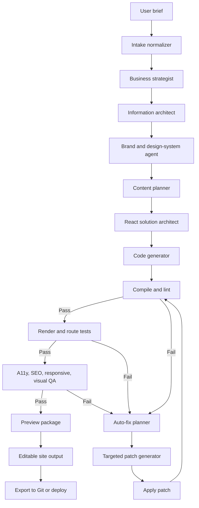

# SajtMaskin — Agentvänlig spec för promptorkestrering, React-hemsidor och auto-fix

## Syfte
Detta dokument beskriver en målarkitektur för en AI-driven hemsidebyggare som genererar, verifierar och automatiskt reparerar React-hemsidor. Dokumentet är skrivet för att kunna användas direkt som underlag till andra agenter, planerare, arkitekter eller implementatörer.

Målet är att definiera en motor som är mer robust än en enkel “prompt in → kod ut”-lösning, och i stället fungerar som en orkestrerad pipeline med specialiserade steg, verifiering och automatiska fixloopar.

---

## Status för jämförelse mot nuvarande projekt
Den direkta GitHub-grenen `Jakeminator123/sajtmaskin` / `jakob` kunde inte läsas från verktygen i detta sammanhang. Därför är jämförelsen nedan försiktig och bygger endast på det som går att verifiera publikt.

Det som går att verifiera publikt är att SajtMaskin/Sajtstudio kommunicerar:
- AI-driven webbplatsgenerering
- fokus på affärsmål
- SEO från start
- unik sajt i stället för bara mallar
- produktionsklar kod som kan redigeras vidare

Detta är en stark produktposition. Det som **inte** går att verifiera härifrån är om den interna implementationen redan har:
- strikt agentuppdelning
- JSON-kontrakt mellan steg
- validator swarm
- diff-baserad auto-fix
- visual regression
- acceptance gates
- design token engine
- patch planner
- tracebar prompt state

All gap-analys mot den faktiska koden ska därför ses som en målbild och inte som ett definitivt påstående om nuvarande implementation.

---

## Grundtes
Bygg inte en enda stor promptmotor.

Bygg i stället en kedja av specialiserade steg där varje steg producerar en strikt, verifierbar mellanrepresentation som nästa steg tar över.

### Rätt modell
`User intent → affärsstrategi → informationsarkitektur → designsystem → sidplan → komponentplan → kodgenerering → verifiering → auto-fixloop → preview/export`

### Fel modell
`“Bygg en modern React-hemsida för X” → 1 stor kodblob`

Den senare är snabb för demo, men den förra är det som skalar till produkt.

---

## Designprinciper

### 1. Separera ansvar hårt
Varje agent ska ha en tydlig roll och inte göra andra agenters arbete.

Exempel:
- strateg-agenten ska inte skriva React-kod
- kodgeneratorn ska inte hitta på affärsmål
- auto-fixern ska inte skriva om hela projektet om ett litet fel kan patchas

### 2. Mellanrepresentationer är förstaklassiga artefakter
Varje steg ska producera maskinläsbara objekt, helst JSON med fasta fält.

### 3. Kod ska genereras från plan, inte direkt från användarprompt
Generatorn ska bygga från en byggplan (`build_plan.json`) snarare än att improvisera från användarens fria text.

### 4. Fixar ska vara diff-baserade
När något går fel ska systemet försöka göra minsta möjliga patch, inte regenerera hela projektet.

### 5. “Klart” måste definieras
Ett projekt är inte klart bara för att det ser okej ut. Det ska passera definierade acceptance gates.

---

## Målarkitektur

### Steg A — Intake / Brief normalizer
Tar in fri användartext och normaliserar den till ett strukturerat projektbrief.

**Input**
- verksamhet
- målgrupp
- mål
- tonalitet
- referenser
- CTA
- SEO-nyckelord
- önskat antal sidor
- brand assets
- tekniska constraints

**Output**
- `project_brief.json`

**Ansvar**
- tolka användarens avsikt
- göra vag input strukturerad
- synliggöra luckor eller antaganden
- inte skriva kod

---

### Steg B — Strateg-agent
Översätter briefen till affärslogik och konverteringsstrategi.

**Output**
- `strategy.json`

**Innehåll**
- positionering
- value propositions
- CTA-hierarki
- trust signals
- differentiering
- content priorities
- konverteringsmål

**Ansvar**
- tänka som en strategist
- definiera vad sajten ska uppnå
- inte planera React-komponenter

---

### Steg C — IA-agent (Information Architecture)
Definierar sajtkartan och sektionerna.

**Output**
- `information_architecture.json`

**Innehåll**
- sitemap
- sidtyper
- sektioner per sida
- internlänkningsplan
- SEO-intention per sida

**Ansvar**
- skapa struktur
- säkerställa logisk navigering
- förbereda content- och komponentplanering

---

### Steg D — Brand/UI-agent
Skapar designsystem och visuella regler.

**Output**
- `design_system.json`

**Innehåll**
- färgroller
- typografi
- spacing scale
- radius
- elevation/shadows
- knappar
- formulär
- cards
- sektionernas rytm
- responsiva regler

**Ansvar**
- definiera token-baserad styling
- skapa konsekvent visuell grund
- inte generera hela sidor

---

### Steg E — Content-agent
Skapar textstruktur och innehållsmodell.

**Output**
- `content_model.json`

**Innehåll**
- rubriker
- underrubriker
- CTA-copy
- FAQ
- proof blocks
- metadata
- schema markup-plan
- innehåll per sektion

**Ansvar**
- skriva innehåll som matchar strategi och IA
- hålla innehållet separerat från komponentimplementering

---

### Steg F — React architect
Översätter strategi, IA, designsystem och content till en konkret teknisk byggplan.

**Output**
- `build_plan.json`

**Innehåll**
- router-struktur
- layouts
- komponentlista
- shared sections
- data contracts
- filplan
- återanvändning
- redigerbarhet/CMS-punkter

**Ansvar**
- bestämma hur React-projektet ska byggas
- planera återanvändning och mappstruktur
- definiera gränssnitt mellan komponenter

---

### Steg G — Code generator
Implementerar byggplanen som faktisk kod.

**Output**
- genererade filer i projektet

**Typiska utdata**
- routes
- layouts
- sections
- components
- styles/tokens
- metadata
- content files
- config-filer

**Ansvar**
- följa byggplanen exakt
- inte improvisera affärslogik
- inte skriva om fungerande delar i onödan

---

### Steg H — Validator swarm
Verifierar att resultatet fungerar tekniskt och kvalitativt.

**Output**
- `validation_report.json`

**Kontroller**
- TypeScript
- ESLint
- build
- hydration
- route rendering
- accessibility
- responsive layout
- SEO-basics
- broken links
- content sanity
- visual consistency

---

### Steg I — Auto-fixer
Tar in felrapporter och genererar riktade patchar.

**Output**
- `patch_tasks.json`
- patchade filer eller diffar

**Ansvar**
- läsa compiler errors
- läsa test failures
- prioritera minsta möjliga fix
- reparera utan full regeneration

---

### Steg J — Acceptance gate
Godkänner endast projekt som uppfyller definierade minimikrav.

**Projektet är inte klart förrän följande passerar**
- build = green
- utpekade routes renderar
- inga blockerande accessibility-fel
- CTA finns på rätt ställen
- metadata finns
- mobil och desktop håller miniminivå
- inga kritiska console/runtime-fel

---

## Flödesschema för promptorkestrering



---

## Rekommenderade kärnartefakter
Dessa objekt bör vara förstaklassiga i systemet:

- `ProjectBrief`
- `StrategyPlan`
- `SitemapPlan`
- `DesignTokenSet`
- `ContentPlan`
- `BuildPlan`
- `ValidationReport`
- `PatchTask`
- `AcceptanceReport`

---

## Exempel på JSON-kontrakt

### `project_brief.json`
```json
{
  "business_type": "",
  "audience": [],
  "primary_goal": "",
  "secondary_goals": [],
  "brand_tone": "",
  "pages": [],
  "cta": [],
  "seo_keywords": [],
  "references": [],
  "constraints": []
}
```

### `strategy.json`
```json
{
  "positioning": "",
  "value_propositions": [],
  "cta_hierarchy": [],
  "trust_signals": [],
  "content_priorities": [],
  "conversion_strategy": ""
}
```

### `information_architecture.json`
```json
{
  "sitemap": [],
  "page_types": [],
  "sections_per_page": {},
  "internal_linking": [],
  "seo_intent_per_page": {}
}
```

### `design_system.json`
```json
{
  "colors": {},
  "typography": {},
  "spacing": {},
  "radius": {},
  "elevation": {},
  "components": {},
  "responsive_rules": {}
}
```

### `content_model.json`
```json
{
  "pages": {},
  "seo_metadata": {},
  "faq": [],
  "cta_copy": [],
  "schema_markup_plan": []
}
```

### `build_plan.json`
```json
{
  "framework": "react",
  "language": "typescript",
  "routing": "",
  "file_structure": [],
  "layouts": [],
  "routes": [],
  "components": [],
  "shared_sections": [],
  "data_contracts": [],
  "content_sources": []
}
```

### `validation_report.json`
```json
{
  "build_status": "pass|fail",
  "lint_status": "pass|fail",
  "typecheck_status": "pass|fail",
  "runtime_status": "pass|fail",
  "a11y_issues": [],
  "seo_issues": [],
  "responsive_issues": [],
  "content_issues": [],
  "visual_consistency_issues": []
}
```

### `patch_tasks.json`
```json
{
  "tasks": [
    {
      "priority": "high",
      "file": "",
      "problem": "",
      "expected_fix": "",
      "acceptance_check": ""
    }
  ]
}
```

---

## Promptprinciper

### Regel 1 — En agent, en roll
Varje prompt ska ha en enda tydlig roll.

### Regel 2 — Strikt outputformat
Varje steg ska returnera JSON eller annat fördefinierat schema.

### Regel 3 — Ingen fri essä mellan steg
Maskin-steg ska inte skriva fritt resonemang. De ska skriva strukturerad output.

### Regel 4 — Kodgeneratorn ska ha hårda constraints
Exempel:
- React + TypeScript
- definierad routermodell
- definierad mappstruktur
- definierad tokenkälla
- inga oplanerade beroenden
- inga full rewrites vid patchning

### Regel 5 — Fixern får endast relevant kontext
Fixer-prompten ska få:
- compiler/test log
- relevanta filer eller filutdrag
- tydligt mål
- acceptance-krav

Den ska **inte** få hela projektet i onödan.

---

## Exempel på agentprompter

### 1. Brief normalizer
**Systemprompt**
> Du omvandlar fri användartext till ett strikt projektbrief för en AI-driven webbplatsgenerator. Returnera endast JSON enligt schema. Gör inga implementationer och skriv ingen kod.

### 2. Strateg-agent
**Systemprompt**
> Du är konverteringsstrateg för webbplatser. Skapa positionering, budskap, trust signals och CTA-hierarki. Returnera endast JSON enligt schema. Ingen kod, inga designbeslut.

### 3. IA-agent
**Systemprompt**
> Du är informationsarkitekt. Skapa sitemap, sidtyper, sektioner och internlänkningsplan. Returnera endast JSON enligt schema. Ingen kod.

### 4. Design-system-agent
**Systemprompt**
> Du definierar ett konsekvent token-baserat design system för React/Tailwind. Returnera endast JSON enligt schema. Ingen sidspecifik implementation.

### 5. Content-agent
**Systemprompt**
> Du skriver strukturerat innehåll för webbplatssektioner baserat på strategi och informationsarkitektur. Returnera endast JSON enligt schema. Ingen React-kod.

### 6. React architect
**Systemprompt**
> Du översätter strategi, IA, design system och content model till en konkret React-byggplan. Returnera endast JSON enligt schema. Ingen slutkod.

### 7. Code generator
**Systemprompt**
> Implementera exakt enligt build_plan. Följ filkontrakt, komponentplan och design tokens. Skapa endast nödvändiga filer. Gör inga affärsbeslut.

### 8. Auto-fixer
**Systemprompt**
> Du får compiler errors, test failures och relevanta filutdrag. Returnera minsta möjliga patchplan och uppdaterade filer. Gör ingen full omskrivning om en riktad patch räcker.

---

## Auto-fixloopar

### Fixloop 1 — Kodkvalitet
Kör:
- `tsc --noEmit`
- `eslint`
- build

Vid fel:
- gruppera fel per fil
- skapa patch tasks
- kör fixer per felkluster
- rebuild

### Fixloop 2 — Render/verifiering
Verifiera:
- startsida
- servicesida
- kontaktsida
- 404-sida
- mobil viewport
- desktop viewport

Vid fel:
- fånga DOM error
- fånga console error
- fånga route-level renderfel
- patcha endast drabbad route/komponent

### Fixloop 3 — UX och SEO
Kontrollera:
- `title`
- `meta description`
- H1
- CTA above the fold
- logiska sektioner
- interna länkar
- alt-texter
- canonical
- schema markup där relevant

### Fixloop 4 — Design consistency
Kontrollera:
- spacing scale
- färgroller
- typografihierarki
- button states
- section rhythm
- contrast

### Fixloop 5 — Content sanity
Kontrollera:
- placeholdertext
- dubbla rubriker
- generiska claims
- tomma testimonials
- CTA mismatch
- inkonsekvent tonalitet

---

## Rekommenderad repo-struktur

```text
/apps
  /web
    /src
      /app
      /components
      /sections
      /lib
      /styles
      /content
      /generated
      /validators

/packages
  /prompt-contracts
  /design-system
  /site-schema
  /qa-rules
  /shared-utils

/services
  /orchestrator
  /agents
    /brief-normalizer
    /strategist
    /ia
    /design-system
    /content
    /react-architect
    /generator
    /fixer
  /pipelines
  /patch-engine
  /telemetry
```

---

## Hur orkestratorn bör fungera
Orkestratorn ska vara navet som:
- anropar rätt agent i rätt ordning
- validerar output mot schema mellan varje steg
- sparar artefakter så att systemet kan återuppta eller felsöka
- triggar validatorer efter kodgenerering
- startar auto-fixloop vid fel
- stoppar först när acceptance gates passerar

### Orkestratorn bör spara minst följande per körning
- input prompt
- normaliserat brief
- strategi
- IA
- design tokens
- content model
- build plan
- genererade filer
- validation reports
- patch history
- slutligt acceptance report

---

## Acceptance criteria
Ett projekt ska minst uppfylla följande innan det markeras som klart:

### Teknik
- TypeScript passerar
- ESLint passerar eller har endast icke-blockerande varningar
- build passerar
- inga blockerande runtimefel

### Rendering
- startsidan renderar
- utpekade huvudsidor renderar
- 404 fungerar
- mobil och desktop fungerar på miniminivå

### UX och innehåll
- tydlig hero
- minst en synlig CTA ovanför fold på startsidan
- logisk navigering
- inga tydliga platshållartexter
- innehållet matchar verksamheten

### SEO
- `title` finns på varje indexerad sida
- `meta description` finns
- H1 finns och är rimlig
- internlänkar finns
- alt-texter finns där relevant

### Design
- konsekvent spacing
- konsekvent typografi
- tillräcklig kontrast
- konsekvent komponentstil

---

## Vanliga felmönster i sådana här projekt

### 1. För mycket i samma prompt
Resultat:
- inkonsekvent design
- hallucinerade filer
- dålig återanvändning
- otydlig ansvarsfördelning

### 2. Ingen mellanrepresentation
Resultat:
- svårt att reparera
- svårt att debugga
- svårt att jämföra versioner
- svårt att förbättra modellen stegvis

### 3. Full regeneration i stället för patching
Resultat:
- fungerande delar går sönder
- hög varians mellan körningar
- svårt att bygga förtroende i produkten

### 4. Ingen verifierbar definition av “klart”
Resultat:
- demo känns bra men produkten är opålitlig
- quality drift
- svårsupportade projekt

### 5. Branding, content och implementation blandas ihop
Resultat:
- rörigt React-träd
- dålig redigerbarhet
- låg återanvändning

---

## Försiktig jämförelse mot nuvarande projekt
Det som publikt ser ut att vara rätt tänkt:
- affärsmål före mallar
- SEO tidigt i processen
- unik output snarare än ren template-fyllning
- kod som går att ta vidare

Det som sannolikt är den viktigaste möjliga förbättringen, oavsett nuvarande intern implementation, är detta skifte:

**Från “generera kod” till “orkestrera en verifierad leveranskedja”.**

Det är där systemet går från imponerande demo till robust produktmotor.

---

## Rekommenderad utvecklingsordning

### Fas 1 — Stabil pipeline
- inför separata agenter
- inför JSON-kontrakt
- spara artefakter mellan steg
- generera från `build_plan.json`

### Fas 2 — Teknisk verifiering
- lägg till typecheck, lint och build som obligatoriska steg
- skapa auto-fix med riktade patchar
- logga patchhistorik

### Fas 3 — Produktkvalitet
- lägg till route tests
- lägg till A11y/SEO-kontroller
- inför acceptance gates

### Fas 4 — Differentiering
- sektionsbibliotek per vertikal
- learned patch patterns
- prompt memory per projekt
- ranking av layouts utifrån konverteringslogik
- visuell regression och konsistenskontroll

---

## Målbild
Den bästa versionen av SajtMaskin är inte bara en AI som skriver React.

Den är:
- en strateg som förstår affärsmål
- en informationsarkitekt som bygger rätt struktur
- ett designsystem som håller ihop UI:t
- en React-arkitekt som planerar återanvändning
- en generator som följer kontrakt
- en verifieringsmotor som hittar fel
- en fixer som patchar tills sidan faktiskt håller

### Komprimerad målformulering
**En orkestrerad sajtmotor som tänker som en strateg, planerar som en UX-arkitekt, implementerar som en senior React-utvecklare och reparerar som en CI-pipeline.**

---

## Bilaga: minimispec för agentimplementation
För varje agent bör följande definieras:

### Agent metadata
- namn
- ansvar
- inputschema
- outputschema
- förbjudna beteenden
- fallbackstrategi
- retry-policy

### Exempel
```json
{
  "name": "react-architect",
  "responsibility": "Translate strategy, IA, design system and content into a concrete React build plan.",
  "input_schema": [
    "project_brief.json",
    "strategy.json",
    "information_architecture.json",
    "design_system.json",
    "content_model.json"
  ],
  "output_schema": "build_plan.json",
  "forbidden_behaviors": [
    "Do not generate final code.",
    "Do not invent business goals.",
    "Do not change design tokens."
  ],
  "fallback_strategy": "Return a reduced but valid build plan if some optional inputs are missing.",
  "retry_policy": {
    "max_retries": 2,
    "retry_on": [
      "schema_validation_failure"
    ]
  }
}
```

---

## Användning
Detta dokument kan användas som:
- systemunderlag för andra agenter
- grund för implementation i repo
- referens för promptkontrakt
- bas för CI/validator design
- underlag för roadmap och refaktorering

