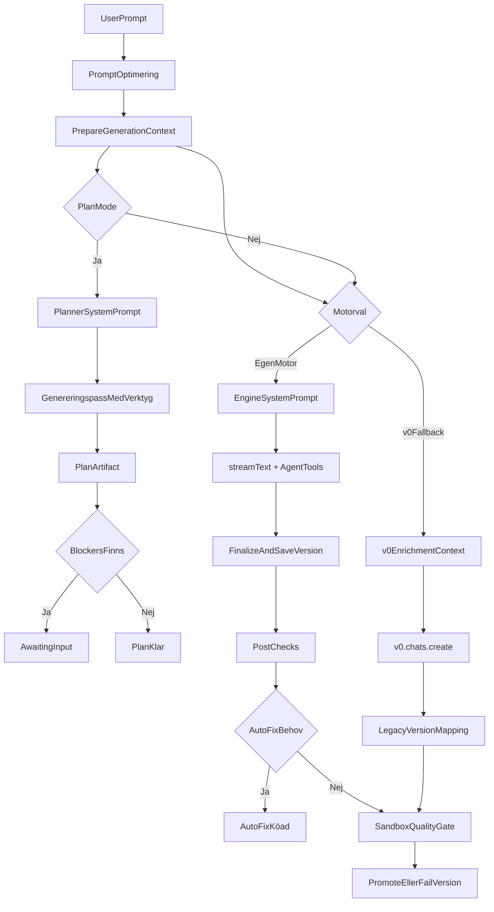

# Slutrapport: buildmotor i Sajtmaskin

## Syfte
Den här rapporten beskriver hur Sajtmaskins nuvarande builddel faktiskt fungerar i kodbasen och jämför den med målarkitekturen i `docs/analyses/2026-03-smb-orchestration-notes/sajtmaskin-prompt-orkestrering.md`.

Fokus ligger på runtime-lanen: hur en användarprompt går från buildern till promptberedning, scaffold- och kontextval, generering, versionssparning, verifiering och eventuell väntan på användarinput. Rapporten skiljer tydligt mellan:

- Sajtmaskins egen motor
- v0 som fallback-lane
- planläge
- verifierings- och reparationssteg

## Kort slutsats
Sajtmaskin har redan passerat stadiet "en prompt in, en rå kodblob ut". Systemet har i dag flera verkliga orkestreringslager: promptoptimering, gemensam kontextberedning, scaffoldval, planläge, agentverktyg för blockerare och integrationer, autofix, syntaxvalidering, project sanity checks, post-checks och sandbox-baserad quality gate.

Samtidigt är systemet ännu inte implementerat enligt svarta lådans fulla målbild. Den största skillnaden är att dagens motor fortfarande i huvudsak är en stark, central genereringspass med stödverktyg och efterkontroller, medan rekommendationen beskriver en strikt fleragentspipeline med separata JSON-kontrakt mellan varje steg. Det finns alltså redan många byggblock, men de är ännu inte organiserade som den formella leveranskedja som dokumentet förespråkar.

Den mest träffsäkra beskrivningen av nuläget är:

> Sajtmaskin har en egen genereringsmotor med gemensam kontextorkestrering, scaffold-driven runtime, planläge och flera verifieringslager, men inte ännu den fulla kontraktsdrivna fleragentspipeline som svarta lådans dokument rekommenderar.

## Övergripande arkitektur

### Två runtime-lanes
I nuläget finns två sätt att generera:

1. Egen motor
2. v0-fallback

Båda använder samma förberedande kontextlager, men olika generatorer.

- Den delade förberedelsen sker i `src/lib/gen/orchestrate.ts` via `prepareGenerationContext()`.
- Valet mellan egen motor och v0-fallback sker i `src/lib/gen/fallback.ts`.
- Den huvudsakliga orkestreringen för nya chats sker i `src/app/api/v0/chats/stream/route.ts`.

### Viktig skillnad mellan lanes
- Egen motor genererar via AI SDK/OpenAI i `src/lib/gen/engine.ts`.
- v0-fallback genererar via `v0.chats.create(...)` i `src/app/api/v0/chats/stream/route.ts`.

Det betyder att v0 i den här arkitekturen inte är "motor" i allmän mening, utan en separat fallback-lane när metadatan och miljöflaggan tillåter det.

### Runtime lane och research lane
Kodbasen följer redan en viktig domänseparation:

- Runtime lane: scaffold-driven generering
- Research lane: kuraterad referensdata som används för promptberikning

Det syns tydligt i `src/lib/gen/system-prompt.ts`, där den dynamiska promptkontexten kan använda:

- knowledge base-sökning
- registry enrichment
- template library-sökning
- referenskodsnuttar

Detta är viktigt eftersom template library i nuläget inte är en egen runtime-lane. Den fungerar som referens- och inspirationslager som matar den riktiga runtime-lanen.

## Hur systemet fungerar i dag

### 1. Prompten normaliseras och komprimeras
Första steget är `orchestratePromptMessage()` i `src/lib/builder/promptOrchestration.ts`.

Det här steget:

- klassificerar prompttyp
- sätter budgetmål
- känner av tekniskt innehåll som inte får förkortas
- avgör om prompten ska skickas direkt, summeras eller fasas som `Plan -> Build -> Polish`

Det är alltså viktigt att förstå att dagens "prompt orchestration" främst är promptstrategi och promptkompression, inte en full affärs-/IA-/design-/content-orkestrator enligt svarta lådans modell.

### 2. Gemensam kontext bereds för båda generatorspåren
`prepareGenerationContext()` i `src/lib/gen/orchestrate.ts` är ett centralt nav i dagens arkitektur.

Det steget:

- väljer scaffold automatiskt eller manuellt
- återanvänder tidigare scaffold om sådan finns
- serialiserar scaffold till promptkontext
- infererar capabilities
- bygger antingen:
  - full `engineSystemPrompt` för egen motor
  - `v0EnrichmentContext` för v0-fallback

Det innebär att scaffoldval, brief, theme, palette, designreferenser och custom instructions inte dupliceras mellan lanes, utan kommer från samma källa.

### 3. Den dynamiska systemprompten är mer avancerad än bara "lite extra text"
`src/lib/gen/system-prompt.ts` visar att systemprompten består av två tydliga lager:

- `STATIC_CORE`
- dynamisk kontext

Den dynamiska kontexten kan innehålla:

- build intent-regler
- scaffoldkontext
- project context från brief
- visual identity
- imageryregler
- SEO-data
- knowledge-base-träffar
- template references
- referenskodsnuttar
- originalprompten som referens

Det här är ett starkt tecken på att systemet redan är mer än en enkel prompt. Samtidigt är detta fortfarande ett promptcentrerat kontrollager, inte separata artefakter som `strategy.json`, `information_architecture.json` och `content_model.json`.

### 4. Planläge finns som separat runtime-path
Om `planMode` är aktivt i metadatan går requesten in i en särskild plan-path i `src/app/api/v0/chats/stream/route.ts`.

Planläget gör följande:

- återanvänder `prepareGenerationContext()`
- bygger en särskild planner-prompt från `src/lib/gen/plan-prompt.ts`
- kör modellen via samma pipelineinfrastruktur
- tillåter agentverktyg via `src/lib/gen/agent-tools.ts`
- fångar upp `emitPlanArtifact`
- sparar planresultatet som en assistant message med UI-part
- returnerar `awaitingInput: true` om blockers finns

Detta är den del som ligger närmast svarta lådans idé om mellanrepresentationer. Men planartefakten är fortfarande en relativt kompakt plan för byggfasen, inte en full kedja av separata, schema-validerade artefakter för strategi, IA, design system och content.

### 5. Egen motor använder ett enda starkt genereringspass med verktyg
När egen motor används:

- systemet bygger en full `engineSystemPrompt`
- prompten kan URL-komprimeras
- agentverktyg kopplas in
- `createGenerationPipeline()` anropar `generateCode()` i `src/lib/gen/engine.ts`
- `generateCode()` använder `streamText(...)` från AI SDK
- resultatet streamas som SSE

Agentverktygen i `src/lib/gen/agent-tools.ts` gör fyra saker möjliga inne i genereringspasset:

- `suggestIntegration`
- `requestEnvVar`
- `askClarifyingQuestion`
- `emitPlanArtifact`

Detta är ett viktigt nulägesfakta: systemet har agentiskt beteende, men det ligger inuti samma modellkörning snarare än som separata explicita agentsteg mellan olika artefakter.

### 6. Genereringen kan pausas för blockerande beslut
I egen motor-pathen markeras vissa verktygsanrop som blockerande:

- integrationsbehov
- miljövariabler
- klargörande frågor

Om modellen signalerar sådant kan flödet sluta med `awaitingInput` i stället för att skapa en version direkt. Det ligger nära dokumentets tanke om att inte gissa kritiska beroenden, men är implementerat som verktygssignaler i samma körning snarare än som en separat strateg-/arkitektagent före kodgenerering.

### 7. Finalisering är ett helt eget pipelineblock
När egen motor har streamat klart går resultatet in i `finalizeAndSaveVersion()` i `src/lib/gen/stream/finalize-version.ts`.

Det steget gör betydligt mer än att "spara filer". Det kör bland annat:

- autofix pipeline
- syntaxvalidering och multipass-fix
- URL-expansion
- bildmaterialisering
- parsing av CodeProject-formatet
- merge mot scaffold eller föregående version
- importkontroller
- repair pass
- merged syntax-fix
- project sanity checks
- skapande av draft-version
- preflight-loggar
- generationslogg
- blockering av preview om preflight hittar blockerande fel

Detta är ett av de starkaste argumenten för att dagens system redan har verklig buildlogik och inte bara promptning.

### 8. Versioner är livscykelhanterade i egen motor
`src/lib/db/chat-repository-pg.ts` visar att den egna motorn har en tydlig lagringsmodell:

- `engineChats`
- `engineMessages`
- `engineVersions`
- `engineGenerationLogs`

Versioner skapas som `draft` med `verificationState: pending`, kan senare markeras som:

- `verifying`
- `passed` + `promoted`
- `failed`

Det ger ett faktiskt versions- och verifieringslivscykellager, vilket ligger närmare dokumentets acceptance-tänk än en ren demo-generator gör.

### 9. Post-checks utökar verifieringen utanför själva generatorn
Efter generering kör klientnära post-checks i `src/lib/hooks/chat/post-checks.ts`.

De kontrollerar bland annat:

- filförändringar mot föregående version
- misstänkt `use()`-användning
- saknade interna routes
- felaktig `Link`-import
- SEO readiness
- project sanity
- design tokens
- bildvalidering
- preview-länk

Om problem hittas kan autofix köas direkt. Om inga sådana fixskäl finns startas sandbox-baserad quality gate.

Det här motsvarar delvis dokumentets validator swarm, men implementationen är utspridd över heuristiska kontroller och best-effort-flöden snarare än en formell `validation_report.json`.

### 10. Quality gate finns, men är tekniskt fokuserad
Server-side quality gate ligger i `src/app/api/v0/chats/[chatId]/quality-gate/route.ts`.

Den:

- bygger komplett projekt
- skriver filer till `@vercel/sandbox`
- kör `tsc --noEmit`
- kör `next build`
- kan även köra `eslint`
- lagrar loggar
- promote:ar eller fail:ar egen motors versioner

Detta är ett verkligt acceptance-liknande steg, men det är främst tekniskt. Dokumentet föreslår även bredare grindar för:

- accessibility
- responsive layout
- CTA-placering
- content sanity
- visual consistency
- SEO-kriterier

Några av dessa finns i post-checks, men inte ännu som ett enda samlat, formellt godkännandesteg.

### 11. v0-fallback delar kontext men inte hela livscykeln
v0-fallback återanvänder samma `prepareGenerationContext()` och skickar sedan `optimizedMessage` plus `v0EnrichmentContext` till `v0.chats.create(...)`.

Det innebär:

- samma scaffold- och briefsignaler kan nå modellen
- samma builder kan ge ett liknande användarflöde
- men själva genereringen, streamformatet och versionsuppladdningen ligger hos v0

Efteråt mappar systemet tillbaka resultatet till intern datamodell. Det betyder att v0-lanen är integrerad, men inte lika djupt internaliserad som egen motors fulla versions- och verifieringskedja.

## Faktiskt prompt-till-sajt-flöde

## Jämförelse mot svarta lådans målarkitektur

### Sammanfattande bedömning

| Område | Bedömning | Kommentar |
| --- | --- | --- |
| Prompt intake / normalisering | Delvis | Finns som promptoptimering, men inte som strikt `project_brief.json`. |
| Strategi | Saknas | Ingen separat strategist-agent eller artefakt. |
| IA | Saknas | Ingen separat sitemap-/IA-agent eller artefakt. |
| Brand / UI-agent | Delvis | Theme, palette, brief och designreferenser finns, men inte som egen agent med eget JSON-kontrakt. |
| Content-agent | Saknas | Innehåll produceras i praktiken i generatorn, inte i separat content model. |
| React architect | Delvis | Planläge ger viss byggplan, men inte full `build_plan.json` som styr all generering. |
| Code generator | Finns | Egen motor och v0-fallback genererar faktiskt kod/sajter. |
| Validator swarm | Delvis | Många kontroller finns, men de är utspridda och inte samlade som en formell swarm med enhetlig rapport. |
| Auto-fixer | Delvis | Flera fixer-steg finns, men inte en tydlig `patch_tasks.json`-driven patch planner. |
| Acceptance gate | Delvis | Tekniskt quality gate finns, men produkt- och UX-kriterier är inte fullt formaliserade. |
| Artefaktlagring | Delvis | Chats, messages, versions och loggar finns, men inte hela kedjan av mellanartefakter. |

## Steg-för-steg mot specifikationen

### A. Intake / Brief normalizer
Dokumentets målbild kräver ett strukturerat `project_brief.json`.

I nuvarande system finns följande närliggande delar:

- `orchestratePromptMessage()` för promptstrategi
- `brief` i metadata
- promptloggning av original/formaterad prompt

Bedömning: `Delvis`

Motivering:
Systemet tar hand om inkommande prompt på ett intelligent sätt, men resultatet är inte en förstaklassig, schema-validerad briefartefakt som alla senare steg bygger vidare på.

### B. Strateg-agent
Dokumentet vill ha positionering, value propositions, CTA-hierarki och trust signals i `strategy.json`.

Bedömning: `Saknas`

Motivering:
Ingen separat strategifas finns i dagens pipeline. Strategiska beslut bakas i stället in i brief, systemprompt och den generativa modellen.

### C. IA-agent
Dokumentet kräver `information_architecture.json`.

Bedömning: `Saknas`

Motivering:
Sitemap och sektioner kan dyka upp i planläge eller briefstruktur, men ingen separat IA-agent producerar en egen, verifierbar artefakt.

### D. Brand/UI-agent
Dokumentet vill ha ett eget `design_system.json`.

I nuvarande system finns:

- `themeColors`
- `designThemePreset`
- `componentPalette`
- visual direction i `brief`
- design references
- regler i systemprompten

Bedömning: `Delvis`

Motivering:
Det finns reell designstyrning, men den lever som promptkontext och UI-state snarare än som ett isolerat designsystemkontrakt mellan separata steg.

### E. Content-agent
Dokumentet vill ha `content_model.json`.

Bedömning: `Saknas`

Motivering:
Innehållet genereras i dag huvudsakligen tillsammans med koden. Det finns inget tydligt content-lager som kan valideras eller patchas separat från implementationen.

### F. React architect
Dokumentet vill ha ett konkret `build_plan.json`.

I nuvarande system finns:

- planläge
- `PLAN_SYSTEM_PROMPT`
- `emitPlanArtifact`
- blockers, assumptions, scaffold och page plan

Bedömning: `Delvis`

Motivering:
Planläget är ett tydligt steg framåt och fungerar som embryot till ett arkitektlager. Men det är ännu inte det centrala kontrakt som generatorn konsekvent måste följa i nästa steg.

### G. Code generator
Dokumentet kräver att kod generatorn bygger exakt från planen.

I nuvarande system:

- egen motor genererar från prompt + systemprompt + scaffold + dynamic context
- v0-fallback genererar från prompt + enrichment context

Bedömning: `Finns`

Motivering:
Det finns en verklig, fungerande code generator. Skillnaden mot målbilden är att den fortfarande främst styrs av promptkontext och scaffold, inte av ett fullständigt `build_plan.json`-kontrakt.

### H. Validator swarm
Dokumentet vill ha en samlad valideringssvärm och `validation_report.json`.

I nuvarande system finns:

- syntaxvalidering
- project sanity
- post-checks
- image validation
- SEO review
- sandbox typecheck/build/lint

Bedömning: `Delvis`

Motivering:
Byggstenarna finns tydligt. Det som saknas är att de samlas i ett enhetligt rapportobjekt med tydlig kontraktsyta och beslutslogik mellan delvalidatorer.

### I. Auto-fixer
Dokumentet vill ha riktade patchar via `patch_tasks.json`.

I nuvarande system finns:

- `runAutoFix`
- `validateAndFix`
- merged syntax fixer
- `repairGeneratedFiles`
- autofix-signalering efter post-checks och quality gate

Bedömning: `Delvis`

Motivering:
Systemet reparerar redan mycket. Men det saknar ännu en explicit patch planner som beskriver vilka diffar som ska göras, i vilken ordning, och varför.

### J. Acceptance gate
Dokumentet vill godkänna projekt först när både tekniska och produktmässiga kriterier passerat.

I nuvarande system finns:

- preflight-fel som kan blockera preview
- quality gate med typecheck/build/lint
- versionspromotion/fail
- vissa UX/SEO-kontroller i post-checks

Bedömning: `Delvis`

Motivering:
Det finns redan en faktisk gate, men den är inte ännu fullständigt definierad som en enda acceptance policy med både teknik, innehåll, UX, SEO, a11y och design consistency.

## Vad systemet redan gör bättre än en enkel demo-motor

### 1. Gemensam kontextorkestrering
Samma förberedande lager används för egen motor och v0-fallback. Det minskar drift mellan lanes.

### 2. Scaffold-driven runtime
Generering sker inte helt från noll. Runtime scaffolds används som startpunkt och merge-bas.

### 3. Faktisk versionslivscykel
Egen motor har draft/verifying/passed/failed/promoted-livscykel, inte bara "senaste output".

### 4. Flera reparationslager
Autofix, syntaxfix, repair pass, sanity checks och quality gate visar att systemet redan försöker stabilisera resultatet efter generering.

### 5. Möjlighet att stanna upp vid blockerare
Miljövariabler, integrationer och klargörande frågor kan redan signaleras innan systemet låtsas att det kan bygga klart allt.

### 6. Planläge är ett verkligt mellanlager
Även om det inte är hela målbilden är planläget ett tydligt steg mot kontraktsdriven generering.

## Största gapen mot målbilden

### 1. För mycket ansvar ligger fortfarande i samma genereringspass
Det mesta avgörs fortfarande i ett sammanhållet modelldrag med verktyg och efterkontroller. Dokumentets målbild vill i stället låta flera explicita steg äga varsin del av besluten.

### 2. Mellanrepresentationerna är inte förstaklassiga nog
Planartefakt finns, men kedjan:

- `project_brief.json`
- `strategy.json`
- `information_architecture.json`
- `design_system.json`
- `content_model.json`
- `build_plan.json`
- `validation_report.json`
- `patch_tasks.json`

finns inte som faktisk standardpipeline.

### 3. Generatorn bygger inte strikt från byggplan
I dagens arkitektur genereras koden från prompt + systemprompt + scaffold + enrichment. Det är starkt, men inte lika kontrollerbart som att låta generatorn lyda ett separat, validerat build-plan-kontrakt.

### 4. Validatorerna är utspridda
Validering finns, men är spridd mellan:

- finalisering
- post-checks
- image validation
- quality gate
- loggar

Det gör systemet kraftfullt, men mindre lätt att förstå, återuppta och jämföra över tid än en samlad validator-orkestrator.

### 5. Patchstrategin är implicit snarare än explicit
Många fixar händer redan, men det saknas ännu ett tydligt patchplan-lager som kan inspekteras, prioriteras och utvärderas som egen artefakt.

## Hur nära ligger systemet rekommendationen?

### Arkitektoniskt
Relativt nära i anda, men inte i form.

Systemet delar flera av dokumentets grundidéer:

- använd scaffold i stället för tom generation
- gör mer än bara en prompt
- validera resultatet
- reparera automatiskt
- fånga blockerande integrationsbehov
- bygg versions- och verifieringslager

Men det följer inte ännu dokumentets föreslagna form:

- separata agenter per ansvar
- schema-validerade artefakter mellan stegen
- generator som styrs av `build_plan.json`
- samlad validator swarm
- explicit patch planner

### Produktmässigt
Systemet ser ut att vara på väg från "imponerande generator" mot "pålitlig buildmotor", men den formella kontraktskedjan är ännu inte fullt etablerad.

## Prioriterade rekommendationer

### Prioritet 1: gör planartefakten till verkligt styrkontrakt
Den enskilt viktigaste förbättringen är att låta planläget gå från hjälpmedel till styrande kontrakt.

Det innebär:

- standardisera planartefakten vidare mot ett riktigt `build_plan.json`
- låt generatorn explicit läsa planen, inte bara originalprompten
- spara planen som förstaklassig artefakt per körning/version

Detta är den kortaste vägen från dagens system till dokumentets målbild.

### Prioritet 2: separera brief, strategi och IA före kod
Inför minst tre tydliga mellanlager före kodgenerering:

- normaliserat brief
- strategi
- IA/site map

Det behöver inte börja som full agent-swarm. Det kan börja som tre små kontraktssteg i samma orkestrator, men med separata schemaobjekt.

### Prioritet 3: samla verifieringen i ett enhetligt `validation_report`
Behåll dagens kontroller, men samla dem till en gemensam rapportstruktur med fält för:

- syntax
- typecheck
- build
- sanity
- SEO
- images
- routes
- a11y
- visual consistency

Det gör systemet enklare att felsöka, jämföra och utvärdera.

### Prioritet 4: inför explicit patch planner
Bygg ett eget lager som producerar patchuppgifter i stil med `patch_tasks.json`, även om de under huven fortfarande exekveras av befintliga fixer-funktioner.

Det skulle göra dagens implicit distribuerade fixlogik mer transparent.

### Prioritet 5: formalisera acceptance gate som policy
Låt en enda acceptance-rapport avgöra om en version är:

- klar för preview
- klar för promoted
- preliminär
- blockerad

Den bör väga samman både tekniska och produktmässiga kriterier.

## Slutbedömning
Sajtmaskins nuvarande builddel är inte bara ett tunt lager ovanpå v0 och den är inte heller bara en "svart låda" i betydelsen att allt sker i ett enda otydligt promptsteg. Den egna motorn innehåller redan flera tydliga lager för:

- promptstrategi
- scaffold-driven kontext
- generering
- versionshantering
- verifiering
- reparation

Det som återstår för att närma sig svarta lådans målarkitektur är främst inte att lägga till "mer AI", utan att göra de befintliga besluten mer explicita, mer artefaktbaserade och mer kontraktsdrivna.

Om man ska sammanfatta den viktigaste riktningen i en mening är den här:

> Nästa stora steg för Sajtmaskins buildmotor är att gå från central promptstyrd generering med starka efterkontroller till en formell, artefaktbaserad orkestrator där varje större beslut lever i ett eget verifierbart kontrakt.

## Kort rekommenderad målbild för nästa iteration

1. Behåll nuvarande egen motor, scaffoldval, finalisering och quality gate.
2. Gör planläget till obligatoriskt internt steg för större builds.
3. Bryt ut `brief`, `strategy`, `IA` och `build plan` som sparade artefakter.
4. Låt generatorn bygga från planen snarare än från fri prompt.
5. Samla verifiering och patchning i en tydlig acceptance-kedja.

Det skulle ligga mycket nära rekommendationen i `docs/analyses/2026-03-smb-orchestration-notes/sajtmaskin-prompt-orkestrering.md` utan att kasta bort de stabila delar som redan finns i dagens implementation.
