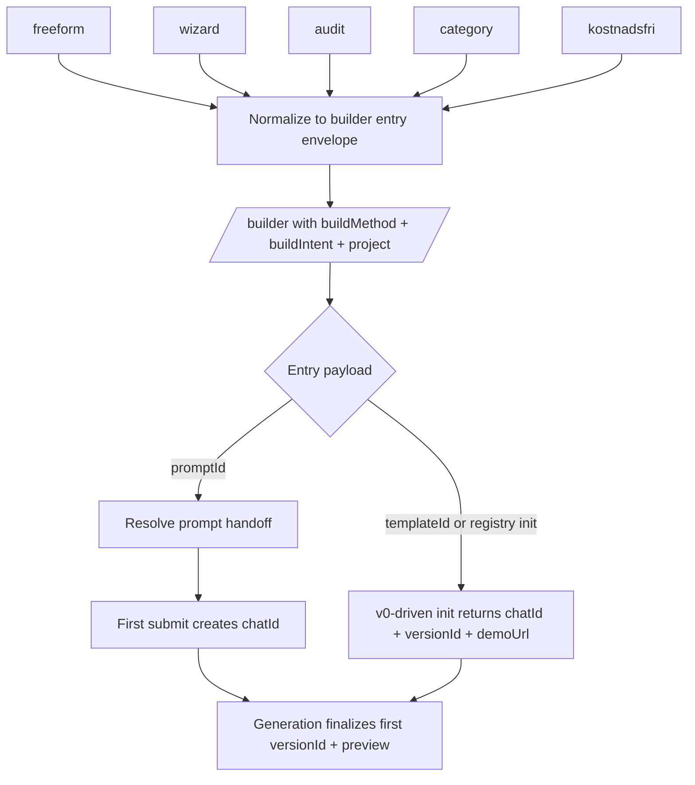

# Builder Entry Flow

## Scope

This document defines the current high-level model for how sessions enter
`/builder`.

Primary code sources:

- `src/app/page.tsx`
- `src/app/category/[type]/page.tsx`
- `src/app/builder/useBuilderState.ts`
- `src/app/builder/useBuilderPageController.ts`
- `src/app/builder/useBuilderEffects.ts`
- `src/app/builder/useBuilderPromptActions.ts`
- `src/lib/hooks/chat/useCreateChat.ts`
- `src/app/api/template/route.ts`
- `src/app/api/v0/chats/init-registry/route.ts`

## Canonical Public Model

The public builder-entry story should stay centered on the five canonical
`BuildMethod` values already used in code.

| `BuildMethod` | Product surface | Typical entry artifact | Expected state at first builder render |
|---|---|---|---|
| `freeform` | Start page `Fritext` | `promptId` | `appProjectId` exists, `chatId` absent, `versionId` absent |
| `wizard` | Start page `Analyserad` | `promptId` | `appProjectId` exists, `chatId` absent, `versionId` absent |
| `audit` | Start page `Audit` | `promptId` | `appProjectId` exists, `chatId` absent, `versionId` absent |
| `category` | Category/gallery prompt entry | `promptId` or `templateId` | prompt-driven category behaves like the three rows above |
| `kostnadsfri` | Cost-free funnel | `promptId` | `appProjectId` exists, `chatId` absent, `versionId` absent |

Important clarifications:

- Blank `/builder` is a utility bootstrap path, not a sixth canonical public
  `BuildMethod`.
- The v0-driven Vercel template path is not a sixth `BuildMethod`. It is a
  special initialization strategy that usually enters under `buildMethod=category`
  and carries `templateId`.
- Runtime scaffold selection is a later generation concern. It is not a builder
  entry point.

## Identifier Lifecycle

| Identifier | Meaning | Prompt-driven expectation | v0-driven template expectation |
|---|---|---|---|
| `project` URL param | Transport field for `appProjectId` | should exist before first send | should exist, but returned server `projectId` must reconcile cleanly |
| `appProjectId` | Durable Sajtmaskin project root | should exist before first chat create | should exist or be adopted from init response |
| `chatId` | Durable builder conversation ID | created on first submit | may already exist on first builder render |
| `versionId` | Saved version snapshot | created after first generation finalizes | may already exist on first builder render |
| `demoUrl` | Active preview source | appears after first version finalization | may already exist on first builder render |
| `sandboxUrl` | Version-level sandbox runtime URL | not part of first entry render | optional later preview/runtime state, not an entry field |

## High-Level Flow

## Recommended Standard

1. Every supported builder session should converge on a durable `appProjectId`.
2. Prompt-driven entry should keep a durable prompt handoff until the first
   `chatId` exists.
3. `chatId` should always be treated as server-generated.
4. `versionId` should not be expected on the first builder render for
   prompt-driven flows.
5. `templateId` should be treated as a transient initializer, not the durable
   identity of the builder session.
6. `source=audit` should remain a compatibility helper, not the primary
   discriminator for entry behavior.
7. `Sandbox` is not part of the builder-entry contract. It belongs to a later
   preview/runtime bridge track.

## Current Implementation Gaps

- Prompt handoff is consumed and removed from the URL before the first chat
  exists, which makes refresh-before-send fragile.
- Category slug transport is not part of the canonical builder state contract.
- The v0-driven template and registry init paths can return a `projectId` that
  needs stronger reconciliation with the active `appProjectId`.
- Sandbox preview persistence has improved: the builder now persists a preview
  override and also stores `sandboxUrl` on the version. It still belongs to a
  separate preview/runtime bridge concern, not to the builder-entry contract.

## Out Of Scope

This document does not redefine:

- runtime scaffold selection
- prompt orchestration internals
- deploy lifecycle
- detailed sandbox implementation design
