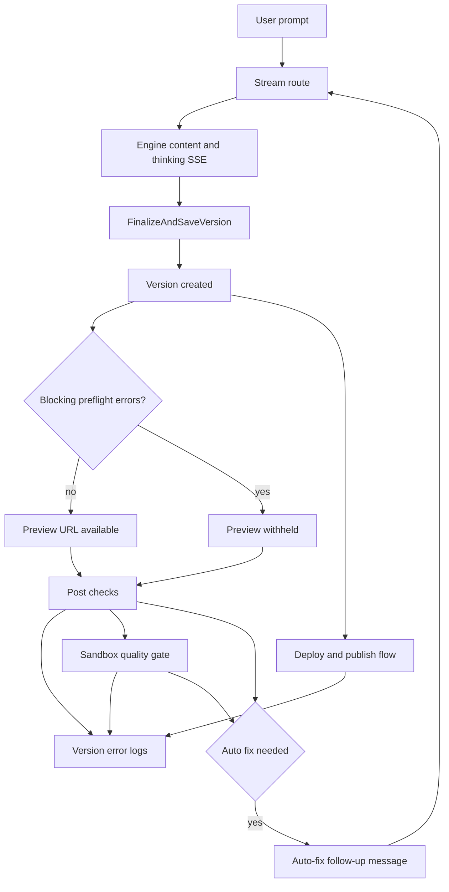

# Generation Loop And Error Memory

This document is the canonical human-readable overview for how Sajtmaskin
currently handles:

- generation streaming
- version creation
- persisted error logs
- scaffold traceability
- post-check and deploy feedback
- assistant bubble rendering during code generation

For builder-side project settings semantics, phase visibility, and clarifying
question UX, see `docs/architecture/project-settings-and-builder-questions.md`.

## Scope

This describes the current behavior after the preview-guard and error-memory
hardening pass on `egen-motor-v2`.

The system still creates a persisted version before the client-side post-check
and quality-gate layers finish, but it now withholds the active preview URL for
versions that fail blocking server-side preflight checks.

## Current Loop

## What Is Persisted Today

### Own engine

- Chat-level scaffold choice is stored in `engine_chats.scaffold_id`.
- Versions are stored in `engine_versions`.
- Version error logs are stored in `engine_version_error_logs`.

Relevant code sources:

- `src/lib/db/schema.ts`
- `src/lib/db/chat-repository-pg.ts`
- `src/lib/db/services/version-errors.ts`

### v0 fallback

- v0-backed versions are stored in `versions`.
- v0-backed version error logs are stored in `version_error_logs`.

Relevant code sources:

- `src/lib/db/schema.ts`
- `src/lib/db/services/version-errors.ts`

## Error Categories And Writers

The system now has one practical rule: if an issue is tied to a version, it
should end up in the version error-log route or the matching DB service.

Common categories:

| Category | Main writer | Notes |
|---|---|---|
| `preflight:summary` | `src/lib/gen/stream/finalize-version.ts` | Server-side summary after final repair/sanity pass |
| `preflight:issues` | `src/lib/gen/stream/finalize-version.ts` | Detailed preflight issues |
| `render-telemetry` | `src/lib/gen/eval/render-telemetry.ts` | Preview rendered or failed after version creation |
| `preview` | `src/components/builder/PreviewPanel.tsx` | Runtime preview errors reported from iframe/client layer |
| `post-check` | `src/lib/hooks/chat/post-checks.ts` | Client post-check runner failure |
| `quality-gate` | `src/lib/hooks/chat/post-checks.ts` | Client aggregate failure summary after generation |
| `preflight:quality-gate` | `src/app/api/v0/chats/[chatId]/quality-gate/route.ts` | Sandbox summary log |
| `quality-gate:typecheck` / `quality-gate:build` / `quality-gate:lint` | `src/app/api/v0/chats/[chatId]/quality-gate/route.ts` | Sandbox command failures |
| `css` | `src/app/builder/useBuilderDeployActions.ts` | CSS validation results after generation |
| `unicode` | `src/app/builder/useBuilderDeployActions.ts` | Text normalization results |
| `deploy` | `src/app/builder/useBuilderDeployActions.ts` | Publish/deploy failures tied to the selected version |
| `client` | `src/components/builder/ErrorBoundary.tsx` | Client crash captured by the error boundary |

## Scaffold Traceability

### Where scaffold is stored

- The resolved scaffold is persisted on the engine chat row:
  `engine_chats.scaffold_id`.
- The own-engine chat API now also exposes:
  - `scaffoldId`
  - `scaffoldFamily`
  - `scaffoldLabel`

Relevant code sources:

- `src/app/api/v0/chats/[chatId]/stream/route.ts`
- `src/app/api/v0/chats/[chatId]/route.ts`

### Where scaffold is not stored

- `engine_versions` does not currently have a `scaffold_id` column.
- A version therefore does not have its own dedicated scaffold field.

### What changed in this audit pass

Own-engine version error logs are now enriched server-side with:

- `meta.scaffoldContext.scaffoldId`
- `meta.scaffoldContext.scaffoldFamily`
- `meta.scaffoldContext.scaffoldLabel`
- `meta.scaffoldContext.persistedOn`

That enrichment is derived from `engine_chats.scaffold_id`, so later analysis
of preflight, preview, post-check, quality-gate, and deploy errors does not
have to rely only on temporary UI state.

Relevant code source:

- `src/lib/db/services/version-errors.ts`

## Why A Second Version Can Appear

There are two different fix layers:

### 1. Server-side autofix inside finalization

This happens before the first version is saved.

Examples:

- autofix pipeline
- syntax validation
- LLM fixer retries for syntax issues
- final repair pass

Relevant code source:

- `src/lib/gen/stream/finalize-version.ts`

### Blocking preview guard

After merge and repair, the server now runs one more syntax pass against the
final merged file set that would actually be saved. If blocking errors remain,
the version is marked failed and the stream does not expose an active preview
URL for that version.

Practical effect:

- broken JSX/TS that survives earlier repair passes no longer becomes the active
  own-engine preview by default
- the failed version still exists for diagnostics and repair
- post-check and auto-fix can still inspect it through version logs

Relevant code source:

- `src/lib/gen/stream/finalize-version.ts`

### 2. Client-side autofix after the first version already exists

This happens after:

- the stream has finished
- a version id is known
- the preview can be opened

Then the client runs post-checks and quality-gate checks. If those discover a
problem, `useAutoFix` sends a new follow-up message, which starts a new
generation and can create a second version.

Relevant code sources:

- `src/lib/hooks/chat/stream-handlers.ts`
- `src/lib/hooks/chat/post-checks.ts`
- `src/lib/hooks/chat/useAutoFix.ts`

This is the current reason you can see:

- one generated version
- then a second minimal repair version

### What changed in the hardening pass

Client-side auto-fix now has two extra guards:

- only the newest version in a chat may enqueue an automatic repair prompt
- older pending auto-fix timers are cleared before newer ones are scheduled

This reduces overlapping repair generations where an older version is still
verifying while a newer version has already started generating.

Relevant code source:

- `src/lib/hooks/chat/useAutoFix.ts`

### Critical vs warning classification (2026-03-15)

Autofix reasons are now split into critical and warning. Only critical reasons
(`preview saknas`, `kodsanity error`) trigger a repair generation. Warning
reasons (`misstankt irrelevanta bilder`, `trasiga bilder`, `saknade routes`,
`fel Link-import`, `misstankt use()`) are logged and shown in the post-check
summary but do not start a new generation.

This fixed a loop where `semantic-image` warnings triggered autofix on every
generation because placeholder images always produce the same warning.

The dedupe key now uses `chatId:reasonHash` (ignoring `versionId`) with global
caps: `MAX_AUTOFIX_PER_CHAT = 2`, `MAX_ATTEMPTS_PER_REASON = 1`.

Relevant code sources:

- `src/lib/hooks/chat/post-checks-results.ts`
- `src/lib/hooks/chat/useAutoFix.ts`

### Richer error memory for auto-fix

Automatic repair prompts now summarize persisted version logs more selectively:

- noisy `info` entries like successful render telemetry are filtered out
- quality-gate command output is included when available
- preview, CSS, preflight-issue, and render-telemetry details are prioritized
- SEO warnings are treated as secondary when blocking diagnostics already exist

This makes the repair prompt more similar to a Lovable-style "Try to Fix"
workflow where the repair model receives concrete compiler/runtime evidence
instead of only generic `build failed` summaries.

Relevant code sources:

- `src/lib/hooks/chat/useAutoFix.ts`
- `src/lib/hooks/chat/helpers.ts`

## Why The Chat Bubble Can Look Heavy

There is no hidden second formatting model that rewrites the generated code into
another bubble format.

Current behavior:

1. The stream routes send `thinking` and `content` SSE events.
2. The client accumulates those strings directly into the assistant message.
3. `MessageList` decides how to render that message:
   - `Streamdown` for normal prose
   - `GenerationSummary` when it sees fenced code blocks or `file="..."`
4. `GenerationSummary` parses the raw assistant content and shows:
   - preview prose
   - generated file count
   - code line count
   - optional raw-code expansion

Relevant code sources:

- `src/app/api/v0/chats/stream/route.ts`
- `src/app/api/v0/chats/[chatId]/stream/route.ts`
- `src/lib/hooks/chat/stream-handlers.ts`
- `src/components/builder/MessageList.tsx`
- `src/components/builder/GenerationSummary.tsx`

### The highlighted rounded bubble

The plain dark rounded bubble comes from `GenerationSummary` when parsed content
does not contain usable code blocks, or when the summary renders preview prose
above the file badges.

Relevant code source:

- `src/components/builder/GenerationSummary.tsx`

### Why large code blobs appear

They appear because the model is actually streaming large code/prose payloads.
The UI is not inventing them later. The summary layer only parses and displays
what was already streamed.

That means:

- code can be present in the assistant message itself
- the summary can collapse it visually
- expanding raw code shows the same underlying content, not a second model pass

## Deploy And Publish Errors

Publish/deploy failures are now persisted into the same version error-log path
under the `deploy` category when a selected version exists.

This makes deploy failures easier to correlate with:

- the generated version
- the scaffold context
- preflight and preview issues from the same run

Relevant code source:

- `src/app/builder/useBuilderDeployActions.ts`
- `src/app/api/v0/deployments/route.ts`

For current builder-side env-var semantics, including own-engine fallback
storage and publish-time env sync, see
`docs/architecture/project-settings-and-builder-questions.md`.

## Decryption Safety (2026-03-15)

`decryptValue()` in `src/lib/crypto/env-var-cipher.ts` previously returned the
raw `enc:...` string on failure (wrong key, corrupted data). This could leak
invalid encrypted values into deploys as env var values.

It now throws `DecryptionError`. Callers in `src/lib/project-env-vars.ts` handle
the error gracefully: failed decryption returns `null` and the env var is
excluded from the map rather than being passed through with an invalid value.

## Current Limits

- The system still persists a version before post-check and quality-gate complete.
- Blocking server-side preflight can now withhold the active preview URL, but it
  is still not the same as a full draft/promote lifecycle.
- Client-side auto-fix still creates a new follow-up generation rather than
  mutating the same version in place.
- Scaffold is still persisted canonically on the chat, not on the version row.
- `preview-render` route has no rate limiting or auth check.
- `data:`/`blob:` URLs in generated code are not stripped before being fed back
  as file context; long base64 strings can waste tokens.

## Future Recommendation

If the goal is “only one final version should exist after all fixes pass”, the
next architectural step should be one of these:

1. Draft/promote: create an internal draft version and only release it after
   quality-gate passes.
2. In-place mutation: let repair flows update the same version instead of
   sending a new follow-up generation.
3. Server-side repair loop: run the quality gate before exposing the version and
   retry/fix on the server until the result is acceptable or the system gives up.

This audit pass does not implement that model. It makes the current model easier
to inspect, debug, and reuse later by preserving better error and scaffold
context.
