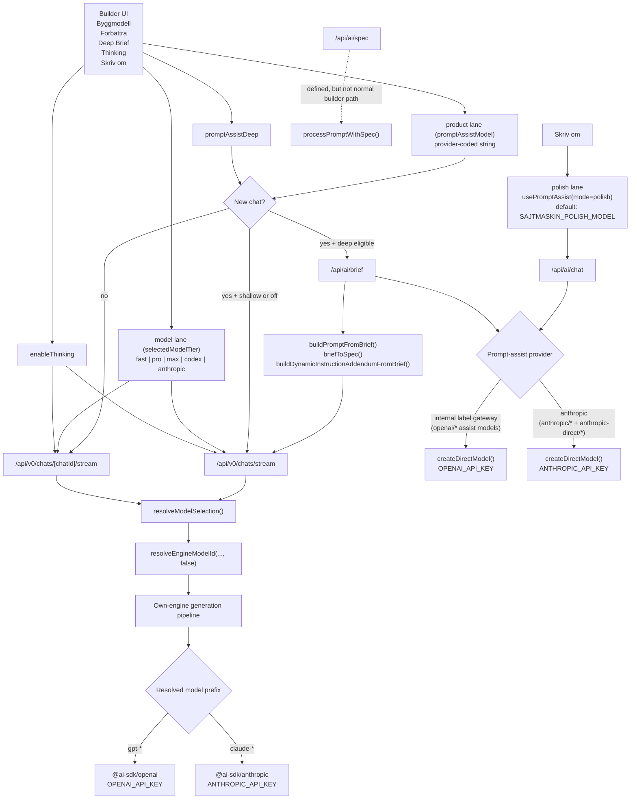

# Builder Model Routing And Trace

This document maps the active builder model lanes end to end:

- what the user sees in the UI
- which route each choice hits
- which provider client actually runs
- where the naming is still historical or misleading

Primary code sources:

- `src/components/builder/BuilderHeader.tsx`
- `src/app/builder/useBuilderState.ts`
- `src/lib/hooks/usePromptAssist.ts`
- `src/lib/models/catalog.ts`
- `src/lib/models/selection.ts`
- `src/app/api/v0/chats/stream/route.ts`
- `src/app/api/v0/chats/[chatId]/stream/route.ts`
- `src/app/api/ai/chat/route.ts`
- `src/app/api/ai/brief/route.ts`
- `src/lib/gen/models.ts`
- `src/lib/builder/gateway-policy.ts`

## UI surfaces

The builder controls belong to three model lanes plus one flag:

1. `Byggmodell` -> **model lane**:
   internal build profile (`fast`, `pro`, `max`, `codex`, `anthropic`) for build/refine generation.
2. `Forbattra` -> **product lane**:
   prompt-assist provider/model string used before generation.
3. `Skriv om` -> **polish lane**:
   low-cost text rewrite lane for the prompt input field.
4. `Deep Brief Mode`:
   structured brief path on new chats for eligible product-lane models (not v0 Model API).
5. `Thinking`:
   extra reasoning flag in the own-engine generation lane, not a separate model tier.

There is also one convenience preset in the dropdown:

- `Anthropic-jamforelse`
  Aligns model lane + product lane to Anthropic for side-by-side comparison.

## Flowchart

## Active route map

| Surface | Route | What it does now |
|---|---|---|
| New build (model lane) | `/api/v0/chats/stream` | Starts a builder generation using the own engine |
| Follow-up build (model lane) | `/api/v0/chats/[chatId]/stream` | Refines an existing own-engine chat |
| Prompt assist rewrite (product lane) | `/api/ai/chat` | Runs `streamText()` for shallow prompt assist |
| Prompt polish rewrite (polish lane) | `/api/ai/chat` | Runs `streamText()` for low-cost prompt rewriting |
| Deep brief (product lane) | `/api/ai/brief` | Runs `generateObject()` to build a structured brief |
| Spec-first chain | `/api/ai/spec` | Exists, but the normal builder flow does not currently call it |

Important nuance:

- `/api/v0/*` in the builder is mostly an own-engine namespace now
- the route names are historical

## Which API shape is used where

The active code uses several AI shapes, and they are intentionally different.

| Flow | Main helper | Why this shape fits |
|---|---|---|
| Build generation | `streamText()` via the own-engine pipeline | Needed for long-running streamed code generation and tool calls |
| Deep brief | `generateObject()` | Needed because the output is schema-shaped JSON, not free text |
| Shallow `Forbattra` / `Skriv om` | `streamText()` | Good fit for text rewriting and prompt editing |
| Provider selection for own-engine | `getOpenAIModel()` | Chooses OpenAI vs Anthropic based on final resolved model ID |

## OpenAI vs Anthropic in this codebase

Raw OpenAI and Anthropic HTTP APIs are not the same shape.

In this codebase, they look similar because the active routes mostly use the AI
SDK abstraction layer:

- `@ai-sdk/openai`
- `@ai-sdk/anthropic`
- `streamText()`
- `generateObject()`

That means:

- the direct provider APIs are still different underneath
- the builder call sites look more uniform than the raw provider HTTP APIs
- "same API structure" is true at the local wrapper level, not at the raw vendor API level

## Current OpenAI docs signals

The latest OpenAI docs surface currently points in this direction:

- GPT-5.4 is described as the frontier model for complex professional work.
- GPT-5.2 is described as the previous frontier model.
- GPT-5.1 is described as the flagship model for coding and agentic tasks with configurable reasoning effort.
- GPT-5-pro is documented as high-reasoning-only.

That is one reason the builder UI now leans more on semantic profile names such
as `Snabb`, `Lagom`, and `Tanker`, with the concrete provider model shown in the
trace/debug surfaces instead of carrying all model-marketing semantics in the
main picker labels.

## Current naming mismatches to remember

1. `Byggmodell` labels are now more semantic than vendor-marketing-heavy, but they are still not guaranteed provider truth.
   If `SAJTMASKIN_MODEL_MAX` is overridden to a Claude model, the UI can still say `Tanker`.
2. `Gateway` is historical naming for the **OpenAI-class** prompt-assist branch (`provider === "gateway"` in `/api/ai/chat` and `/api/ai/brief`).
   That branch uses `createDirectModel()` with **`OPENAI_API_KEY`** (not Vercel AI Gateway). Shared policy lives in `src/lib/builder/gateway-policy.ts`.
3. `Thinking` is a boolean feature flag, not a profile such as `pro` or `max`.
4. `Skriv om` is not the same as `Forbattra`.
   It is the separate polish lane; for Anthropic comparison it follows the Anthropic product lane model.

## Overlay and helper script

This session adds two debugging aids:

1. Builder overlay
   Open the builder with `?modelTrace=1` to show the floating model-trace panel.
   The panel can also be toggled with `Alt+Shift+M`.
2. Root Python helper
   `python model_trace_overlay.py status`
   `python model_trace_overlay.py apply`
   `python model_trace_overlay.py launch`

The helper updates `.env.local` so the GUI-facing model env vars match the
current builder defaults, then optionally opens the overlay URL.
