# Motor-status: Egen kodgenereringsmotor

> Senast uppdaterad: 2026-03-18 (Plan 9 completed, Plan 10 delivered: telemetry, feedback, scaffold learning, collaboration, phase-aware model routing, eval suite. V0 fallback stream extracted. DB migrations applied.)

Kort namnnotering:
- `landing-v2` och `PromptWizardModalV2` är kvarvarande UI-iterationsnamn på
  den nuvarande landningsytan, inte separata runtime-versioner av motorn.

## Arkitektur

```
Användarens prompt
       │
       ▼
┌──────────────────────────────┐
│  PROMPT ASSIST               │
│  - Polish: gpt-5.3-codex    │
│  - Deep Brief: gpt-5.4      │
│  (via AI Gateway)            │
└──────────┬───────────────────┘
           ▼
┌──────────────────────────────┐
│  PRE-GENERATION              │
│  - Prompt-orkestrering       │
│  - Scaffold-matchning (17 st)│
│  - Route-planering           │
│  - Kontraktsinferens         │
│  - URL-komprimering          │
│  - Dynamisk kontext (KB)     │
│  - Brief -> system prompt    │
│  - buildSystemPrompt()       │
└──────────┬───────────────────┘
           ▼
┌──────────────────────────────┐
│  GENERATION (4 tiers)        │
│  Fast:      gpt-4.1          │
│  Pro:       gpt-5.3-codex    │
│  Max:       gpt-5.4          │
│  Codex Max: gpt-5.4 (xhigh)  │
│  (alla via OPENAI_API_KEY)   │
└──────────┬───────────────────┘
           ▼
┌──────────────────────────────┐
│  POST-GENERATION             │
│  finalizeAndSaveVersion():   │
│  1. 7-stegs autofix          │
│  2. esbuild-validering       │
│  3. URL-expansion            │
│  4. Fil-parsning             │
│  5. Scaffold-merge + varning │
│  6. Import-checker (scaffold)│
│  7. Version-sparning         │
└──────────┬───────────────────┘
           ▼
┌──────────────────────────────┐
│  PREVIEW & DELIVERY          │
│  - Preview-render (iframe)   │
│  - Nedladdning (zip)         │
│  - Deploy (Vercel API)       │
└──────────────────────────────┘
```

## Own-engine preview model

The default own-engine preview is **not** a full Node.js build of the generated
app. It is a fast internal preview surface that renders a self-contained HTML
view from the saved version files.

What that means in practice:

- the engine generates code and saves a version
- the preview route loads the saved files
- the preview layer builds self-contained HTML for the iframe
- this is cheaper and faster than booting a full sandbox for every generation
- it is useful for fast iteration, but it is not identical to a real deployed runtime

When you need something closer to a real Node.js runtime, the intended path is
Sandbox or actual deployment, not the default preview iframe.

### Fidelity gap

The preview renders React 18 UMD + Tailwind CDN in a single HTML document.
This means: no App Router, no Server Components, no `next/font`, no
`next/image`, and limited import resolution. The generated code is often
significantly better-looking when exported and run with `npm run dev` or
deployed. The preview panel shows a subtle "Snabb preview — begränsad
fidelity" badge to set expectations.

## Own-engine runtime flow

```mermaid
flowchart TD
    userPrompt[Användarprompt] --> ingress[BuilderOrApiIngress]

    subgraph orchestration [OrchestrationLayer]
        ingress --> promptNormalization[PromptNormalisering]
        promptNormalization --> contextOrchestration[ContextOrchestration]
        contextOrchestration --> scaffoldSelection[RuntimeScaffoldSelection]
        scaffoldSelection --> capabilityInference[CapabilityInference]
        capabilityInference --> systemPromptAssembly[SystemPromptAssembly]
        systemPromptAssembly --> modelResolution[ModelResolution]
    end

    subgraph generation [GenerationLayer]
        modelResolution --> ownEngine[OwnEngineGenerationPipeline]
        ownEngine --> streamedOutput[StreamedAiOutput]
        streamedOutput --> outputComplete{OutputKomplett}
        outputComplete -->|Nej| awaitingInput[AwaitingInputIngenVersion]
        outputComplete -->|Ja| accumulatedContent[AccumulatedGenerationContent]
    end

    subgraph finalization [FinalizationLayer]
        accumulatedContent --> autofix[Autofix]
        autofix --> syntaxValidation[SyntaxValidationAndRepair]
        syntaxValidation --> urlExpansion[UrlExpansionAndImageMaterialization]
        urlExpansion --> parseGeneratedFiles[ParseGeneratedFiles]
        parseGeneratedFiles --> mergeFiles[MergeWithScaffoldOrPreviousVersion]
        mergeFiles --> importChecks[ImportChecks]
        importChecks --> previewPreflight[PreviewPreflight]
        previewPreflight --> sanityChecks[ProjectSanityChecks]
        sanityChecks --> persistAssistant[PersistAssistantMessage]
        persistAssistant --> persistVersion[PersistVersionFiles]
    end

    subgraph preview [RuntimePreviewLayer]
        persistVersion --> previewPassed{PreviewPreflightPassed}
        previewPassed -->|Ja| previewUrl[GenerateOwnPreviewUrl]
        previewPassed -->|Nej| previewBlocked[VersionSavedPreviewBlocked]
        previewUrl --> previewRender[GetApiPreviewRender]
        previewRender --> loadFiles[LoadFilesFromPostgres]
        loadFiles --> buildHtml[BuildSelfContainedPreviewHtml]
        buildHtml --> iframePreview[IframeRuntimePreview]
    end

    subgraph postGeneration [PostGenerationControlLayer]
        previewUrl --> postChecks[PostChecks]
        previewBlocked --> postChecks
        postChecks --> versionDiffing[VersionDiffing]
        versionDiffing --> healthChecks[PreviewHealthSeoRouteChecks]
        healthChecks --> qualityGate[QualityGateSandbox]
        qualityGate --> repairNeeded{RepairNeeded}
        repairNeeded -->|Ja| autofixFollowup[AutofixFollowupRequest]
        autofixFollowup --> ingress
        repairNeeded -->|Nej| accepted[VersionAcceptedReadinessState]
    end

    subgraph deployment [DeploymentLayer]
        accepted --> publishRequested{PublishRequested}
        publishRequested -->|Ja| loadPersistedVersion[LoadPersistedVersionFiles]
        loadPersistedVersion --> predeployFixes[PredeployFixes]
        predeployFixes --> blobMaterialization[BlobMaterialization]
        blobMaterialization --> vercelDeploy[VercelDeploymentApi]
        vercelDeploy --> deployedRuntime[PermanentDeployedRuntime]
    end
```



## Modellmappning (egen motor)

Canonical build profiles live in `docs/schemas/model-build-profiles.md`.

| Build profile | Fallback-v0-ID | OpenAI-modell | Användning |
|---------------|----------------|---------------|------------|
| **Fast** (`fast`) | `v0-max-fast` | `gpt-4.1` | Snabba ändringar, enkla sidor |
| **Pro** (`pro`) | `v0-1.5-md` | `gpt-5.3-codex` | Kodspecialiserad, balanserad |
| **Max** (`max`) | `v0-1.5-lg` | `gpt-5.4` | Flaggskepp, bäst reasoning |
| **Codex Max** (`codex`) | `v0-gpt-5` | `gpt-5.4` | Kodgenerering med xhigh reasoning |

Default selected profile: **Max** (`max`)

## API-nycklar

| Flöde | Nyckel |
|-------|--------|
| Kodgenerering | `OPENAI_API_KEY` (direkt mot OpenAI) |
| Prompt Assist | `AI_GATEWAY_API_KEY` (Vercel AI Gateway) |
| Deep Brief | `AI_GATEWAY_API_KEY` (gateway-only) |
| V0 Platform (legacy/mall) | `V0_API_KEY` (inte för kodgenerering; `V0_FALLBACK_BUILDER` är deprecated) |

## Scaffold-system (10 runtime-scaffolds)

`base-nextjs`, `landing-page`, `saas-landing`, `portfolio`, `blog`, `dashboard`,
`auth-pages`, `ecommerce`, `content-site`, `app-shell` — se `registry.ts`.

Matcher: nyckelord först (deterministiskt), embedding-fallback när träffen är
generisk (`landing-page` / `base-nextjs`). Research-artefakter från
`scaffold-research.generated.json` (byggd från `research/dossiers/` via
`npm run scaffolds:research`). Scaffold-kontext i systemprompt; import-check
efter merge. Canonical doc: `docs/architecture/scaffold-system.md`.

## Implementerat

| Modul | Filer | Status |
|-------|-------|--------|
| Kodgenerering (4 tiers) | `src/lib/gen/engine.ts` | Fungerar |
| Systemprompt (~17K tokens) | `src/lib/gen/system-prompt.ts` | Fungerar |
| 12 suspense-regler | `src/lib/gen/suspense/rules/*` | Fungerar |
| 7-stegs autofix | `src/lib/gen/autofix/*` | Fungerar |
| Scaffold-import-checker | `src/lib/gen/autofix/rules/scaffold-import-checker.ts` | Ny |
| finalizeAndSaveVersion | `src/lib/gen/stream/finalize-version.ts` + `src/lib/gen/stream/finalize-*.ts` | Förbättrad |
| Empty-output guard | `src/lib/gen/stream/finalize-version.ts` + stream routes | Ny |
| AI SDK stream-event loggning | `src/lib/gen/stream-format.ts` | Ny |
| Merge med varningar | `src/lib/gen/version-manager.ts` | Förbättrad |
| esbuild syntax-validering | `src/lib/gen/autofix/syntax-validator.ts` | Fungerar |
| LLM fixer | `src/lib/gen/autofix/llm-fixer.ts` | Fungerar |
| Säkerhetsmodul | `src/lib/gen/security/*` | Fungerar |
| 50 docs-snippets + KB | `src/lib/gen/data/docs-snippets.ts` | Fungerar |
| 792 Lucide-ikoner | `src/lib/gen/data/lucide-icons.ts` | Fungerar |
| Preview-render | `src/lib/gen/preview/*` | Fungerar |
| Projekt-scaffold | `src/lib/gen/project-scaffold.ts` | Fungerar |
| 10 scaffolds | `src/lib/gen/scaffolds/*/manifest.ts` + `registry.ts` | Alla klara |
| Plan-mode + review-step | `src/app/api/v0/chats/stream/route.ts`, `src/app/api/v0/chats/[chatId]/stream/route.ts`, `src/components/builder/BuildPlanCard.tsx` | Ny |
| Readiness + launch-gating | `src/app/api/v0/chats/[chatId]/readiness/route.ts`, builder-UI, deploy-actions | Ny |
| Route planning | `src/lib/gen/route-plan.ts`, `src/lib/gen/orchestrate.ts`, `src/lib/gen/system-prompt.ts` | Ny |
| Scaffold-aware retry | `src/lib/gen/scaffolds/scaffold-aware-retry.ts`, finalize/preflight/post-check flow | Ny |
| Pre-generation contracts | `src/lib/gen/pre-generation-contracts.ts`, route streams, builder model-info | Ny |
| Contract clarification persistence | `src/lib/gen/contract-answer-context.ts`, route streams, prompt context reuse | Ny |

## Quality Tiers (2026-03-15)

Versioner har nu en trestegs kvalitetsstatus som visas som badge i VersionHistory:

| Tier | Badge | Villkor |
|------|-------|---------|
| `preview` | Preview-klar (grön) | Sidan renderas i iframe, inga kritiska fel |
| `sandbox` | Sandbox-klar (blå) | Alla sandbox-tester godkända (typecheck + build) |
| `production` | Produktionsklar (guld) | Framtida: branschkrav, SEO-baseline, regelverk |
| `none` | (inget) | Preview saknas eller kritiska fel finns |

Implementerad i `src/lib/db/engine-version-lifecycle.ts` (`resolveQualityTier`),
`src/lib/hooks/chat/post-checks-results.ts`, `src/lib/hooks/chat/post-checks-summary.ts`,
och `src/components/builder/VersionHistory.tsx`.

## Autofix Reason Classification (2026-03-15)

Autofix-anledningar är nu uppdelade i kritiska och varningar. Bara kritiska
anledningar triggar automatisk reparation. Varningar loggas och visas i
post-check-sammanfattningen utan att starta en ny generation.

| Typ | Anledningar | Triggar autofix |
|-----|------------|-----------------|
| Kritisk | `preview saknas`, `preview blockerad i preflight`, `kodsanity error` | Ja |
| Varning | `misstankt irrelevanta bilder`, `trasiga bilder`, `saknade routes`, `fel Link-import`, `misstankt use()` | Nej |

Implementerad i `src/lib/hooks/chat/post-checks-results.ts`.

Dedupe-nyckel: `chatId:reasonHash` (utan `versionId`).
Gräns: `MAX_AUTOFIX_PER_CHAT = 2`, `MAX_ATTEMPTS_PER_REASON = 1`.

## Fas 8 runtime-status (2026-03-16)

Den serverdrivna runtime-lanen har nu fått den första kompletta Phase 8-kedjan
på plats även utanför plan-mode:

- scaffold-matchning påverkar nu curated template references djupare i
  systemprompten
- pre-generation route planning klassar `one-page`, `brochure`,
  `content-heavy`, och `app-shell`
- route-planen verifieras både i finalize preflight och i post-checks
- scaffold-aware retry kan föreslå ny scaffold när felbilden tyder på
  mismatch eller scaffold-drift
- pre-generation contracts infereras innan generation, inklusive
  `dataMode`, auth/payment/db-provider, integrationer och env vars
- blockerande kontraktsoklarheter kan stoppa generationen tidigt och skicka en
  klargörande fråga
- svar på sådana kontraktsfrågor sparas strukturerat och återanvänds i nästa
  generationsturn

Detta betyder att Phase 8 inte längre bara lever i plan-mode eller reviewkortet
utan också i den riktiga own-engine-kedjan som bygger preview-versioner.

## Kända kvarvarande begränsningar

- Mallreferenskatalogen (`src/lib/gen/template-library/`) kan fyllas på igen med
  utvalda källor; tom stub är giltig tills ni kuraterar om
- Preview stubs approximerar shadcn -- inte pixelperfekt
- Route-plan och kontraktssvar syns nu i builderns model-info och i dev-loggar,
  men har ännu inte en större dedikerad Phase 8-statusyta i buildern
- Scaffold-aware retry är fortfarande första versionen: den kan styra repair-
  turnens scaffold och ge diagnostics, men den gör ännu inte full automatisk
  omgenerering med alternativa scaffolds
- Plan-mode är i praktiken own-engine-only; v0-fallback bypassar fortfarande den
  review-driven vägen

## Phase 9 runtime-status (2026-03-16)

Buildern har nu passerat den första Phase 9-kickoffen och innehåller flera
konkreta SMB Growth-slices i den aktiva runtime-/buildervägen:

- Kodvy har versionsbackade editors för ett brett set av återkommande
  innehållsytor: metadata, raw code, hero, services, FAQ, testimonials, stats,
  process, products, pricing, pricing-features, categories, nav, CTA, blog
  post metadata, och footer links
- post-checks kan nu driva strukturerade nästa steg för editorial packs,
  business workflow packs, SEO och analytics
- compare / restore / rollback har fått en första praktisk slice i buildern
- awaiting-input-flödet är nu hårdare säkrat, inklusive bättre fallback-bevaring
  av den riktiga frågan och synligare vänteläge i previewpanelen
- QA har breddats från helper-only tester till riktiga `PreviewPanel`- och
  `MessageList`-smoketester

Detta betyder inte att hela Phase 9 är färdig, men det betyder att builderns
SMB editing loop nu är sent i polish/QA-fasen snarare än tidig i
implementationsfasen.

## Nya skydd och beteenden

- Första generationer som returnerar `contentLen: 0` sparas inte längre som scaffold-baserade fejkversioner.
- Create/send-streams loggar nu en sammanfattning av AI SDK-eventtyper och tool-calls för enklare felsökning av tomma streams.
- Scaffold-serialisering känner nu igen fler svenska kreativa nyckelord (`djungel`, `70-talet`, `kamouflage`, `taktisk`, m.fl.) och instruerar modellen att skriva om placeholder-copy tydligare.
- Systemprompten instruerar nu modellen att undvika preview-osäkra globala beroenden som `Canvas` och `Autoplay`; klienttunga bibliotek ska importeras explicit eller ges fallback.
- Follow-up-streamen använder nu samma agent-tools som create-streamen, så modellen kan stanna och skicka `askClarifyingQuestion` / integrationssignaler även efter första versionen.
- Capability inference markerar nu databasprompter separat (`needsDatabase`) och hintar uttryckligen att modellen inte får gissa Prisma/Supabase/SQLite/provider utan bekräftelse.
- Env-audit för admin skiljer nu på `local_only`, `environment_specific`, `shared_runtime` och target-täckning på Vercel, så lokal `.env.local` och Vercel-targets kan granskas utan blind sync.
- Create/send-streams kan nu köras i ett riktigt plan-läge för own-engine chats,
  med rikare `PlanArtifact`, blocker-frågor, review-card och en explicit
  approve -> build-brygga.
- Planner-svaret persisteras nu med canonical `uiParts` i chat-lagret, så
  own-engine-chat reload kan återskapa review-kortet utan att vara beroende av
  lokal-only state.
- Den gamla klientorkestratorn `usePlanExecution.ts` är borttagen; approve ->
  build ägs nu av den serverdrivna promptbryggan.

## 2026-03-18: Plan 9 + 10 leveranser

### Plan 9 (SMB Growth) — SLUTFÖRT
- Teameditor i Kodvy (namn/roll/beskrivning) med teal-tema
- SEO-preflight körs server-side i finalize; saknad metadata/titel blockerar publicering
- Installationsguide för integrationer (analytics, affärsflöden, övrigt) i ProjectEnvVarsPanel
- Innehållsnivå-diff för versioner med radjämförelse och expanderbara filsektioner
- Rollback-bekräftelsedialog med tydliga svenska varningstexter

### Plan 10 (Learning & Moat) — ~90% LEVERERAT

#### Generationstelemetri
- `generation_telemetry` tabell (22 kolumner) i Supabase
- Skrivs från `finalize-version.ts` vid varje generation (best-effort)
- Service-lager: `src/lib/db/services/generation-telemetry.ts`

#### Builder-feedback
- `VersionFeedback.tsx`: tumme upp/ner + problemkategorier (fel stil, struktur, innehåll, integration, preview)
- API-route: `/api/v0/chats/[chatId]/versions/[versionId]/feedback`
- Kopplar till telemetri-tabellen via `userFeedback`-fält

#### Scaffold-lärande
- `scaffold-scoring.ts`: beräknar compositeScore per scaffold från telemetri (success rate, feedback, retry rate)
- `matcher.ts`: konsumerar boost/penalty för generiska defaults
- `scaffold-aware-retry.ts`: historisk success rate för retry-vägar

#### Samarbetsprimitiver
- `version_comments` och `version_approvals` tabeller i Supabase
- `collaboration.ts` service med CRUD
- API-routes: comments, approval, collaboration-summaries
- `VersionCollaboration.tsx`: kommentarer + godkännandeflöde
- `VersionHistory.tsx`: indikatorer (amber dot, grön check, kommentarsbricka)

#### Fasmedveten modellrouting
- `phase-routing.ts`: alla faser (planner, verifier, generator, fixer, deploy-assistant) använder vald tier:s fulla modell
- Plan-mode och fixer integrerade med phase routing
- Telemetri registrerar routingsammanfattning

#### Eval-svit
- 15 benchmarks (coffee-shop, dashboard, portfolio, blog, pricing, auth, ecommerce, restaurant, agency, settings, booking, multi-page, saas-dashboard, content-blog, consultant)
- Baseline-jämförelse med regressionsdetektering
- CLI-runner: `npm run eval:suite`, `eval:gate` (CI), `eval:baseline`

### V0-fallback stream — EXTRAHERAT
- `src/lib/providers/v0-fallback/stream-adapter.ts` (598 rader)
- Create-route: 1382 → 817 rader (-40%)
- Follow-up-route: 1381 → 1018 rader (-26%)

### DB-migrationer
- `npm run db:migrate` med `Scripts/run-migrations.ts`
- Stöd för `db:push` och `db:generate` via drizzle-kit
