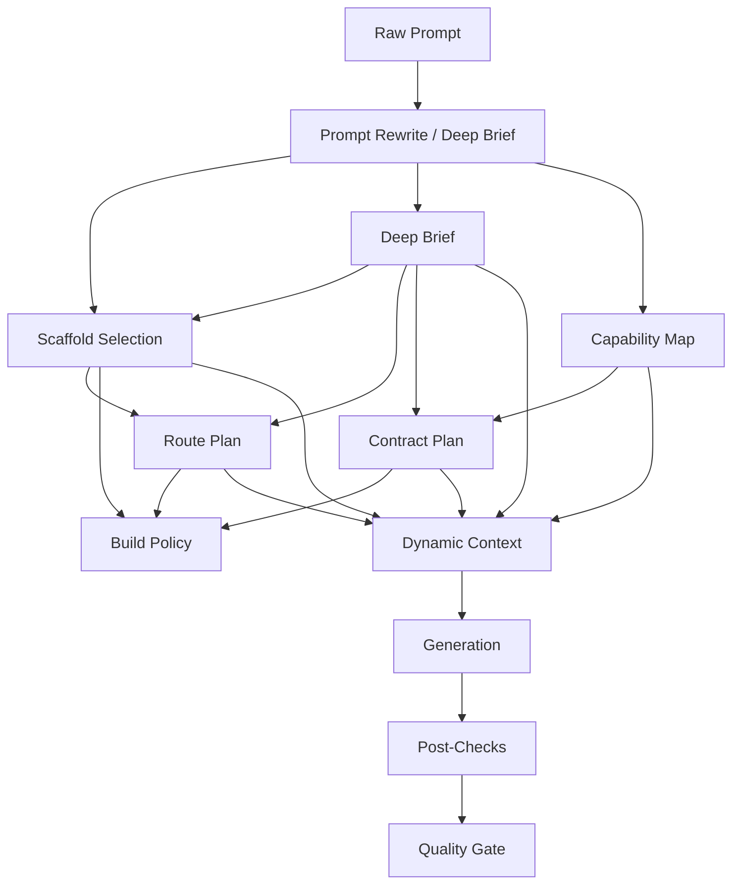

# LLM Signal Flow

Det här dokumentet beskriver **hur** signallagren samspelar i create-chat, follow-up och repair.

För den kontraktslika tabellen över lager, inputs och outputs: se
`docs/schemas/orchestration-signal-contract.md`.

För matrisen över LLM-roller/modeller: se `docs/schemas/llm-role-matrix.md`.

## Översikt

## Create-chat (`init`)

1. Buildern tar emot användarprompten.
2. `promptAssist` / Deep brief kan bygga ut prompten eller generera en structured brief.
3. Scaffoldval körs i `resolveOrchestrationBase()` via `matchScaffoldAuto()`.
4. Route plan, contracts och BuildSpec byggs.
5. Dynamic context byggs i `system-prompt.ts`.
6. Generatorn kör.
7. Finalize, post-checks, preview-start och quality gate sker efteråt.

### Brief → Scaffold

Deep brief matas nu in i scaffoldmatchningen via `ScaffoldQueryContext` (`briefPages`, `styleKeywords`, `domainHints` → keyword-boost + berikad embedding-prompt). Det minskar risken att ett fel scaffold väljs, men keyword-lagret kan fortfarande dominera vid mycket starka träffar.

## Follow-up

Follow-ups skiljer sig från create-chat på tre sätt:

1. user-turnen wrappas med continuity / current files / requested changes
2. persisted scaffold kan återanvändas
3. route plan fryser ofta befintliga routes i stället för att bygga ny IA från scratch

Det här gör follow-upkedjan mer konservativ, men innebär också att ett fel scaffold kan leva kvar tills repair eller explicit redesign låser upp det.

### Viktig nuvarande follow-up-balans

Vanliga follow-ups hålls fortfarande konservativa, men capability-heavy önskemål som t.ex. karusell, 3D, större animationer eller premium-visuals ska inte lika lätt falla ner till den lättaste context-/verification-banan bara för att användaren inte skrev ordet `redesign`.

Det betyder i praktiken:

- små copy-/layoutändringar kan fortfarande gå i ett lättare follow-up-spår
- capability-heavy follow-ups ska oftare stanna på minst `contextPolicy: normal`
- capability-heavy follow-ups ska oftare undvika `verificationPolicy: fast`

## Repair

Repair arbetar normalt med:

- senaste versionen
- persisted scaffold
- error logs / quality gate / preflight-signaler

Om scaffold-aware retry hittar tydliga blockerare kan den föreslå en enklare scaffoldpivot (t.ex. `ecommerce` -> `base-nextjs`), men detta sker sent och kostar extra pass. Ren merged syntax utan import-/strukturstöd ska nu mindre aggressivt tolkas som scaffold-drift.

### Viktig repair-begränsning

Repair/fixer-output måste returnera **kompletta filer**, inte snippets. Runtime antar att varje `file="..."`-block är hela filen. Partial-file-output blockeras nu tidigare i finalize/preflight i stället för att sparas som preliminär version.

## Vad som fungerar bra

- Deep brief ger bättre pages/sections/visual direction/SEO än en torftig prompt ensam.
- Dynamic context har bra struktur och prioriterad pruning.
- Repairkedjan kan rädda bra resultat även efter dåligt scaffoldval.

## Vad som fungerar sämre

- scaffoldval använder nu brief via `ScaffoldQueryContext`, men keyword-lagret kan fortfarande dominera vid starka träffar; embeddings kan utmana svagare keyword-val (se merge-policy i `matcher.ts`)
- capability/contract-lagren kan förstärka ett dåligt scaffoldval
- follow-up kan bevara fel routes/scaffold för länge

## Rekommenderad styrprincip

1. Prompt assist / Deep brief ska ge hela kedjan rikare domäninformation.
2. Scaffold ska vara **strukturhypotes**, inte ensam domänsanning.
3. Route plan och contracts ska väga briefsignaler tyngre än scaffolddefaults när de krockar.
4. Post-checks ska fortsatt vara sanningslager för vad som faktiskt blev genererat.
