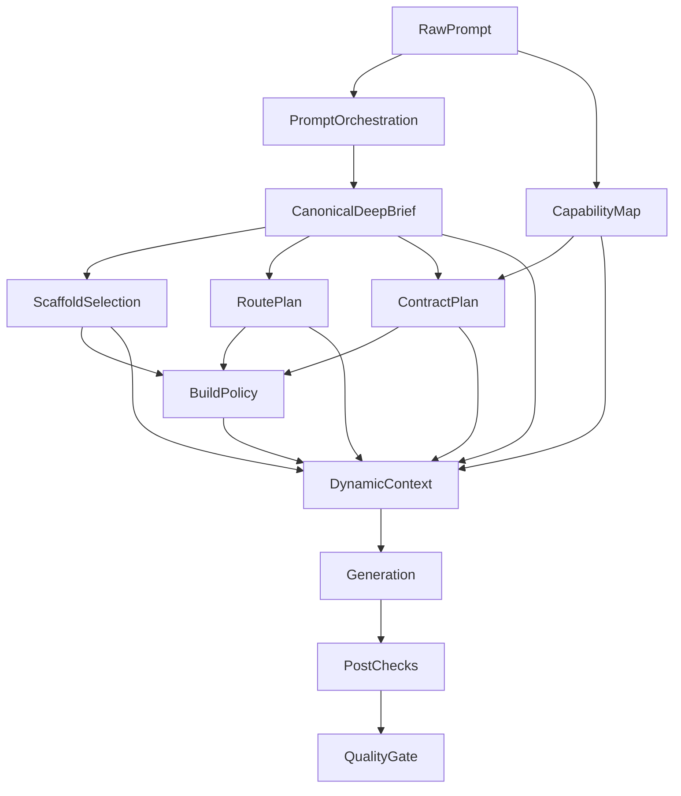

# LLM Signal Flow

Hur signallagren samspelar i create-chat, follow-up och repair, plus **vem äger vilken signal** (canonical source).

**Senast uppdaterad:** 2026-04-29.

För kontraktslika tabellen över lager, inputs och outputs: `docs/schemas/orchestration-signal-contract.md`.
För matrisen över LLM-roller/modeller: `docs/schemas/llm-role-matrix.md`.

---

## Översikt



**Styrprincip:** expandera en gång (Deep Brief), exekvera många steg.

---

## Ägarskap per steg

| Steg | Äger | Ska **inte** |
|---|---|---|
| **Deep Brief** | Produktidé, målgrupp, tonalitet, sidor/IA, CTA, visual direction, imagery, SEO-bas | — |
| **Scaffold Selection** | Strukturhypotes och startform | Uppfinna ny produktsemantik |
| **Route Plan** | IA-normalisering med tydlig provenance (`brief` / `prompt` / `scaffold`) | Omtolka briefens sidor |
| **Contract Plan** | Auth, db, betalning, env, integrationer | Gissa domäntillhörighet utöver brief |
| **BuildSpec** | Execution policy, budgetar, preview/verifiering, change scope | Kreativt omtolka prompten |
| **Dynamic Context** | Prompt-assembly och token-pruning | Lägga till ny kreativ tolkning utöver brief |

---

## Signal Ownership Matrix

Varje signal i init-pipelinen har **exakt en canonical source**. Konsumenter läser därifrån — de uppfinner inte om samma svar.

| Signal / fråga | Canonical source | Data/config | Konsumenter | Får dupliceras? |
|---|---|---|---|---|
| **Domän / site-type** | `domain-inference.ts` | `config/domain-rules.json` | `site-brief-generation.ts`, `src/lib/builder/prompt-assist/` (fallback) | Nej — alla ska importera `inferDomain` / `inferSiteTypeHintFromDomain` |
| **Structured-prompt heuristik** | `prompt-heuristics.ts` | `config/prompt-heuristic-tokens.json` | `promptOrchestration.ts` | Nej — alla ska importera delade tokens + `countTokenHits` |
| **Keyword-extraktion (formatering)** | `prompt-heuristics.ts` | `SECTION_KEYWORDS`, `STYLE_KEYWORDS` | `src/lib/builder/prompt-assist/` (`formatPrompt`, addendum) | Nej — importera, inte duplicera |
| **Init-semantik (projektgrund)** | Deep Brief (`site-brief-generation.ts`) | `siteBriefSchema` | `create-chat-stream-post.ts`, `buildDynamicContext()` | Nej — brief-objektet via `meta.brief` är enda kanonisk signal |
| **Globala designregler** | Core Rules (`config/prompt-core/`, inkl. `03-visual-design.md` + `04-coding-direction.md`) | markdown-filer | `static-core-loader.ts` → system prompt | Nej — directive cascade borttagen 2026-04-18 |
| **Request-specifik designkontext** | `buildDynamicContext()` i `src/lib/gen/system-prompt/` | brief + scaffold + theme | codegen system prompt (`## Brief-Locked Design Values` före variant) | Nej — brief-driven, inte omtolkad |
| **Build intent (codegen + assist)** | `BUILD_INTENT_GUIDANCE` i `src/lib/gen/intent-guidance.ts` | delad konstant | `src/lib/gen/system-prompt/` (`buildDynamicContext()`) + `src/lib/builder/prompt-assist/` | Nej — en canonical konstant, båda ytor importerar den |
| **Capability-inferens** | `capability-inference.ts` | regexar + manifest | `buildDynamicContext()`, `BuildSpec`, `follow-up-clarification` | Nej |
| **Capability → dossier-bridge** | `src/lib/gen/capability-dossier-bridge.ts` | deklarativ map | `orchestrate.ts` → `selectDossiersForRequest({ requestedCapabilities })` | Nej — single source. Bridge-mappar inferred flags till dossier capability-id:n innan urval |
| **Fallback-addendum (non-init)** | `src/lib/builder/prompt-assist/` | `MOTION_GUIDANCE`, `VISUAL_IDENTITY_GUIDANCE`, `QUALITY_BAR_GUIDANCE` | `useInitBrief.ts` → `generateDynamicInstructions` vid brief-miss | Legacy-fallback, skippas vid init |
| **User-message formattering (legacy fallback)** | `formatPrompt()` i `src/lib/builder/prompt-assist/` | `SECTION_KEYWORDS`, `STYLE_KEYWORDS` | `prompt-wizard-modal-v2.tsx`, `prompt-assist/runner.ts` | Borttagen från `useCreateChat`-init 2026-04-28 (init skickar rå text). Kvar för wizard/runner. |
| **Init Brief hook** | `useInitBrief.ts` | `generateDynamicInstructions` | `useBuilderPageController.ts` | Hook — konsumerar `/api/ai/brief` + fallback addendum |

### Princip

```
Core Rules         = oföränderliga produktregler (config/prompt-core/, alltid med —
                     inkluderar visual-design + coding-direction sedan directive
                     cascade togs bort 2026-04-18)
dynamic context    = brief-driven runtime-kontext (per request — brief explicit >
                     brief inferred > guidance-resolvers heuristik > statiska defaults)
assist/fallback    = degraderad reservväg (brief-miss / non-init)
config/*.json      = editerbar data (domain rules, ai models, env policy)
```

### Skydd

- Vid ändring av `config/domain-rules.json`: kör `server-auto-brief-policy.test.ts`.
- Vid ändring av brief-schema: kontrollera att `buildDynamicContext` konsumerar nya fält.
- Vid ändring av Core Rules: kontrollera att inga duplicerade regler skapas i dynamic context.

---

## Create-chat (`init`)

1. Buildern tar emot användarprompten.
2. **Deep Brief** genereras som det kanoniska semantiska expansionssteget. Brief-objektet skickas via `meta.brief`; brief-deriverad prose ska **inte** dubblera samma semantik i `system`/`customInstructions`. `siteBriefSchema` bär även init-signaler som `domainProfile`, `motionLevel`, `qualityBar`, `seasonalHints` och `requestedCapabilities` så `buildDynamicContext()` slipper uppfinna dem senare.
3. Server Auto-Brief är fallback när klienten inte skickar brief — körs för init-prompts utan client-brief (även strukturerade website-prompts), men hoppas över för audit, technical/preserved payload och follow-up. Sedan 2026-04-29 finns en konservativ `simpleWebsitePath` för korta website/template-init prompts: den hoppar Server Auto-Brief, externa/component references och dossiers, men bara när scaffolden är enkel och prompten saknar multi-route-, integration-, contract- och heavy capability-signaler.
4. Scaffoldval körs i `resolveOrchestrationBase()` via `matchScaffoldAuto()`.
5. Route plan, contracts och BuildSpec byggs — översätter briefens semantik till exekvering snarare än att uppfinna ny vision.
6. Dynamic context byggs i `src/lib/gen/system-prompt/`. När briefen bär designvärden renderas `## Brief-Locked Design Values` före `## Scaffold Variant (this generation)` och med högre pruning-prioritet, så variantens tema/font/motif bara är fallback när briefen är tyst. `## Your Toolkit` byggs från registry-synkade `SHADCN_COMPONENTS`-mappen, filtrerad mot vilka `@/components/ui/*`-subpaths som faktiskt finns lokalt; `## Component References` lägger separat till capability-matchade kodexempel från `data/shadcn-examples/`. I `simpleWebsitePath` är component references avstängda för att hålla init-konteksten kort.
7. Generatorn kör. Modellvalet kommer från `phaseRouting.defaultByTier`, och planner/generator hämtar phase-specifik thinking / `reasoningEffort` från `phaseRouting.thinkingByTier`. **Codegen-verktyg:** `suggestIntegration` och `requestEnvVar` är informativa (UI-signal, ingen paus); endast `askClarifyingQuestion` sätter blocking/`awaitingInput`.
8. Finalize, post-checks, preview-start och quality gate sker efteråt.

### Brief → Scaffold

Deep brief matas in i scaffoldmatchningen via `ScaffoldQueryContext` (`briefPages`, `styleKeywords`, `domainHints` → keyword-boost + berikad embedding-prompt). Det minskar risken att fel scaffold väljs, men keyword-lagret kan fortfarande dominera vid mycket starka träffar.

---

## Follow-up

Skiljer sig från create-chat på fyra sätt:


1. user-turnen wrappas med continuity / current files / requested changes
2. persisted scaffold kan återanvändas
3. route plan fryser ofta befintliga routes i stället för att bygga ny IA från scratch
4. **ingen ny full init-brief** — men en **minimerad snapshot-brief** hydreras
   (A1/A2, 2026-04-21) via `buildFollowUpBriefFromSnapshot` när
   `meta.brief` saknas. Snapshot-briefen bär `requestedCapabilities`,
   `domainProfile`, `projectTitle`, `brandName`, `visualDirection.styleKeywords`,
   `toneAndVoice` samt (sedan 2026-04-29) `qualityBar`, `motionLevel`,
   `colorPalette` och `typography` så `src/lib/gen/system-prompt/` och
   `scaffold-query-context.ts` ser samma designfält som init — utan att återköra
   Deep Brief-LLM:en.

### Nuvarande follow-up-balans

- små copy-/layoutändringar kan gå i lättare follow-up-spår
- capability-heavy follow-ups (karusell, 3D, större animationer, premium-visuals) ska oftare stanna på minst `contextPolicy: normal`
- capability-heavy follow-ups ska oftare undvika `verificationPolicy: fast`

### Framtida delta-brief

Större redesigns eller nya sidstrukturer kan i framtiden få en smal `change-brief` eller `delta-brief` som bara beskriver vad som ska ändras och bevaras — inte en ny full Deep Brief.

---

## Repair

Arbetar normalt med:
- senaste versionen
- persisted scaffold
- error logs / quality gate / preflight-signaler

När tier kan härledas använder repairkedjan både fixer-fasens modell och fixer-fasens thinking / `reasoningEffort` från manifestet.

Om scaffold-aware retry hittar tydliga blockerare kan den föreslå en enklare scaffoldpivot (t.ex. `ecommerce` → `base-nextjs`), men detta sker sent och kostar extra pass.

### Repair-begränsning

Repair/fixer-output måste returnera **kompletta filer**, inte snippets. Runtime antar att varje `file="..."`-block är hela filen. Partial-file-output blockeras tidigare i finalize/preflight i stället för att sparas som preliminär version.

---

## Vad som fungerar bra / sämre

| Bra | Sämre |
|---|---|
| Deep brief ger bättre pages/sections/visual direction/SEO | Scaffoldval — keyword-lagret kan dominera vid starka träffar trots brief-context |
| Dynamic context har bra struktur och prioriterad pruning | Capability/contract-lagren kan förstärka dåligt scaffoldval |
| Repairkedjan kan rädda bra resultat efter dåligt scaffoldval | Follow-up kan bevara fel routes/scaffold för länge |

---

## Rekommenderad styrprincip

1. Deep Brief = **enda kanoniska semantiska expansionen** för init. Expandera en gång, exekvera många steg.
2. Scaffold = **strukturhypotes**, inte ensam domänsanning.
3. Route plan + contracts ska väga briefsignaler tyngre än scaffolddefaults när de krockar.
4. Follow-ups ska **inte** återköra Deep Brief-LLM:en — men en minimerad
   snapshot-brief hydreras från `briefSummary` (A1/A2) så kapabilitets-,
   domän- och designsignaler lever vidare utan ny LLM-rundgång.
5. Post-checks = sanningslager för vad som faktiskt genererades.
