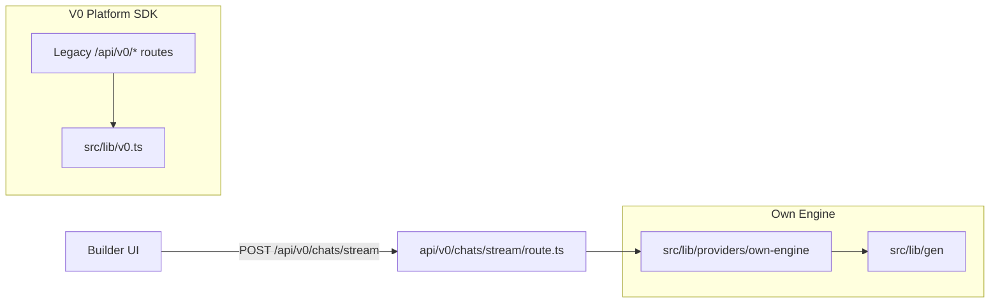

# Own Engine vs V0 — Quick Reference Map

> Senast uppdaterad: 2026-03-20

This document separates the codebase into two categories: **Own Engine**
(inhouse generation) and **V0 SDK** (V0 Platform API), and clarifies what
**V1/V2** mean in different contexts.

For the phased V0 removal plan, see `docs/architecture/v0-soft-deprecation.md`.
For the full engine architecture, see `docs/architecture/engine-status.md`.

## The key distinction

The HTTP route prefix `/api/v0/*` is **not** the same as "calls the V0 API".
It is a historical client contract — the builder frontend posts to `/api/v0/chats/stream`,
but the server-side handler routes to `src/lib/providers/own-engine/` and
`src/lib/gen/engine.ts` by default. The stream metadata carries
`enginePath: "own-engine"`.

The V0 Platform SDK (`src/lib/v0.ts`) is still imported by legacy routes for
chat CRUD, version management, and template operations, but it is **not** part
of the default generation flow.

## Category 1: Own Engine (inhouse)

Generates code, matches scaffolds, plans, streams SSE to the builder,
finalizes/autofixes, and renders preview — without the V0 Platform API.

| Area | Location |
|------|----------|
| Core engine, scaffolds, orchestration | `src/lib/gen/` (`engine.ts`, `orchestrate.ts`, `scaffolds/`) |
| Own-engine stream providers | `src/lib/providers/own-engine/` |
| Pipeline entry | `src/lib/gen/pipeline.ts` |
| Model catalog and selection | `src/lib/models/` (`catalog.ts`, `selection.ts`) |
| System prompt assembly | `src/lib/gen/system-prompt.ts` |
| Autofix and post-generation | `src/lib/gen/autofix/`, `src/lib/gen/stream/` |
| Preview rendering | `src/lib/gen/preview/` |
| Builder-side defaults and orchestration | `src/lib/builder/defaults.ts`, `promptOrchestration.ts` |

**Naming artifacts:** Some symbols still carry `v0` in their name
(`normalizeV0Error`, `v0EnrichmentContext`) despite being used exclusively
in the own-engine path. These are naming leftovers, not V0 SDK usage.

## Category 2: V0 SDK (legacy / auxiliary)

Routes and utilities that still import `v0` from `src/lib/v0.ts` or files
under `src/lib/v0/`. Used for legacy project management and template
operations — not for the main generation flow.

| Area | Files |
|------|-------|
| Chat CRUD via V0 SDK | `src/app/api/v0/chats/init/route.ts`, `src/app/api/v0/chats/route.ts`, `src/app/api/v0/chats/[chatId]/route.ts` |
| Version management | `src/app/api/v0/chats/[chatId]/versions/route.ts`, `src/app/api/v0/chats/[chatId]/files/route.ts` |
| Project settings / env vars | `src/app/api/v0/projects/`, `src/app/api/v0/integrations/` |
| Template init and download | `src/app/api/template/route.ts`, `src/app/api/download/route.ts` via `src/lib/v0/v0-generator.ts` |
| Webhooks | `src/app/api/webhooks/v0/route.ts` |
| Registry URL parsing (shared utility) | `src/lib/v0/v0-url-parser.ts` — used by shadcn registry code, not V0 cloud generation |

Plan 17 (WS-2) removed the V0 **generation fallback** but deferred removal of
the V0 SDK client because these auxiliary routes still need it.

## V1 and V2 — what they mean in this repo

There are no top-level `v1/` or `v2/` directories representing architecture
versions. The suffixes appear in several unrelated contexts:

| Context | Meaning |
|---------|---------|
| **External API versions** | URL path segments in third-party APIs: `api.v0.dev/v1/chats`, Vercel Registrar `/v1/registrar/`, Vercel Teams `/v2/teams/`, AI Gateway `/v1/chat/completions`, Unsplash `Accept-Version: v1`, WordPress `wp-json/wp/v2` |
| **Landing page** | `src/components/landing-v2/` and `src/styles/landing-v2.css` — second iteration of the landing page. The V1 landing no longer exists in the tree |
| **Prompt wizard** | `src/components/modals/prompt-wizard-modal-v2.tsx` (`PromptWizardModalV2`) — second iteration of the wizard. Exported from `src/components/modals/index.ts` |
| **Git branch history** | `egen-motor-v2` was a branch name for own-engine work, referenced in `docs/old/analyses/2026-03-branch-assessment.md`. Not a directory |
| **Orchestrator run** | `2026-03-14-runtime-atomisering-v2` was an orchestrator run name, not a code version |

None of these represent a repo-wide "V2 architecture". They are independent
iteration labels on specific features or external API versions.

If you see `landing-v2` or `PromptWizardModalV2` in current app entrypoints,
read them as retained UI iteration names on the active landing surface, not as
evidence of an unmerged engine or hidden runtime branch.
