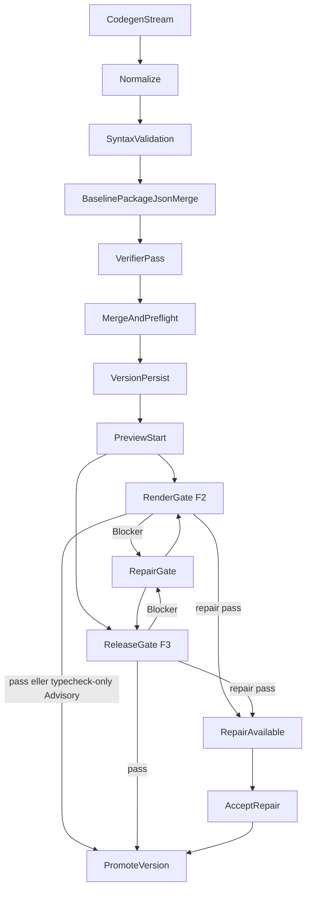

# RenderGate och ReleaseGate — körflöde

Tunna översikten av **när** VM-gaten körs och hur den kopplas till preview och
RepairGate. Fält, check-id:n och telemetrikolumner ägs av
[`../schemas/quality-gate.md`](../schemas/quality-gate.md). Invariants ägs av
[`runtime-contracts.md`](runtime-contracts.md). Pipelineordning ägs av
[`llm-pipeline.md`](llm-pipeline.md) § Fas 3.

Kodnamn: RenderGate = `designPreview`, ReleaseGate = `integrationsBuild`.

## Vad gaten är

RenderGate och ReleaseGate kräver en riktig Next-/Node-miljö och körs i
preview-hostens **verify-lane**, inte i samma workspace som live-previewn i
iframen.

De är inte Normalize, syntaxvalidering i finalize, verifier-pass, live
`npm run dev`, eller CapabilitySmoke (`product_postcheck.*`).
CapabilitySmoke-fynd projiceras i publiceringskollen (`GET .../readiness`).
När senaste `product_postcheck.summary` har `productBlocked: true` från ett
spärrande fynd (`preview_boot_page`, `runtime_crash`, `mobile_menu_failed`,
≥2 `broken_anchor`, eller `hydration_dom_loss` där en server-renderad CTA
saknas efter klienthydrering) blir ytan röd (`status: "blocked"`) och fyndet syns som
orsak (B1, 2026-08-15). `info.productPostcheckBlocksF3` och
`info.productPostcheckBlockedReason` bär samma signal.
Live-preview-skärmdumpar (postcheck, thumbnail, inspector) måste skickas med
Playwright `caret: "initial"`. Default `"hide"` injicerar `caret-color` på
formulärfält och kan fabricera `hydration_mismatch` → overlay →
`runtime_crash` på en frisk sajt. `preview_probe_unreadable` (tomt/misslyckat
Chromium-svar) är advisory och
får inte färga rött eller formuleras som att preview-hosten visar startsidan.
Rådgivande koder stannar i `warnings`. Promotion läser inte fältet.
Fynden är aldrig `canDeploy`-blockers. Sena browser-fel
(`preview:client-error` med `created_at` > `promoted_at`) projiceras som
advisory warnings och är aldrig `canDeploy`-blockers.

Product Postcheck-loggar stämplas av servern med files-revision och aktuell
preview-tuple. Hela batchen skrivs i en Postgres-transaktion efter låsning av
versionsraden; revision som redan har överspelats ger inget delresultat. Alla
readiness-/statusläsare ignorerar attesterade rader vars revision inte längre
matchar versionens filer. Motsvarande `version.degraded`-händelser bär samma
revision; status- och historikprojektionerna filtrerar bort en stämplad händelse
från N så snart samma version har blivit N+1. Preview-sessionen ligger i Redis och kan därför inte
delta i samma DB-transaktion; den valideras före skrivningen och tuplen bevaras
som spårbar metadata, medan den atomiska hållbarhetsgrinden är files-revisionen.
Nya `product_postcheck.*`-rader utan denna attestation avvisas; äldre oattesterade
rader förblir läsbara historiskt. Ett superseded resultat är helt tyst och ett
saknat/ogiltigt route-svar ger bara en generisk transportdiagnos samt retry/hold
i verify-lanen — inget av fallen får skapa ett gammalt produktverdikt.

| Lane | Syfte | Typisk körning |
| --- | --- | --- |
| Preview-lane | Snabb live-preview | `npm install` + `npm run dev` |
| Verify-lane | Export-/buildbarhet och repair-underlag | `tsc`, ev. `eslint`, ev. `next build` |

Aktuella checklistor per lane ägs av
`config/ai_models/manifest.json#qualityGateTiers` (projektion:
[`../generated/policies.generated.md`](../generated/policies.generated.md)).

## När gaten körs

1. **Asynkt efter finalize** via `resolvePostFinalizeServerVerifyDecision` →
   `triggerServerVerification`. Hoppas över bland annat vid
   `verificationPolicy === "fast"`, `previewBlocked`, och F2-init utan
   preflight-fel/verifier-Blocker. F2-ägaren är klienten
   (`post-checks.ts` → `POST .../quality-gate`); server-verify skippas för F2
   (`design_preview_skip_verify`).
2. **Explicit route** `POST /api/engine/chats/[chatId]/quality-gate`.
   `lifecycle_stage` väljer lanen; klient-body kan varken upp- eller
   nedgradera checks. För `integrationsBuild` kör routen först den
   serverägda `checkTier3ReadinessForVersion`
   (`src/lib/gen/verify/tier3-readiness.ts` — saknad env → 412
   `tier3_env_not_ready`; saknad F2-parent / L2-dom
   `blocked`/`pending`/`indeterminate`/`superseded` → 409; L6 `running`-claim
   är `pending`) innan VM-ReleaseGate.
   Samma funktion körs i `triggerServerVerification` och
   `triggerBuildErrorRepair` under lease mot exakt `filesRevision`:
   före första F3-gaten, efter varje reparation och omedelbart före
   varje F3-promotion. Klientens skip av `/quality-gate` för
   integrationsversioner hoppar inte över grinden.
3. **Efter repair** — både `server-verify` och `/repair` re-kör samma gate.
4. **Browser-resume** (`useResumePendingVerification`): strandade F2-drafts
   och **importerade basversioner** (`edit_kind="imported_repo"` —
   template/ZIP/GitHub) körs genom den explicita routen vid nästa
   builder-besök. Importlanen (2026-08-18) är importens enda
   verifieringslivscykel: kortare åldersgrind (90 s), ingen
   bildvalidering (verbatim-kontraktet) och gaten kör på verbatim-exporten
   (`chatUsesVerbatimRepo`). Utfall: pass → promotad ("Verifierad"),
   advisory-säkra typfel → promotad med varningar, render-risk/installfel →
   `failed`.

F3 (`previewPolicy: "fidelity3"`) ägs av serverns post-finalize
`triggerServerVerification`, utom den deterministiska F3-forken där klientens
`runF3FinalizeAction` är enda gate-anropare.

## F2 vs F3

- F2: typecheck-only RenderGate med render-first Advisory. Semantiska typfel
  som `next dev` renderar igenom är Advisory (`isTypecheckOnlyAdvisory` i
  `quality-gate-checks.ts`). Render-risk-TS-koder, build/lint och
  verifierns build-breaking-fynd är Blocker. Svar bär `vmGatePassed: false` +
  `designAdvisory` så det inte läses som solid-grön.
- **Advisory gäller previewn, inte publiceringen.** `next build` på Vercel kör
  en strikt `tsc`, så varje kvarvarande typfel fäller hostingbygget oavsett
  render-risk. `resolveDeployTypecheckAdvisoryGate`
  (`src/lib/db/engine-version-lifecycle.ts`) blockerar därför
  `POST /api/v0/deployments` med `DEPLOY_TYPECHECK_ADVISORY` när en
  designversions senaste gate-verdikt är en typecheck-advisory
  (`resolveLatestGateAdvisoryChecks` över `engine_version_error_logs`), och
  readiness speglar samma villkor som blocker
  (`typecheck-advisory-blocks-publish`) så `canDeploy` aldrig ljuger.
  Grinden är fail-closed: kastar loggläsningen svarar deploy-POST `503
  DEPLOY_GATE_LOGS_UNAVAILABLE` före credits och Vercel-anrop — en tom lista
  är exakt det som öppnar grinden och får inte antas.
  Previewn, promoteringen och F3 påverkas inte. Bakgrund: prod 2026-09-10
  (chat `5d809cc1`) publicerade en advisory-promotad version och Vercel-bygget
  föll på exakt de advisory-klassade felen; 14 av 19 fallna typechecks under
  40 dagar var advisory.
- **Bevisat ofarligt `.next/`-brus räknas inte.** Verify-lanens `tsc` kan
  plocka upp en stale `.next/dev/types/routes.d.ts` (`TS1005`; den genererade
  `tsconfig.json` inkluderar globben, Next-paritet). `normalizeTypecheckResult`
  (`quality-gate-checks.ts`), anropad i `runQualityGateChecks` så alla
  gate-vägar delar den, viker bara det brusets typecheck till pass.
  Nexts egna route-validatorer under `.next/types/app/**` (t.ex. `TS2344`
  PageProps) är riktiga fel och förblir fail. `isAdvisorySafeTypecheckOutput`
  klassificerar de kvarvarande raderna. Prod 40 d: 15 av 63 tsc-träffar
  (signatur `9bf13221eb3e`) var `routes.d.ts`/`TS1005`-bruset.
- F3: auktoritativ VM-ReleaseGate på en lease-skyddad filesnapshot. En ny
  `integrations`-rad med samma `files_json` som F2-föräldern skapas när F3
  inte kräver codegen; gaten får aldrig promota F2-raden. `passed` räcker inte:
  `promoted = true`, ej `superseded`, ej `promoteError`, `vmGatePassed !== false`.

Lint är borttagen ur den blockerande F3-lanen (2026-07-22) men kan
återaktiveras via manifestet. Warm ESLint är opt-in diagnostik och startar
inte RepairGate.

## Repair-relation

Gate-output är felkälla till RepairGate, inte en andra LLM-port.

Ordning inuti repair: deterministisk import-repair på tsc-koder först; om
gaten då passerar promotas versionen utan LLM (`method: "deterministic"`).
Annars `runRepairLoop` → `runLlmRepairGate`. Post-repair måste samma signal
passa igen (`resolveSameSignalGateChecks`). Lyckad repair skriver
`repaired_files_json` och `verification_state = "repair_available"` — inte
tyst overwrite av `files_json`. Accept: `POST .../accept-repair`.

Alla LLM-repair går genom `runLlmRepairGate`
(`src/lib/gen/autofix/llm-repair-gate.ts`). Outcome-strängar ägs av
`resolveServerRepairOutcome` i `server-verify-log-meta.ts`.

Preview-VM:ens `build-error`-SSE startar repair-loopen automatiskt i **alla**
miljöer sedan 2026-09-11 (`isAutoRepairBuildErrorEnabled` i
`server-verify/build-error-trigger.ts`; production var av tills 40 dagars prod
visade 3/3 budgetbundna reparationer). Kill-switch:
`SAJTMASKIN_AUTO_REPAIR_BUILD_ERROR=0`. Vercels egna byggfel repareras
fortfarande bara på knapptryck («Publicera om med fix», Ö3) — deploy-routen kan
inte köra en bakgrundsreparation efter svaret på serverless, och
publiceringsgrinden ovan är avsedd att göra det fallet sällsynt.

Deterministiska fixare kan själva införa fel: `icon-component-value-fixer`
skrev fram till 2026-09-11 om `{x.icon}` även inne i attribut
(`name={product.icon}` → ternary med `<product.icon />`), vilket gav
TS2322/TS2339/TS2604 på korrekt modellkod och fällde ett Vercel-bygge. Den är
nu begränsad till bara JSX-barn i filer med komponentikoner och klassad
`risky` i `FIXER_REGISTRY`, så verifieraren täcker den när den fyrar.

En version som ersätts under gaten settlas terminal-neutralt som `superseded`
("Ersatt"), aldrig rött `failed`.

Promote-guard (`assertPromoteAllowed`) spärrar promotion medan telemetrin
säger `verifier_failed` / `preflight_failed`. Fältsemantik:
[`../schemas/quality-gate.md`](../schemas/quality-gate.md).

## Verifier-pass efter Normalize

Verifiern bedömer den **mergade** `package.json` (samma `mergePackageJsonWithBaseline` som persist), inte modellens utkast. En paketpost i `dependencies` eller `devDependencies` räknas som närvarande (`tailwindcss` ligger i baslinjens `devDependencies`). Importerat repo-läge hoppar över baslinjemergen.

`resolveVerifierPassPolicy()` kan hoppa över verifiern (light/fast follow-up,
flagga av). När grundpolicyn säger `run` styrs skip av Normalize-risk:
`safeFixCount > 0` och ingen risky → `safe_fixes_only`; `riskyFixCount > 0` →
`risky_fixes`; 3D-signal och LLM-fix i validate tvingar körning. `FIXER_REGISTRY`
är riskkällan.

## Install i verify-lane

Normal install först; `--legacy-peer-deps` bara vid detekterad peer-konflikt.
`node_modules` kan delas med live-workspace vid matchande dependency
fingerprint (`install-cache-share` / `install-peer-fallback` i `results[]`).

## Historisk baslinje

Baslinjen är ett mätvärde att jämföra mot, inte en policy — ägaren byter den
när det finns skäl. Aktuell: 14-dagars KPI t.o.m. 2026-09-11 (27 chattar, 60
genereringar), ägd av
`scripts/observability/control-stats-baseline-2026-09-11.json`. Ta fram en
färsk mätning med
`node scripts/db/control-stats.mjs --json --env=.env.vercel.production.pulled --days=14 --allow-insecure-ssl`
och jämför med `npm run stats:compare -- --current <fil> --md`. Prod-mätning
ägs inte av den här filen.

| Mätvärde | Fas 0 (2026-07-02) | Baslinje 2 (2026-09-11) |
| --- | --- | --- |
| RenderGate/ReleaseGate pass | 84 % | 63 % (Postcheck-overlay räknas som ej pass) |
| Typecheck som first failure | 99 % av gate-fails | 100 % |
| Importrelaterade TS-fel | 84 % av felträffar | 6 % |
| Verifier skippad | 69 % (volymstyrd) | 50 % |
| Typecheck-fails som advisory-promotades | — | 4/5 (40 d: 14/19) |
| Gate-failade räddade av repair | 1/28 (3,6 %) | ej härledbar; 40 d: 3/3 repair-körningar lyckade |
| Versioner som slutar failed | 38 % | 1,8 % (delvis absorberat av advisory) |

Läs de två sista raderna ihop: färre `failed` beror till stor del på att
advisory-promoteringen slutade kalla typfel för fel. Fas 0-siffran 3,6 % ska
inte återanvändas som argument om repair-lagret — den mätte något annat än
dagens loop.
