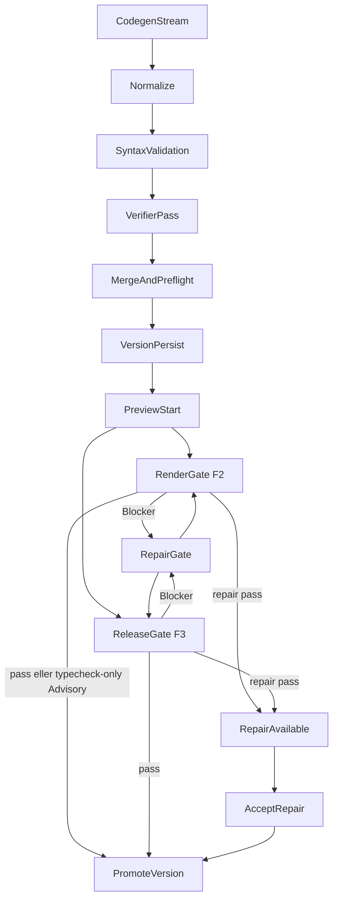

# RenderGate och ReleaseGate — körflöde

Tunna översikten av **när** VM-gaten körs och hur den kopplas till preview och
RepairGate. Fält, check-id:n och telemetrikolumner ägs av
[`../schemas/quality-gate.md`](../schemas/quality-gate.md). Invariants ägs av
[`runtime-contracts.md`](runtime-contracts.md). Pipelineordning ägs av
[`llm-pipeline.md`](llm-pipeline.md) § Fas 3.

Kodnamn: RenderGate = `designPreview`, ReleaseGate = `integrationsBuild`.

## Vad gaten är

RenderGate och ReleaseGate kräver en riktig Next-/Node-miljö och körs i
preview-hostens **verify-lane**, inte i samma workspace som live-previewn i
iframen.

De är inte Normalize, syntaxvalidering i finalize, verifier-pass, live
`npm run dev`, eller CapabilitySmoke (`product_postcheck.*`).
CapabilitySmoke-fynd projiceras som warnings i publiceringskollen
(`GET .../readiness`). `productBlocked` på senaste
`product_postcheck.summary` sätter `info.productPostcheckBlocksF3`.
`info.productPostcheckBlockedReason` är sammanslagna fyndtitlar från de
F3-spärrande koderna (`mobile_menu_failed`, ≥2 `broken_anchor`,
`runtime_crash`, `preview_boot_page`) — inte själva enum-koderna.
Rådgivande koder stannar i `warnings`. Promotion läser inte fältet.
Fynden är aldrig `canDeploy`-blockers.

| Lane | Syfte | Typisk körning |
| --- | --- | --- |
| Preview-lane | Snabb live-preview | `npm install` + `npm run dev` |
| Verify-lane | Export-/buildbarhet och repair-underlag | `tsc`, ev. `eslint`, ev. `next build` |

Aktuella checklistor per lane ägs av
`config/ai_models/manifest.json#qualityGateTiers` (projektion:
[`../generated/policies.generated.md`](../generated/policies.generated.md)).

## När gaten körs

1. **Asynkt efter finalize** via `resolvePostFinalizeServerVerifyDecision` →
   `triggerServerVerification`. Hoppas över bland annat vid
   `verificationPolicy === "fast"`, `previewBlocked`, och F2-init utan
   preflight-fel/verifier-Blocker. F2-ägaren är klienten
   (`post-checks.ts` → `POST .../quality-gate`); server-verify skippas för F2
   (`design_preview_skip_verify`).
2. **Explicit route** `POST /api/engine/chats/[chatId]/quality-gate`.
   `lifecycle_stage` väljer lanen; klient-body kan varken upp- eller
   nedgradera checks. För `integrationsBuild` kör routen först
   `checkTier3ReadinessForVersion` (saknad env → 412
   `tier3_env_not_ready`; `product_postcheck_blocked` från F2-föräldern
   via `productPostcheckVersionId` → 409) innan VM-ReleaseGate.
3. **Efter repair** — både `server-verify` och `/repair` re-kör samma gate.

F3 (`previewPolicy: "fidelity3"`) ägs av serverns post-finalize
`triggerServerVerification`, utom den deterministiska F3-forken där klientens
`runF3FinalizeAction` är enda gate-anropare.

## F2 vs F3

- F2: typecheck-only RenderGate med render-first Advisory. Semantiska typfel
  som `next dev` renderar igenom är Advisory (`isTypecheckOnlyAdvisory` i
  `quality-gate-checks.ts`). Render-risk-TS-koder, build/lint och
  verifierns build-breaking-fynd är Blocker. Svar bär `vmGatePassed: false` +
  `designAdvisory` så det inte läses som solid-grön.
- F3: auktoritativ VM-ReleaseGate på en lease-skyddad filesnapshot. En ny
  `integrations`-rad med samma `files_json` som F2-föräldern skapas när F3
  inte kräver codegen; gaten får aldrig promota F2-raden. `passed` räcker inte:
  `promoted = true`, ej `superseded`, ej `promoteError`, `vmGatePassed !== false`.

Lint är borttagen ur den blockerande F3-lanen (2026-07-22) men kan
återaktiveras via manifestet. Warm ESLint är opt-in diagnostik och startar
inte RepairGate.

## Repair-relation

Gate-output är felkälla till RepairGate, inte en andra LLM-port.

Ordning inuti repair: deterministisk import-repair på tsc-koder först; om
gaten då passerar promotas versionen utan LLM (`method: "deterministic"`).
Annars `runRepairLoop` → `runLlmRepairGate`. Post-repair måste samma signal
passa igen (`resolveSameSignalGateChecks`). Lyckad repair skriver
`repaired_files_json` och `verification_state = "repair_available"` — inte
tyst overwrite av `files_json`. Accept: `POST .../accept-repair`.

Alla LLM-repair går genom `runLlmRepairGate`
(`src/lib/gen/autofix/llm-repair-gate.ts`). Outcome-strängar ägs av
`resolveServerRepairOutcome` i `server-verify-log-meta.ts`.

En version som ersätts under gaten settlas terminal-neutralt som `superseded`
("Ersatt"), aldrig rött `failed`.

Promote-guard (`assertPromoteAllowed`) spärrar promotion medan telemetrin
säger `verifier_failed` / `preflight_failed`. Fältsemantik:
[`../schemas/quality-gate.md`](../schemas/quality-gate.md).

## Verifier-pass efter Normalize

`resolveVerifierPassPolicy()` kan hoppa över verifiern (light/fast follow-up,
flagga av). När grundpolicyn säger `run` styrs skip av Normalize-risk:
`safeFixCount > 0` och ingen risky → `safe_fixes_only`; `riskyFixCount > 0` →
`risky_fixes`; 3D-signal och LLM-fix i validate tvingar körning. `FIXER_REGISTRY`
är riskkällan.

## Install i verify-lane

Normal install först; `--legacy-peer-deps` bara vid detekterad peer-konflikt.
`node_modules` kan delas med live-workspace vid matchande dependency
fingerprint (`install-cache-share` / `install-peer-fallback` i `results[]`).

## Historisk baslinje

Fryst 14-dagars KPI t.o.m. 2026-07-02 (41 chattar, 115 genereringar).
Siffrorna ägs av
`scripts/observability/control-stats-baseline-2026-07-02.json`.
Jämför med `npm run stats:compare`. Prod-mätning ägs inte av den här filen.

| Mätvärde | Baslinje |
| --- | --- |
| RenderGate/ReleaseGate pass | 84 % |
| Typecheck som first failure | 99 % av gate-fails |
| Importrelaterade TS-fel | 84 % av felträffar |
| Verifier skippad | 69 % (volymstyrd) |
| Gate-failade räddade av repair | 1/28 (3,6 %) |
| Versioner som slutar failed | 38 % |
