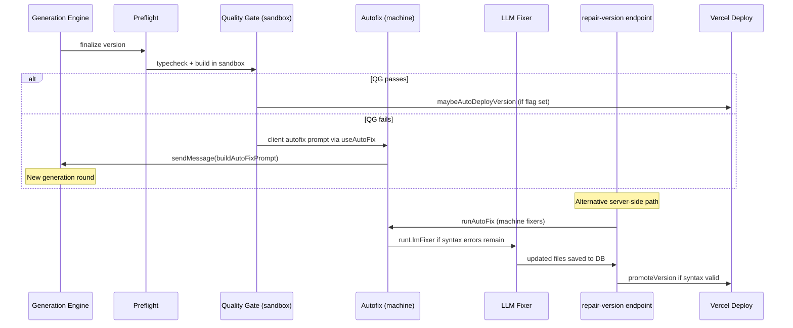

# Repair-Deploy Loop

## Scope

This document describes the automated repair and deploy chain that runs after
code generation, from quality gate through optional Vercel deployment.

## Sequence

## Components

| Component | Location | Role |
|-----------|----------|------|
| Quality gate | `src/app/api/v0/chats/[chatId]/quality-gate/route.ts` | Runs `tsc` and `next build` in `@vercel/sandbox`; persists results to `engine_version_error_logs` |
| Machine autofix | `src/lib/gen/autofix/pipeline.ts` (`runAutoFix`) | Deterministic fixers: use-client, import paths, syntax validation, dep completion |
| LLM fixer | `src/lib/gen/autofix/llm-fixer.ts` (`runLlmFixer`) | AI-driven code repair when machine fixes are insufficient |
| Validate-and-fix | `src/lib/gen/autofix/validate-and-fix.ts` | Multi-pass loop combining machine + LLM during generation |
| Client autofix | `src/lib/hooks/chat/useAutoFix.ts` | Sends repair prompt as a chat message; rate-limited per reason and per chat |
| Server repair | `src/app/api/v0/chats/[chatId]/repair-version/route.ts` | Reads version files, runs machine+LLM pipeline, saves repaired files, logs result |
| Auto-deploy | `src/lib/hooks/chat/auto-deploy.ts` | Client-side fire-and-forget deploy after quality gate pass |
| Placeholder env | `src/lib/project-env-placeholders.ts` | Auto-inserts dev placeholder values for missing project env vars |

## Env flags

- `SAJTMASKIN_AUTO_PLACEHOLDER_ENV` — auto-fill missing project env vars with dev placeholders
- `SAJTMASKIN_AGGRESSIVE_AUTOFIX` — raise autofix limits and reduce delays
- `SAJTMASKIN_AUTO_DEPLOY_AFTER_REPAIR` — auto-deploy to Vercel after quality gate passes

See `docs/ENV.md` for full details.

## Preview policy

`resolveEngineDemoUrlDetails` in `src/lib/gen/demo-url.ts` now returns a
legacy preview URL even for versions with `verification_state: "failed"`,
using mode `"verification-failed"`. This ensures the iframe always shows an
approximate preview while autofix iterates, rather than displaying a blank
panel.

## Supabase vs Vercel hosting

Supabase provides the **database** (Postgres) and related services for
Sajtmaskin's own data (chats, versions, projects, error logs). It does **not**
host the generated Next.js applications.

Generated sites are deployed to **Vercel** via `createVercelDeployment` in
`src/lib/vercelDeploy.ts`. Supabase egress limits can affect Sajtmaskin's API
responses (database reads/writes), but they do not affect the Vercel build or
hosting of generated sites.

Upgrading Supabase resolves database egress throttling; it does not replace the
need for Vercel deployment infrastructure.
