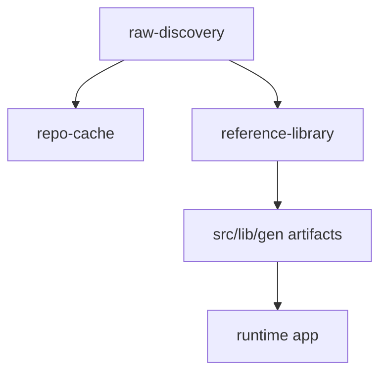

# Repo Hygiene

This document defines which large paths should stay committed, which should stay
local-only, and which should be evaluated for later extraction from this repo.

## Why the repo feels large

There are two different size problems:

- local working-set bloat from `research/external-templates/repo-cache/`
  and similar research helpers
- tracked context bloat from generated artifacts, reference dossiers, and a few
  large media/report files

The current research flow already separates those lanes:



## Classification

| Status | Paths | Why |
|------|------|------|
| `keep` | `src/`, `docs/`, `public/video/` | App/runtime code, canonical docs, and currently used product assets. |
| `keep` | `src/lib/gen/template-library/`, `src/lib/gen/scaffolds/`, `src/lib/gen/data/docs-embeddings.json` | Runtime code imports these generated artifacts directly. Keep them committed even when some large generated JSON files are excluded from Cursor indexing. |
| `local-only` | `research/external-templates/repo-cache/`, `research/external-templates/raw-discovery/`, `_template_refs/`, `_sidor/`, `research/_sidor/` | Reproducible research inputs, clone mirrors, or legacy migration data. |
| `archive` | `docs/plans/archived/`, `docs/old/` | Useful historical context, but low-value for day-to-day indexing. |
| `move-later` | `research/external-templates/reference-library/` | Valuable curated research, but not a runtime dependency. Largest trackable research surface. |
| `move-later` | `data/scaffold-candidates-curated.json` | Regenerable report artifact written by scripts, not a runtime source of truth. |
| `move-later` | `next_sidan_skrapning.txt` | Historical intake notes now partly captured in canonical policy docs. |

## Ignore policy

### Git ignore

`gitignore` should keep accidental local artifacts out of commits:

- clone mirrors and local research caches
- workstation-specific helper folders like `_template_refs/`
- reproducible reports like `data/scaffold-candidates-curated.json`
- one-off intake notes like `next_sidan_skrapning.txt`

Do not add `src/lib/gen/` or `public/video/` to `.gitignore` unless runtime code
stops reading those files.

Adding a path to `.gitignore` does not remove an already tracked file. Use a
separate cleanup change if you later decide to untrack an existing artifact.

### Cursor ignore

`cursorignore` should be more aggressive than `.gitignore`.

It is safe to exclude:

- local research lanes
- archived docs
- machine-generated JSON that is runtime-read but rarely hand-edited
- large report/reference files that can be opened directly when needed
- local orchestrator run history and other short-lived execution traces

This keeps search and AI context focused on source code and canonical docs.

Important distinction:

- `cursorignore` is an indexing/noise-control tool, not a statement that a file is unimportant.
- Large generated artifacts under `src/lib/gen/` can stay committed and runtime-critical while still being good candidates for `cursorignore`.
- When a task actually depends on one of those files, prefer reading it directly instead of removing it from `cursorignore` by default.

## Safe local cleanup

These folders can be deleted locally and recreated later:

- `research/external-templates/repo-cache/`
- `research/external-templates/raw-discovery/current/`
- `_template_refs/`

PowerShell examples:

```powershell
Remove-Item "research/external-templates/repo-cache" -Recurse -Force
Remove-Item "research/external-templates/raw-discovery/current" -Recurse -Force
Remove-Item "_template_refs" -Recurse -Force
```

Rebuild only what you need:

```bash
npm run references:discover
npm run template-library:hydrate-cache
npm run template-library:build
npm run template-library:embeddings
npm run scaffolds:curate
```

Notes:

- `repo-cache/` is expected to grow large again after hydration.
- Do not delete `research/external-templates/reference-library/` unless you are
  intentionally rebuilding or relocating that curated layer.
- Do not delete `src/lib/gen/` artifacts unless you are ready to regenerate and
  validate runtime behavior.

## Reference library decision

Current recommendation:

- keep `research/external-templates/reference-library/` versioned for now
- exclude it from Cursor indexing
- treat it as a research lane, not a runtime dependency
- re-evaluate moving it out if either file count, churn, or onboarding cost keeps
  growing

Move it to a sibling repo or archive only when all of these are true:

1. The generated runtime artifacts in `src/lib/gen/` are confirmed sufficient for
   day-to-day app work.
2. Research workflows can regenerate or fetch dossiers without depending on this
   repo clone as the canonical storage location.
3. Team members no longer need routine PR review on dossier-level changes.

Until then, the best cost/benefit move is to reduce indexing noise first and
avoid adding more local-only artifacts to Git.
