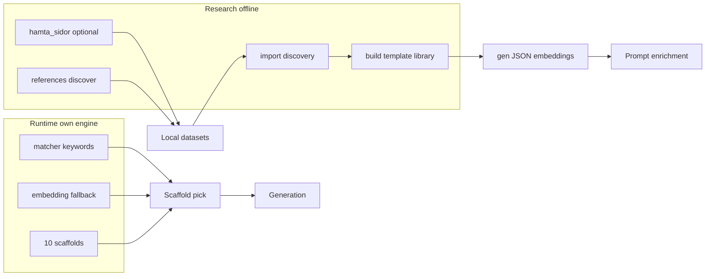

# Skript, `hamta_sidor` och runtime scaffolds

Kort översikt för underhåll och agentarbete. Senast genomgång: 2026-03-25 (kanon `hamta_sidor_branch_emil.py` + lab under `scripts/labs/testning_scarf/`).

## `hamta_sidor` (Vercel Templates-skrapning)

| Fil | Storlek (ca) | Syfte |
|-----|----------------|-------|
| ~~`hamta_sidor.py` (repo root)~~ | — | **Borttagen** 2026-03-24 (var dublett av dåvarande `scripts/hamta_sidor.py`). |
| ~~`scripts/hamta_sidor.py`~~ | — | **Borttagen** 2026-03-25; använd `hamta_sidor_branch_emil.py` med `--legacy-wide-use-cases` för samma breda kategori-lista. |
| [`scripts/hamta_sidor_branch_emil.py`](../../scripts/hamta_sidor_branch_emil.py) | (växer) | **Kanon:** `USE_CASES_CORE`, valfritt `--extended-scrape`, valfritt `--legacy-wide-use-cases` (historisk bred lista), tierad utdata, rapporter, `--flat-layout`, `--urls` → `direct-urls/`, m.m. **Vanligt val för manuell inhämtning** av research-material. |

**Rekommendation / kanon:** endast **`hamta_sidor_branch_emil.py`**. Detaljer: [`scripts/README.md`](../../scripts/README.md). Inget körs från `package.json`; det påverkar **research** / lokala dataset, inte produktion.

**Risk:** Vercel kan ändra HTML → tysta fel eller tomma listor. Verifiera manuellt efter större sajtändringar.

**Övriga referenser:** [`docs/plans/avklarat/2026-03-docs-old-archive/2026-03-holding-area/next-sidan-skrapning.txt`](../plans/avklarat/2026-03-docs-old-archive/2026-03-holding-area/next-sidan-skrapning.txt) nämner historiskt `hamta_sidor.py` — använd `scripts/hamta_sidor_branch_emil.py` (valfritt `--legacy-wide-use-cases`).

### `vercel_template_cli.py` (repo root)

| Fil | Syfte |
|-----|--------|
| [`vercel_template_cli.py`](../../vercel_template_cli.py) | **Offline**-CLI som skrapar [Vercel Templates](https://vercel.com/templates) efter filtergrupper (use case, framework, CSS, DB, …), kan plocka GitHub-repo från detaljsidor och skriva **JSON** (`--json`) eller **scaffold-kandidatlista** (`--candidates`). |

**Inte runtime:** används bara för research och kurering innan interna scaffolds uppdateras. Kedja enligt skriptets docstring: kandidater → `npm run scaffolds:curate` (eller motsvarande) → manuell granskning → `sync-scaffold-refs.mjs` → nya manifest under `src/lib/gen/scaffolds/`.

**Beroenden:** Python 3 + `requests` + `beautifulsoup4` (t.ex. `pip install requests beautifulsoup4`). Vercel kan ändra HTML; vid tomma resultat, verifiera sidstruktur manuellt.

**Återställd:** filen togs tillfälligt bort 2026-03-24 och återinfördes p.g.a. fortsatt behov av mallupptäckt.

---

## `scripts/` — koppling till `package.json` och interna imports

### NPM (`package.json` `scripts`)

| Skript | Används av |
|--------|------------|
| `refresh-token.mjs`, `db-init.mjs`, `next-runner.mjs` | dev/build/start |
| `sync-v0-templates.mjs`, `validate-templates.mjs` | templates:* |
| `generate-template-embeddings.ts` | templates:embeddings |
| `import-template-discovery.ts`, `hydrate-template-library-cache.ts`, `build-template-library.ts`, `generate-template-library-embeddings.ts` | template-library:* |
| `audit-runtime-library.ts` | runtime-library:audit |
| `generate-scaffold-embeddings.ts`, `curate-scaffold-candidates.ts`, `promote-to-scaffold.ts` | scaffolds:* |
| `generate-docs-embeddings.ts` | docs:embeddings |
| `run-eval.ts` | eval |
| `run-migrations.ts` | db:migrate |
| `test-api-usage.mjs` | test:api |
| `labs/testning_scarf/*` (via `prompt:trace`, `scaffold:suite`, `first-llm:lab`, `first-llm:live`, `testning:codegen-print`) | **Lab/debug** — se [`scripts/README.md`](../../scripts/README.md) § Lab / debug |

`references:discover*` kör **Playwright** på `e2e/vercel-templates/scrape-catalog.spec.ts` (**spårad**). Legacy-mappen `vercel_templates_levels/` kan finnas lokalt (gitignore) men är inte npm-kanon. Full förklaring + scaffold-gränser: [`vercel-templates-discovery.md`](vercel-templates-discovery.md), [`vercel-templates-playwright-scaffold-integration.txt`](vercel-templates-playwright-scaffold-integration.txt).

### Dokumenterade manuellt (ej i `package.json`)

| Fil | Anteckning |
|-----|------------|
| `sync-scaffold-refs.mjs` | [`scripts/README.md`](../../scripts/README.md), [`vercel_template_cli.py`](../../vercel_template_cli.py) (valfri katalogskrapning) |
| `manual/scaffold-pipeline.py` | [`scripts/manual/README.md`](../../scripts/manual/README.md), [`scripts/README.md`](../../scripts/README.md) — interaktiv meny för template-library-kedjan |
| `scripts/hamta_sidor_branch_emil.py` | Se avsnitt ovan (enda Python-entry för denna skrapare) |
| `recovery/recreate-repo-branch-commit.ps1` | **Saknas** i repot; beskrivs som borttaget/odeployat i [`scripts/README.md`](../../scripts/README.md). |

### Interna moduler (importeras av andra skript)

- `template-library-discovery.ts` — används av `build-template-library.ts`, `import-template-discovery.ts`, `hydrate-template-library-cache.ts`, `curate-scaffold-candidates.ts`, `promote-to-scaffold.ts`, `scaffold-candidate-report.ts`; test: `template-library-discovery.test.ts` (körs med `vitest` om filen matchar projektets testmönster).
- `scaffold-candidate-report.ts` — används av `build-template-library.ts`, `curate-scaffold-candidates.ts`.

### Borttagna som oanvända (2026-03-24)

| Fil | Skäl |
|-----|------|
| `hamta_sidor.py` (repo root) | Dublett av borttaget `scripts/hamta_sidor.py` (båda borta; kanon = `scripts/hamta_sidor_branch_emil.py`). |
| `_verify_password.mjs` | Tom fil (0 byte), inga referenser. |
| `verify-tables.ts` | Engångs-/lokal Postgres-listning, inga referenser i repot; återfinns i git-historik vid behov. |

---

## Runtime scaffolds (ingen kodändring här)

**Flöde:** `orchestrate.ts` → `matchScaffold` / `matchScaffoldWithEmbeddings` ([`matcher.ts`](../../src/lib/gen/scaffolds/matcher.ts)) → [`serializeScaffoldForPrompt`](../../src/lib/gen/scaffolds/serialize.ts) → [`buildSystemPrompt`](../../src/lib/gen/system-prompt.ts) → generation.

- **Primärt:** nyckelordsmatchning per scaffold-familj (landing, SaaS, portfolio, …).
- **Fallback:** [`scaffold-search.ts`](../../src/lib/gen/scaffolds/scaffold-search.ts) (förberäknade inbäddningar + ev. live OpenAI-anrop om nyckel finns). Heuristik i `matcher.ts` begränsar när embedding får slå om från generiska keyword-defaults (t.ex. auth/dashboard).

**Styrkor:** Fast register (~10 scaffolds), förutsägbart beteende, `npm run scaffolds:validate` (manifesttester).

**Osäkerheter:** Beroende av OpenAI för embedding-fallback; Vercel/HTML-ändringar påverkar **inte** runtime-matchning direkt — däremot **Playwright**-discovery och manuella skript som matar research-artefakter.

**Läs mer:** [`engine-status.md`](engine-status.md), [`structure-and-terminology.md`](structure-and-terminology.md), [`src/lib/gen/scaffolds/README.md`](../../src/lib/gen/scaffolds/README.md), [`.cursor/rules/terminology.mdc`](../../.cursor/rules/terminology.mdc) (v0-templates vs scaffold vs Vercel mall).



---

## `.cursorignore` och `scripts/`

I repot är raden `#scripts/` **utkommenterad** — `scripts/` indexeras alltså av Cursor. Om du återaktiverar `scripts/`, lägg gärna till undantag, t.ex.:

```gitignore
scripts/
!scripts/README.md
!scripts/*.ts
!scripts/*.mjs
```

…så att agenter fortfarande ser README och entrypoints utan att indexera allt.

---

## Relaterad dokumentation

- [`scripts/README.md`](../../scripts/README.md) — detaljerade kommandon för sync, template library, recovery.
- [`docs/README.md`](../README.md) — nav-hubb.

