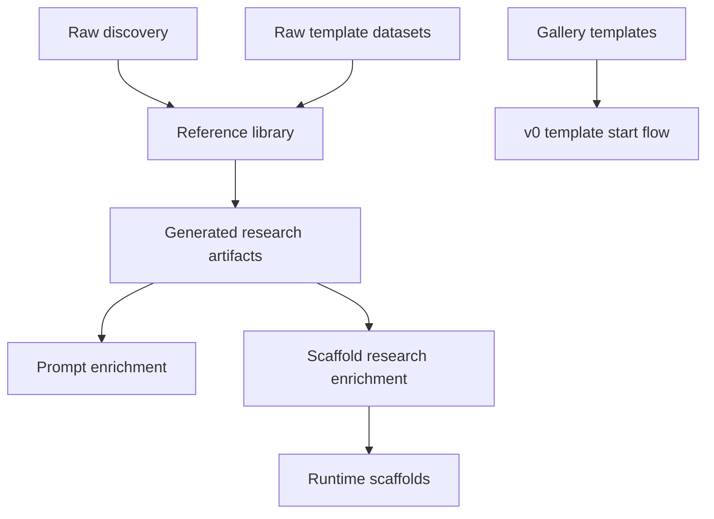

# Structure And Terminology Overview

This document is the canonical human-readable overview for how Sajtmaskin
organizes:

- product gallery templates
- runtime scaffolds
- external reference research
- generated research artifacts

## What to keep

- `src/lib/templates/`
  Product-facing template gallery data used by the UI and v0 template-start flow.
- `src/lib/gen/scaffolds/`
  The only runtime scaffold registry used directly by prompt-based generation.
- `src/lib/gen/template-library/`
  Generated research artifacts consumed by runtime prompt enrichment and search.

## What was renamed or repositioned

- `_scaffold_discovery/` -> `research/external-templates/raw-discovery/`
  Raw, noisy local discovery output from scrape/discovery scripts.
- `v0_vercel_agents/template_library/` -> `research/external-templates/reference-library/`
  Curated external reference library containing per-template reference dossiers.

Compatibility note:

- `v0_vercel_agents/template_library/` is kept as a small migration stub so old
  references can point humans to the new canonical path.

## What should be archived or treated as non-canonical

- raw scrape output in `research/external-templates/raw-discovery/`
- local `_sidor` datasets and ad-hoc desktop datasets
- temporary migration notes that duplicate the canonical terminology docs

These inputs are useful for research, but they are not sources of runtime truth.

Related but separate:

- `_template_refs/` contains manually synced full-repo references for focused
  scaffold research. It is research material, not the default generation base.

## Canonical terminology

- `gallery template`
  A product/UI template entry from `src/lib/templates/`.
- `runtime scaffold`
  An internal starter project from `src/lib/gen/scaffolds/`.
- `external reference template`
  A public starter repo/page from Vercel or similar ecosystems.
- `reference dossier`
  A curated per-template research package in
  `research/external-templates/reference-library/dossiers/`.
- `generated research artifacts`
  Committed JSON/embeddings derived from curated research, primarily in
  `src/lib/gen/template-library/` and
  `src/lib/gen/scaffolds/scaffold-research.generated.json`.

## Data flow

## Important boundary

External reference templates are not cloned into runtime generation by default.
They are used to:

- enrich prompts
- improve search and embeddings
- improve internal scaffold metadata and future scaffold evolution

Prompt-based own-engine generation remains scaffold-driven unless a separate,
explicit repo-import flow is introduced in the future.
