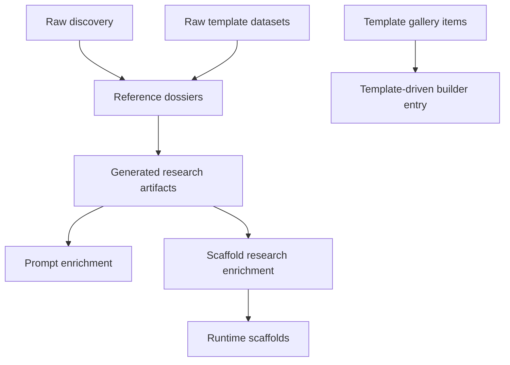

# Structure, Terminology, And Agent Coordination

This is the canonical human-readable document for:

- core product and architecture terminology
- structure boundaries between runtime, research, and planning material
- collision-avoidance rules when multiple agents may be working in parallel

Agent-facing mirrors live in:

- `.cursor/rules/terminology.mdc`
- `.cursor/rules/parallel-agent-collision-safety.mdc`

If this file and those rules ever disagree, update them in the same turn.

## Site layers

| Layer | What it is | What it is not |
|------|-------------|----------------|
| `Vercel` | Hosting platform: deploys, domains, env vars, CDN | Not Sajtmaskin itself |
| `Sajtmaskin` | The app in this repo: builder, projects, deploy flow, own engine | Not the hosting platform |
| `v0` | Soft-deprecated external generation platform used only for explicit fallback/integration paths | Not the default generation path |
| `demo site` | A user-generated site previewed or deployed from Sajtmaskin | Not the Sajtmaskin app |

## Parallel agent safety

When more than one agent may be active, treat coordination as explicit repo state,
not as guesswork.

Use these rules:

1. Check `.cursor/agent-intents/BOARD.md` before editing shared areas.
2. Re-read `git status` before touching files that may already be in motion.
3. Narrow work to non-overlapping files whenever possible.
4. If overlap is plausible, ask before editing ambiguous files.
5. Never overwrite, delete, stage, or commit another agent's changes without explicit confirmation.

Working interpretation of the intent board:

- `active` with fresh `Session` and `Heartbeat` means another agent likely owns that area right now.
- `done` means historical context only.
- Missing or stale heartbeat means "treat carefully", not "safe to ignore blindly".

## Runtime lane vs research lane

Use this two-lane model when discussing generation architecture:

| Lane | What belongs here | What it is not |
|------|-------------------|----------------|
| `runtime lane` | `src/lib/gen/scaffolds/`, scaffold matching, scaffold serialization, preview/deploy generation flow | Not the template gallery, not raw research datasets |
| `research lane` | `scaffold-pipeline/catalog/`, `scaffold-pipeline/discovery/`, curated generated JSON in `src/lib/gen/template-library/` | Not the runtime scaffold registry |

The template gallery is a product discovery surface, not a third runtime lane.

## Template terminology

These terms must not be mixed:

| Term | Meaning | Scope |
|------|---------|-------|
| `template gallery item` | User-facing gallery entry from `src/lib/templates/` | Product/UI |
| `runtime scaffold` | Internal starter project from `src/lib/gen/scaffolds/` | Runtime generation |
| `Vercel template` | Public starter repo/page from Vercel's ecosystem | External reference |
| `reference dossier` | Curated per-template research package in `scaffold-pipeline/dossiers/` | Research |
| `generated research artifact` | Committed JSON/embeddings derived from dossiers, mainly in `src/lib/gen/template-library/` and `src/lib/gen/scaffolds/scaffold-research.generated.json` | Runtime input derived from research |
| `raw discovery` | Noisy scrape/discovery output in `scaffold-pipeline/discovery/` | Non-canonical research input |

Preferred wording:

- UI/product copy: `hemsidemall` or `kategori-mall`
- code/docs for `src/lib/templates/`: `template gallery` or `template gallery item`
- code/docs for `src/lib/gen/scaffolds/`: `runtime scaffold`
- external ecosystem items: always qualify as `Vercel template`

## Builder model terminology

Inside the builder, use lane language consistently:

| Lane | What it controls | User-facing control |
|------|------------------|---------------------|
| `model lane` | Main generation model for build/refine | `Byggmodell` |
| `product lane` | Prompt-assist model before build | `Forbattra` and deep brief |
| `polish lane` | Low-cost text-only prompt rewrite | `Skriv om` |
| `thinking flag` | Extra reasoning behavior in generation metadata | `Thinking` |

Important rules:

- Do not mix runtime/research lanes with builder model lanes.
- `Thinking` is not a lane and not a fifth tier.
- `Anthropic` may appear in both model lane and product lane, but they are still separate controls.

## Canonical identifiers

| Concept | Canonical name | Notes |
|--------|----------------|-------|
| Our durable project ID | `appProjectId` | Root project identity in Sajtmaskin |
| URL transport for project ID | `project` | Hydrates `appProjectId` |
| Builder conversation ID | `chatId` | Durable builder conversation |
| External legacy project ID | `v0ProjectId` | Legacy/fallback identity only |
| Preview URL | `demoUrl` | Usually temporary preview or sandbox-facing URL |
| Entry mode | `buildMethod` | `wizard`, `category`, `audit`, `freeform`, `kostnadsfri` |
| Build type | `buildIntent` | `website`, `app`, `template` |

## Canonical repo boundaries

Keep these as the main canonical homes:

- `src/lib/templates/` for template gallery data
- `src/lib/gen/scaffolds/` for runtime scaffolds
- `src/lib/gen/template-library/` for generated research artifacts used at runtime
- `scaffold-pipeline/dossiers/` for curated research dossiers

Treat these as non-canonical or local-only support areas:

- `scaffold-pipeline/discovery/` (bulk gitignored)
- `scaffold-pipeline/repo-cache/` (local clone mirrors, gitignored)
- local `_sidor` datasets and ad-hoc desktop datasets
- temporary migration notes that duplicate the canonical docs

Related but separate:

- `_template_refs/` is focused scaffold-research material, not the default runtime base

## Data flow

## Working rule

If a new doc, rule, or agent handoff introduces different terminology for one of
the concepts above, update this file rather than letting a parallel vocabulary
grow elsewhere.
