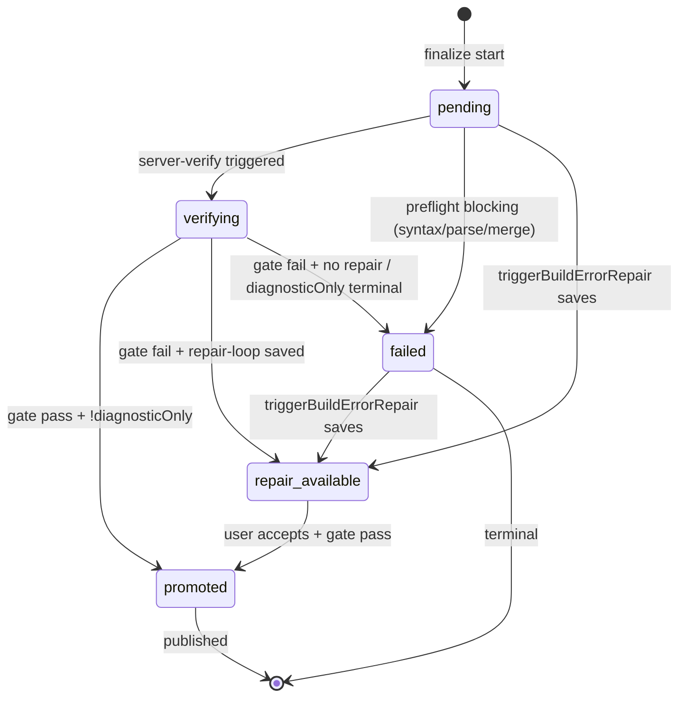

# Version-status state machine

Denna fil dokumenterar DB-state-maskinen för `engine_versions` (`release_state`, `verification_state`) och vilken kod som skriver respektive state. Skrevs ursprungligen 2026-04-23 som del av showcase-bug-rotorsaksfixen — se [`docs/devlogs/2026-04-23-showcase-bug-rootfix.md`](../devlogs/2026-04-23-showcase-bug-rootfix.md).

## States

Definierat i [`src/lib/db/engine-version-lifecycle.ts`](../../src/lib/db/engine-version-lifecycle.ts):

| `release_state` | `verification_state` | Betydelse |
|---|---|---|
| `draft` | `pending` | Nyskapad. Ingen verifiering har kört än. |
| `draft` | `verifying` | Server-verify kör i bakgrunden. |
| `draft` | `repairing` | En repair-pass skriver nya filer. |
| `draft` | `repair_available` | Repair-pass klar, användaren kan acceptera/granska. |
| `draft` | `passed` | Verifierad men inte promotad. |
| `draft` | `failed` | Verifiering misslyckades definitivt. |
| `promoted` | (vilken som) | Publicerad — live. |

**Två statusytor läser detta:** publicerings-/deploy-ytan (`/readiness`) läser DB-state via `resolveEngineVersionLifecycleStatus(version)` och visar labels som "Draft"/"Verifierar"/"Reparerar"/"Fix redo"/"Fel"/"Publicerad". **Builder-spinnern + version-historik-badgen** läser däremot event-bus-projektionen (`selectVersionStatus` via `/version-status` + `/versions`), som sedan #337 reconcilas mot terminalt DB-`verification_state` (`reconcileTerminalDbState`) så en död verify-runda aldrig fastnar på "verifying".

## Transitioner

## Vem skriver vad

| Transition | Kod | Not |
|---|---|---|
| → `pending` | [`addAssistantMessageAndCreateDraftVersion`](../../src/lib/db/chat-repository-pg.ts) | Default state vid DB-insert. |
| → `verifying` | `markVersionVerifying` | Anropas av [`server-verify.ts`](../../src/lib/gen/verify/server-verify.ts) före gate-körning. |
| → `repairing` | `markVersionRepairing` | Anropas av repair-loop innan LLM-anrop. |
| → `repair_available` | `saveRepairedFiles` | Efter lyckad LLM-repair i server-verify. |
| → `passed` | (oanvänd i nuläget) | Reserverad för framtida split av `passed` vs `promoted`. |
| → `failed` | `failVersionVerification` / `maybeFailVersionVerification` | Se 2026-04-23-ändringen nedan. |
| → `promoted` | `promoteVersion` | Server-verify gate-pass (inte diagnostic_only), eller manuell quality-gate-route. |

## 2026-04-23 — regel för pre-commit `failed`

**Tidigare beteende:** varje version med verifier-LLM blocking findings (`verifierBlockingFindings.length > 0`) markerades omedelbart `failed` inne i `finalizeAndSaveVersion` via `maybeFailVersionVerification`. Server-verify sprang sen i `diagnosticOnly: true` och gjorde **ingen** state-uppdatering. Resultat: UI:n visade "Fel" innan server-verify hunnit köra sitt riktiga tsc+build-pass.

**Nytt beteende (fas D1–D2 av showcase-bug-rotorsaksfixen):**

1. Endast **preflight hard errors** (syntax/parse/merge) → pre-committa `failed` i finalize. Dessa är deterministiska och ska fast-fail:a.
2. **Verifier-only blocking** → state stannar i `pending` tills server-verify landat. UI:n visar "Verifierar" under fönstret.
3. Server-verify i `diagnosticOnly: true` **resolverar** terminalt via `failVersionVerification` både vid gate-pass (verifier-LLM och tsc oeniga) och gate-fail (båda eniga om fel). Detta säkrar att versionen aldrig fastnar i `pending` utan att någon sätter slutstatus.
4. `triggerBuildErrorRepair` (VM build-error SSE) kan fortfarande override:a vilket state som helst genom `saveRepairedFiles` → `repair_available`.

## 2026-07-02 — F2 render-first (typecheck advisory, #330)

För F2-rader (`lifecycle_stage !== "integrations"`) leder ett **typecheck-only**-gate-fel numera till `verifying → promoted` (advisory), **inte** `verifying → failed`. Regelägare: `isTypecheckOnlyAdvisory()` i `quality-gate-checks.ts`, delad av **båda** gate-vägarna:

- `POST .../quality-gate` promotar (fortfarande via `assertPromoteAllowed`) och svarar `{ passed: true, vmGatePassed: false, designAdvisory: true }`; ingen auto-repair triggas.
- Bakgrunds-`server-verify` speglar regeln och försöker promota **före** `version.verifier.done`-emitten; en promote-no-op (lease/guard/DB) emitterar **ingen** terminal bus-händelse (terminal bus-`failed` är sticky i `reconcileTerminalDbState` och skulle annars pinna en falsk röd status) — bussen lämnas snurrande så DB-`passed`/watchdog resolvar.

`verification_state` blir alltså `passed`/`promoted` med en `warning`-logg (`quality-gate:typecheck-advisory`), inte `failed`. Båda vägarna emitterar dessutom `version.degraded {typecheck_advisory}` så status-projektionen visar "klar med varningar" (degraded), aldrig solid grön.

Oförändrat hårt (→ `failed`/repair som förr): F3 (`integrations`), varje F2-fel där `build` eller `lint` failar (inkl. build-origin `forceBuildCheck`), samt typecheck-fel med **render-risk-diagnostik** (trasig modul-/export-resolution, `RENDER_RISK_TS_CODES` i `quality-gate-checks.ts` — bryter `next dev` också) eller oparsebar tsc-output (fail-closed). Verifier/promote-guard-block ger fortfarande `failed`; `diagnosticOnly`-läget advisory-promotar aldrig. Render-säkerheten (att sidan renderar) gate:as uppströms i finalize-preflight, inte här.

Koden: se `runner.ts:389-410` och `server-verify.ts:175-245`.

## 2026-07-02 — strandade F2-drafts + preview-url-persist

F2-promotion körs från webbläsaren (post-checks → `POST /quality-gate` → promote), och watchdogen rör medvetet inte F2-`pending`. Två härdanden efter prod-incidenten (chat `4314362f`, follow-up-version strandad som `draft`/`pending` för alltid):

1. **Resume av strandad verify-lane:** `useResumePendingVerification` (monterad i `useBuilderPageController`) återupptar `POST /quality-gate` för chattens senaste version när den är `draft`+`pending`, F2 (ej `integrations`), ej `quick_edit` och äldre än 3 min (`RESUME_VERIFY_MIN_AGE_MS` — den ordinarie post-stream-lanen är klart yngre än så). En stängd/omladdad flik lämnar alltså inte längre versionen ogrön för alltid; nästa builder-besök plockar upp den. Routens per-version-lease gör dubbelkörning ofarlig (409 `version_busy`).
2. **`preview_url` persisteras awaitat:** `updateVersionPreviewUrl` efter `preview-ready` i `generation-stream-post-finalize.ts` var fire-and-forget — på serverless kunde skrivningen dö vid function-freeze och lämna `preview_url = NULL` trots lyckad preview. Skrivningen awaitas nu.

## Uppföljningsspår

- **Full event-bus UI-flip** (Kvarvarande #11) — ✅ **klar** (Område 6-3): builder-ytorna läser `selectVersionStatus(events)` från [`event-bus-projection.ts`](../../src/lib/logging/event-bus-projection.ts) via `/version-status` + `/versions`. #337 la till terminal DB-reconcile (`reconcileTerminalDbState`) + en lease-säker stale-watchdog (`settleStaleVerificationIfNeeded`, delad med `/readiness`) så bussen aldrig fastnar icke-terminalt. Kvar-fältet `resolveEngineVersionLifecycleStatus` används nu bara av publicerings-/deploy-ytan.
- **Audit §3.2** (slå ihop server-verify + quality-gate + accept-repair till ett enda pass) — större refaktor, parkerad.
