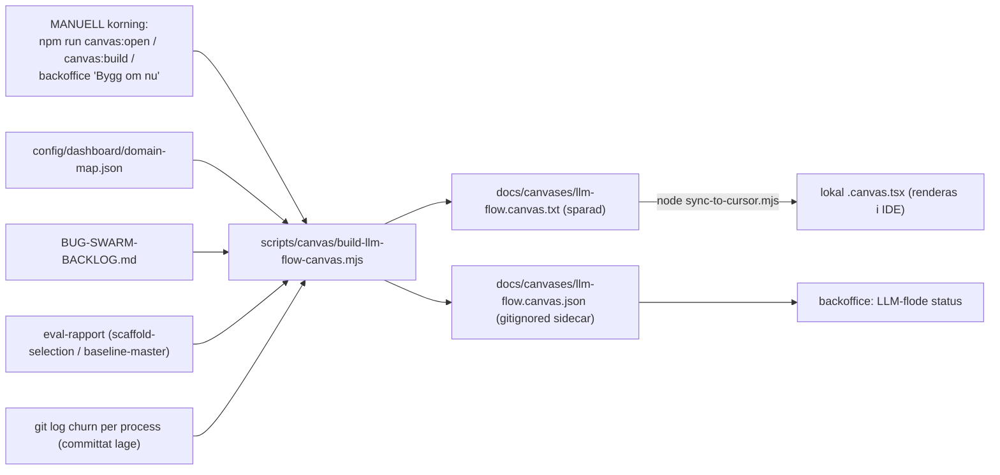

# LLM-flode canvas - oversikt (plan + design)

Versionerad kopia av arbetsplanen. En oversikts-canvas for sajtmaskins
LLM-flode som visar per process om den ar **Klart / Pagar / Skakigt /
Blockerat**. Genereras MANUELLT (se "Uppdatering") - varje artefakt ar en
ogonblicksbild vid korningstillfallet (se "Farskhet"), inte en live-vy.

## Krav som styrde designen

1. **Icke-invasivt.** Inga andringar i befintliga filer bara for att canvasen
   ska funka. Inga edits i `package.json`, `predev`, `.cursor/hooks.json`,
   `tsconfig.json` eller `eslint.config.mjs`. Allt nytt ar additiva filer.
2. **Inga kontraktsytor.** Repot ar i tung forandring. Generatorn far inte
   forlita sig pa stabila filsokvagar/API:er/scheman - den auto-upptacker
   signaler, behandlar varje kalla som valfri och degraderar grafiskt
   (saknad/andrad kalla -> sektionen utelamnas, kraschar aldrig).
3. **Canvasen ror aldrig kallkod.** Generatorn LASER kallor och SKRIVER bara
   canvas-artefakten (`docs/canvases/llm-flow.canvas.{txt,json}`).
4. **Dynamisk.** Status harleds live fran repo-signaler vid varje korning.

## Varfor `.txt` i repot, `.canvas.tsx` lokalt

Repots `tsconfig.json` har `include: ["**/*.tsx", ...]` globalt och CI kor
`npm run typecheck` + `npm run lint` pa varje push/PR till `master`. En riktig
`.canvas.tsx` i repot skulle alltsa typecheckas, importera `cursor/canvas`
(inte ett repo-beroende) och bracka CI. Darfor:

- Repo-artefakt: `docs/canvases/llm-flow.canvas.txt` (tsc/eslint ror aldrig `.txt`).
- Lokal render: `scripts/canvas/sync-to-cursor.mjs` kopierar den till
  `~/.cursor/projects/*sajtmaskin*/canvases/llm-flow.canvas.tsx` dar bara Cursor
  laser den.

Detta gor losningen immun mot hur kontraktsytorna an andras under omstoptningen.

## Dataflode



## Artefakter (enbart nya, additiva filer)

- `scripts/canvas/build-llm-flow-canvas.mjs` - resilient, beroendefri,
  deterministisk generator. Auto-upptacker processer fran
  `config/dashboard/domain-map.json`, parsar `BUG-SWARM-BACKLOG.md` defensivt,
  laser eval-rapporten (`data/scaffold-eval/reports/scaffold-selection-latest.json`
  eller `evals/results/baseline-master/_summary.json`) och raknar git-churn.
  Skriver `docs/canvases/llm-flow.canvas.txt` (sparad) + `.json`-sidecaren;
  `--json-only` skriver bara sidecaren.
- `scripts/canvas/open-in-browser.mjs` - bygger samma `buildData()` till fristaende
  HTML i `.tmp/` och oppnar den i webblasaren (`npm run canvas:open`).
- `scripts/canvas/sync-to-cursor.mjs` - fristaende, opt-in sync till Cursors
  per-maskin projektmapp. Ingen inkoppling i predev/hooks.
- `scripts/canvas/llm-flow-canvas.config.json` - VALFRI tunn override (fokus,
  churn-troskel, status-overrides). Kan raderas; generatorn auto-upptacker allt.
- `docs/canvases/llm-flow.canvas.txt` - genererad, sparad canvas-artefakt (diffbar pa GitHub).
- `docs/canvases/llm-flow.canvas.json` - gitignorerad sidecar som backoffice-vyn laser.
- `docs/canvases/llm-flow-canvas.plan.md` - denna plan.

## Statusmodell (defaults, override per process i configen)

- **Klart** (gron): inga matchade oppna backlog-rader, ingen het churn.
- **Pagar** (info): het git-churn (>= troskel) men inga oppna buggar.
- **Skakigt** (amber): matchade oppna backlog-rader, eller eval under troskel.
- **Blockerat** (rod): en matchad backlog-rad ar markerad `BLOCKER`.

Bug-attribution ar medvetet smal (kuraterade, specifika termer + langa
fil-stammar) - hellre missa an over-matcha. Den auktoritativa, kompletta listan
visas separat i sektionen "Oppna huvudrisker" direkt ur backloggen.

## Uppdatering (manuell)

Canvasen uppdateras INTE automatiskt. Den tidigare auto-PR-workflowen
(`.github/workflows/llm-flow-canvas.yml`) togs medvetet bort i #191
(`chore(ci): disable auto-PR canvas refresh workflow`) for att slippa
refresh-PR-bruset. Regenerera nar du vill ha farsk status:

```
npm run canvas:open                              # HTML i webblasare (ett kommando)
npm run canvas:build                             # skriv om .txt + .json (sparad artefakt)
node scripts/canvas/sync-to-cursor.mjs          # rendera lokalt i Cursor
```

Backoffice-vyn "LLM-flode status" regenererar `.json`-sidecaren vid start och har
en "Bygg om nu"-knapp (kor `node ... --json-only`, ror aldrig den sparade `.txt`).

Vanlig rutin i webblasare: `npm run canvas:open`.

Fardefarbete lokalt i Cursor: `git pull` -> `node scripts/canvas/sync-to-cursor.mjs` ->
oppna canvasen bredvid chatten.

## Farskhet (viktigt)

Varje artefakt ar en **ogonblicksbild** av repo-laget vid genereringstillfallet.
Kallorna blandar working tree och committat lage:

- **Fil-kallor lases fran working tree:** `BUG-SWARM-BACKLOG.md`,
  `config/dashboard/domain-map.json` och eval-rapporten lases direkt fran disk
  (`readFileSync`) - ocommittade andringar i DEM syns vid nasta omkorning.
- **Git-harledda falt speglar committat lage:** commit-hash (HEAD) och churn per
  process kommer fran `git log` - ocommittade kod-andringar raknas inte i churn
  forran de ar committade.
- `npm run canvas:open` skapar en **ny webblasarflik** varje korning; gamla
  flikar ligger kvar pa sin gamla data (ingen live-reload).
- Stammer inte siffrorna: kor om kommandot (och committa det som ska synas i churn).

## Utbyggnad

Configen och generatorn ar byggda sa fler per-process-canvasar kan laggas till
senare utan omskrivning (t.ex. en djup-canvas per fas). Forsta leveransen ar en
samlad oversikt.
