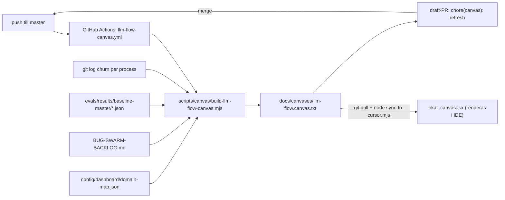

# LLM-flode canvas - auto-uppdaterad (plan + design)

Versionerad kopia av arbetsplanen. En oversikts-canvas for sajtmaskins
LLM-flode som visar per process om den ar **Klart / Pagar / Skakigt /
Blockerat**, alltid fresh mot `master` och synkad GitHub <-> lokalt.

## Krav som styrde designen

1. **Icke-invasivt.** Inga andringar i befintliga filer bara for att canvasen
   ska funka. Inga edits i `package.json`, `predev`, `.cursor/hooks.json`,
   `tsconfig.json` eller `eslint.config.mjs`. Allt nytt ar additiva filer.
2. **Inga kontraktsytor.** Repot ar i tung forandring. Generatorn far inte
   forlita sig pa stabila filsokvagar/API:er/scheman - den auto-upptacker
   signaler, behandlar varje kalla som valfri och degraderar grafiskt
   (saknad/andrad kalla -> sektionen utelamnas, kraschar aldrig).
3. **Canvasen ror aldrig kallkod.** Generatorn LASER kallor och SKRIVER bara
   canvas-artefakten. Refresh-PR:n ror enbart canvas-`.txt`.
4. **Dynamisk.** Status harleds live fran repo-signaler vid varje korning.

## Varfor `.txt` i repot, `.canvas.tsx` lokalt

Repots `tsconfig.json` har `include: ["**/*.tsx", ...]` globalt och CI kor
`npm run typecheck` + `npm run lint` pa varje push/PR till `master`. En riktig
`.canvas.tsx` i repot skulle alltsa typecheckas, importera `cursor/canvas`
(inte ett repo-beroende) och bracka CI. Darfor:

- Repo-artefakt: `docs/canvases/llm-flow.canvas.txt` (tsc/eslint ror aldrig `.txt`).
- Lokal render: `scripts/canvas/sync-to-cursor.mjs` kopierar den till
  `~/.cursor/projects/*sajtmaskin*/canvases/llm-flow.canvas.tsx` dar bara Cursor
  laser den.

Detta gor losningen immun mot hur kontraktsytorna an andras under omstoptningen.

## Dataflode



## Artefakter (enbart nya, additiva filer)

- `scripts/canvas/build-llm-flow-canvas.mjs` - resilient, beroendefri,
  deterministisk generator. Auto-upptacker processer fran
  `config/dashboard/domain-map.json`, parsar `BUG-SWARM-BACKLOG.md` defensivt,
  laser `evals/results/baseline-master/_summary.json` och raknar git-churn.
  Skriver bara `docs/canvases/llm-flow.canvas.txt`.
- `scripts/canvas/sync-to-cursor.mjs` - fristaende, opt-in sync till Cursors
  per-maskin projektmapp. Ingen inkoppling i predev/hooks.
- `scripts/canvas/llm-flow-canvas.config.json` - VALFRI tunn override (fokus,
  churn-troskel, status-overrides). Kan raderas; generatorn auto-upptacker allt.
- `docs/canvases/llm-flow.canvas.txt` - genererad canvas-artefakt (diffbar pa GitHub).
- `.github/workflows/llm-flow-canvas.yml` - auto-uppdatering vid master-push.
- `docs/canvases/llm-flow-canvas.plan.md` - denna plan.

## Statusmodell (defaults, override per process i configen)

- **Klart** (gron): inga matchade oppna backlog-rader, ingen het churn.
- **Pagar** (info): het git-churn (>= troskel) men inga oppna buggar.
- **Skakigt** (amber): matchade oppna backlog-rader, eller eval under troskel.
- **Blockerat** (rod): en matchad backlog-rad ar markerad `BLOCKER`.

Bug-attribution ar medvetet smal (kuraterade, specifika termer + langa
fil-stammar) - hellre missa an over-matcha. Den auktoritativa, kompletta listan
visas separat i sektionen "Oppna huvudrisker" direkt ur backloggen.

## Auto-uppdatering (`.github/workflows/llm-flow-canvas.yml`)

- Trigger: push till `master` med `paths-ignore: docs/canvases/**` (+ manuell
  `workflow_dispatch`).
- Kor generatorn, jamfor `git diff` pa canvas-`.txt`, och oppnar en draft-PR via
  `peter-evans/create-pull-request@v8` om den andrats. PR:n ror enbart canvas-`.txt`.
- Dubbel loop-sakerhet: `paths-ignore` + deterministisk output (ingen diff -> ingen PR).

## Korning (manuellt)

```
node scripts/canvas/build-llm-flow-canvas.mjs   # generera artefakten
node scripts/canvas/sync-to-cursor.mjs          # rendera lokalt i Cursor
```

Fardefarbete lokalt: `git pull` -> `node scripts/canvas/sync-to-cursor.mjs` ->
oppna canvasen bredvid chatten.

## Utbyggnad

Configen och generatorn ar byggda sa fler per-process-canvasar kan laggas till
senare utan omskrivning (t.ex. en djup-canvas per fas). Forsta leveransen ar en
samlad oversikt.
