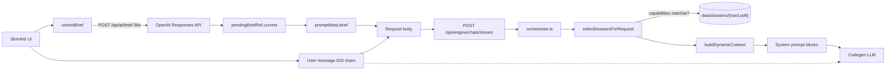
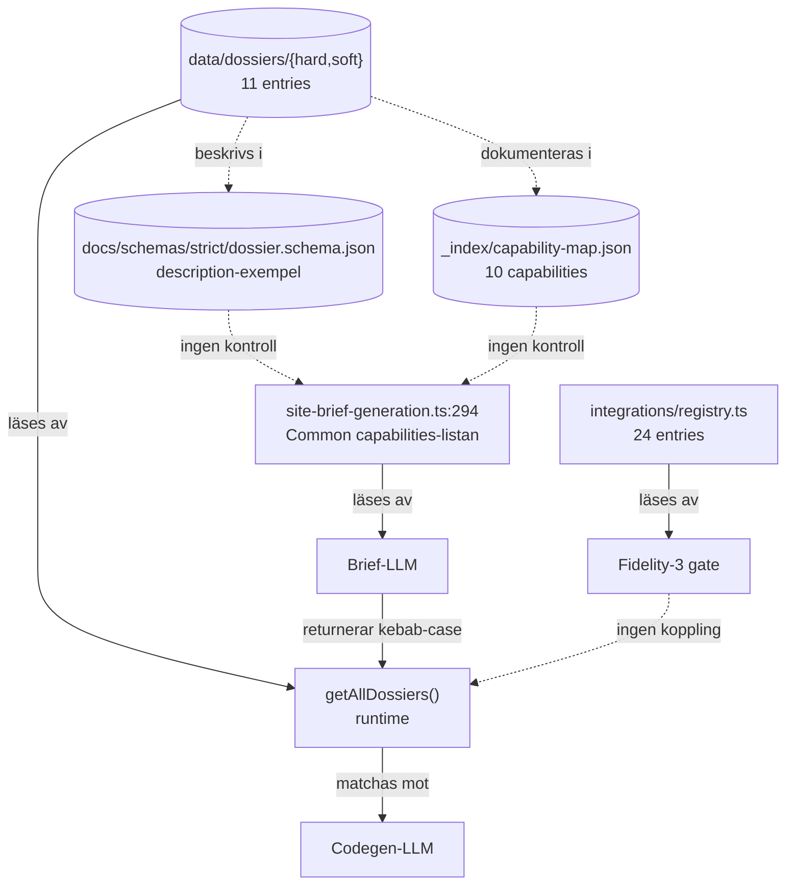

# Devlog — 2026-04-21 — Kapten Krabbas Surfskola

Kronologisk redogörelse av en testkörning genom egen-motorn (Tanker/max, skrivfritt-flöde). Fyra genereringar landade på samma `chatId` plus ett avbrutet fidelity-3-försök. Syftet var att bevaka pipelinen utan att ingripa.

> Åtgärdsplan för identifierade problem: [`docs/plans/active/dossier-brief-sync.md`](../plans/active/dossier-brief-sync.md).

## Setup

- Profil: **Tanker** (id: `max`) → mappar till `gpt-5.4` med thinking på, image generations på, deep brief på
- Provider: OpenAI (Responses API, `USE_RESPONSES_API="true"`)
- Browser: Chrome
- Dev-server: lokal `npm run dev` (Next.js 16.2.3 + Turbopack)
- Preview: Fly preview_host (`https://vm-fly-jakem.fly.dev`)
- Tidszon: alla tider i denna fil är **UTC** (rolling-loggens kanon). Agentpanelen i browsern visade motsvarande lokal tid (CEST, +2h)

## Loggkällor

Tre parallella loggsystem skrev under körningen. Adekvat för post-mortem, viktiga att känna till:

| Källa | Format | Var | Innehåll |
|---|---|---|---|
| Rolling-log | plain text, tail-vänlig | [`logs/sajtmaskin-local.log`](../../logs/sajtmaskin-local.log) | en rad per signal (`[sajtmaskin-dev] HH:MM:SS kind ...`) |
| Doc-log | pretty JSON per signal | [`logs/sajtmaskin-local-document.txt`](../../logs/sajtmaskin-local-document.txt) | full payload per signal, klippt till ~12000 ord |
| Körfil (generationslogg) | strukturerad mapp per run | `logs/generationslogg/<timestamp>-<slug>/` | `summary.md`, `meta.json`, `timeline.ndjson`, `fault-fix-index.{md,csv}`, `fix-patterns.json`, `observability.json` |
| Site-observability | per-chat rolling | `logs/site-observability/<chatId>/` | `history.ndjson` (alla runs för chattet), `latest/` (senaste run:s rådata) |

Körfil-mappen är det *kanoniska* referensmaterialet för en enskild generation — `meta.json` har exakta tider/tokens, `timeline.ndjson` är hela signal-historiken, `fault-fix-index.md` listar alla autofix/verifier/server-verify-händelser.

## Tidslinje (4 genereringar + F3-försök)

### Run 1 — Init (Kapten Krabbas Surfskola)

Körfil: [`logs/generationslogg/20260421-151205-freeform/`](../../logs/generationslogg/20260421-151205-freeform/).

- **13:08 (UTC)** — Stale dev-build. Alla `/api/*`-routes svarar 404 med HTML, klienten kraschar i `JSON.parse` på controllern (`use-landing-controller.ts:211`). Self-healing när Next byggde om routerna.
- **13:10:43** — `[AI] Builder feature flags resolved {imageGenerationsEnabled: true, blobEnabled: true}`. Project skapat: `AeJMWP7B2K6I4JYdBHnle`, prompt-id `Z2X1ey5YPcvW0FM6XO5VT`.
- **13:11:27.102** — `[AI] Dynamic instructions started` (`flow: dynamic_instructions`, `briefProvider: openai`).
- **13:12:03.378** — `[AI] Dynamic instructions completed (brief only, addendum skipped) durationMs: 36275`. Brief tog 36 sek. `requestedCapabilities: ["image-gen"]`, `briefQuality: full`. Ingen dossier på disk har capability `image-gen` → **0 av 11 dossiers valda**.
- **13:12:03.379** — `[AI] Create chat requested` `messageLength: 620, attachments: 0, imageGenerations: true, buildProfile: 'Tanker', buildProfileId: 'max'`. `Prompt formatting result {originalLength: 620, finalLength: 620, changed: false, briefActive: true}` — vilseledande utan att se `meta.brief`-bytes.
- **13:12:05 — 13:25:38** — Själva streamen + pipelinen. **13 min 30 sek** (`durationMs: 809612`). 35 filer. `site.done` med `errorCount: 0`, `verifierBlockingFindingCount: 1`, `previewBlocked: false`. `versionId: f884cc14-8622-4b1d-b166-664316263cc9`. Slug-derivering kollapsade till `orchestration-styledirection`.

Sidan-historia från chat-observabilityns `history.ndjson` visar att init-körningen hade **452 fault-fix-entries totalt** (95 unresolved, 18 error, 53 warning, 381 info) — modellen försökte först skaffolda multiple pages (`app/galleri/page.tsx`, `app/paket/page.tsx`, `app/blog/[slug]/page.tsx`, `app/om/page.tsx`) som alla hade syntax-problem. Slutresultatet är en trimmad version med bara `/` och `/support`.

### Run 2 — Follow-up "tre.js-gubbe"

Körfil: [`logs/generationslogg/20260421-152853-freeform/`](../../logs/generationslogg/20260421-152853-freeform/).

- **13:28:53** — `site.start` + `comm.request.followup`. `promptType: followup_technical`, `promptStrategy: direct`, `chars: 3655`, `baseVersionId: f884cc14...`. **Ingen ny brief körs** — `followup_technical` + `direct` hoppar över `useInitBrief`, och scaffold-selektion blir `selectionMethod: "persisted"` (behåller `landing-page` från init).
- **13:35:14** — `stream.summary` — reasoning 4:16 min, output 2:00 min, **input tokens 60 743, output tokens 27 204**.
- **13:35:15** — `autofix.result fixes=5 warnings=4`. `syntax-validation.pass phase=invalid errors=1`. Den bristfälliga filen var `components/ocean-swimmer-overlay.tsx` — `Unexpected "}"` vid rad 235.
- **13:35:15** — `autofix.mechanical-residual mechanical=0 residual=1` → syntax-fixer startar med `gpt-5.3-codex`.
- **13:35:22** — `syntax-validation.fixer.result before=1 after=0 improved=true`. Fixen lyckades.
- **13:36:22** — `verifier-pass.fixer` + **`cross-file-import-checker`** körs. **Detta är där stub-komponenterna `paddling-captain.tsx`, `direction.tsx`, `point.tsx` skapades** — se "Zip-inspektion" nedan.
- **13:36:23** — `version.created versionId: ed34950e-5477-4806-b5fc-33965c9b9502`.
- **13:36:24** — `preflight.version.failed errors=0` + `site.done durationMs=449670` (**7 min 30 sek total**). `verificationBlocked: true` (1 blocking verifier-finding).
- **13:36:25** — `server-verify.policy run=false reason=fast_policy`.

Tidigare i sessionen sa jag "20 sek" om follow-upen. Den siffran (`Stream summary durationMs: 21331`) var bara klient-streamen, inte hela pipelinen. Sant svar: **7.5 min**.

### Run 3 — Tyst re-validering

Körfil: [`logs/generationslogg/20260421-153918-freeform/`](../../logs/generationslogg/20260421-153918-freeform/).

- **13:39:17 — 13:42:28** — Samma `versionId: ed34950e`. Tomma `highlights`, `faultFixSummary.total: 0`. En "verifier-rerun-after-fix"-typ av händelse utan nya fynd. Förmodligen triggad av quality-gate:ens auto-repair-policy efter run 2:s blocking finding.

### Run 4 — "Lägg till shadcn Input"

Körfil: [`logs/generationslogg/20260421-154228-freeform/`](../../logs/generationslogg/20260421-154228-freeform/). **Detta är versionen i `version-0f1750ed.zip`.**

- **13:42:28** — `site.start` + `comm.request.followup`. `rawMessage` börjar med:
  ```
  MÅL
  Lägg till UI-element (komponent): **Input**
  📍 Placering: Längst upp
  ```
  Det är alltså **inte** tre.js-körningen — det är en shadcn-Input-addition via UI:ets "Lägg till UI-element"-flöde. `chars: 2828`, `promptStrategy: direct`, `strategyReason: preserve_registry_payload`.
- **13:42:29** — `orchestration.styleDirection: editorial-lux`.
- **13:44:59** — `stream.summary` — reasoning 54s, output 94s, **input tokens 68 927, output tokens 11 153**.
- **13:45:00** — `syntax-validation.pass phase=passed errors=0`.
- **13:45:04** — `verifier-pass blocking=0, quality=1`. Quality-finding: **`a11y-duplicate-id`**:
  > "app/page.tsx: duplicate id value 'input-demo' is used on both `<section id=\"input-demo\">` and `<Input id=\"input-demo\">`. IDs must be unique for valid HTML and correct label targeting."
- **13:45:05** — `version.created versionId: 0f1750ed-ff38-4673-a544-4875aef5521e`.
- **13:45:06** — `preflight.summary filesChecked=36 issues=0 errors=0 previewBlocked=false`.
- **13:45:06** — `site.done durationMs=157216` (**2 min 37 sek**).
- **13:45:08** — `server-verify.policy run=false reason=design_preview_skip_verify`.

### Fidelity-3-försök (avbrutet)

- **~13:48** — Användaren laddar ner zip:en (`version-0f1750ed.zip`).
- **~13:50** — Försök till F3 ("bygg integrationer"). Kontrakts-validering kräver real-värden för `CLERK_SECRET_KEY`, `CONTENTFUL_SPACE_ID`, `CONTENTFUL_ACCESS_TOKEN`, `GOOGLE_CLIENT_ID`, `GOOGLE_CLIENT_SECRET`, `MONGODB_URI` — alla från [`integrationRegistry`](../../src/lib/integrations/registry.ts) (24 entries), ingen backas av en dossier (11 entries). Avbröts av användaren.

## Inspektion av `version-0f1750ed.zip`

Zip:en representerar run 4 (efter shadcn Input-tillägg), men innehåller även de komponenter som autofix fabricerade under **run 2**. Tre.js-spåret ligger här kvar (wrappern finns, gubben är stub — se nedan).

Three.js-deps landade i `package.json`:

```json
"three": "0.176.0",
"@react-three/fiber": "9.1.2",
"@react-three/drei": "10.7.7"
```

Wrappern är komplett — `components/ocean-swimmer-overlay.tsx` (1929 bytes) använder R3F korrekt med Canvas, ortografisk kamera, `prefers-reduced-motion`-respekt, och mountas i `app/layout.tsx` på rad 105.

**Men gubben är en stub.** `components/paddling-captain.tsx` är 9 rader:

```tsx
export function PaddlingCaptain(props: Record<string, unknown>) {
  return (
    <div data-stub="PaddlingCaptain" style={{ padding: "2rem", border: "2px dashed #666", borderRadius: "0.5rem", color: "#999", textAlign: "center", fontSize: "0.875rem" }}>
      [PaddlingCaptain]
    </div>
  );
}
export default PaddlingCaptain;
```

Samma stub-mönster återfinns i `components/direction.tsx` och `components/point.tsx`.

**Säkert källa lokaliserad:** [`src/lib/gen/autofix/rules/cross-file-import-checker.ts`](../../src/lib/gen/autofix/rules/cross-file-import-checker.ts) rad 156–170 (`stubForName`) genererar exakt det här JSX-mönstret. Funktionen har 4 regler: namn som slutar på `Provider`/`Context` → React-stub, `use*` → hook-stub, lowercase → `null`-returnerande funktion, allt annat (PascalCase) → den synliga `data-stub`-diven.

Varför det triggade: run 2:s `cross-file-import-checker` (körde `13:36:22`) såg att `ocean-swimmer-overlay.tsx` importerade `@/components/paddling-captain` **innan modellens egen fil hunnit bli giltig**, skapade en stub, och `paddling-captain.tsx`-stuben vann över modellens version. För `Point` och `Direction` är orsaken liknande — en annan fil importerade dem som om de vore komponenter (de är typer i `surf-snake-game.tsx`).

Slutsats: **wrappern är riktig, gubben renderar en streckad ruta**. För användaren ser det ut som ingenting.

Bonus-fynd: `components/surf-snake-game.tsx` (240 rader, 11 KB) finns från init-genereringen — snake-spelet i originalprompten landade alltså redan i första körningen. Inte uppmärksammat tidigare i sessionen.

## Vad gick bra

- Pipelinen rullade igenom hela vägen **4 gånger** utan att krascha helt
- Three.js-overlay + deps tillagda som follow-up trots att init-briefen inte plockade `visual-3d`-capability
- Syntax-fixer (`gpt-5.3-codex`) fixade run 2:s `Unexpected "}"`-fel utan manuell interaktion
- Server-auto-brief-fallback finns och loggar `briefQuality: server-auto` när client-brief saknas
- `repair_loop` städade stale error-rader korrekt (`reason: clean-followup`)
- `previewDeferred=true` + diagnostic-only verifier låter UI:t visa preview snabbt även när verifier hittar non-blocking findings
- Körfil-strukturen (`generationslogg/<stamp>-<slug>/`) gör det enkelt att obducera en specifik run efteråt

## Vad gick dåligt — kort matris

- **Brief-LLM:n känner till capabilities som inte finns** (`image-gen`, `auth`) och **missar 6 av 11 dossiers** som finns på disk. Hardkodad lista i [`src/lib/builder/site-brief-generation.ts:294`](../../src/lib/builder/site-brief-generation.ts) — se [P0](../plans/active/dossier-brief-sync.md#p0-dossier-vokabulär-mismatch).
- **Dossier-schemat självt** ([`docs/schemas/strict/dossier.schema.json`](../../docs/schemas/strict/dossier.schema.json) rad 35) reciterar samma gamla hårdkodade capability-exempel. Tredje källa ur synk. Se [P0 schema-sync](../plans/active/dossier-brief-sync.md#p0-tre-parallella-kataloger-ur-synk).
- **`data/dossiers/_index/capability-map.json`** — en tredje katalog (10 capabilities → 11 dossier-ids). Kommenteras som "backoffice listings + sanity check during curation" men är inte uppdaterad/automatisk. Se samma [P0](../plans/active/dossier-brief-sync.md#p0-tre-parallella-kataloger-ur-synk).
- **Fidelity-3 ber om Clerk/Contentful/MongoDB** som ingen dossier backar — två parallella kataloger ([`registry.ts`](../../src/lib/integrations/registry.ts) med 24 entries vs dossiers med 11). Se [P0](../plans/active/dossier-brief-sync.md#p0-fidelity-3-bryter-mot-dossier-poolen).
- **Follow-up återväljer aldrig dossiers** — `followup_technical` + `direct` hoppar `useInitBrief`. Three.js-wrappern fick uppfinnas från scratch trots att `three-fiber-canvas`-dossiern hade passat. Se [P1](../plans/active/dossier-brief-sync.md#p1-follow-ups-hoppar-över-dossier-omval).
- **Autofix fabrikerar synliga stub-komponenter** i run 2 för `Point`, `Direction`, `PaddlingCaptain`. Modellens riktiga fil ersätts med en streckad ruta. Se [P0](../plans/active/dossier-brief-sync.md#p0-autofix-stub-fabrikering-förstör-genererad-3d).
- **Slug-derivering kollapsar till `orchestration-styledirection`** istället för en site-baserad slug. [`devLog.ts deriveSlugFromEntry()`](../../src/lib/logging/devLog.ts) plockar `type` som fallback. Se [P1](../plans/active/dossier-brief-sync.md#p1-slug-derivering-kollapsar).
- **`Prompt formatting result changed:false`** är vilseledande när brief är aktiv. Se [P1](../plans/active/dossier-brief-sync.md#p1-prompt-formatting-loggraden-är-vilseledande).
- **`tsc-skipped` när `resolvedScaffold == null && !forceTsc`** — typecheck hoppas tyst. Se [P1](../plans/active/dossier-brief-sync.md#p1-tsc-tyst-skippas).
- **WS HMR i preview_host (Fly) failas konstant** — `wss://.../{chatId}/_next/webpack-hmr` får inte upgrade. Floodar konsolen. Se [P2](../plans/active/dossier-brief-sync.md#p2-ws-hmr-prefix-mismatch-i-preview_host).
- **Verifier-finding `footer-dead-links`** är false-positive när snippet saknas — borde degraderas till `warning/skipped`. Se [P2](../plans/active/dossier-brief-sync.md#p2-verifier-blind-findings-rapporteras-som-error).
- **`a11y-duplicate-id`** (run 4) — shadcn Input-tillägget återanvände en existerande section-id. Verifiern fångade det, men autofix-passet rörde det inte. Se [P2](../plans/active/dossier-brief-sync.md#p2-autofix-ignorerar-a11y-findings).
- **D-ID avatar CORS** från `localhost:3000` → agent `v2_agt_h5geNb9N` saknar allowed origin. Se [P2](../plans/active/dossier-brief-sync.md#p2-d-id-avatar-cors-i-lokal-dev).

## Verifier-fynd per körning

**Run 1 (init, `f884cc14`):** 1 blocking, 0 quality, 452 fault-fix-entries (mest syntax-fel i pages som senare droppades).

**Run 2 (tre.js-gubbe, `ed34950e`):** 1 blocking, 2 quality, 16 fault-fix-entries. Huvudfel: `Unexpected "}"` i `ocean-swimmer-overlay.tsx:235`, fixat av `gpt-5.3-codex`. `cross-file-import-checker` skapade stub-komponenterna här. UI visade `footer-dead-links` + `navigation-placeholder-actions` som de 2 kvalitets-blocks.

**Run 3 (re-validering, `ed34950e`):** 0 fynd. Noop.

**Run 4 (shadcn Input, `0f1750ed`):** 0 blocking, 1 quality, 3 fault-fix-entries. Enda finding: `a11y-duplicate-id` på `input-demo`. 36 filer (+1 mot run 2).

## Dataflöde — så briefen hamnar fram (eller inte)



Notera den horisontella linjen `select → disk`: det är där 1:1-mappningen mellan `requestedCapabilities` och dossier-id sker. Om brief-LLM:n säger `"image-gen"` och ingen dossier har `capability: "image-gen"`, blir resultatet tomt — utan att någon signal flaggar det.

## Tre källor till sanningen (alla ur synk)



## Profilen `Tanker/max` på follow-ups

Tidigt i sessionen tolkade jag `model: gpt-5.4` på follow-upen som att en lättare modell tagit över. Det är fel. Tanker/max *är* `gpt-5.4 + thinking`. Profilen följde med follow-upen. Loggraden `Körmodell: gpt-5.4` i agentpanelen är därför korrekt och förväntad.

## Två observationer som inte är buggar

- **`changed: false` när brief är aktiv** — designvalet är medvetet (kommentar i [`useCreateChat.ts:344-358`](../../src/lib/hooks/chat/useCreateChat.ts)): briefen åker som strukturerad data via `meta.brief` och utökas server-side i `buildDynamicContext()`. Ingen wrapping av user-prompten behövs. Loggraden är dock vilseledande (se P1).
- **`previewDeferred: true`** + verify-lane som kör efter `site.done` — preview kan visas omedelbart, verifier rapporterar blockerande findings asynkront. Avsiktligt och rimligt; kan dock kännas som att UI ljuger.

## Säkerhets-/städ-nit i `.env.local`

- `JUICEFACTORY_API` är `pk_live_*` i lokal dev — byt till test-nyckel
- Duplicates: `SAJTMASKIN_PROMPT_DUMP` (rad 167 + 174), `SAJTMASKIN_DEFER_EXTRA_ROUTES_ON_INIT` (rad 172 + 175)
- `SAJTMASKIN_MODEL_ANTHROPIC="claude-opus-4.6"` — verifiera alias i `config/ai_models/manifest.json`

## Nästa steg

Se [`docs/plans/active/dossier-brief-sync.md`](../plans/active/dossier-brief-sync.md) för åtgärdsplanen, severity-grupperad.
