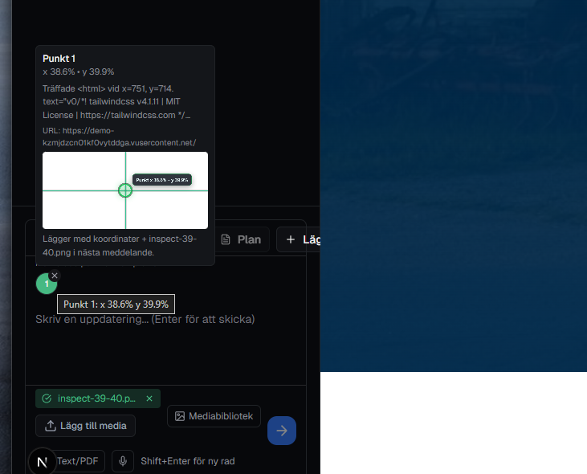
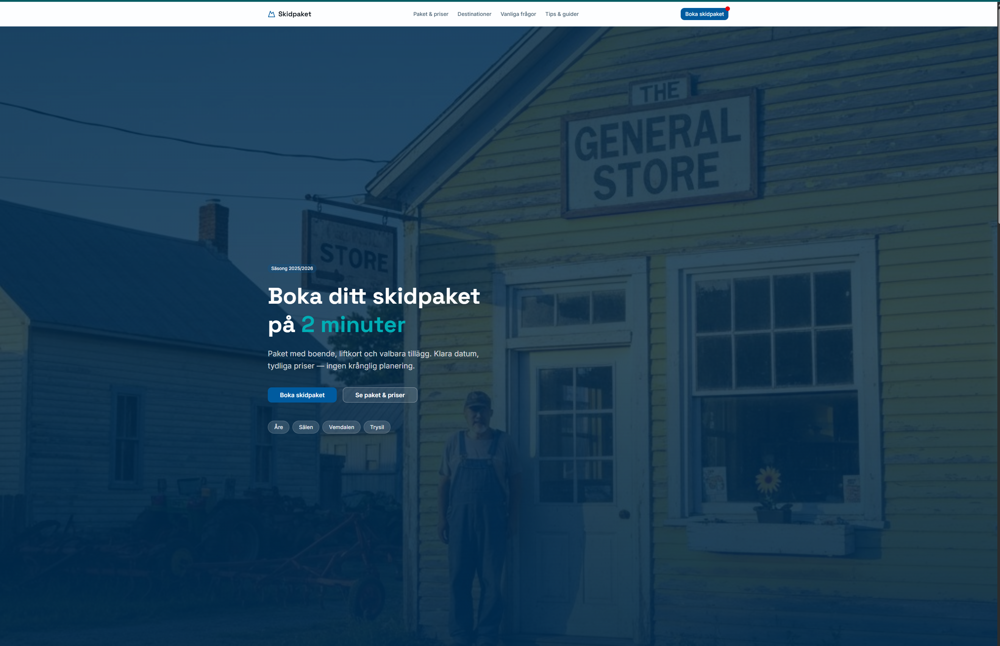

# Inspector Worker Quickstart

This guide runs Playwright capture in an isolated container, without changing the rest of the app stack.

## 1) Configure `.env.local`

Add these keys to your local env:

```bash
INSPECTOR_CAPTURE_WORKER_URL="http://localhost:3310"
INSPECTOR_CAPTURE_WORKER_TOKEN="replace-with-a-long-random-token"
INSPECTOR_CAPTURE_WORKER_TIMEOUT_MS="7000"
```

Notes:
- `INSPECTOR_CAPTURE_WORKER_URL` enables worker forwarding in `/api/inspector-capture`.
- If worker is down or unreachable, the API automatically falls back to local capture logic.
- `INSPECTOR_CAPTURE_WORKER_TOKEN` is optional but strongly recommended.

## 2) Start only the worker

```bash
npm run inspector:worker:up
```

Check status:

```bash
npm run inspector:worker:ps
```

Stream logs:

```bash
npm run inspector:worker:logs
```

Stop:

```bash
npm run inspector:worker:down
```

## 3) Verify health endpoint

```bash
curl http://localhost:3310/health
```

Expected response:

```json
{"ok":true,"service":"inspector-worker","playwright":true}
```

## 4) End-to-end test in builder

1. Run the app normally (`npm run dev`).
2. Open builder preview.
3. Activate `Inspektionstestknapp`.
4. Click in preview.
5. Confirm a chat point chip appears with coordinates and preview image.

## 5) Fallback test (no worker)

1. Stop worker: `npm run inspector:worker:down`
2. Keep `INSPECTOR_CAPTURE_WORKER_URL` set.
3. Click in preview again.
4. Confirm capture still works via local fallback (or at minimum coordinates are still added to the chat point).

## Security defaults

The capture API and worker block obvious internal/private hosts by default (localhost, loopback, and private IP ranges). Keep this behavior enabled for production safety.

