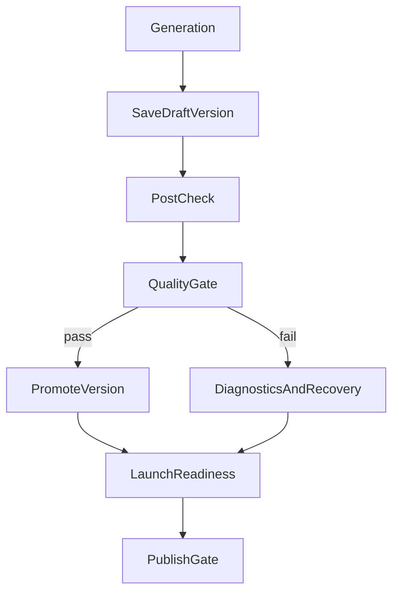

# Plan 7: World-Class Builder Phase 1 - Trust And Launch

## Goal
Make every generation feel trustworthy, inspectable, and close to publishable.

This phase is the highest-leverage product pass because it improves the moment
where confidence is won or lost: preview, quality, version state, and publish.

## Current foundation

Relevant existing building blocks:

- `src/lib/gen/stream/finalize-version.ts`
- `src/lib/hooks/chat/post-checks.ts`
- `src/components/builder/PreviewPanel.tsx`
- `src/components/builder/VersionHistory.tsx`
- `src/components/builder/ProjectEnvVarsPanel.tsx`
- `src/app/builder/useBuilderDeployActions.ts`
- `src/app/api/v0/chats/[chatId]/quality-gate/route.ts`
- `src/app/api/v0/chats/[chatId]/versions/[versionId]/error-log/route.ts`
- `docs/architecture/generation-loop-and-error-memory.md`
- `src/components/builder/DomainManager.tsx`
- `src/components/builder/DomainSearchDialog.tsx`
- `src/app/api/v0/deployments/[deploymentId]/events/route.ts`
- `src/lib/hooks/useDeploymentStatus.ts`

The repo already supports provisional versions, post-checks, quality gate,
persisted error logs, and deploy preparation. Phase 1 extends these into a
coherent release model instead of separate signals.

Additional baseline already exists from earlier tactical work:

- custom-domain setup and deployment-domain persistence are already present
- project-scoped env-var management is already live in both builder and deploy
- deployment webhook plus SSE status streaming exist, but still need final
  trust/access hardening
- builder message rendering has received a baseline performance pass, which
  gives this phase more room for richer diagnostics surfaces

## Workstreams

### 1. Draft -> Verify -> Promote versions
Current issue:
- visible versions can exist before all checks finish

Implementation direction:
- extend the version model in `src/lib/db/schema.ts`
- add version lifecycle fields such as `releaseState`, `verificationState`,
  `verificationSummary`, `promotedAt`
- write helper methods in `src/lib/db/chat-repository-pg.ts` for:
  - `createDraftVersion(...)`
  - `markVersionVerifying(...)`
  - `promoteVersion(...)`
  - `failVersionVerification(...)`

Pipeline changes:
- `src/lib/gen/stream/finalize-version.ts` should save a draft version first
- `src/lib/hooks/chat/post-checks.ts` and quality-gate flow should promote only
  when checks pass
- failed verification should keep the draft inspectable, but not the default
  "ready" version for the chat

### 2. Runtime-truth preview
Current issue:
- the builder preview is operationally useful, but not always runtime-true

Implementation direction:
- make `PreviewPanel` treat runtime preview as primary truth
- move stub-preview into explicit fallback mode
- expose preview mode labels such as:
  - `Runtime preview`
  - `Fallback preview`
  - `Code view`
- route preview failures into the diagnostics system instead of leaving them as
  isolated iframe states

Primary code:
- `src/components/builder/PreviewPanel.tsx`
- `src/components/builder/SandboxModal.tsx`
- `src/app/api/v0/chats/[chatId]/quality-gate/route.ts`

### 3. Launch-readiness center
Current issue:
- users must mentally merge env vars, preview state, version state, and deploy
  state across several surfaces

Implementation direction:
- add a launch-readiness section in the right-hand builder surfaces
- aggregate:
  - missing env vars
  - unresolved quality-gate failures
  - preview/runtime errors
  - deploy blocking warnings
  - domain/deploy readiness

Primary UI homes:
- `src/components/builder/ProjectEnvVarsPanel.tsx`
- `src/components/builder/VersionHistory.tsx`
- `src/app/builder/BuilderShellContent.tsx`

Possible API support:
- new aggregated readiness route under `src/app/api/v0/chats/[chatId]/`
  returning a normalized checklist per selected version

### 4. Diagnostics and recovery center
Current issue:
- persisted errors exist, but they are not a first-class builder experience

Implementation direction:
- add a per-version diagnostics drawer or tab
- show grouped logs:
  - preview
  - project sanity
  - quality gate
  - deploy
  - integration/env issues
- add clear recovery actions:
  - retry checks
  - autofix follow-up
  - open affected files
  - compare with previous version
- carry forward remaining deployment-status hardening:
  - ensure deployment event/SSE routes enforce the same ownership checks as the
    normal deployment read path

Primary code:
- `src/app/api/v0/chats/[chatId]/versions/[versionId]/error-log/route.ts`
- `src/lib/db/services/version-errors.ts`
- `src/components/builder/VersionHistory.tsx`
- `src/components/builder/MessageList.tsx`

### 5. Publish gating
Current issue:
- publish can feel like a next step even when the system already knows the
  version is not ready

Implementation direction:
- gate `Publicera` behind readiness status
- allow two levels:
  - hard block for missing required env vars / failed verification
  - soft warning for non-critical issues
- show exact reason in UI, not generic disabled state

Primary code:
- `src/components/builder/BuilderHeader.tsx`
- `src/app/builder/useBuilderDeployActions.ts`
- `src/components/builder/ProjectEnvVarsPanel.tsx`

## Data flow

## Deliverables

- version lifecycle model with draft and promoted states
- runtime/fallback preview distinction in the UI
- launch-readiness checklist per selected version
- diagnostics and recovery surface tied to persisted logs
- publish gating with exact blocking reasons

## Acceptance criteria

- users can distinguish draft, verifying, failed, and promoted versions
- the default visible version for a chat is trustworthy
- preview failures surface through builder diagnostics instead of isolated noise
- publish is blocked or warned with specific, actionable reasons
- error logs are explorable per version in the builder

## Recommended build order

1. Add version lifecycle fields and repository helpers.
2. Update finalization and post-check flows to use draft/promote.
3. Build readiness aggregation.
4. Add diagnostics UI.
5. Add publish gating and final preview labeling.
