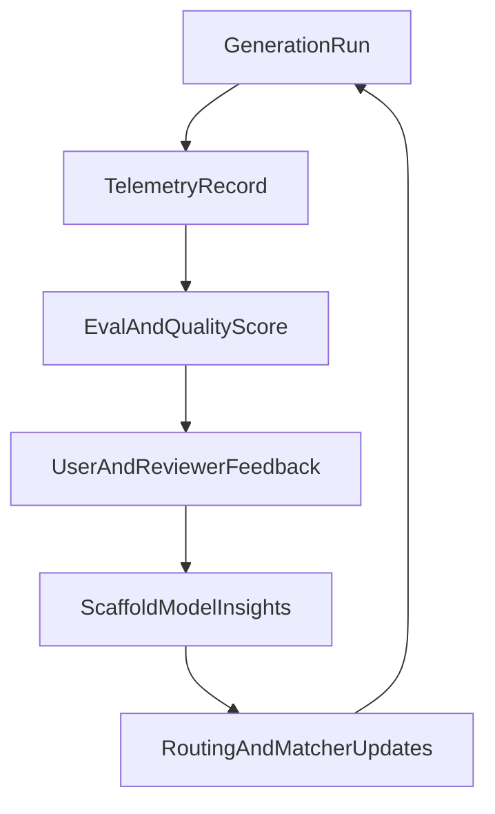

# Plan 10: World-Class Builder Phase 4 - Learning And Moat

## Goal
Build the systems that make Sajtmaskin better over time and harder to copy.

This phase is about turning runtime outcomes into product intelligence:
telemetry, evals, scaffold learning, user feedback, and collaboration flows that
compound rather than reset between generations.

## Current foundation

Relevant existing systems:

- `src/lib/gen/eval/`
- `src/lib/gen/eval/render-telemetry.ts`
- `src/lib/db/services/version-errors.ts`
- `src/lib/db/chat-repository-pg.ts`
- `src/app/api/analytics/route.ts`
- `src/lib/db/services/analytics.ts`
- `docs/llm/egen-motor/MOTOR-STATUS.md`
- `docs/llm/egen-motor/byggplaner/10-generationsdata.md`
- `src/lib/hooks/chat/useAutoFix.ts`

The repo already persists important slices of runtime truth. The gap is not data
existence, but turning that data into selection, routing, ranking, and feedback
loops.

Important boundary:

- generic site/pageview analytics already exist, but they are not version,
  scaffold, model, or retry aware
- do not treat the existing analytics pipeline as a substitute for the unified
  generation telemetry model in this phase

## Workstreams

### 1. Generation telemetry model
Current issue:
- useful signals exist, but they are spread across logs, eval helpers, and error
  records rather than a single generation intelligence model

Implementation direction:
- define a generation telemetry record with fields for:
  - selected scaffold and alternatives
  - model/build tier
  - prompt classification
  - retry count
  - autofix usage
  - quality-gate result
  - preview/runtime success
  - deploy result
  - user-visible publish result
- persist it per version and aggregate per scaffold family / prompt type

Primary code:
- `src/lib/db/schema.ts`
- `src/lib/db/chat-repository-pg.ts`
- `src/lib/gen/eval/`
- `src/lib/gen/stream/finalize-version.ts`

### 2. Scaffold and retry learning
Current issue:
- scaffold choice is currently largely static per prompt pattern, with little
  learning from actual outcomes

Implementation direction:
- score scaffold outcomes by:
  - successful publish rate
  - quality-gate pass rate
  - need for retries
  - common failure categories
- feed these scores back into scaffold matching and retry selection
- allow scaffold A/B trials for specific prompt categories

Primary code:
- `src/lib/gen/scaffolds/matcher.ts`
- `src/lib/gen/orchestrate.ts`
- `src/lib/gen/eval/scorecard.ts`
- telemetry persistence layer

### 3. Feedback loops from the builder
Current issue:
- there is little explicit capture of whether the user thought the result was
  correct, wrong scaffold, wrong style, wrong content, or publish-ready

Implementation direction:
- collect lightweight structured feedback in the builder:
  - good result
  - wrong style
  - wrong structure
  - wrong content
  - wrong integration assumptions
  - preview looked wrong
- tie the feedback to version, scaffold, model tier, and repair history

Primary code:
- `src/components/builder/BuilderHeader.tsx`
- `src/components/builder/MessageList.tsx`
- `src/lib/db/services/audits.ts`
- telemetry and analytics services

### 4. Collaboration and approval primitives
Current issue:
- shared previews exist, but there is no strong workflow for review, approval, or
  handoff inside the builder

Implementation direction:
- add:
  - version comments
  - approval queue
  - reviewer mode
  - shared revision links
  - publish approvals for team workflows
- connect review states to promote/publish gating from Phase 1

Primary code:
- builder UI under `src/components/builder/`
- project/version routes
- future team/project service layer under `src/lib/db/services/`

### 5. Phase-aware model routing
Current issue:
- model routing exists, but it is still mostly tier-based rather than task-based

Implementation direction:
- define separate routing logic for:
  - planner
  - generator
  - verifier
  - fixer
  - deploy assistant
- route based on phase and failure pattern, not only selected tier
- persist routing decisions for later quality analysis

Primary code:
- `src/lib/v0/modelSelection.ts`
- `src/lib/gen/autofix/llm-fixer.ts`
- `src/lib/gen/orchestrate.ts`
- prompt-assist and stream routes

### 6. Eval suite as product guardrail
Current issue:
- eval infrastructure exists but is not yet a durable release gate for major
  product changes

Implementation direction:
- define a stable benchmark set across:
  - one-page company sites
  - multi-page brochure sites
  - SaaS landing pages
  - service sites with forms/bookings
  - content-heavy sites
- compare changes by:
  - visual quality
  - preview correctness
  - route completeness
  - integration correctness
  - publish readiness

Primary code:
- `src/lib/gen/eval/runner.ts`
- `src/lib/gen/eval/checks.ts`
- `src/lib/gen/eval/report.ts`

## Learning loop

## Deliverables

- unified generation telemetry schema
- scaffold performance scoring
- structured builder feedback capture
- collaboration and approval primitives
- phase-aware model routing
- benchmarked eval suite tied to product changes

## Acceptance criteria

- the platform can explain why specific scaffold/model choices are working or not
- user feedback becomes queryable product data, not just chat history
- review and approval can happen around versions, not only outside the tool
- evals become part of product decision-making, not only engineering notes

## Recommended build order

1. Create unified telemetry schema.
2. Attach structured feedback to versions.
3. Add scaffold scoring and routing feedback loops.
4. Add collaboration and approval primitives.
5. Turn evals into a recurring release guardrail.
