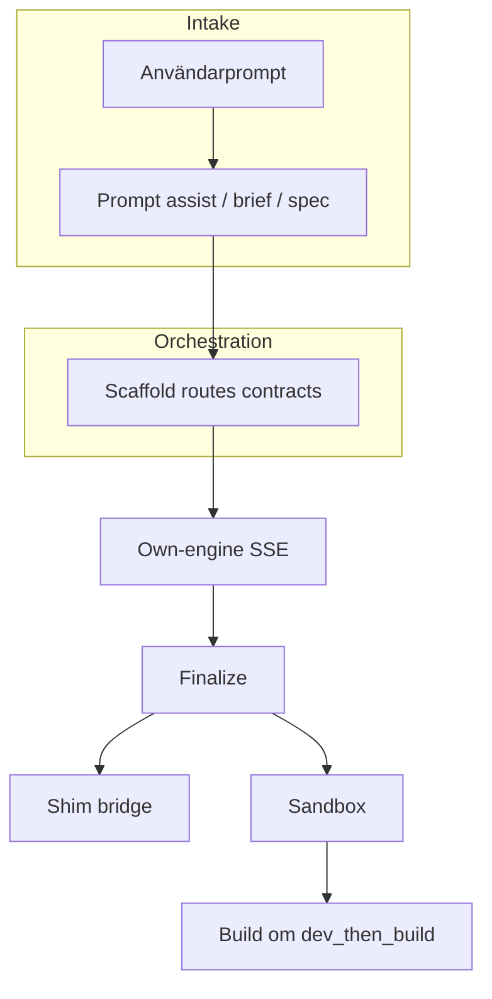
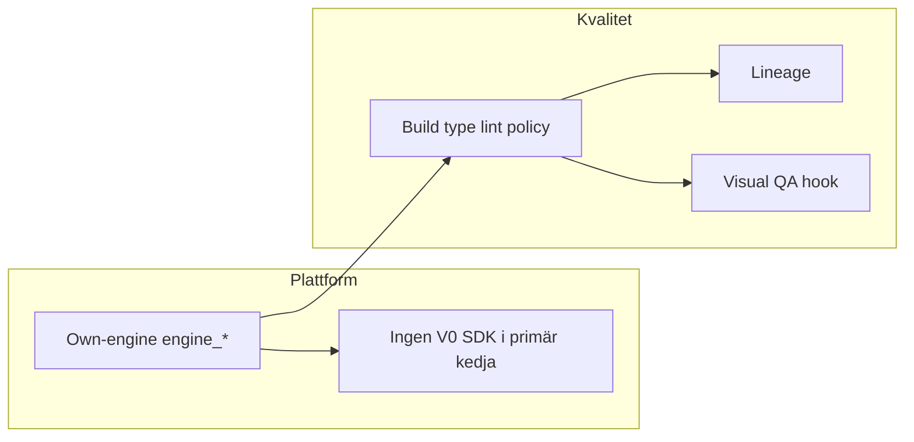

# Konsoliderad plan v2: Own-engine som plattform + kvalitet och spårbarhet

## Varför en plan

De två tidigare planerna berör **samma produktkedja** men olika dimensioner:

| Dimension | Fokus |
|-----------|--------|
| **Plattform / V0** | Sajtmaskin ska **äga** generering och preview via **own-engine** (`engine_*`, stream, finalize, sandbox). V0-mapp, **v0-sdk** och **V0 Platform API** (`V0_API_KEY`) ska bort eller ersättas så att primärflödet inte längre blandar in extern V0-leverantör. |
| **Kvalitet / LLM** | Höja ribban från “valid preview” till **verifierad** output: build/type/lint-policy, bättre felobservation, prompt-lineage, förberedelse för visuell/innehålls-QA — utan att kasta befintlig orchestration/scaffold/finalize-arkitektur. |

**Koppling:** V0-avveckling gör **en enda sanning** i kod och API lättare att resonera om; kvalitetsarbetet får **bättre effekt** när allt går via own-engine och `files_json`. Sandbox/iframe-kedjan är **gemensam referens** för båda ([`preview-deploy.md`](../../architecture/preview-deploy.md), [`generation-stream.ts`](../../../src/lib/providers/own-engine/generation-stream.ts)).

---

## Gemensamma principer (gäller hela konsoliderade planen)

1. **`/api/v0/` i URL:er** = Sajtmaskins **HTTP API version 0**, inte V0 Platform. Se [`.cursor/rules/terminology.mdc`](../../../.cursor/rules/terminology.mdc).
2. **Sandbox-preview (tier 2)** ≠ **produktionsdeploy** — håll isär i UI och dokumentation.
3. **Shim (tier 1)** är **brygga/fallback** medan sandbox bootar eller vid fel; **sandbox-URL** är målpreview när den finns (inte “shim först som strategi”).
4. **Deterministiska grindar före fler fria LLM-anrop** — LLM-reparation när en gate faller.
5. **Default branch** i aktuellt repo: **`master`** (korrigera docs som felaktigt säger `main` om det förekommer).

---

## Del A — Plattform: own-engine som ägare, minska V0-beroende

### A.0 Terminologi och kedjeverifiering

- Lås in att team/agenter följer terminologi (V0-mapp vs SDK vs API vs HTTP v0).
- Verifiera kedjan: **chat → POST stream → finalize → `startSandboxPreview` → `sandbox_url` → iframe**; dokumentera luckor om tier 2 uteblir (credentials, `previewBlocked`, gates, klient-sync — spår [`preview-deploy.md`](../../architecture/preview-deploy.md)).

### A.1 Inventering `src/lib/v0/` — AVKLARAT

`src/lib/v0/`, `src/lib/v0.ts` och `v0-sdk` är borttagna. Kvarvarande `v0`-namn i repot är naming debt (symboler, DB-fält, payload-nycklar) — se `terminology.mdc` tre-kategori-modellen. Kontrakts- och DB-omdöpningar (t.ex. `v0ChatId`, `v0_*` kolumner) kräver migrationsplan och hör till en separat fas.

### A.2 HTTP-lager: stäng V0 API-vägar

- Ta bort fallback i `GET api/v0/chats/[chatId]` som anropar `v0.chats.getById`; engine/tenant-baserat svar, annars 404.
- Routes med `assertV0Key`: engine-only eller 410/501 där lämpligt.
- Webhooks: `api/webhooks/v0` — ta bort eller ersätt med Vercel-relevant om det är enda behovet.

### A.3 Mall, registry, zip utan V0 API

- `api/template`, `api/download`, `api/v0/chats/init-registry`: ersätt med scaffold + `files_json` / DB eller avveckla tills ersättning finns.

### A.4 Ta bort v0-sdk — AVKLARAT

`v0-sdk`, `src/lib/v0.ts` och `V0_API_KEY` är borttagna ur runtime (2026-03-27).

### A.5 Builder och klient

- Minska `v0ProjectId` / `isV0StyleChatRecord` / `v0-preview-priority`; copy i t.ex. `ProjectEnvVarsPanel` ska tala **own-engine/projektbegrepp** där det är sant.

### A.6 Databas (valfritt, egen PR)

- Legacy `v0_*` vs `engine_*` — migrera eller read-only efter att API inte skriver legacy.

### A.7 Tester och dokumentation

- Uppdatera mocks (`route.test.ts` m.fl.), `AGENTS.md`, `preview-deploy.md`: own-engine → sandbox → iframe som huvudspår.

**Risk:** Brytning om mall/zip/registry tas bort innan ersättning finns — sekvensera A.2–A.3 före A.4.

---

## Del B — Kvalitet: sandbox, grindar, lineage, QA

### Verifikation av extern kritik (kort)

- **`dev_only` default:** [`runtime-url.ts`](../../../src/lib/mcp/runtime-url.ts) — `SAJTMASKIN_SANDBOX_PREVIEW_MODE` default → ingen `npm run build` i sandbox utan `dev_then_build`.
- **Typecheck:** [`project-scaffold.ts`](../../../src/lib/gen/project-scaffold.ts) — `lint` finns; **`typecheck`-script** saknas i mallen (rimligt tillägg).
- **Bildpolicy:** `next.config` i scaffold kan tillåta t.ex. `picsum.photos` medan prompt regler annat — **aligna** eller motivera.

### B.1 P0 — Högst impact

| Åtgärd | Riktning |
|--------|----------|
| Preview-policy | `dev_then_build` (eller tydlig ENV/tier-default) där “klar” ska inkludera build-signal |
| Typecheck i scaffold + ev. sandbox-steg | `npm run typecheck` (`tsc --noEmit`) |
| Lint som gate | Inte bara script i `package.json` — kör och rapportera strukturerat |
| Loggsnitt | Install/build/readiness vid fel (koppla till chat/version där möjligt) |
| Pinna sandbox git-bas | Fast commit/tag eller fork — dokumentera |

### B.2 P1

- Dependency repair vid resolverfel (allowlist, patch `package.json`, retry, logga).
- Visuell QA **v0**: kontrakt/hook efter sandbox (screenshot + JSON-kritik + ev. patch-task).
- Innehålls-QA: heuristik mot brief (lorem, tomma CTA).

### B.3 P2

- **Prompt lineage** per version (original → orchestrerad → brief/spec → scaffold → källor → hash).
- **Drift-check** mot brief efter generering.
- **Policy alignment:** `remotePatterns` vs prompt bildregler.

---

## Flöden (översikt)

### Nuvarande (förenklad)

### Målbild (plattform + kvalitet)

---

## En sammanhållen arbetsordning

Rekommenderad **sekvens** (justera vid team-beroenden):

1. **A.0** Terminologi + kedjeverifiering (+ ev. `verify-branch-docs`).
2. **B.1 del:** Pinna sandbox-bas + loggsnitt (förklarar tier-2-problem samtidigt som A pågår).
3. **A.1–A.2** Inventering + HTTP-fallback (låg risk om feature-flagg/gradvis).
4. **B.1** Preview-policy + typecheck + lint-gates (produktbeslut om kostnad/latens för default `dev_then_build`).
5. **A.3–A.4** Mall/zip + SDK-borttagning när ersättning finns.
6. **A.5–A.7** Builder + tester + docs.
7. **B.2–B.3** Dep repair, visual QA kontrakt, lineage, drift, image policy.

---

## Instruktion till implementerande agent (Cursor / IDE)

- Implementera i **små PR:er** med tydlig rollback för preview-policy.
- Läs befintliga gränssnitt i `finalize-version`, `finalize-preflight`, `generation-stream` innan nya steg läggs in.
- Nya LLM-anrop **sist** — efter misslyckade grindar.
- Uppdatera tester nära `stream/route.test.ts`, sandbox-preview.

---

## Konsoliderad checklista (todo-IDs)

_Plattform / V0_

- [ ] `terminology-lock-in` — Följ `terminology.mdc`
- [ ] `verify-own-engine-chain` — Dokumentera kedja och luckor tier 2
- [ ] `audit-lib-v0` — Klassificera A/B/C, flytta B/C
- [ ] `remove-http-v0-fallback` — GET chat, assertV0Key-vägar
- [ ] `replace-template-registry-zip` — Engine + DB, ingen `downloadVersion`
- [ ] `remove-v0-sdk` — Paket + env rensning
- [ ] `builder-cleanup` — v0ProjectId, preview-priority, copy
- [ ] `deploy-clarity` — Sandbox vs deploy i UI/docs
- [ ] `schema-migration-optional` — Separat PR legacy vs engine

_Kvalitet / LLM_

- [ ] `verify-branch-docs` — main vs master i docs
- [ ] `p0-preview-policy` — dev_then_build / SSE build-steg
- [ ] `p0-scaffold-typecheck` — Script + sandbox
- [ ] `p0-sandbox-logs` — Loggsnitt vid fel
- [ ] `p0-pin-template` — Sandbox git-bas
- [ ] `p1-dep-repair` — ERESOLVE-loop
- [ ] `p1-visual-qa-contract` — Hook efter sandbox
- [ ] `p2-lineage` — prompt_lineage per version
- [ ] `p2-image-policy` — next.config vs prompt

---

## Historik

- **v2 (denna fil):** Konsolidering av LLM-kvalitetsplan och V0/own-engine-plattformsplan.
- Tidigare källor borttagna (LLM-flöde förbättringsplan, V0-plattform avvecklingsplan) — finns i git-historik.
