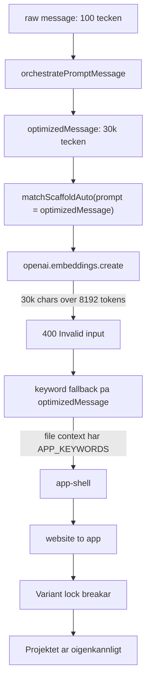

# P26 — Follow-up Orchestration Glitch Remediation

**Status:** 7/8 PR mergade (PR3 + PR8 cancelled). **Kvar: P26-uppföljare** — `[orchestrate] build_intent_promoted { from: 'website', to: 'app' }` triggar fortfarande på follow-ups (verifierat i chat `cdc23879-f4c1-4398-b91b-5e1af020e34c`, 2026-04-21). PR1:s `scaffold_locked_to_persisted` early-return tar inte effekt i auto-scaffold-grenen. Isolera i ny PR som tightar promotion-villkoret. Effort: ~2h.

Historik: Full PR-lista + root cause + 7 mergade branches i sektionerna nedan — referens för uppföljaren. Två kvarvarande separata buggar: (1) `clear-redesign`-overklassificering på bildbyten (PR2 exponerar detta i `variant_lock_skip`-logg); (2) hydration error på landing-page pga SSR-tidsberoende. Båda utanför scope för P26 själv — egna issues.

**Owner:** Cursor agent (Claude Opus 4.7)
**Origin:** Empirisk testkörning av builder med Tänker-modellen, chatId `cdc23879-f4c1-4398-b91b-5e1af020e34c`

## TL;DR

På en oskyldig follow-up (`"Byt bild til len elefant. GÖr också hela bakgrunden mörk fast som att det regnar animatiskt också"`) flippade systemet:

- `landing-page → app-shell`
- `website → app`
- `warm-local → immersive-dark`

På en bildbyte. Follow-ups är inte hårt länkade till sitt projekt — vi fixar det.

## Root cause

`matchScaffoldAuto` matas med `optimizedMessage` (~30 000 tecken med all filkontext) istället för användarens råa text. Embedding-API:t fail:ar med `400 max 8192 tokens`. Keyword-fallback ser APP_KEYWORDS i filkontexten → `app-shell`. Detta promotar build_intent från `website` till `app`. Variant-locken släpper när scaffold byts.



## Evidens

- Loggrad: `[scaffold] Embedding API call failed { 400 max 8192 tokens, queryChars: 30917 }`
- Loggrad: `[scaffold] scaffold_semantic_unavailable { fallbackScaffoldId: 'app-shell', method: 'keyword' }`
- Loggrad: `[orchestrate] scaffold_drift { briefNominated: 'landing-page' (0.98), finalPick: 'app-shell', pickMethod: 'picker_override' }`
- Loggrad: `[orchestrate] build_intent_promoted { from: 'website', to: 'app' }`

## PR-paket

### PR1 — Root cause + defenses (P0, branch: `fix/P26-pr1-scaffold-match-raw-message`)

A1+A2+A3+C som ett sammanhängande paket.

**A1.** `src/lib/api/engine/chats/chat-message-stream-post.ts` (~rad 753) + `src/lib/gen/orchestrate.ts` (rad 422-430): lägg till `scaffoldMatchPrompt` (raw `message`) som separat fält i `OrchestrationInput`. `matchScaffoldAuto`, `buildScaffoldPrompt` och `expandQuery` använder den korta strängen för embedding + keyword. `optimizedMessage` används fortfarande för LLM-prompten.

**A2.** `src/lib/gen/orchestrate.ts` (rad 383-446): när `generationMode === "followUp"` OCH `ignorePersistedScaffold === false` OCH `persistedScaffoldId` finns → early return persistedScaffold innan `matchScaffoldAuto` körs alls. Logga `[orchestrate] scaffold_locked_to_persisted`.

**A3.** `src/lib/gen/orchestrate.ts` (rad 507-522): block `build_intent_promoted` när `resolvedMode === "followUp"` och `persistedBuildIntent` är non-app. Logga `intent_promotion_blocked_followup`.

**C.** `src/lib/gen/scaffolds/scaffold-search.ts` (rad 152-184): klipp `expandQuery(query)` till max 7000 tecken före `openai.embeddings.create`. Logga `embedding_query_truncated`.

### PR2 — Variant lock fork-safe (P1, branch: `fix/P26-pr2-variant-lock-fork`)

**A4.** `src/lib/gen/stream/finalize-version/` (post-OMTAG-03 package — sök i `runner.ts` eller phase-helpers): säkerställ att `orchestration_snapshot.variantId` ALLTID skrivs vid `site.done` (även init), så följande follow-up alltid har `priorVariantId`. `src/lib/gen/scaffold-variants/matcher.ts` + `src/lib/gen/orchestrate.ts`: tightening av lock-logiken.

### PR3 — Quality-gate readiness probe (P1, branch: `fix/P26-pr3-quality-gate-readiness`)

**B.** `src/lib/gen/verify/server-verify.ts` + quality-gate route under `src/app/api/engine/chats/[chatId]/`: kräv `HEAD https://vm-fly-jakem.fly.dev/<chatId>/` returnerar 200 + första route-render slutfört innan gate startar. Backoff 30s @ 1s, fail-soft.

### PR4 — HMR-spam mitigation (P2, branch: `fix/P26-pr4-hmr-spam`)

**D.** `preview-host/src/runtime.js` (rad 411-440, 1154-1166): utöka `NEXT_CONFIG_ENV_SNIPPET` så Turbopack-HMR också tystas. Stub `/_next/webpack-hmr` med 404. Builder-UI: filtrera bort `webpack-hmr`-konsolfel i preview-iframens diagnostikmottagning.

### PR5 — rawMessage logging (P2, branch: `fix/P26-pr5-raw-message-logging`)

**E.** `src/lib/api/engine/chats/chat-message-stream-post.ts` (rad 880-892): lägg `rawMessage` (truncated 500 chars) bredvid `message` i `comm.request.followup`-loggen.

### PR6 — Bygg nu UX (P2, branch: `fix/P26-pr6-bygg-nu-ux`)

**F.** `src/components/builder/preview-panel/PreviewPanelF3Trigger.tsx` + `src/app/api/engine/chats/[chatId]/finalize-design/route.ts`: byt label till "Bygg integrationer", visa toast med saknade env-vars vid 412, disable knappen om inga Tier-3 integrationer detekterats.

### PR7 — Backoffice scaffold_lifecycle FileNotFound (P2, branch: `fix/P26-pr7-backoffice-build-template-path`)

Användaren rapporterade traceback:

```
FileNotFoundError: 'C:\\Users\\jakem\\dev\\projects\\sajtmaskin\\scripts\\template-library\\build-template-library.ts'
```

Filen är borttagen (sannolikt i `561acad3a fix(scripts): restore v0-template sync killed by template-library cleanup`). `backoffice/pages/scaffold_lifecycle.py` (`_build_template_library_path`, `_scan_scaffold_dependencies`) refererar fortfarande till gamla pathen. Antingen uppdatera path eller tolerera att filen saknas.

### PR8 — Dossier re-embed (P2, branch: `chore/P26-pr8-dossier-reembed`)

Om PR7 eller andra ändringar lägger nya dossierfiler eller flyttar paths: kör om embeddings via befintligt script i `scripts/dossiers/` så semantisk index är uppdaterat.

### PR9 — 3D Three Fiber dossier (P3, branch: `feat/P26-pr9-three-fiber-dossier`)

**G.** Skapa `data/dossiers/soft/3d-canvas-react-three-fiber/manifest.json` + `instructions.md` med best practices: `dynamic({ ssr: false })`, `<ErrorBoundary>`, mobile-fallback, `renderer.dispose()`, `useReducedMotion`-respekt. Triggers: `3d`, `three`, `webgl`, `animerad`, `roterande`. Re-embed via PR8.

## Verifiering per PR

Alla PR:s måste klara:

- `npx tsc --noEmit` (0 fel)
- Befintliga vitest-tester relevanta för rörda filer (ex `src/lib/gen/scaffolds/matcher.test.ts`)

## Pushing

Branches skapas lokalt med commits. **INGEN push till origin görs av agenten** — användaren granskar och pushar/öppnar PR själv.

## Status

Se TodoWrite-listan i agent-sessionen för aktuell progress. Slutsammanfattning skrivs sist i denna fil.

---

## Implementationslogg

### 2026-04-21 03:30 — Plan etablerad

Initial planfil skapad. Branches kommer skapas under PR1 nedan.

### 2026-04-21 04:10 — Autonom leverans klar

**7 branches skapade och commitade lokalt** (ingen push gjord — vänta på user review):

| PR | Branch | Commit | Status |
|----|--------|--------|--------|
| PR1 | `fix/P26-pr1-scaffold-match-raw-message` | `5ef314fcc` | klar — root cause + 3 defenses |
| PR2 | `fix/P26-pr2-variant-lock-fork` | `bc88a3347` | klar — variant-lock diagnostik |
| ~~PR3~~ | (cancelled) | — | hypotes om quality-gate race var fel; verify-lane är separat sandbox |
| PR4 | `fix/P26-pr4-hmr-spam` | `e86cea5cc` | klar — Turbopack-HMR stub |
| PR5 | `fix/P26-pr5-raw-message-logging` | `ab5f18cbe` | klar — rawMessage i devLog |
| PR6 | `fix/P26-pr6-bygg-nu-ux` | `06dd4bee4` | klar — "Bygg integrationer" + env toast |
| PR7 | `fix/P26-pr7-backoffice-build-template-path` | `a7d1d4865` | klar — backoffice template-library cleanup |
| ~~PR8~~ | (cancelled) | — | dossier loader walks fs direkt; ingen embedding-fil att rebuilda |
| PR9 | `feat/P26-pr9-three-fiber-dossier` | `9f832728f` | klar — Three Fiber dossier + needs3D-bridge |

**Verifiering:** alla branches passerade `npx tsc --noEmit` (0 fel) och relevanta `vitest`-suiter.

### Föreslagen merge-ordning (interna beroenden noterade)

1. **PR1** — root cause (low risk, högst värde)
2. **PR2** — variant-lock diagnostik (independent)
3. **PR4** — HMR-spam (independent, preview-host only)
4. **PR5** — rawMessage logging (independent, additivt)
5. **PR6** — Bygg nu UX (independent, additivt)
6. **PR7** — backoffice cleanup (independent)
7. **PR9** — 3D-dossier (additivt; needs3D-bridge fungerar med eller utan PR1)

PR2 och PR1 rör båda `src/lib/gen/orchestrate.ts` men på olika rader → ingen merge-konflikt förväntad.
PR1 och PR9 rör båda `src/lib/gen/orchestrate.ts` på olika kodblock → samma sak.
PR5 rör samma fil som PR1 (`chat-message-stream-post.ts`) men på olika rader → också ok.

### Vad som INTE blev gjort (skippat med dokumentation)

- **PR3 (quality-gate readiness probe):** Min initiala hypotes var att quality-gate kördes mot kall live-VM och triggade false-positive build-fail. Vid djupare läsning av [src/lib/gen/verify/server-verify.ts](src/lib/gen/verify/server-verify.ts) visade det sig att `runQualityGateOnExportable` använder en SEPARAT verify-lane sandbox via preview-host som installerar och bygger filerna isolerat. Det är inte en race mot live-VM:n. Den faktiska "Fel: verification failed: build" jag såg i UI:n vid v1 var sannolikt ett verkligt build-fel som autorepairen rättade — INTE en false positive. Skippas tills vi har konkret reproducerbart fall.
- **PR8 (dossier re-embed):** Dossier-loadern (`src/lib/gen/dossiers/registry.ts`) walks `data/dossiers/{hard,soft}/` direkt med mtime-cache. Det finns inget centralt embedding-index för dossierna att rebuilda. Den nya 3D-dossiern plockas upp automatiskt vid nästa server-restart. (Scaffold-VARIANT embeddings i `config/scaffold-variants/_index/variant-embeddings.json` är något separat och regenereras automatiskt vid dev-server-start.)

### Inte adresserat (kvarvarande mindre buggar att rapportera separat)

1. **`clear-redesign`-overklassificering**: Loggen visade att v2 (cafe-prompten) klassificerades som `Delta-brief generated for clear-redesign follow-up`. En bildbyte ska inte vara clear-redesign — det släpper variant-locken. PR2:s nya logging avslöjar detta i `variant_lock_skip { reason: 'clear_redesign_intent' }` så vi ser det hända, men själva intent-klassificeraren behöver tightening i en framtida PR.
2. **Hydration error på landing-page**: React hydration mismatch syns konstant i Chrome DevTools. Sannolikt `Date.now()` eller `Math.random()` i en SSR-komponent. Inte adresserat i P26 (utanför scope).

### Hur man pushar och öppnar PRs

```powershell
# Per branch:
git push -u origin fix/P26-pr1-scaffold-match-raw-message
gh pr create --title "P26 PR1 — lock follow-up scaffold/intent (A1+A2+A3+C)" --body "Se docs/plans/active/P26-followup-orchestration-glitch.md"

# Upprepa för pr2, pr4, pr5, pr6, pr7, pr9
```

Eller pusha alla på en gång:

```powershell
git push origin fix/P26-pr1-scaffold-match-raw-message fix/P26-pr2-variant-lock-fork fix/P26-pr4-hmr-spam fix/P26-pr5-raw-message-logging fix/P26-pr6-bygg-nu-ux fix/P26-pr7-backoffice-build-template-path feat/P26-pr9-three-fiber-dossier
```
