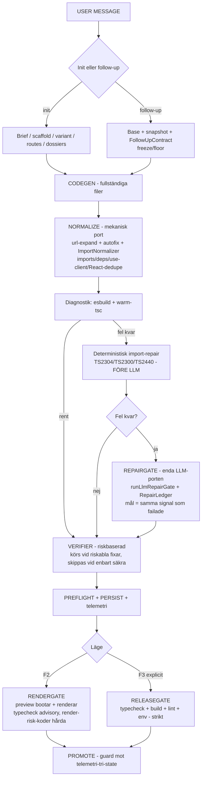

# Kontrollflöde-konsolidering — master-plan (nivå 1)

**Uppdrag i en mening:** sänk felvolymen i LLM-flödet genom att flytta mekaniska fixar
uppströms, ersätta fel riskmått, samla all LLM-repair bakom en port och låta gates vara
kvitton — utan att tumma på F3-strikthet, promote-guard eller render-risk-skydd.

**Arbetsmodell:** orkestratorn (Cursor-agenten) skriver nivå 2-dokument + prompt per fas,
granskar PR:ar och kör bugbot-postcheck. Jake godkänner fasstart och varje merge.
Builder-agenter (grind-/cloud-agenter) implementerar och PR:ar per fas.

---

## 1. Bevisläge (verifierat 2026-07-02)

Prod-statistik 14 dagar (115 genereringar, 41 chattar) + kodverifiering mot master samma dag.
Detaljer: `kontrollflödesmapp/` (tre canvas-HTML + coach-konversation).

| Fynd | Värde | Kodverifiering |
|---|---|---|
| Gate-failures som faller först på typecheck | 68/69 (99 %) | typecheck enda VM-check i F2 (`quality-gate-checks.ts`) |
| Typecheck-fel som är importrelaterade (TS2304+TS2300+TS2440) | 84/100 träffar | — |
| TS2304 kända imports (Badge/Button/Link/toast) | 60 träffar | `ts2304-known-import-fixer` finns men körs **bara** i server-repair, efter gate-fail (`fixer-registry.ts:347`, enda anrop `deterministic-import-repair.ts:167`) |
| TS2300 dubbelimport skapad av fixarna själva | 18 träffar | `consolidateReactImports` körs aldrig i server-repair; `fixDuplicateImportBindings` slår inte ihop två imports från samma modul |
| Warm-tsc-fail går direkt till LLM | — | `validate-and-fix.ts:235-255` → `runLlmRepairGate`, ingen deterministisk import-repair före |
| Autofix ingriper | 114/115 körningar; 58 över heavy-tröskeln (median 18, max 77, tröskel 5) | `pre-phases.ts:193` (`fixCount > 5`, räknar bara första passet) |
| LLM-verifier skippas | 69 % av körningar (41 pga heavy load) | `fast-path.ts:302-313` (`verifierSkippedByHeavyLoad`) |
| Gate-failade versioner som räddas av repair | 1/28 (3,6 %) | repair-LLM får syntaxdiagnostik, verifieras inte mot tsc; max 2 pass; superseded-races |
| Server-repair + manuell repair kringgår RepairLedger | — | `repair-loop.ts:632` anropar `runLlmFixer` direkt; alla finalize-vägar går redan via `runLlmRepairGate` |
| `repairScopeId` tappas | 4 anropsplatser | `validate-and-fix.ts:655,679,898,918` — ledger-scope faller tillbaka till chatId |
| Restore resyncar inte preview | `version_mismatch` ger bara overlay | `versions/route.ts:303-314` (ingen preview-push), `usePreviewSession.ts:136-152` |
| Mätluckor | `deploy_result` skrivs aldrig; dossier-val ej i telemetri; RAG 16 rader | writer saknas i `src/`; `persist-telemetry.ts` skriver ej `selectedDossierIds` |

**Viktiga nyanser mot rådatan:**

- Registret har **53** fixers (inte 54).
- F2 render-first (typecheck-only → advisory/degraded promote) och hårda render-risk-koder
  (TS1361/2300/2304/2305/2307/2440/2552/2613/2614) är **redan** på master sedan 2/7 — behålls.
- Statistiken täcker mest tiden **före** render-first-bytet och före dagens punktfixar
  (#346 jsx-checker, #354 warm-tsc-observability, #356 Badge-kollision). Faserna bygger på
  kodläget, inte siffrorna rakt av; effekten mäts om efter varje våg.

## 2. Diagnos i en mening

Sajtmaskin har inte för många kontroller — den har (1) rätt mekaniska fixar **för sent**
(import-klassen), (2) **fel riskmått** (`fixCount > 5`) som stänger av verifiern där den
behövs, och (3) LLM-repair som **verifieras mot fel signal** och delvis kringgår
RepairLedger utanför finalize.

## 3. Målbild — flödesschema nivå 1



### Kontrakt → kodägare

| Kontrakt | Ansvar | Kodägare idag (mappning, ingen rename) |
|---|---|---|
| IntentContract | init/follow-up, scaffold, variant, routes, dossiers | `orchestrate.ts`, `follow-up-*`, `build-spec/` |
| GenerationContract | fullständiga filer, inga diff-snuttar | `generation-stream.ts`, Core Rules |
| NormalizeContract | mekaniskt körbar output: imports, deps, use client, dedupe | `autofix/pipeline.ts`, `pre-phases.ts`, `deterministic-import-repair.ts` (flyttas upp) |
| RepairContract | en enda LLM-repair-port | `llm-repair-gate.ts` (`runLlmRepairGate` + `RepairLedger`) — repair-loop routas in |
| RenderContract (F2) | preview bootar, sidan renderar, inga fatala fel | quality gate `designPreview` + preview + product postcheck (advisory) |
| ReleaseContract (F3) | typecheck + build + lint + env, explicit | quality gate `integrationsBuild` + readiness, tvingas server-side |

### Terminologi (beslut: kanoniskt i docs, mappning mot kod-legacy)

Kanoniska produktbegrepp införs i glossary/docs/rules. Befintliga kod-identifierare och
telemetri-kategorier **behåller sina namn**; nya moduler döps kanoniskt.

| Kanoniskt | Betyder | Absorberar/mappas mot |
|---|---|---|
| Normalize | mekanisk kodstädning före LLM | autofix, pre-fix, import-fix, url-expand |
| RepairGate | enda LLM-repair-vägen | syntax-fixer, verifier-fixer, server-repair-LLM, manual repair-LLM |
| RenderGate | F2: boot/render/inga fatala fel | quality gate (designPreview), preview-check |
| ReleaseGate | F3: typecheck/build/lint/env | quality gate (integrationsBuild), build gate, readiness |
| Advisory | synligt men ej blockerande | warnings, soft fail, degraded |
| Blocker | stoppar promote/preview | hard fail, blocking |
| CapabilitySmoke | capability-specifik smoke | product postcheck, framtida 3D-smoke |

## 4. Principer & stoppregler

Gäller varje fas och varje builder-agent-prompt.

1. **F3-strikthet behålls.** `INTEGRATIONS_BUILD_QUALITY_GATE_CHECKS` tvingas server-side — rörs inte.
2. **Promote-guard behålls.** Tri-state-läsningen och fail-closed `onReadError` rörs inte.
3. **Render-risk-koderna förblir hårda i F2.** `RENDER_RISK_TS_CODES` får inte bli advisory.
4. **Lint blir inte hard i F2.** P34 C–E förblir parkerad tills Fas 6-beslut.
5. **Ingen fjärde repair-lane.** Samla, flytta eller wrappa — inga nya `runLlmFixer`-callsites.
6. **Ingen ny regex-importkirurgi utan parser/tsc-kvitto.** Import-mutationer ska valideras
   (parse + dedupe-check) innan de accepteras.
7. **Sopa framför egen dörr.** Varje fas städar sitt område: ersatta scheman/policies raderas
   i samma PR; tas en kontrollinstans bort följer dess schema, tester, docs och telemetri-rader
   med; docs ersätter — de staplar inte.
8. **En ägare per signal.** Ny/ändrad signal läggs hos canonical source, inte i fem konsumenter.
9. **Kod är source of truth.** Nivå 2-dokument skrivs mot kodläget vid fasstart, inte mot statistiken.
10. **Mät före/efter.** Ingen våg avslutas utan omkörd `control-stats` och jämförelse mot KPI.

## 5. Faser (= nivå 2-dokument)

Sju faser. Varje fas blir ett nivå 2-dokument (`NN-fas-*.md`) med en agent-prompt
(`aktiviteter/`) när fasen startas. Varje fas-PR ska innehålla: kodändring + städning +
docs-synk + tester + verifiering (`npm run typecheck`, riktad `npx vitest run`, `npm run lint`)
+ bugbot-postcheck dokumenterad i PR:en.

### Fas 0 — Telemetri-hygien & baslinje

| | |
|---|---|
| Mål | Gör effekten av fas 1–4 mätbar; stäng kända mätluckor |
| Huvudleveranser | Persistera dossier-val i `generation_telemetry`; skriv `deploy_result` (writer saknas helt); ärlig repair-outcome-taxonomi (ersätt "incomplete: 0 errors remain"); frys baslinje-siffrorna (redan exporterade i `kontrollflödesmapp/`) |
| Städning | Gamla missvisande outcome-strängar ersätts (inte parallellt namn); dokumentera mappning gammal→ny i fas-doc; läsare (backoffice, control-stats) hanterar historiska rader |
| Docs | `docs/schemas/quality-gate.md` telemetri-avsnitt; backoffice-sidor som läser outcome-strängar synkas |
| Tester | telemetri-writer-test; outcome-taxonomi-test |
| Ägarytor | `persist-telemetry.ts`, `generation-telemetry.ts`, `repair-loop.ts` (endast outcome-strängar), deploy-flödet |
| Beroenden | Inga — kan starta direkt |
| Agent-smarthet | 4/10 · liten-mellan PR |

### Fas 1 — Import-normalisering uppströms (Normalize)

| | |
|---|---|
| Mål | Eliminera de två största felklasserna (TS2304 kända imports ~60 träffar, TS2300 fixer-skapad dubbelimport 18 träffar) FÖRE gaten |
| Huvudleveranser | (a) Warm-tsc-fail i `validateAndFix` → kör `runDeterministicImportRepair` → `runAutoFix` → warm-tsc igen → **först därefter** `runLlmRepairGate`; (b) React/same-module-dedupe (`consolidateReactImports` + duplicate-binding-validering) efter **varje** import-injektion, inklusive i `deterministic-import-repair.ts`; (c) `ts2304-known-import-fixer` blir diagnostikdriven del av normalize-flödet (ownerPhase uppdateras); (d) egen-komponent-klassen (Reveal): skilj "känt bibliotek" från "egen fil som inte emitterats" via versionens fil-lista innan stub/import väljs; (e) tråda `repairScopeId` till alla `runWarmTscPass`/`runWarmEslintPass`-anrop (4 callsites — flyttad hit från Fas 0 pga samma fil) |
| Städning | `import-validator`:s regex-merge degraderas till fallback bakom parser+dedupe-kvitto (kommentaren "highest-corruption-risk" ska bli inaktuell); död JSX-scan-injektion bort om diagnostikvägen täcker; `docs/contracts/fixer-registry.md` uppdateras i samma PR |
| Docs | fixer-registry.md, llm-pipeline.md (Fas 3-ordningen) |
| Tester | Regression för smörsajt-mönstret (dubbel React-import i `three-canvas-shell.tsx`); TS2304-klass-test i finalize-vägen; utökade `deterministic-import-repair.test.ts` + `validate-and-fix.test.ts` |
| Ägarytor | `validate-and-fix.ts`, `deterministic-import-repair.ts`, `rules/ts2304-known-import-fixer.ts`, `react-import-consolidated.ts`, `import-validator.ts`, `fixer-registry.ts` |
| Beroenden | Fas 0 bör mergas först (mätbarhet), tekniskt oberoende |
| Agent-smarthet | 9/10 · mellan-stor PR — kärnpipeline, högst regressionsrisk |

### Fas 2 — riskScore ersätter fixCount>5

| | |
|---|---|
| Mål | Verifiern ska styras av risk, inte volym: många säkra fixar är normalflöde; en riskabel fix är signal |
| Huvudleveranser | Riskklass (`safe`/`risky`) per fixer i `FIXER_REGISTRY` (53 st); policy i `fast-path.ts`: skip verifier endast om **enbart** säkra fixar ingripit; riskabla klasser (JSX-tag-mutation, cross-file stub, merge rewrite, dep-bump) → verifier körs; capability `visual-3d` → verifier körs alltid |
| Städning | `autoFixHeavyLoad`-tröskeln + `verifierSkippedByHeavyLoad` tas bort helt (ersätts, inte flaggas); telemetrin får `risk`-fält, gamla `autofix_heavy_load`-eventet slutar skrivas och dokumenteras som historiskt |
| Docs | quality-gate.md verifier-policyavsnitt; glossary-notis |
| Tester | Policy-test: 24 safe → skip; 1 risky → run; 3D-capability → run |
| Ägarytor | `fixer-registry.ts` (metadata), `pre-phases.ts`, `fast-path.ts`, `policy.ts`, `persist-side-effects.ts` |
| Beroenden | Kan gå parallellt med Fas 1 (kontaktyta: `fast-path.ts` — Fas 1 mergas först vid konflikt) |
| Agent-smarthet | 7/10 · mellan PR |
| Beslut (taget) | Ökad verifier-frekvens/kostnad accepterad av ägaren 2026-07-02 |

### Fas 3 — En repair-port (RepairGate; L1 återupplivas)

| | |
|---|---|
| Mål | All LLM-repair genom `runLlmRepairGate`/`RepairLedger`; repair-framgång = samma signal som failade passerar |
| Huvudleveranser | (a) `repair-loop.ts:632` routas via gaten (ledger, scopeId, dedupe över lanes); (b) samma-signal-kontrakt: tsc-fel ⇒ targeted tsc-pass krävs före "success", parse ⇒ parser, build ⇒ build (F3); (c) repair-LLM:ens kontext: tsc-output + changed files + import graph + prior failed patch; (d) base-aware repair härdas — superseded version ⇒ avbryt tidigt i stället för att jobba klart och kastas; (e) partial-file-utfasning där mekanik täcker: targeted-bundle gate-styrs, preflight-partial-file behålls men mäts (utfasningsbeslut i Fas 6) |
| Städning | L1-planen (`docs/plans/archived/parked/L1-unified-repair-call.md`) markeras superseded-by denna fas; direktanropsvägar och död kod i repair-loop bort; router-README uppdateras |
| Docs | quality-gate.md repair-avsnitt; runtime-contracts.md repair-kontraktet |
| Tester | Ledger-dedupe över lanes; same-signal-verify per felklass; superseded-abort; utökad `repair-loop.outcome.test.ts` |
| Ägarytor | `repair-loop.ts`, `llm-repair-gate.ts`, `server-verify.ts`, `repair/route.ts`, `deterministic-import-repair.ts` |
| Beroenden | Efter Fas 1 (båda ändrar repair-lanen) |
| Agent-smarthet | 9/10 · stor PR — störst strukturell risk, ev. delas i två PR:ar (routing → kontrakt) |

### Fas 4 — Preview/restore-resync & race-städning

| | |
|---|---|
| Mål | Ingen användare ska fastna på trasig/fel preview efter restore eller repair-races |
| Huvudleveranser | Restore ⇒ deterministisk preview-resync (server-side push eller forced restart-key); `version_mismatch` ⇒ auto-resync i stället för enbart overlay; utred DB-lås-timeouts (`SELECT … FOR UPDATE` under gate-fönstret) och åtgärda om kvarstående |
| Städning | `docs/runbooks/preview-white-screen.md` uppdateras mot nya beteendet; överflödig overlay-copy bort |
| Docs | runbook + preview-session-kontraktet |
| Tester | Restore→resync-test; `usePreviewSession`-test för mismatch-vägen |
| Ägarytor | `versions/route.ts` (restore), `usePreviewSession.ts`, `useBuilderVmPreview.ts`, ev. `preview-host/` |
| Beroenden | Inga — parallell med allt utom Fas 3 (liten kontaktyta i verify-ytan) |
| Agent-smarthet | 7/10 · mellan PR — klient+server men avgränsat |

### Fas 5 — Terminologi & docs-spegling

| | |
|---|---|
| Mål | En begreppsuppsättning: Normalize/RepairGate/RenderGate/ReleaseGate/Advisory/Blocker/CapabilitySmoke kanoniska i docs; kodens legacy-namn mappade |
| Huvudleveranser | Glossary-uppdatering + mappningstabell; `terminology.mdc`-tabellen utökas; `llm-pipeline.md` rättas (VM-gaten körs efter persist via post-checks/server-verify — dokumenterad ordning matchar inte koden idag); quality-gate.md + fixer-registry.md synkas mot nya flödet; backoffice-rubriker (endast text, inte kategorinycklar) |
| Städning | Gamla begrepp och döda länkar bort ur de sex kanoniska dokumenten; ersätt, stapla inte |
| Tester | Docs-only — länk-/diff-koll |
| Ägarytor | `docs/architecture/*`, `docs/schemas/quality-gate.md`, `docs/contracts/fixer-registry.md`, `.cursor/rules/terminology.mdc`, `backoffice/pages/*` (rubriker) |
| Beroenden | Efter att Fas 1–3 mergats (docs ska spegla runtime) |
| Agent-smarthet | 4/10 · mellan PR, låg risk |

### Fas 6 — Mätning, utvärdering & beslutsstängning

| | |
|---|---|
| Mål | Bevisa (eller falsifiera) effekten; stäng öppna policy-beslut med data |
| Huvudleveranser | Omkörd `control-stats.mjs` (7 + 14 d efter sista våg-merge) jämförd mot KPI-tabellen; eval-svit av ~20 kända failure-prompts (smörsajt, 3D-landing, follow-up-tunga) som repro-underlag; beslutsunderlag till ägaren: P34 lint C–E, product postcheck advisory→hard, verifier-frekvensjustering, partial-file-utfasning |
| Städning | Stängda BUG-SWARM-BACKLOG-rader bockas av; denna plan flyttas till `avklarat/` med utfallssiffror; `kontrollflödesmapp/`-materialet arkiveras eller raderas (ägarbeslut) |
| Ägarytor | `scripts/db/control-stats.mjs` (läsning), docs/plans |
| Beroenden | Sist — efter Fas 1–5 |
| Agent-smarthet | 5/10 · docs/analys-PR |

## 6. Exekveringsmodell

### Vågkarta (parallellism)

```text
Våg A+B (parallellt): Fas 0 ∥ Fas 4 ∥ Fas 1 ∥ Fas 2   — beslut 2026-07-02: körs samtidigt från master
Våg C (sekventiell):  Fas 3                             — kräver Fas 1 mergad
Våg D (parallellt):   Fas 5 ∥ Fas 6-start               — docs efter kod; mätning löpande
```

**Merge-ordning för Våg A+B:** Fas 0 → Fas 4 → Fas 1 → Fas 2. Fas 2 rebasar över Fas 1
vid konflikt i `fixer-registry.ts` (Fas 1 rör en entry, Fas 2 rör alla). Varje prompt
listar reserverade filer som ägs av parallella faser.

- En PR per fas (Fas 3 får delas i två). Builder-agenter körs som grind-/cloud-agenter
  i egna branches/worktrees — aldrig `git checkout` i huvudcheckouten.
- Orkestratorn granskar varje PR + kör bugbot-subagent-postcheck och dokumenterar
  review-väg + triage i PR:en (enligt `pr-merge-review-gate.mdc`). Jake godkänner merge.
- Efter varje våg: riktad verifiering + kort mätavstämning innan nästa våg startar.

### Agent-smarthet per fas (rekommendation)

| Fas | Smarthet (1–10) | Motiv |
|---|---|---|
| 0 | 4 | Mekaniska writer-/threading-ändringar, tydligt scope |
| 1 | 9 | Kärnpipeline; fel här skapar nya felklasser |
| 2 | 7 | Policylogik + metadata på 53 fixers, måttlig risk |
| 3 | 9 | Störst strukturell risk; kontraktsdesign |
| 4 | 7 | Klient+server-koordination, avgränsad |
| 5 | 4 | Docs/terminologi, ingen runtime-risk |
| 6 | 5 | Analys + beslutsunderlag |

## 7. KPI-mål

Baslinje = 14-dagarsfönstret t.o.m. 2026-07-02 (`kontrollflödesmapp/`). Mål efter Fas 1–4.

| Mätvärde | Baslinje | Mål |
|---|---|---|
| Quality gate pass | 84 % | 90–93 % |
| Typecheck som first failure | 99 % av gate-fails | < 60 % |
| Importrelaterade TS-fel | 84 % av felträffar | < 35 % |
| Verifier skippad | 69 % (volymstyrd) | riskbaserad — skip endast vid enbart säkra fixar |
| Gate-failade räddade av repair | 1/28 (3,6 %) | > 25 % av verkliga repair-fall |
| Versioner som slutar failed | 38 % | < 25 % |

## 8. Beslutslogg

| Datum | Beslut | Av |
|---|---|---|
| 2026-07-02 | Terminologi: kanoniskt i docs/glossary/rules + nya moduler; befintlig kod/telemetri behåller namn med mappningstabell | Jake |
| 2026-07-02 | Repair-konsolidering: full (gate-routing + samma-signal + partial-file-utfasning där mekanik täcker) | Jake |
| 2026-07-02 | Exekvering: parallellt där möjligt (grind-/cloud-agenter PR:ar), sekventiellt där beroenden kräver; smarthet 1–10 anges per fas | Jake |
| 2026-07-02 | Verifier-kostnad: ökad verifier-frekvens vid riskabla fixar accepterad | Jake |
| 2026-07-02 | Våg A+B körs som fyra parallella cloud-agenter från master (fas 0/4/1/2); merge-ordning 0→4→1→2; `repairScopeId`-trådning flyttad Fas 0→Fas 1 | Jake + orkestrator |
| 2026-07-02 | **Våg A+B mergad:** #361 (Fas 0) → #362 (Fas 4) → #363 (Fas 1) → #360 (Fas 2). #360 krävde master-merge + 2 integrationsfixar (risk-fält på Fas 1:s nya `own-component-import-fixer`, `autoFixRisk` i Fas 0:s testfixtur) — verifierade i worktree före merge. `ts2304-known-import-fixer` behåller `risky`: klassningen är inert för verifier-policyn (fixern körs i warm-tsc-repairen, inte i `runAutoFix` vars fixar risk-summeras) och fail-closed är rätt default | Orkestrator (merge på Jakes uppdrag) |
| 2026-07-02 | **Våg C (Fas 3) mergad:** #364 — repair-loopen via `runLlmRepairGate` + delad `RepairLedger` (ledger-handover finalize→server-verify; aborted-attempt-undantag för reducerad-budget-retry), `resolveSameSignalGateChecks` (strikt additiv union, #260/#291 bevarade), superseded-abort i två varianter (nyare version / files_json-avance), callsite-vakttest. Granskad via diff-läsning + lokal worktree-verifiering (typecheck 0 fel, 249 riktade tester gröna) + full CI inkl. Vercel Agent Review. L1-planen markerad superseded | Orkestrator (merge på Jakes uppdrag) |
| 2026-07-02 | Fas 6 delas: builder-agent levererar eval-svit + baseline-jämförelse-tooling; själva prod-mätningen (kräver prod-DB-creds) + beslutsunderlag (P34, postcheck, partial-file, verifier-frekvens) ägs av orkestratorn + Jake efter ~7 dagars ny data | Orkestrator |
| 2026-07-03 | **Våg D mergad:** #366 (Fas 5 terminologi/docs — 7 kanoniska begrepp, llm-pipeline-ordningen rättad, endast backoffice-visningstext) → #365 (Fas 6 eval-svit 21 tester + `stats:compare` + fryst baslinje-JSON). #365 fick en rubrik-konflikt i `quality-gate.md` mot #366 (Fas 5 döpte om "LLM-fixer incomplete-files-skydd" → "RepairGate …") — löst i worktree (behöll Fas 6-avsnittet + Fas 5-rubriken), eval-svit + self-test + typecheck gröna före merge. **Alla 7 faser är nu levererade i kod/docs.** | Orkestrator (merge på Jakes uppdrag) |
| 2026-07-03 | **Efterputs #367 mergad** (extern coach-review av slutläget, 91 % säkerhet): (1) safe-only verifier-skip blockeras nu när `validateAndFix` använt LLM-fixar (`fixerUsed`/`llmFixCount>0` ⇒ trigger `llm_fixes_in_validate`) — medvetet snävare än coachens förslag: deterministisk import-repair med warm-tsc-kvitto blockerar inte skippet; (2) `control-stats` sektion 20: `typecheckTsCodes` + `derivedKpis.importRelatedTypecheckErrorsPct` (metod = baslinjens TS2304+TS2300+TS2440) så `stats:compare` slipper n/a på huvud-KPI:n; (3) LucideIcon-residualen loggad som P2 i backloggen (2 träffar/14 d — under åtgärdströskeln); (4) coachens #355-varning: stale PR, ska rebasas/omvärderas — inte mergas rakt av. Bugbot-pass: 0 fynd | Orkestrator |

## 9. Medvetet utanför scope (nu)

| Sak | Varför | Var den bor |
|---|---|---|
| Component registry per version (full) | Fas 1 löser Reveal-klassen lättviktigt via versionens fil-lista; full registry är infra utan bevisad ytterligare vinst | Ev. framtida initiativ |
| 3D/WebGL render-smoke (CapabilitySmoke) | Vänta på Fas 2-effekten (verifier körs igen på 3D) + Fas 6-mätning | Fas 6-beslut |
| P34 lint C–E i F2 | Ger fler blockerande fel, inte färre; F3 har redan lint | Parkerad; Fas 6-beslut |
| Product postcheck advisory→hard | Signalen behöver stabiliseras först | Fas 6-beslut |
| RAG-lärande som fixer-styrning | 16 rader data — för tunt | Efter mer data |
| Durable event-bus (B3/E2) | Egen backlog-post, eget scope | `active/README.md` backlog |
| Ny auth/rate-limit/kryptering | Utanför explicit scope per repo-regel | — |

## 10. Nästa steg

1. ~~Jake granskar denna master-plan~~ — godkänd 2026-07-02.
2. ~~Agent-prompts för Våg A+B (Fas 0/4/1/2)~~ — skrivna → [`aktiviteter/`](aktiviteter/).
3. ~~Våg A+B implementerad och mergad~~ — PR #361/#362/#363/#360, alla CI-gröna med
   dokumenterad bug-postcheck (2026-07-02, se beslutsloggen).
4. ~~Fas 3 (Våg C)~~ — implementerad och mergad som PR #364 (2026-07-02). L1-planen
   markerad superseded.
5. ~~Våg D (Fas 5 + Fas 6-tooling)~~ — mergad som #366 + #365 (2026-07-03).
   **Allt builder-arbete är klart.**
6. **Kvar (orkestrator + ägare), efter ~7 dagars ny prod-data (~2026-07-10):**
   mätavstämningen — `npm run env:pull:prod-snapshot` → `control-stats --json` →
   `npm run stats:compare -- --baseline scripts/observability/control-stats-baseline-2026-07-02.json --current <fil> --md`
   — sedan beslutsunderlag (P34 lint C–E, postcheck advisory→hard, partial-file-utfasning,
   verifier-frekvensjustering), Jakes beslut, och flytt av denna plan till `avklarat/`
   med utfallssiffror. Ev. arkivering/radering av `kontrollflödesmapp/` är Jakes beslut.
